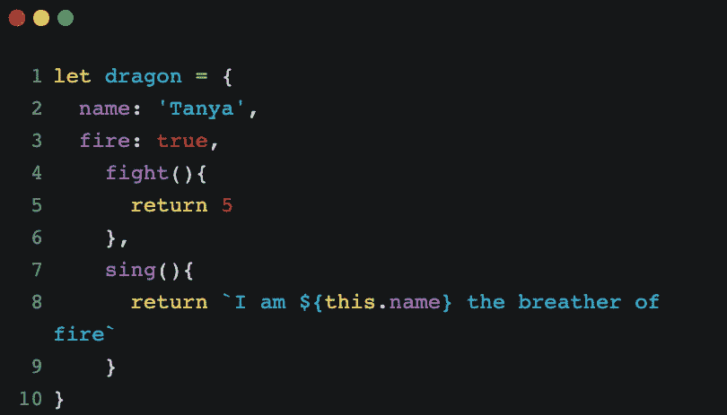
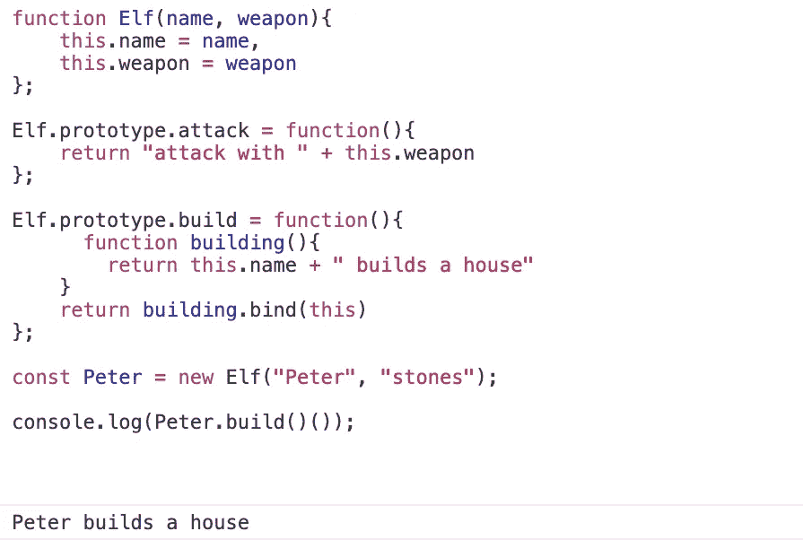
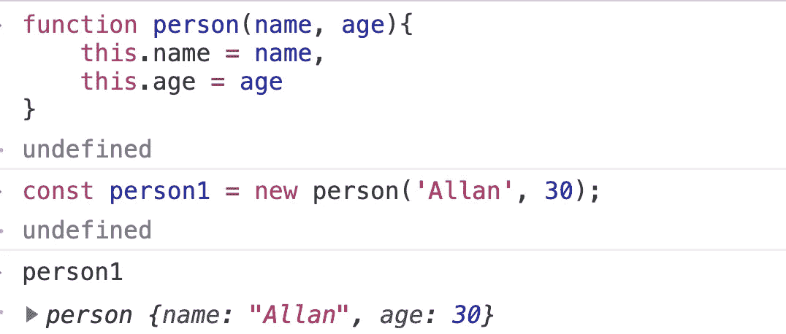
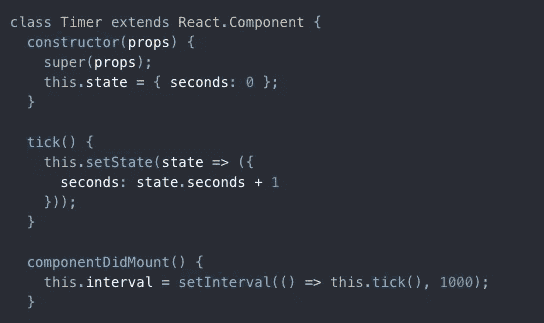

# 全面了解面向对象编程(OOP)

> 原文：<https://blog.devgenius.io/a-comprehensive-look-at-object-oriented-programming-oop-91d6423dde9a?source=collection_archive---------11----------------------->

## 编程范例

侯赛因·巴德沙阿在 [Unsplash](/s/photos/chains?utm_source=unsplash&utm_medium=referral&utm_content=creditCopyText) 上拍摄的照片

下面是这篇文章的内容:
1。**这个**关键字
2。**新增**关键词
3。关于**原型**的一切
4。 **ES6 类**5
类。基于类的语言，比如 Java、C++、T21。**传承**传承
7。**object . create**8。**私有** vs **公有**9。面向对象的四个原则

编程范式允许我们以一种易于推理的方式组织代码。

这就是我们希望从理解这种编程范式中得到的东西:

1.  我们会让代码更清晰，更容易理解。
2.  我们将使我们的代码易于扩展。请记住，随着我们的应用程序的增长，随着我们的程序的增长，随着团队中的开发人员的增长，我们的代码更容易使用这些编程范例进行扩展。
3.  让多个程序员更容易维护代码。
4.  让我们的代码记忆高效。
5.  它将保持我们的代码干燥。我们就不重复了。我们的代码将是干净和高效的。

所以很明显，编程范式允许我们使复杂的代码更有组织性。但是在 OOP 和函数式编程之前，有机器码；最初，程序员使用的都是 1 和 0。

> 编程范式允许我们以一种易于推理的方式组织代码。

随着时间的推移，我们进入了[程序风格的编程](https://en.wikipedia.org/wiki/Procedural_programming#:~:text=The%20focus%20of%20procedural%20programming,members%20or%20attributes)%20using%20interfaces.)。通过这种方式，我们做了计算机希望我们做的事情——也就是说，我们存储数据，然后使用某种功能处理这些数据。但是没有结构或组织。

我们有一步一步的指令:*电脑，把内存放在这里，电脑把内存移到这里，电脑把内存换到这里，然后给我这个。一切都是程序性的。*

 [## 编程语言的历史

### 编程语言的历史跨越了从早期机械计算机的文档到现代工具…

en.wikipedia.org](https://en.wikipedia.org/wiki/History_of_programming_languages) 

最初，我们从基本编程语言开始——真正的低级语言。**基本**，**汇编语言**， **COBOL** ，但是在整个六七十年代，发生了一个很大的变化。我们开始建立这些基本范式。

## 如何以更有条理的方式编写代码？

非过程化的代码。这时候 **OOP** 和 **FP** 开始生效。我们有像 [Scheme](https://en.wikipedia.org/wiki/Scheme_(programming_language)#:~:text=Scheme%20is%20a%20minimalist%20dialect,by%20its%20developers%2C%20Guy%20L.) 这样的语言，这是 Javascript 的灵感之一。我们有像 [Smalltalk](https://en.wikipedia.org/wiki/Smalltalk) 这样的语言，它将 **OOP** 的思想作为一种组织代码的方式推广开来。

最后，在 80 年代，随着越来越多的最佳实践开始出现，我们开始进行更多的整合—人们就一些好的模式和最佳实践达成一致。模块之类的东西。

在这里， **OOP** 真正开始腾飞了。我们有了像 c++(T19)这样的语言。C++是最初的带类的 C 语言——这些类允许我们进行面向对象的编程。我们有 [Objective C](https://en.wikipedia.org/wiki/Objective-C) ，顾名思义，它是一种基于 C 的语言，灵感来自于对象和 **OOP** 。那是事情真正开始起飞的时候。

同时在后台，我们也有函数式编程。在 90 年代，随着互联网时代的到来，我们开始有更多的语言。Java 因其面向对象的范例而大受欢迎。

1995 年，我们有了作为网络语言的 Javascript 和许多我们熟悉的其他语言。OOP 跟上了潮流，并且随着诸如 Java 之类的语言而真正流行起来。

今天，我们看到了函数式编程语言的趋势。它们变得越来越流行，主要是因为这种范式与[并发](https://en.wikipedia.org/wiki/Concurrent_computing)和[分布式编程](https://en.wikipedia.org/wiki/Distributed_computing#:~:text=A%20computer%20program%20that%20runs,like%20connectors%20and%20message%20queues.)配合得很好。

> 这一切都表明，随着时间的推移，程序员们越来越多地使用代码，我们开始形成我们认为是好的实践的想法。

这一切都表明，随着时间的推移，程序员们越来越多地使用代码，我们开始形成我们认为是好的实践的想法。
所以当时人们在问自己我们应该做什么？
OOP 和 FP 是进化而来的两大范式。所以通过学习这两件事，我们可以站在巨人的肩膀上。

我们开始了解所有这些之前的程序员学到了什么好的实践，他们犯了什么错误，这样做，我们就能写出更好的代码。

# 面向对象编程与函数式编程

在所有的程序中，有两个主要成分:
1。数据——我们保存在记忆中的东西。
2。行为——程序能做的事情。

为了让我们处理这两件事，我们最初有像 Java 和 Scheme 这样的语言，它们对我们能做什么有不同的想法(Java 和 Scheme 是 Javascript 的灵感)。

我们之前了解到 Javascript 中有像函数和对象这样的东西，它们非常重要。我们学习了所有关于**原型继承、**函数及其有用的工具，如**闭包**以及函数是 Javascript 中的一等公民的概念。

 [## 关于闭包 Javascript 的第一支柱，您需要知道的一切。

### 强大的 Javascript 支柱

medium.com](https://medium.com/swlh/all-you-need-to-know-about-closures-the-first-pillar-of-javascript-5e7ed96f241c)  [## 关于原型继承 Javascript 的第二个支柱，您需要知道的就是

### 我们在这里学到的东西将帮助我们理解面向对象编程(OOP)。

medium.com](https://medium.com/swlh/all-you-need-to-know-about-prototypal-inheritance-the-second-pillar-of-javascript-d8d851cd4509) 

从这两个想法，我们有了函数式编程和面向对象编程。

OOP 说把数据和它的行为放在一个叫做对象的位置；把所有这些放在一个盒子里会更容易理解我们的程序是如何工作的。

函数式编程认为数据和行为是截然不同的东西，为了清晰起见应该分开保存。因此，也许不是用一个大盒子来描述一切，而是用多个盒子。

OOP 就像制造一个机器人，我们有一个头部组件，一个手部组件，可能还有胸部组件，腿部组件，触角组件，然后我们一起组装。

函数式编程说，只要给我数据，我就会通过函数对数据进行操作，然后我会从你给我的数据中返回一些新的东西。

这里的目标不是向你展示这是 **FP** Vs **OOP** ，而是这些实际上是互补的。这不是一个凌驾于另一个之上。相反，它是关于联合使用两种范例来制作好的程序。Javascript 的美妙之处在于它是多范例的。

我们可以使用这两种技术使我们的代码更容易推理，更清晰，更容易理解，更容易扩展，更高效。此外，我们可以根据手头的问题使用这些范例中的每一个，并使用每一个中的技术为特定的问题选择一个范例。

[的两大支柱](https://medium.com/swlh/all-you-need-to-know-about-prototypal-inheritance-the-second-pillar-of-javascript-d8d851cd4509)终于让我们了解了这些话题。

闭包是 FP**的重要组成部分，没有它们，我们就无法用函数式编程来完成我将要向你展示的事情。没有原型，我们将无法做我们将在 **OOP** 中要做的事情。**

# OOP 简介

这里的大部分东西，我们已经看过了。
[**本**](https://medium.com/@allansendagi/javascript-fundamentals-this-keyword-481722806d20) 关键字，[原型继承](https://medium.com/swlh/all-you-need-to-know-about-prototypal-inheritance-the-second-pillar-of-javascript-d8d851cd4509)，**新**关键字，新 **ES6 类**，**继承**， **Object.create** 。我们还将看到私有和公共字段 Java 等语言中基于类的继承思想。最后，我们将讨论 OOP 的四个原则。

## OOP 从 70 年代就已经存在了。

这是一种编程风格，在诸如 [C#](https://en.wikipedia.org/wiki/C_Sharp_(programming_language)) 、Python、Ruby 和 Java 等语言中非常常见。在面向对象的程序设计中，对象是一个包含信息和操作的盒子，这些信息和操作应该指向同一个概念。

这就像我们在模拟现实生活中的物体。我们以前在龙的物体上看到过这种情况。我们有一些面向对象的原则。

我们有关于龙的数据，比如名字和喷火的能力。我们也有龙可以采取的行动。在 OOP 中，这些数据也可以称为状态。
我们已经将这条龙包装在一个对象中，以模拟真实生活中的龙，其中包含关于龙的一些数据，以及龙可以采取的行动。

> 属性或特性允许我们跟踪对象的状态，方法允许我们操纵对象的状态，以便我们模拟真实世界。

属性或特性允许我们跟踪对象的状态，方法允许我们操纵对象的状态，以便我们模拟真实世界。

这就是我们想要对 **OOP** 做的事情。

我们想看看这个世界，并把我们想做的事情组织到这些相互作用的小物件盒里。这样我们就能把所有东西都分门别类，井井有条。

说到 OOP，主要有两种:
1。有基于类的编程语言。
2。基于原型的编程语言。

正如我们知道的 Javascript，我们有原型继承。因此，让我们来看看从过程代码开始的整个旅程——我们不断重复的代码变成了一直通向 **OOP** 的代码。

让我们从一个有角色互动的游戏开始。使用让我们创建一个程序，在头脑中有 **OOP** 原则来组织我们的代码。

**创建 elf 对象**

精灵角色。资料来源:ZTM

和任何游戏一样，我们不会只有一个精灵。我们将会有不同的精灵，不同的名字，不同的武器，甚至不同的方法。
那么如果想再加一个小精灵该怎么做呢？

我们可以复制并粘贴这段代码，也许可以创建 elf2。

我们游戏中的第二个精灵角色

那么，我们刚刚所做的让我们走向 OOP 的工作有什么好处呢？

我们这里有一个叫做[封装](https://en.wikipedia.org/wiki/Encapsulation_(computer_programming))的东西。我们将功能组合在一起。我们有状态，即对象中的数据和作用于该状态的函数。
以便这些功能可以与此状态交互。他们可以阅读甚至修改它。我们可以有一种方法，可以把武器从弓变成剑。

# 这是我们迈向 OOP 的第一步。

我们已经将可以用来模拟真实世界精灵的功能封装到这些容器中。但是这有什么问题呢？

很明显的问题是，当我们需要更多的精灵时——在这个游戏中我们会需要大量的精灵，我们不得不一遍又一遍地复制相同的代码，即使精灵们有相同的攻击方法。我们不得不一直重复复制和粘贴代码。

最有可能的是，我们的精灵拥有比这更多的功能，这意味着更多的属性，更多的方法。我们并没有让我们的代码非常枯燥。我们只是不断地重复自己。

# 所以让我们进入面向对象程序设计的第二步。

## 工厂功能

工厂函数是行为类似工厂的函数——它们为我们创建对象。

让我们通过编程来创建精灵。

这里我们创建了一个工厂函数——一个为我们创建对象的函数。我们甚至可以使用 ES6 语法来简化这一点，如果属性和值相同，我们可以将它保存在对象内部。

工厂函数的美妙之处在于，现在如果我想创建另一个精灵，我只需:

所以我们现在不只是复制代码，而是有了这个为我们创造精灵的功能。

我们已经朝着面向目标的方向前进了一步。

我们避免了重复的代码。但是这里还有一个问题。工厂功能很棒，但是这里有什么问题呢？
如果我们有 1000 个精灵呢？这意味着所有 1000 个精灵都需要内存空间来存储相同的数据！

所以像**名字**和**武器**将会不同，我们将不得不为每个精灵在内存中存储这些数据。此外，像 **attack()** 这样非常通用的方法必须被复制到每个精灵的不同内存位置。因此，如果我们有 1000 个精灵，那么每个精灵在内存的不同位置有 1000 个攻击函数。

幸运的是，Javascript 有一个叫做**原型继承**的东西。我们可以利用这一点来改进它，这样我们就可以在不同的对象之间共享功能。

 [## 关于原型继承 Javascript 的第二个支柱，您需要知道的就是

### 我们在这里学到的东西将帮助我们理解面向对象编程(OOP)。

medium.com](https://medium.com/swlh/all-you-need-to-know-about-prototypal-inheritance-the-second-pillar-of-javascript-d8d851cd4509) 

# 所以让我们进入面向对象的第三步。

我们希望解决在多个对象上拥有相同功能的问题。我们如何做到这一点？

在我们开始原型继承之前，有一种手动的方法。

我们可以取出**攻击**功能，并把它放在某种我们有共同功能的商店里。例如，我可以做

现在，我有了一个简单的对象，上面有攻击方法，我现在需要做的就是添加一行代码来赋予 Peter 和 Sam 攻击能力:

彼得.攻击()

Sam.attack()

# Object.create()

这是可行的，但是仍然需要大量的手工工作。Javascript 给了我们一个工具，让我们自己更容易做到这一点。我们可以使用 **Object.create()** 。

使用 Object.create()，我可以稍微清理一下。我们将删除代码行，并使用 Object.create()来创建链接——这两部分代码之间的原型链，而不是手动将方法附加到每个 elf。

我们可以很简单地做到这一点。

> Object.create 所做的是在我们刚刚创建的 **elf 函数**和 **newElf** 之间创建一个链接。我们在这里做原型继承。

Object.create 所做的是在我们刚刚创建的 **elf 函数**和 **newElf** 之间创建一个链接。我们在这里做原型继承。

Object.create 为我们一路创建了这个原型链，以便我们可以使用攻击方法。

这里有一个问题。即使我们用 **Object.create()** 做的是真正的原型继承，你也不会在大多数代码库中看到这一点。它应该这样使用。

诚然，我们的代码更简洁了一些，但这并没有被整个 Javascript 社区所接受。

我们的目标是更接近面向对象编程。但是我们现在做的还不一定是面向对象的。

那么在 Object.create()之前程序员用的是什么？

# 面向对象的第四步。

没有 Object.create，我们做了一些更接近 OOP 的东西。我们没有使用 Object.create()，而是使用了 [**构造函数**。](https://developer.mozilla.org/en-US/docs/Web/JavaScript/Reference/Global_Objects/Object/constructor#:~:text=The%20constructor%20property%20returns%20a,true%20%2C%20and%20%22test%22%20.)

有趣的部分来了。我不会在这里退任何东西。我用的是 [**这个**](https://medium.com/@allansendagi/javascript-fundamentals-this-keyword-481722806d20) 就是这样。

## 我们正在建造一个精灵。

那么这是如何工作的呢？

如果我这么做了:

如果我运行这个，我会得到一个类型错误— *无法读取 undefined 的属性‘name’。*

如果我运行这个，我会得到一个类型错误— *无法读取 undefined 的属性‘name’。*

而这是因为构造函数是这样构建的:为了使用构造函数，你需要在 Javascript 中使用 [**new**](https://developer.mozilla.org/en-US/docs/Web/JavaScript/Reference/Operators/new) 关键字。

我们看到这神奇地起作用了。但这是为什么呢？
那是因为 Javascript 中的 new 关键字自动为我们返回对象，并创建了 elf 构造函数。

> 任何使用 **new** 关键字调用的函数都被称为构造函数。

任何使用 **new** 关键字调用的函数都被称为构造函数。

我们以前也见过构造函数。类似于**数字()**、**对象()**或**函数()**——大写字母，但它们是函数。

这些都是构造函数。您可以通过使用 **new** 关键字来调用它们。所以作为一个规则，所有的构造函数都应该以大写字母开头，让其他程序员知道你需要使用 new 关键字来调用这个函数。

让我们看看如何使用 Javascript 自带的构造函数创建一个 elf。

函数构造函数简单地允许我们使用 **new** 关键字并为我们创建这些对象。

但是现在让我们在这里实现攻击函数。

因为我们使用了 **new** 关键字，它自动为我们返回一个 Elf 对象并创建了我们的 Elf 构造函数，所以我们创建了一个新对象。因为调用了这个函数，所以创建了一个新的执行上下文。

由于这是一个我们正在运行的函数— **Elf** ，并且创建了一个新的执行上下文，这意味着我们自动获得了附加到它上面的 **this** 变量。请记住，我们调用的每个函数都会得到**和**参数。

 [## Javascript 基础——函数调用、参数关键字、可变环境、作用域链。

### 程序只是简单的分配内存，比如，给一个变量赋值，然后运行一个函数做一些事情…

medium.com](https://medium.com/@allansendagi/javascript-foundation-function-invocation-arguments-keyword-variable-environment-scope-chain-97d4888cf319) 

有趣的是，当我们使用 **new** 关键字时，而不是像通常那样 **this** 指向窗口对象，当一个新的执行上下文被创建时， **new** 关键字改变了 this 所指向的**。相反，**新的**关键字会说，我要你把这个**指向我们刚刚创建的对象。所以这就成了**彼得。**

让我们看看当我们删除**新的**关键字时会发生什么。

移除新关键字

这是因为如果没有 **new** 关键字，我们就不会返回那个对象，也不会将 **this** 赋值给调用我们的对象。

所以**新的**关键字在幕后为我们做了很多工作，以便让它工作。
所以我们使用 **new** 关键字是非常重要的，这就是为什么我们要用大写字母向其他程序员表示我们需要使用 **new** 关键字，否则它将无法工作。

> 这个功能如此强大的原因是 Javascript 中的每个函数都有一个原型属性。

这个功能如此强大的原因是 Javascript 中的每个函数都有一个原型属性。

函数是一种特殊类型的对象。它是一个可调用的对象，有可以调用的代码，一个可选的名字，属性，如果我们想给它，我们可以访问。

但是我们也获得了用每个新函数创建的原型{}。这个原型属性对于任何常规函数都是毫无用处的，但是当我们有构造函数时，这个原型最终会变得有用。像 **Function** 这样的本地构造函数附带了调用、应用和绑定等功能。

数组带有 **reduce** ， **map** ， **forEach** ，因为它们是在数组构造函数之外构建的。

## 在我们的例子中，我们可以将我们自己的添加到原型中。

所以现在我们可以做:

我们能够使用**原型**为我们的 Elf 添加功能。

回顾一下，

我们能够使用构造函数而不是像 **Object.create()** 这样的东西来创建这个神奇的函数。我们神奇的函数返回一个新函数，并修改这个对任何对象调用我们的意义。因此，代替全局对象，**这个**现在将指向调用对象；**彼得**和**山姆**。

此外，因为这是一个构造函数，我们有原型函数，我们可以附加东西。

这样当彼得.攻击()被调用时，它就工作了。请记住，Peter 没有将 **attack()** 作为自己的方法，但是它将沿着原型链向上，在那里它将找到攻击。

现在**彼得**和**山姆**都能够从内存的同一个位置使用**攻击()**。我们不需要在内存中的多个位置复制 **attack()** ，我们只需要写一次，这两个小精灵就会指向同一个内存空间。

美妙之处在于，随着游戏的发展，我可以不断添加功能或方法。

**注:**如果我们把这个改成箭头函数会怎么样？

我们变得不明确。

记住，箭头函数是词汇范围的。它们根据它们被写入的位置来定义这个。而**这个**在这种情况下是全局对象，因为谁在调用**这个**，除了全局对象之外，周围没有其他对象。

但是通过使用动态限定作用域的常规函数，**这个**将根据调用它的人而改变。这是一个你不想使用箭头函数的地方，因为你不想要一个词汇范围的 **this** 。

## 让我们更深入地研究构造函数

console.log( **this** )给我们的 Elf 是一个空对象

因为我们没有添加任何东西，所以这里没有属性，我们只是创建一个空对象。

但是如果我将***console . log(this)***下移，我们会看到在添加了**名称**和**武器**属性之后，我们就可以访问它们了。

演示**这个**

有意思的是，现在如果我给我们的构造函数添加一个 **var q=6** ，我们将无法把它添加到我们的 elf 对象中。

我们只能使用**这个**关键字向 Elf 添加属性

使用构造函数，我们可以向对象添加属性的唯一方法是使用 **this** 关键字。

我们还讨论了构造函数如何自动为我们创建原型链。让我们来测试一下。

我们看到 Elf 是我们的原型，因为 **__proto__** 指向了 Elf 的原型。记住， **Elf.prototype** 是因为**新的**关键字而为我们创建的。

因此，当我们最终在原型上添加类似于 **attack()** 的项目时，我们现在有了指向 **Elf.prototype** 的 **__Proto__** ，其中包含了 **attack()** 方法。

彼得 __proto__ 指向精灵原型

现在如果我做 **Elf.prototype** ，我们看到的是同样的事情。我们在这个原型中有 **attack()** 函数。

如果我们在添加原型之前使用 console.log:

这是一个空的物体

记住，我们创建的每个函数都有这个原型属性。但是只有**构造函数**对这个原型对象有用。

但是现在如果我做 **Peter.prototype** 会怎么样？

彼得。原型给了我们未定义的

我不确定。这是因为**彼得**不是一个函数。彼得是一个物体。只有函数可以访问原型。

**注意:**
OOP 中的一个陷阱是这样的:

方法内部的函数仍然是函数内部的函数

在这里，如果我单击运行，我得到未定义的**。**

**为什么会这样？
方法内部的函数是函数内部的函数。这意味着**这个**不是分配给对象本身，而是这次分配给窗口对象。有几种方法可以解决这个问题:**

# **绑定()**

****

**或者我们可以参考一下**这个****

****

# **我们到了吗？或者这个代码有什么问题？**

**这段代码的问题是**原型**有点奇怪。有点难以理解吧？**

**除非你真正了解你的原型继承和 Javascript 如何工作，否则这段代码不容易理解，而大多数人都不了解。这很快就会变得非常混乱。没有多少人喜欢这种编码风格。**

**在旧的代码库中，你可能会发现这种风格的编程，尤其是当他们在做 OOP 的时候。问题是 OOP 完全是关于类的概念。在这段代码中，这里没有类，没有大写字母，这就是为什么在语言中添加了 **Object.create()** 来避免这种麻烦，只使用纯原型继承。
但是**这个**和**新的**关键字的想法很大程度上受到了 OOP 的启发，尤其是对于像 Java 这样的语言。**

# **用 Javascript 面向对象的最后一步。**

**那么我们该如何改善这一点呢？让我们添加类，尽可能地接近 Javascript 的 OOP。**

## **Javascript 中的一切都是对象。**

**让我们尝试一些东西。我们现在理解了构造函数。所以如果我做了:**

****

**Javascript 为我们创建了第 5 个**。****

****它是一种对象。****

********

****a 是对象的类型，因为我们使用了构造函数****

****这不同于简单地说:****

********

****b 的类型是一个数字****

****所以:****

********

****我们看到的是，在 Javascript 中有两种不同的方式来构造这些东西。****

****然而，如果我只做两个等号，我会因为类型强制而得到 true。****

********

****有趣的是，现在如果我做了 **b.toString** ，我就可以在 **b** 上使用所有这些方法，尽管我们看到 **b** 是一个原始类型。****

********

****这是因为在 Javascript 中，当我们给一个变量 **(var b=5)** 赋值时，Javascript 会在内部**构造**我们添加的数字，这样我们就可以访问所有这些方法。这就是我们如何使用像 **toString** 、**fixed**这样的东西。甚至在字符串值或字符串基元上，我们也可以有这样的方法。****

****Javascript 看到您想要使用对象方法，所以它自动假设您指的是对象而不是原语，所以它在内部运行构造函数对象。这也是像 **new Date()** 这样的事情的工作方式。****

****你在创建对象，这很有用，因为它们有一个内置的原型，这样我们就可以运行不同种类的方法。****

********

****所以从技术上讲，在 Javascript 中，一切都是对象。****

> ****所以是的，从技术上讲，在 Javascript 中，一切都是对象。****

****除了**空**和**未定义**之外，所有东西都有一个构造函数。我们为所有的东西都准备了构造函数，这样我们就有了可以对它们使用的方法。****

# ****Javascript 中的终极 OOP。****

********

****构造函数****

****还记得我们的构造函数吗？没有人真正喜欢添加方法的原型方式。所以有了 ES6，Javascript 终于引入了**类**关键字。****

> ****OOP 是基于**类**关键字的想法而创建的。一个班级是我们想要被创造的蓝图。****

****OOP 是根据**类**关键字的想法创建的。一个班级是我们想要被创造的蓝图。****

****让我们看看这是如何工作的。****

****我们可以简单地定义我们的 Elf 类:****

********

****现在，正如 OOP 所建议的，我们希望将我们的功能保留在这个盒子里——**类**。我们的属性、方法、状态和所有动作都在一个包含的环境对象中。****

****每次实例化时，我们都使用 **new** 关键字和类。****

****这才是 OOP 真正的妙处。我们正在模拟现实生活场景。我们正在创建一个精灵的职业，这是我们希望精灵成为的样子的蓝图。****

****精灵有名字。他们有武器。他们也可以像 **attack()** 一样对这些属性进行操作。您可以继续向保存整个 Elf 对象的相同位置添加方法。****

****任何时候我们需要更新一些东西或者改变或者增加一个方法，我们只需要在这里改变它，所有 Elf 的实例都会得到更新。****

******实例**是我们使用类的时候会经常听到的一个常用词。****

****当我们调用一个类并在该类之外创建一个对象时，就会发生一个实例。例如，彼得是 Elf 的一个实例。****

********

****彼得是小精灵的一个实例****

****因此， **Instanceof** 是我们可以用来说我们正在创建一个类的实例的语言。****

****这个带有**新**关键字的叫做**实例化**。我们正在实例化一个类。****

****如果我删除**新的**关键字，我会得到一个非常详细的错误。*没有 new* 就不能调用类构造函数。****

********

****现在你知道了。在这里，我们终于有 OOP 了，是吗？****

****不完全是。****

> ****这就是我们所说的[句法糖](https://en.wikipedia.org/wiki/Syntactic_sugar#:~:text=In%20computer%20science%2C%20syntactic%20sugar,style%20that%20some%20may%20prefer.)。实际上，我们仍然在使用原型继承。我们没有使用类，因为类在其他语言中工作。这是 Javascript 最接近类的方式。****

****这就是我们所说的[句法糖](https://en.wikipedia.org/wiki/Syntactic_sugar#:~:text=In%20computer%20science%2C%20syntactic%20sugar,style%20that%20some%20may%20prefer.)。实际上，我们仍然在使用原型继承。我们没有使用类，因为类在其他语言中工作。这是 Javascript 最接近类的方式。****

****在引擎盖下，他们仍然使用**新的**关键字，与**原型**。****

****那么我们为什么不从一开始就创建类呢？这难道不会让一切变得更容易吗？****

****因为课程不一定是解决所有问题的答案。而且正如语言的创造者所说:****

********

****来源:从零到精通****

****Brendan Eich 的任务是创建一种语言，吸引习惯于类和 OOP 概念的 Java 开发人员。
但同时，他们想创造一种竞争性的语言。出于营销的目的，他们不能让它完全一样。****

****他必须有创造力。他使用了原型继承，这与 Java 和 C++等语言中类的工作方式不同。****

> ****在其他语言中，类是真实存在的。在 javascript 中，类仍然只是对象。****

****在其他语言中，类是真实存在的。在 javascript 中，类仍然只是对象——Javascript 中的一切都是对象。****

## ****Javascript 有类吗？****

****是的，它们是句法糖。但是 class 关键字只是原型继承。****

****而有人称这个[为伪古典继承](http://theoryapp.com/javascript-inheritance-pseudoclassical-vs-prototypal/#:~:text=Pseudoclassical%20Inheritance,to%20build%20the%20inheritance%20chain.&text=It%20also%20adds%20a%20method,is%20inherited%20in%20the%20instance.)因为它不是真正的古典继承。****

****但是看着这个，我希望你能看到我们是如何从重复的代码，越来越难维护到更有组织的东西。我们创建了这一组更易于维护和扩展的功能。****

****顺便说一下，你可能会问自己，为什么我们不把 attack()方法添加到构造函数中呢？这是因为每次我们使用 **new** 关键字并创建或实例化一个类时，构造函数都会运行，因为每个精灵都有一个唯一的名字，也许还有一个唯一的武器。****

****但是 attack()由该类的所有实例共享****

****如果我们把攻击转移到构造函数，那会占用内存空间。****

****而不是从每个对象创建一个攻击函数，如果我们添加到构造函数中，我们会这样做，这是我们试图避免的事情。相反，我们只有一个。所有这些实例都可以访问的一个位置中的一个函数。****

# ****Object.create Vs 类****

****有热爱类的人，也有从来不想用类的人。有些人想避免使用 **new** 关键字和 **this** 关键字，因为他们说这会引起太多的混淆。****

****所以这只是个人喜好。备受尊敬的程序员热爱类。其他备受尊敬的程序员讨厌类。而且没有对错之分。****

****但是需要注意的是，我们用类做的所有事情都可以用 **Object.create()** 来完成。****

****有了 **Object.create()** 我们实际上拥有了我们需要的一切，一点也不混乱。我们能够创建这些原型链，而不用假装我们有类****

****有些人把**叫做 Object.create()** 纯粹的原型继承，因为这是纯粹的方式，而不是假装我们是别人。****

****你用什么由你决定。大多数 Javascript 社区不像类语法那样使用 **Object.create()** 。****

****在大多数情况下，尤其是使用 OOP 原则的新代码库，他们会使用**类**，但是 Javascript 的美妙之处在于它是多范例的。它允许我们根据手头的问题和我们与其他程序员的团队动态，有很多选择来编码我们想要的方式。****

# ****操纵 this 关键字的 4 种方法****

1.  ****第一个是这个关于**新**绑定的想法。此绑定用于构造函数。****

********

******new** 绑定允许我们将 **this** 分配给我们实例化的对象。因此 **person1** 将是 this 关键字。****

****这是我们操纵这个关键字的一种方式。****

****2.另一种方式叫做**隐式绑定。******

********

****这里的**这个**就是指**人**。这就是隐式绑定。是最常见的一种。****

****3.我们还看到了显式绑定。这是我们决定这个关键字应该指的是什么的时候。****

********

****最初，**这个**是指**人**就像我们上面看到的。现在，如果我们想让**这个**引用窗口对象，我们可以明确地告诉它**将**绑定到什么。我们说绑定到窗口对象。****

****显式绑定使用**调用**，**绑定，**和**应用**来显式地告诉程序嘿这是我想要的**这个**是什么。我希望是窗户。****

## ****4.这个和箭头功能。****

****有了箭头函数，我们了解到，与其他所有动态确定**这个**作用域的情况不同——无论何时调用它，它都会被确定，有了箭头函数，我们可以进行词法作用域。那是我们写函数的地方，那是这个绑定到**的地方。******

****所以我可以这样做:****

********

****这里一切正常，因为我们使用了箭头函数。如果我们不使用一个箭头函数，而只使用一个常规函数，那么，**这个**就是我们通常不想要的窗口对象。****

****这一切都让我们能够驾驭**这个**的力量。****

# ****遗产****

****OOP 的一个核心是**继承**——向下传递知识。****

****还记得一开始我们决定创造这个拥有所有这些角色的童话游戏吗？我们从精灵开始。但是你可以看到我们的目标是拥有很多东西，不仅仅是精灵。****

********

****我们希望有一只**龙**、**骑士**、**国王**、**王后**，也许还有一些魔术师。
那么使用这个**继承**的 OOP 原则，我们如何用我们已经完成的工作来完成它呢？****

****假设我想要一个新的玩家，这个玩家是一个叫史莱克的奥尔加。我该如何着手创造这个奥尔加呢？
当然，我能做的最糟糕的事情就是复制并粘贴这段代码来创建一个 Olga 类。****

****复制和粘贴代码是我们想要避免的。****

****我们的一个选择是复制 elf 并扩展它。为了复制我们已经拥有的内容，我们可以使用 spread 运算符。****

********

****在这里，我将彼得复制到 Ogre 变量中。****

****但是现在，如果我做 **Orge__proto__** 的话，我会得到基本对象。****

********

****彼得呢。****

********

****我得到了**精灵**。****

****所以我克隆了这个对象，但是**食人魔**没有**精灵**作为基类。****

********

****这些对象引用的不是内存中的同一个位置。它们是完全不同的东西。但是我也丢失了原型继承链。****

****我连 **Orge.attack()都不会。******

********

****我没有**攻击()**——所以这是个问题。****

****我们如何扩展这一点？这就是遗传的用处。在我们有这个类语法之前，用 Javascript 做起来真的很难。它包含了许多丑陋的原型代码。****

****在我们的例子中，我们稍微改变了命名。我们的超类现在是**角色。从这个超类，Elf **扩展了**——这是一个关键字**字符**类。******

**这个东西叫做[在 OOP 中子类化](https://hacks.mozilla.org/2015/08/es6-in-depth-subclassing/)。**

**也就是说，我们有一个基类或超类和子类。我们想从**角色**类继承它的所有属性和方法，并用 **Elf** 扩展它来创造一些新的东西。**

**让我们把这个变得更有趣。假设精灵有一个额外的属性——一个**类型**属性，让我们知道他们是什么类型的精灵。**

**我们将如何着手做那件事？
让我们添加类型属性。如果我添加一个构造函数，我这样做，type = type，这行得通吗？**

**我们要实例化 Elf 类，给它起名字和武器；我们也想拥有这种类型。所以也许我们会有第三个参数。**

****

****类 Elf 扩展字符**的意思是设置 prototype __proto__ 指向字符。精灵现在有一个原型链到角色。**

*****必须叫超…..*****

**这就是说，为了让我们有自己的构造函数，并且能够使用**这个**，并且知道**这个**指的是什么，我们需要调用 **super** ，这里是 **Elf** 而不是**字符，**我们有一个特殊的关键字叫做 **super。****

**通过在构造函数内部做 **super** ，它说调用 **Elf** 的超类，也就是**角色。**所以它会调用**角色**，这样我们就可以创建 **this.name** 和 **this.weapon** 。**

****

**在 super 里面，我们要通过它的**名字**和**武器**。**

**现在，这是标准的，尤其是基于类的语言，其中 **super** 是指超类。**

****

**因为为了在构造函数内部使用这个关键字，当我们扩展某个东西的时候，我们必须先调用 super。
这样如果我把 **console.log()** 移动到下面并运行，我就有了 Elf，它附带了**名称**和**武器**。**

****

**这是因为当 super 运行构造函数时，我们现在有了一个具有这些属性的 character 实例，我们可以使用 this.type 向它添加类型。**

**因此，在构建过程的最后，我们已经设置好了所有的属性。**

****

**记住这个关键词简单的说我是谁我是谁？谁在叫我？在这种情况下，我们使用**新的**关键字，这样**这个**将被设置为 Elf。**

**但是我们制作这个视频的初衷是想创造一个**食人魔。因此，让我们创建另一个类。****

****

**如果我在这里做 **makeForte()** 并运行它，我就能够在 Shrek 上使用 **makeForte()** 方法或函数。**

****

**但是如果我让 Dolby make forte，我会得到一个错误。**

**我们能够保持我们的代码整洁有序，并扩展我们的基本角色，在我们的游戏中创造所有这些不同的角色。我们可以重用我们以前编写的代码，但是也可以扩展这些类，使它们拥有自己独特的东西——像类型这样的属性，甚至像 **makeForte** 这样的方法。**

**创建 **makeForte()** 意味着我们为 **Ogre** 类创建了自己的方法。但是我们在引擎盖下做的是我们扩展了原型。**

**和说**ogre . prototype . make forte()**是一样的。在幕后，Javascript 为我们创建了这个，因为我们使用了**类**关键字。**

**它看起来比不得不使用**原型**要好得多，但正如我们之前看到的，它可能会有点令人困惑。除了它看起来更干净的事实之外，事情是有意义的，我们正在使用一些 OOP 原则，如**类**、**扩展、**和使用子类。**

**我们还使用 **new** 关键字来创建实例。在底层，我们使用 Javascript 的原型继承在我们的对象之间建立这些原型链。**

**为了测试所有东西都连接正确，让我们做几个测试。**

****

**Ogre 是一个构造函数，所以我们使用 Ogre.prototype，它是包含所有可用属性和方法的对象。**

****

**character . prototype . isProtorypeOf(ogre . prototype)**

**所有这些原型的东西令人困惑。使用 is **instanceof 有一个更好的方法来检查这些连接。****

********

**我们变得真实是因为杜比从角色一直延伸。**

> ****实例**是当我们使用来自**类的 **new** 关键字时。我们创建一个类的实例。实例实际上是在创建该类的一个版本。****

****实例**是当我们使用来自**类的**新**关键字时。我们创建一个类的实例。实例实际上是在创建该类的一个版本。****

****继承**——这就是我们用关键字**扩展**所做的，从更高的类继承一些东西。Javascript 中的继承并没有真正复制我们的功能。相反，它只是将原型链连接起来，这样你就不会创建副本和使事情变得低效。**

**相反，每当它在 Ogre 类中找不到什么的时候，它就会去查找 Ogre 超类，也就是 character。**

**所以它使用原型继承在 Javascript 中创建了这种高效的链接。而且，与其他基于类的语言不同，Javascript 只是对象 s——它的对象继承自对象。没有技术课。另一方面，像 Java 这样的语言有实际的类。他们是一个东西。**

**而类继承自类。有趣的是，当我们做类似**扩展**的事情时，像 Java 和 C++这样的语言实际上是在复制对象。而不是像 Javascript 那样，我们链接并引用对象。实际上在内存方面有一点效率。**

# **公共与私人**

**在许多有类的 OOP 语言中，私有和公共字段的概念非常重要。在 Javascript 中，我们没有这个。**

**对于任何不应该被访问的东西，从一个类甚至一个对象，我们会添加一个下划线，让其他人知道这是私有的。你不应该叫它。但是下划线实际上没有任何作用。**

****

**我仍然可以使用这个方法，甚至可能错误地将它重新赋值为 false。**

********

**所以现在我已经覆盖了所有内容。**

**像 Java 这样的其他语言有类似于 **private** 的东西——一个使东西私有的关键字，只能在类内部使用。**

**但是有一个 [Ecma 剧本提案](https://github.com/tc39/proposal-private-methods)即将出台来解决这个问题。**

**Ecma 脚本提案正处于第三阶段，是针对类字段声明的，可能还会有一些修改。**

**目前，最接近于实现或拥有**私有**状态或私有数据，只能在类内部访问，这是我们正在努力的方向。**

# **react.js 中的 OOP**

**现在你可以在野外发现 OOP 了。**

**例如，如果您曾经使用过 react.js，您可以看到他们是如何使用 OOP 原则的。**

****

**来源:[https://reactjs.org/](https://reactjs.org/)**

**我们现在可以查看代码并更好地理解它。我们创建了一个 **timer** 类，它扩展了**React . component . react . component**是来自 react 团队的东西。他们已经为我们构建了这个类，它拥有所有这些特性，这样我们就可以使用自动为我们提供的 **render()** 之类的东西。**

**我们正在使用别人的代码，我们正在扩展那里的基本组件，以添加我们自己的功能。我们有接受道具的构造函数。我们有**state**——我们的 toggle 类的状态，然后我们在这个类上创建我们自己的方法，比如 **tick()** 。**

# **面向对象的支柱**

**我们从开发游戏的想法开始。利用这个想法，我们开始学习 OOP，以及如何使用这种编程范式来改进我们的代码，使其更有组织性。不经意间，我们刚刚学会了 OOP 的四大支柱。**

1.  ****封装**:记住在 OOP 之前我们有过程化编程。与过程式编程不同，在过程式编程中，我们用函数修改没有实际结构的数据，OOP 将对象放在一个容器中，并将事物组织成模拟现实世界应用程序的单元。**

**这是**封装**。我们将代码包装到彼此相关的盒子中，以便这些盒子可以使用我们提供的方法和属性进行交互。这使得代码更容易维护，可重用性更高。这里有所有这些很好的类包，我们可以随时使用。**

**2.抽象:这仅仅意味着对用户隐藏复杂性。也就是创建更简单的接口，比如处理类，剩下的工作就是实例化类。比如一个**精灵**的实例，它的所有属性和方法都已经存在了。**

**抽象的概念是，这是你可以使用的属性和方法，不用担心其他的。我会在幕后做所有的计算。这降低了复杂性，因为我们可以直接看到方法并理解一个**类**能做什么。当我们有私有方法和私有变量时，抽象也会有所帮助——这是 Javascript 正在努力的方向。**

**3.继承:通过从其他对象继承，我们避免了重写相同的代码，并且通过共享方法节省了内存空间。**

**继承是一个非常强大的概念，也是我最喜欢的 OOP 部分。**

**4.**多态性。这个词本身意味着许多形式。多态性引起了激烈的争论。对它的含义有很多解释。但是这个想法是在不同的对象上调用相同的方法，每个对象以不同的方式响应。****

****

**这里先说**精灵**和**食人魔**职业的攻击方式不同。比如小精灵用**叫声**攻击，**食人魔**只是回 **arrrghhhh。****

**现在运行**杜比.攻击(wee)** 和**史莱克.攻击()**给我们 **weeeeeee** 和 **arrrghhhh。****

**这是多态性的一个非常基本的方式，但是以多种形式出现的能力的概念是存在的。我们只是简单地覆盖了 **attack()** 方法，其中相同的方法对每种类型的类有不同的作用。或者我们可以做方法重载，也就是增加额外的特性或者额外的参数来增加方法的功能。**

**OOP 中多态性的概念是，它能够根据对象的数据类型或类来不同地处理对象。现在，因为 Javascript 是一种动态类型语言，它限制了我们可以拥有的多态性的数量，但想法仍然是一样的。**

**为派生类重定义方法的能力，允许我们重用一些功能，但也可以为它们自己的对象和类定制方法。多态性很有用，因为我们不必一遍又一遍地复制和粘贴代码。我们可以使用超类的一些功能来适应我们自己的特定需求。**

## **这些是 OOP 的四大支柱。**

**我们一直在使用它们。在这些支柱的帮助下，我们实现了本节开始时设定的目标。**

**我们创造了清晰易懂的代码。**

**易于扩展的代码。**

**易于维护，因为我们不必担心那些原型链。我们只是使用简单的类。一切都继承自超类。如果我们必须修改一个类，我们可以只在一个地方修改它。**

**我们还了解了内存效率，尤其是在 Javascript 中，对象使用引用而不是克隆和复制彼此。**

**最后，我们能够让我们的代码干燥。我们不会对每个对象一遍又一遍地重复自己。相反，我们有一个可以创造功能的地方。**

**所以现在我们有了一种以批判和智慧的方式思考代码的方法；来构建你的代码。不用一个接一个，一行接一行地写代码，你现在有了一个基线来开始考虑代码和你应该如何组织它。不同的事物应该如何相互交流，才能创造出有这些想法的程序？**

**关于多态性的练习。**

********

# **这就是面向对象的方法。**

**那么我们学到了什么？
1。**本**关键词
2。**新**关键词
3。关于原型
4 的一切。ES6 类
5。基于类的语言比如 Javas 和 C++
6。继承
7。Object.create
8。私有 vs 公有
9。面向对象的 4 个原则**