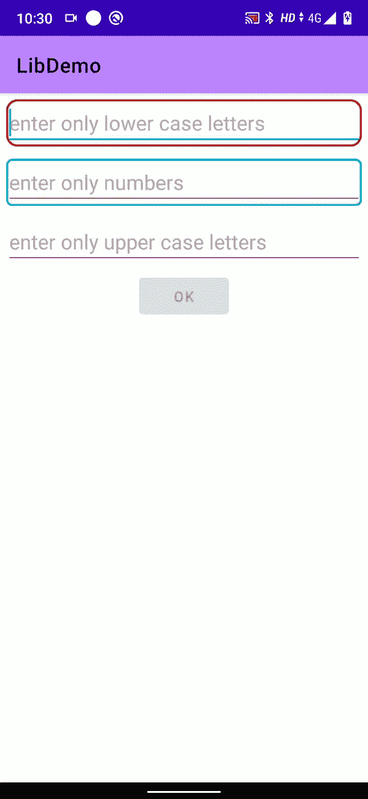

# 一种在 Android 中验证用户输入的更酷的方式

> 原文：<https://blog.devgenius.io/a-cooler-way-of-validating-user-input-in-android-45f4a4574431?source=collection_archive---------5----------------------->


来源:[https://www . EPO . org/about-us/services-and-activities/international-European-cooperation/international-binary/validation-system . html](https://www.epo.org/about-us/services-and-activities/international-european-cooperation/international-bilateral/validation-system.html)

验证用户输入在几乎所有的应用程序中都很常见，验证输入的方式在几乎所有的应用程序中几乎都是相似的——太多 if 和 else 了，对吗？

在某些情况下，你必须根据某个**编辑文本**中的输入来启用或禁用某个按钮是否有效。甚至更糟，让我们看看如何👇？

如你所见，你必须检查两个监听器中的相同条件，这违反了 [DRY](https://en.wikipedia.org/wiki/Don%27t_repeat_yourself) 原则。

不仅[干](https://en.wikipedia.org/wiki/Don%27t_repeat_yourself)这也是违反[开闭原则](https://en.wikipedia.org/wiki/Open%E2%80%93closed_principle#:~:text=In%20object%2Doriented%20programming%2C%20the,without%20modifying%20its%20source%20code.)👇

如你所见，当你在布局中添加一个新的 **EditText** 时，你需要在所有条件下改变所有现有的代码断点。

这不仅是一个糟糕的模式，而且看起来也很难看，因为你必须在所有的 EditTexts 上设置一个 **TextWatcher** ，然后检查文本在那个 EditTexts 中是否有效，所有其他的 EditTexts 也使用相同的 if 检查。

> 我们能做得更好吗？

# 介绍 ValidationNotifierEditText

我创建了一个小的库来简化这个，它将减少很多样板文件，使它不容易出错，并且它遵循干燥和开放-封闭的原则。最重要的是，你可以有一个可选的编辑文本边框和圆角，而不用设置背景。👇



让我们看看它是如何工作的👇

```
<com.abhinav.chouhan.validationnotifieredittext.ValidationNotifierEditText
    android:id="@+id/vne"
    app:vne_borderColor="@android:color/holo_blue_dark"
    app:vne_borderWidth="2dp"
    app:vne_cornerRadius="5dp"
    app:vne_giveBorder="true"                                
    android:textColorHint="@android:color/darker_gray"
    app:vne_validBorderColor="@android:color/holo_blue_dark"
    app:vne_invalidBorderColor="@android:color/black"
    android:layout_width="match_parent"
    android:layout_height="wrap_content
    android:hint="enter only numbers"
    app:vne_validatorRegex="[1-9]+"
   />
```

你必须在 xml 中传递一个 ***正则表达式*** 正则表达式在内部被检查，当文本变得有效或无效时，你会得到通知👇

```
val validationNotiferEditText = findViewById(R.id.vne)
       validationNotifierEditText.addValidationChangeListener(object : ValidationNotifierEditText.ValidationChangeListener{
        //called when text is valid
              override fun onBecomeValid(validationNotifierEditText: ValidationNotifierEditText) {

              }
        //called when text is invalid
             override fun onBecomeInvalid(validationNotifierEditText: ValidationNotifierEditText) {
          }
    }) 
```

## 在一个地方获得所有验证事件

如果您只需启用或禁用一个按钮，您不必在所有编辑文本上设置 TextWatcher。您可以在 xml 中放入一个特殊的视图，并给它所有其他 EditTexts 的 id。

当全部有效和全部无效时，你将得到回调。👇

使用它，你不需要检查任何 if 条件，你也可以在未来的布局中添加或删除尽可能多的 EditText，并且不会中断现有的代码。

> 在项目级**中添加*build . gradle***
> 
> `allprojects {
> repositories {
> …
> maven { url ‘[https://jitpack.io'](https://jitpack.io') }
> }
> }`
> 
> 添加模块级 **build.gradle**
> 
> `dependencies {
> 
> implementation ‘com.github.AbhinavChauhan97:ValidationNotifierEditText:1.3.7’ // use latest vesion
> }`

请在我的 [**github**](https://github.com/AbhinavChauhan97/ValidationNotifierEditText) 找到源代码，了解更多

谢谢

祝你愉快😊