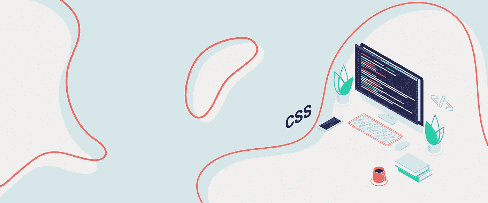

# BPM:一种 CSS 自定义属性方法

> 原文：<https://blog.devgenius.io/a-css-custom-properties-methodology-551665a8f13f?source=collection_archive---------6----------------------->



CSS 自定义属性(或 CSS 变量)功能强大，层叠，让我们以以前无法的方式构建网站。也就是说，CSS 的层叠意味着很有可能会出现意想不到的副作用，尤其是如果您不仅仅在`:root`级别定义属性的话。以下是对 BEM、ABEM 或大多数基于块的 CSS 方法使用自定义属性的建议。

BPM (Block Property Modifier)是对 BEM、ABEM 或大多数基于块的 CSS 方法使用自定义属性的建议。它的惯例集中在明确自定义属性的预期范围，以便它们可以在组件之间轻松使用或重构，而不会产生意外的后果。

# 1.- <someprefix>- <property-name>-</property-name></someprefix>

选择属性名时，首先考虑使用现有 CSS 属性的名称。比如`color`过`text-color`、`gap`过`spacing`等。如果没有合适的 CSS 属性，请选择一个与其他 CSS 属性一致的名称。开发人员习惯于 CSS 属性，所以他们更有可能识别出什么是属性，你引用的是他们已经知道的属性。

如果有多个相似的值就用后缀:`color-primary`、`color-secondary,`、`gradient-start`、`gradient-end`、`font-family-heading`等。

# 2.前缀:根属性。

为在`:root`中定义的属性选择一个标准前缀，比如`--root-`:

```
:root {
  --root-color-primary: orangered;
  --root-color-secondary: cyan;
  --root-padding: 20px;
  --root-buttonAngle: -15deg;
}
```

您应该仅在`:root`元素级别覆盖这些值，而不是在特定元素中。这些值相当于项目的常数，应该可以从任何组件访问。它们可能实际上并不是恒定的—*—*您可能希望根据媒体查询(如`prefers-color-scheme`、`prefers-reduced-motion`或视口大小)来更改这些值——但是我们希望这些值在任何地方都可用，不受任何父元素的影响。

# 3.以私有特性的块名作为其前缀。

为私有块属性加上前缀`blockName`:

```
.button {
  --button-color: purple;
  --button-buttonAngle: var(--root-buttonAngle, 15deg);
}
```

没有办法创建真正的私有 CSS 属性。然而，如果你在像原子设计这样的方法中工作，组件应该很少作为它们自己的父组件出现，所以用它们的块名作为属性的前缀可以避免冲突。

这些属性**不应在该程序块之外设置或使用**。开发人员应该可以自由地创建和重构它们。它们应该由块、块的元素和修饰符设置或使用:

```
.button {
  --button-color: purple;
  background-color: var(--button-color);
  box-shadow: 0 0 10px var(--button-color);
}// BEM
.button--bright {
  --button-color: gold;
}// ABEM
.button.-bright {
  --button-color: lemonchiffon;
}
```

# 4.对公共属性使用不带前缀的属性。

首先，假设您有一个`.card`块，您想为子块、`.button`和`.quote`设置一个`—-color`:

```
.card {
  --color: slateblue;
  --card-color: var(--color);
  border: 4px solid var(--card-color-primary);
  box-shadow: 0 0 10px var(--card-color-primary);
}.button {
  --button-color: var(--color, var(--root-color-primary));
  background-color: rgba(255, 255, 255, .5);
  border: 3px double var(--button-color);
  color: var(--button-color);
}.quote::before {
  color: var(--color, var(--root-color));
  content: '“';
}
```

这里，`.button`和`.quote`都使用`.card`定义的`--color`。我们保留这些属性不加前缀，以表明任何块都可以设置或使用公共的、不加前缀的属性。

把你的公共财产和私人财产分开。例如，如果我们试图重构以去掉`--button-color`:

```
.button {
  background-color: rgba(255, 255, 255, .5);
  border: 3px double var(--color, var(--root-color-primary));
  color: var(--color, var(--root-color-primary));
}// We can't do this anymore
.button.-danger {
  --button-color: brickred;
}// Instead we have to override every place the color is used
.button.-danger {
  border-color: brickred;
  color: brickred;
}// We can override over the original --color, but now we can't get
// the original value of 'slateblue' at all.
.button.-danger {
  --color: brickred;
}
```

# 5.保持一致。

重用属性名。例如，定义所有三个`--root-color`、`--button-color`和`--color`是非常好的。为不同的组件重用相同的公共属性意味着所有这些组件一起工作会更好。

# 例子

## 为特定子块设置特性

假设在`.card`中，我们只想改变其中一个按钮的`--color`。我们可以为特定元素设置公共属性:

```
.card__action {
  --color: yellowgreen;
}
```

## 恢复自定义属性

类似地，我们可以使用`initial`将一个属性恢复到它的默认值:

```
// Applies to all elements
.card {
  --color: yellowgreen;
}// But initial reverts card__action to its defaults
.card__action {
  --color: initial;
}
```

## 更改子元素的公共属性值

说`.card`和`.button`都用`--color`。如果它们应该具有相同的值，就不需要做什么特别的事情；`--color`的值将向下级联。但是，如果您希望子元素的`--color`有不同的值，而不改变`.card`的值，我们可以这样做:

```
.card * {
  --color: lime;
}// or if you want lower specificity::where(.card *) {
  --color: lime;
}
```

我们也可以通过使用`initial`为子元素完全取消设置`--color`的值:

```
// If specificity is an issue, target :where(.card *)
.card * {
  --color: initial;
}// or if you want lower specificity::where(.card *) {
  --color: initial;
}
```

## 自定义属性与修饰符的优先级

回到`.button`的例子，我们有两种不同的方法让修改器与自定义属性交互:

```
.button {
  --button-color: var(--color, var(--root-color-primary));
  background-color: rgba(255, 255, 255, .5);
  border: 3px double var(--button-color);
  color: var(--button-color);
}.button.-danger {
  --button-color: brickred;
}.button.-bright {
  --button-color: var(--color, gold);
  border-width: 6px;
}
```

`.button.-danger`改变按钮颜色，并将完全忽略`--color`的值。如果您正在实现亮暗模式，有时您可能希望覆盖一个自定义属性，以便无论如何都使用相同的颜色(砖红色)。

另一方面，`.button.-bright`在改变默认颜色的同时仍然尊重`--color`的值。我们可以使用`-bright`,即使我们需要改变颜色，或者想要新的颜色(金色)用于亮模式，但是需要覆盖金色用于暗模式。

## 块元素的私有属性

如果你需要的话，你可以给变量加上前缀`blockName__elementName`，而不仅仅是一个`blockName`:

```
.card__hero {
  --card__hero-width: calc(50vw + 600px);  
  width: var(--card__hero-width);
}
```

您像这样定义属性，您不能从`.card`覆盖它们，除非您定义伴随的公共属性:

```
.card.-thin {
  --hero-width: 30vw;
}.card__hero {
  --card__hero-width: var(--hero-width, calc(50vw + 600px));
  width: var(--card__hero-width);
}
```

如果需要覆盖块中的属性，建议改为在块中设置这些私有属性:

```
.card {
  --card-width-hero: calc(50vw + 600px);
}.card.-thin {
  --card-width-hero: 30vw;
}.card__hero {
  width: var(--card-width-hero);
} 
```

# 思想

当你第一次采用自定义属性时，考虑采用这种约定——尝试跳过开发新功能的“狂野西部”阶段，考虑如何用 CSS 的其余部分组织自定义属性。

*本文最初发表在 Imarc 博客* [*上(带有语法高亮)。*](https://www.imarc.com/blog/block-property-modifier-a-bem-like-css-custom-properties-methodology)