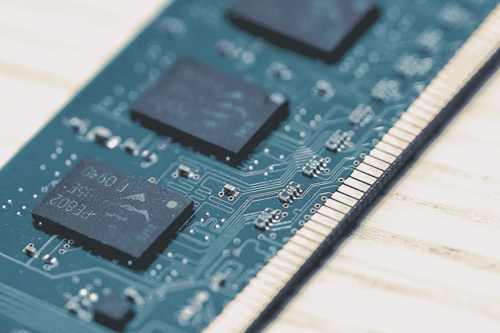

# 一个关于后期初始化选项的奇怪故事——第二部分

> 原文：<https://blog.devgenius.io/a-curious-tale-of-late-initialisation-options-part-ii-339a85e08961?source=collection_archive---------16----------------------->

## 使用 Kotlin 的后期初始化选项导航内存泄漏和线程安全



[杰里米·贝赞格](https://unsplash.com/@jeremybezanger?utm_source=medium&utm_medium=referral)在 [Unsplash](https://unsplash.com?utm_source=medium&utm_medium=referral) 上拍摄的照片

在[第一部分](https://bendaniel10.medium.com/a-curious-tale-of-late-initialisation-options-part-i-44da6ca94068)中，我们在使用完一个`Behaviour`之后成功地清理了我们的资源。

选择的解决方案使我使一个属性可空，即使我觉得它不应该是空的。

> 我想知道为什么我需要这样做，当我确信只要我调用了`onAttach(Item)`，那么`item`的值就永远不会是`null`。

但是这总是真的吗🤔？

## 捕捉:多线程

多线程使事情变得复杂。大多数被认为写得很好的代码，一旦被放到多线程环境中，就会暴露出它们的弱点。

我完全同意

让我们把我的代码放到一个多线程环境中，看看它的表现如何。

我已经更新了下面的代码片段。我假设必须在`onAttach(item)`方法中进行异步 API 调用。这个 API 调用完成后，将调用`echo()`方法。以下是更新后的代码:

这里，我使用了 Kotlin 提供的`thread { }` util 函数。它也会自动启动`Thread`。为了简洁起见，我使用了线程。还有其他推荐的方法，比如使用 [Kotlin 协程](https://kotlinlang.org/docs/coroutines-overview.html)、 [RxJava](https://github.com/ReactiveX/RxJava) 等。

使用与第一部分相同的参数运行更新后的代码，结果如下:

```
Detaching null
Attaching, null
```

让我们看一下与最近的代码更新相关的产生这个输出的代码，以便我们能够理解发生了什么。

如果你按照代码的逻辑流程。您将看到为什么在`echo()`方法调用期间`item.name`的值是`null`。`behaviour.onAttach(item)`方法调用立即返回，不久之后`behaviour.onDetach()`方法调用被执行。

这是可能的，因为`apiCall(then)`方法以异步方式运行。此外，由于该方法上发生的长时间操作，`onDetach()`能够在执行`echo()`函数之前完成并清理资源。

现在我们已经看到了`item`属性如何可能处于空状态。我们如何解决这个问题？

## 解决方案三:抱歉打扰了

一种简单的方法是将创建的线程保存在一个可空属性中，然后在调用`onDetach()`方法时中断它。这样，在调用了`onDetach()`之后，将不会执行`echo()`方法。让我们检查一下更新后的代码:

apiCall(then)现在必须捕获“InterruptedExecption ”,因为它的线程在第 12 行被中断。

运行它的输出变成:

```
Detaching null
interrupted. fun ...echo()... not called.
```

这么🎉。这个解决方案工作得很好，因为在调用了`onDetach()`方法之后，我们不再关心`apiCall(then)`方法调用的结果。

## 捕捉:线程安全、可重用性和 API 设计

不幸的是，我们的解决方案仍然不能很好地工作。其他开发人员抱怨说，即使在发生了`onDetach()`之后，仍在调用`echo()`方法。他们还说，没有办法将`Behaviour`从单个项目上拆下来。

让我们更新我们的`main`函数来理解他们的请求。

你可以很快发现第二个请求是有意义的。我们需要一种方法将`Behaviour`从单个项目中分离出来。然而，我不认为他们对第一种选择是正确的。让我们运行代码，看看会发生什么。

```
Detaching null
Interrupted, fun ...echo()... not called.
Attaching, null
```

呃，什么？为什么会这样？我可以发誓`onDetach()`方法会恰当地处理这种情况。也许我们应该仔细看看。让我们用更多的日志来丰富代码，以了解正在发生的事情。

现在我们将能够看到哪个线程正在运行`onDetach()`、`echo()`和`apiCall(then)`方法中的不同操作。这是显示新日志的输出:

```
Detaching null from main, interrupted Thread-1
Calling API for null from Thread-0
Calling API for null from Thread-1
Interrupted, fun ...echo()... not called from Thread-1
Attaching, null from Thread-0
```

啊哈！问题就在这里。你能看见它吗？`Thread-0`没有线程中断。你可以看到，每当执行`apiCall(then)`时，`apiCallThread`总是会被覆盖。因此，`onDetach()`方法只会中断最后一次存储的`apiCallThread`。

另外，请注意，输出的第 2 行和第 3 行不再记得`item`，因为它们已经被分离。当然，接口及其实现并不像我们希望的那样好。

```
...
Calling API for null from Thread-0
Calling API for null from Thread-1
...
```

这是一个问题。

让我们进入[的最后一部分](https://bendaniel10.medium.com/a-curious-tale-of-late-initialisation-options-part-iii-e92d9f2abd79)，看看最新的解决方案。