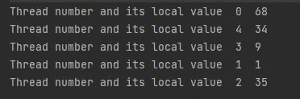
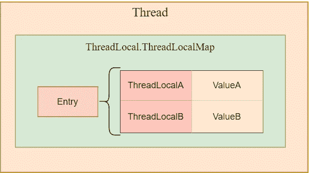
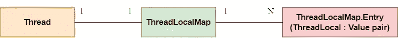

# 深入探究 Java ThreadLocal

> 原文：<https://blog.devgenius.io/a-deep-dive-into-java-threadlocal-9d0c2591a72f?source=collection_archive---------3----------------------->


ThreadLocal 是 Java 程序中常用的类之一。

今天我刚刚遇到了一个用例，我的 workplace 代码库利用 ThreadLocal 来存储特定于线程的上下文。

但如果你当场让我在 ThreadLocal 上更深入地解释，我很可能回答不出来——这也是这篇文章产生的原因。

对于那些参加面试的人，我希望这篇文章也能帮助你，以防这也是你的面试问题之一。

# 什么是 ThreadLocal？

从它的名字，我们可以知道它存储了线程的局部变量。这些变量被隔离在不同的线程之间，只能被自己的线程访问。

应用 ThreadLocal 的常见场景包括:

1.  线程间的数据隔离
2.  数据库连接的会话管理
3.  线程的事务信息的存储

# 如何使用 ThreadLocal？

让我们看一个简单的例子。

```
public static void main(String[] args) { //Create a ThreadLocal
    ThreadLocal<String> local = new ThreadLocal<>(); //Create a new Random class
    Random random = new Random(); //Create 5 threads
    IntStream.*range*(0, 5).forEach(a-> new Thread(()-> { //Set a local value for each of the threads
        local.set(a+"  "+random.nextInt(100));
        System.*out*.println("Thread number and its local value  "+ local.get()); }).start());
}
```

在上面的代码中，我们创建了一个 ThreadLocal 类，创建了 5 个线程，在每个线程中为 ThreadLocal 赋值并打印它们。

下面是输出的内容:



够简单吗？

# 引擎盖下是什么？

如果你仔细观察，你会发现上面的 ThreadLocal 中有两个重要的方法。

```
1\. public T get() {}
2\. public void set (T value) {}
```

让我们来看看 ThreadLocal 源代码中的 setter 方法:

```
public void set(T value) {
        Thread t = Thread.currentThread();
        ThreadLocalMap map = getMap(t);
        if (map != null)
            map.set(this, value);
        else
            createMap(t, value);
}
```

setter 方法首先获取当前线程，调用 *getMap()* 方法获取一个 *ThreadLocalMap* 类。如果映射存在，以当前线程 *t* 为 key，输入参数为 value，在映射中设置{key:value}对。如果没有，那么创建一个地图。

您现在可能想知道— **什么是 ThreadLocalMap？**

```
static class ThreadLocalMap {
   */**
    * The entries in this hash map extend WeakReference, using
    * its main ref field as the key (which is always a
    * ThreadLocal object).  Note that null keys (i.e. entry.get()
    * == null) mean that the key is no longer referenced, so the
    * entry can be expunged from table.  Such entries are referred to
    * as "stale entries" in the code that follows.
    */* static class Entry extends WeakReference<ThreadLocal<?>> {
       */** The value associated with this ThreadLocal. */*
       Object value;
       Entry(ThreadLocal<?> k, Object v) {
           super(k);
           value = v;
       }
    }}
```

*ThreadLocalMap* 是 *ThreadLocal* 中的内部静态类，定义了一个 *Entry* 类来存储数据。*条目*使用 *ThreadLocal* 实例作为键，并设置我们传入的值。

如果在这个阶段太混乱，只要记住是 *ThreadLocalMap* 中的*条目*类在做实际的值存储。

为了从 *ThreadLocal* 中检索数据，我们来看看 getter 方法:

```
public T get() {
        Thread t = Thread.currentThread();
        ThreadLocalMap map = getMap(t);
        if (map != null) {
            ThreadLocalMap.Entry e = map.getEntry(this);
            if (e != null) {
                @SuppressWarnings("unchecked")
                T result = (T)e.value;
                return result;
            }
        }
        return setInitialValue();
}
```

在 getter 方法中，我们将使用 *currentThread* 作为键来获取 *ThreadLocalMap* 。然后映射将基于 *ThreadLocal* 实例 *getEntry()* 并返回 *Entry* 实例和存储值。

**感觉有点头晕？**

也许图表会有所帮助:



1.  每个*线程*维护一个对 *ThreadLocalMap* 的引用
2.  *ThreadLocalMap* 是 *ThreadLocal* 的内部静态类，使用 *Entry* 类进行存储
3.  *ThreadLocalMap* 键是 *ThreadLocal* 实例，可以有多个 *ThreadLocal*
4.  *ThreadLocal* 本身不存储值，但它是线程从 *ThreadLocalMap* 获取值的一个键

> 请注意，最好删除 ThreadLocal，以避免由于 Entry 类中的弱引用而导致的 OOM(内存不足错误)。

我希望这篇文章对你有所帮助。

我是后端软件工程师。如果你渴望了解技术，请关注我的频道，了解我在日常工作和生活中获得的灵感。

> ***阅读更多:***[*一个关于 Java 静态关键字在职期间的案例*](/a-case-about-java-static-keyword-during-my-job-53cebb6af597)[*如何解决这个 Java 多线程面试问题？*](/how-can-you-solve-this-java-multithreading-interview-problem-8e6ec53fab27)
> 
> ***获取连接:***[*我的 LinkedIn*](https://www.linkedin.com/in/daini-wang-5127b2182)