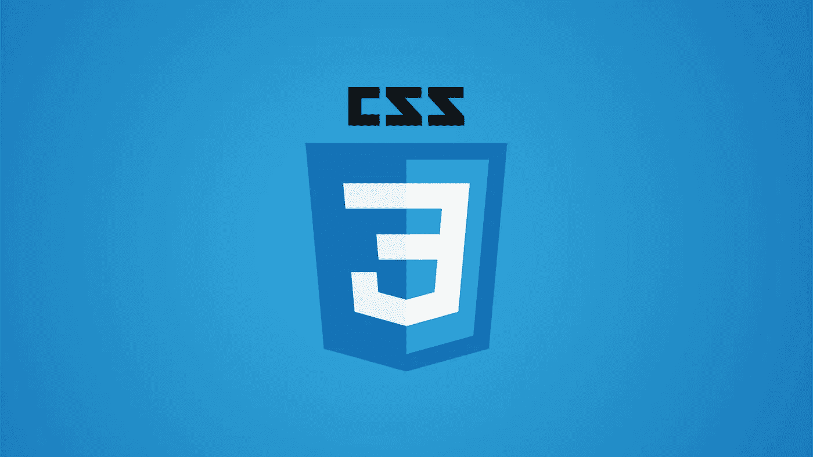

# 深入研究 CSS :has 选择器

> 原文：<https://blog.devgenius.io/a-deep-dive-into-the-css-has-selector-646363ed40c4?source=collection_archive---------16----------------------->

希望很快我们就能获得 CSS 中一个新的很酷的特性，选择器。



简而言之，CSS `:has`选择器可以帮助您根据条件设计特定元素的样式。例如，如果你想以某种方式设计一个包含或不包含图像的 div，你可以用`:has`选择器来实现。让我们来看看这将是什么样子:

```
div:has(img) { border: 1px solid red; }
```

上面将选择所有带有`:has`(图片)的 div，并给它一个红色边框。为了说明 HTML 如何实现这一点:

```
<div> <!-- Will be styled with a red border -->
  
<div>

<div></div> <!-- Will not get style of red border -->

<div> <!-- Will not get style of red border -->
  <article></article>
</div>
```

很棒吧？这是对 CSS 的巨大补充。通常，我们将不得不使用 Javascript 来完成这一点，现在我们可以避免…几乎！
不幸的是，目前还没有任何主流浏览器支持它，但所有主流浏览器都会添加对该功能的支持，这只是时间问题。希望不会太久。

当浏览器开始实现这个新特性时，我们可以很容易地检测最终用户的浏览器是否支持这个特性(如果不支持，您可以实现一个回退)

```
@supports(selector(:has(img))) {   */* Supported! */* }
```

相当漂亮的功能，对吧！我只是想和你分享这个很棒的 CSS 功能。如果我们幸运的话，`:has`将在今年内在所有主流浏览器中实现。

感谢你的阅读，我希望你喜欢这篇文章，如果是的话，请点击按钮支持我。

附注:首先，你应该收到我的邮件。 [***在这里做*** *！*](https://nickychristensen.medium.com/subscribe)

*其次，如果你自己也喜欢体验媒介，可以考虑通过注册成为* *的会员来支持我和其他成千上万的* [***。它每月只需花费 5 美元，它极大地支持了我们，作家，你也有机会用你的作品赚钱，并且你的作品可以接触到数以千计的人。通过这个链接***](https://nickychristensen.medium.com/membership) **[***报名***](https://nickychristensen.medium.com/membership) *，你就直接用你的一部分费用支持我，不会多花你多少钱。如果你这样做了，万分感谢。***

[](https://medium.com/js-dojo/vue-3-tips-tricks-d820b04f452f) [## Vue 3 提示和技巧

### 使用这些提示和技巧，成为更好、更高效的 Vue 开发人员

medium.com](https://medium.com/js-dojo/vue-3-tips-tricks-d820b04f452f) [](/convert-text-to-speech-with-javascript-using-the-web-speech-api-97bc2a9df75d) [## 使用 Web Speech API 通过 JavaScript 将文本转换为语音

### 如何用几行 JavaScript 轻松地将文本转换成语音。

blog.devgenius.io](/convert-text-to-speech-with-javascript-using-the-web-speech-api-97bc2a9df75d) [](https://javascript.plainenglish.io/how-to-conditionally-add-properties-to-an-object-with-javascript-in-2-minutes-7cce88b316b4) [## 如何在 2 分钟内用 JavaScript 有条件地向对象添加属性

### 您是否曾经遇到过想要有条件地给对象添加属性的情况？有几种方法可以…

javascript.plainenglish.io](https://javascript.plainenglish.io/how-to-conditionally-add-properties-to-an-object-with-javascript-in-2-minutes-7cce88b316b4) 

如果你想找个时间和我聊聊，可以关注我的 [*推特*](https://twitter.com/nickycdk)*|*[*LinkedIn*](https://www.linkedin.com/in/dknickychristensen/)*或者直接访问我的* [*网站*](https://nickychristensen.dk/) *。*