# 使用 Python 对数据科学工资进行详细分析

> 原文：<https://blog.devgenius.io/a-detailed-analysis-into-data-science-salaries-using-python-188a39c3bdba?source=collection_archive---------7----------------------->


马克西姆·霍普曼在 [Unsplash](https://unsplash.com?utm_source=medium&utm_medium=referral) 上的照片

作者:约翰·伊克佩姆

在数据科学领域开始职业生涯令人兴奋，但也给我留下了一大堆问题。除了涉及相当广泛的“数据科学”的工作部分之外，我想找出世界上哪些地区对数据科学家的需求最大，从而导致更高的报酬或工资。在小型、中型或大型公司担任数据分析师有什么不同，这些对你的薪酬/增长有多大影响？

本案例研究重点关注这一点，因为我们使用数据来得出准确的结论。在这里，我们按照数据科学中的职位来研究收入最高的人，并将其与公司规模、经验水平、公司位置等相关联。

本研究使用的数据是根据本[许可证](https://creativecommons.org/publicdomain/zero/1.0/)从 ai-jobs.net[汇总的数据获得的。点击](http://ai-jobs.net)下载该数据集[。这些数据包含了我们在这项研究中可能需要的所有必要信息。](https://www.kaggle.com/datasets/ruchi798/data-science-job-salaries)

*   工作年份:支付工资的年份
*   经验水平:一年内的工作经验水平，可能值如下:EN 入门级/初级 MI 中级/中级 SE 高级/专家前执行级/主管
*   employment_type:角色的雇佣类型，可以是 PT 兼职、FT 全职、CT 合同或 FL 自由职业者
*   职位名称:这一年中工作过的角色。
*   薪金:支付的薪金总额。
*   salary_currency:以 ISO 4217 币种代码表示的薪金币种。
*   salary_in_usd:以美元为单位的工资(外汇汇率除以平均汇率。通过 fxdata.foorilla.com 查询相应年份的美元汇率)。
*   employee_residence:员工在工作年度居住的主要国家/地区，作为 ISO 3166 国家/地区代码。
*   remote_ratio:远程完成的工作总量，可能的值如下:0 没有远程工作(小于 20%)，50 部分远程 100 &完全远程(大于 80%)。
*   company_location:作为 ISO 3166 国家代码的雇主主要办事处或承包分公司所在的国家。
*   company_size:一年中为公司工作的平均人数:“S”小于 50 名员工(小型)，“M”50 到 250 名员工(中型)；“L”大于 250 名员工(大型)。

这个数据是一个。“csv”文件按行和列排列。它包含过去三年(2020–2022)收集的数据。用于此分析的工具是 Python，位于 Jupyter 笔记本 IDE 上。首先，我们导入本研究所需的所有工具，并将数据集导入 Jupyter notebook。虽然这篇文章中包含了一些代码片段，但是您可以在这里访问完整的代码。

```
import pandas as pd
import matplotlib.pyplot as plt
import numpy as np
import plotly.express as pxdata=pd.read_csv(r'C:\Users\HI\Downloads\Compressed\Data Science Job Salaries\ds_salaries.csv')
```

让我们来看看数据集:

```
data.head()
```

我们有一个“未命名”的列，这将影响我们分析的准确性。我们必须摆脱它。

```
del data["Unnamed: 0"]
```

接下来，我们必须检查数据集，以确保所有列都具有正确的数据类型

```
data.info()
```

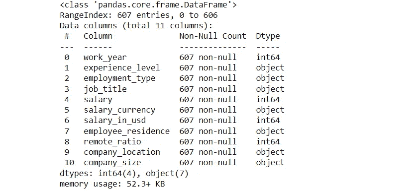

我们的数据类型是准确的。检查空值:

```
data.isnull().sum()
```

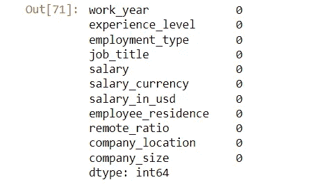

我们目前在数据集中没有空单元格。数据已清理完毕，可以使用了。让我们开始分析。

# 1.每年收入最高的职业(2020 年至 2022 年)

首先，让我们从这个数据集中找出每年收入最高的人。

1.  **2020 年**；

```
#highest earner for all data professions in USD in 2020highearn1=data[data.work_year==2020]
highearn1=highearn1.groupby(['job_title','experience_level','company_size','company_location']).max()['salary_in_usd'].reset_index()
highearn1=highearn1.sort_values('salary_in_usd',ascending=False).head(10)
highearn1
```

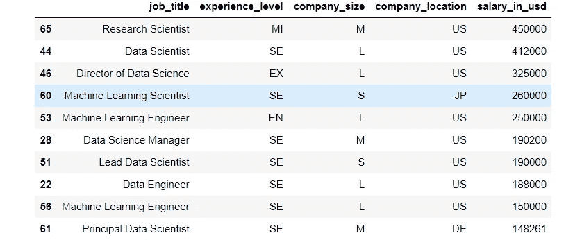

2020 年最高收入人群

显示前 10 名，一个在美国中型公司工作的中级经验的“研究科学家”,是我们 2020 年的最高收入者。为了保持我们分析的一致性，我们将只使用每个条目的“薪金美元”作为我们的工资栏。

2.**为 2021 年**；

```
#highest earner for all data professions in USD in 2021highearn2=data[data.work_year==2021]
highearn2=highearn2.groupby(['job_title','experience_level','company_size','company_location']).max()['salary_in_usd'].reset_index()
highearn2=highearn2.sort_values('salary_in_usd',ascending=False).head(10)
highearn2
```

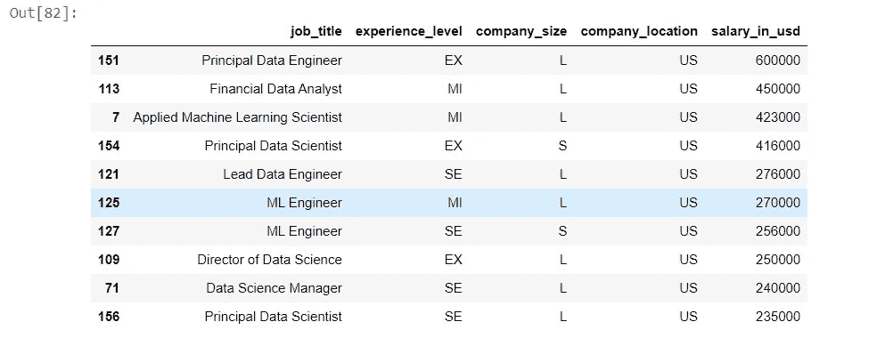

2021 年最高收入人群

2021 年，“首席数据工程师”占据首位，但在美国一家大公司的高管层工作。

3.**为 2022 年**；

```
#highest earner for all data professions in USD in 2022highearn3=data[data.work_year==2022]
highearn3=highearn3.groupby(['job_title','experience_level','company_size','company_location']).max()['salary_in_usd'].reset_index()
highearn3=highearn3.sort_values('salary_in_usd',ascending=False).head(10)
highearn3
```

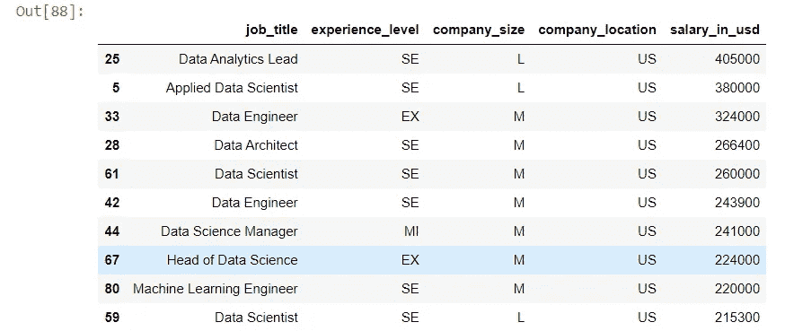

2022 年最高收入人群

一名“数据分析主管”在美国一家公司担任高级职位，今年位居榜首。

从这个分析中，我们可以推断出，你的职位并不是决定工资的唯一因素，因此也就产生了差距。我们需要考虑你的经验水平、公司所在地和公司规模。

# 2.每个职位的平均收入

在我们继续分析之前，让我们先来看看平均来说，哪些职位工资最高。

```
#average earning per job titleavgearn=data.groupby('job_title').mean()['salary_in_usd'].reset_index()
avgearn=avgearn.sort_values('salary_in_usd',ascending=False).head(10)
avgearn
```

显示前 10 名:

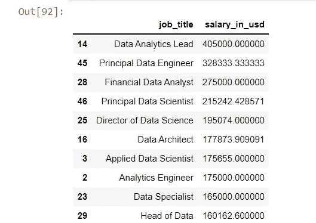

薪酬最高的头衔

在酒吧聊天中显示:

```
avgearn.plot(kind='bar',x='job_title',y='salary_in_usd',title='Average earning per job title',figsize=(15,8))
```

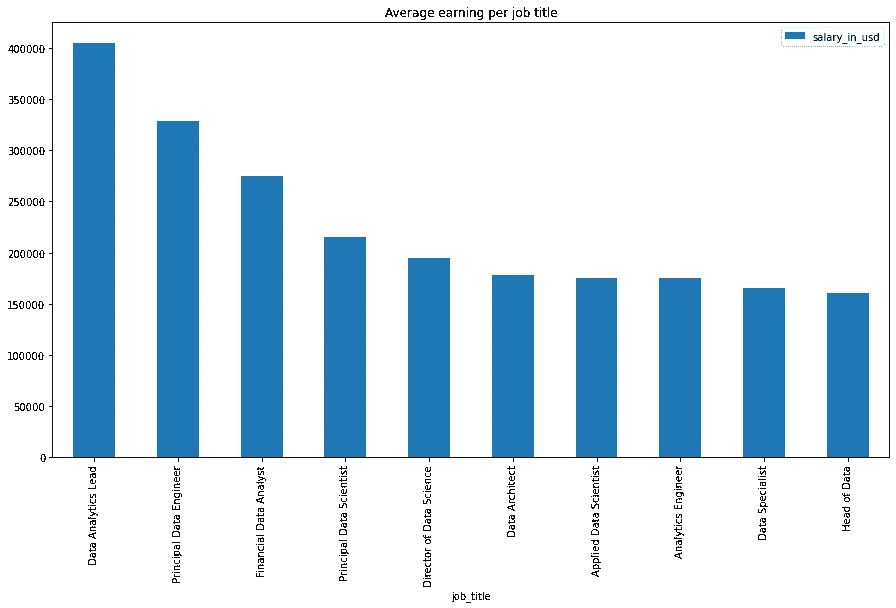

薪酬最高的头衔

# 3.每个地区职称的平均工资

从我们之前的分析中，我们可以看到美国是收入最高的国家。我们将进行一项分析，看看美国的平均薪酬与数据集中的其他地区相比如何。从美国开始:

```
#average pay of job titles per region#starting with the US:payus=data[data.company_location=='US']
payus=payus.groupby('job_title').mean()['salary_in_usd'].reset_index()
payus=payus.sort_values('salary_in_usd',ascending=False).head(10)
payus 
```

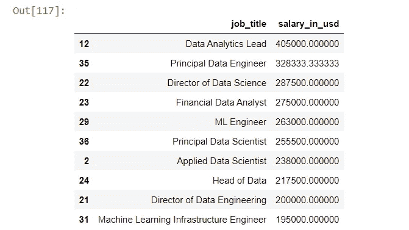

美国平均薪酬最高的头衔

与其他地区进行比较；

```
#comparing these values with the rest of the regions on the datasetpayout=data[data.company_location!='US']
payout=payout.groupby('job_title').mean()['salary_in_usd'].reset_index()
payout=payout.sort_values('salary_in_usd',ascending=False).head(10)
payout
```

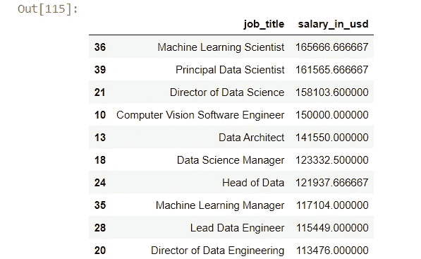

美国以外的平均顶级头衔

比较两个结果，我们会发现常见的职称。首先，我们从上面的 python 脚本或美国和美国以外的公司中删除了“head”函数，因此我们可以获得数据集的完整视图。然后，我们合并两个数据集。

```
compare = pd.merge(payus,payout[['job_title','salary_in_usd']],on='job_title', how='left').dropna().head(10)
compare
```

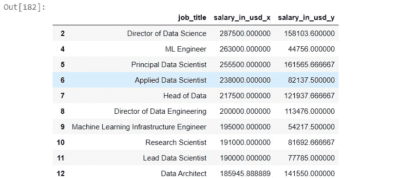

我们将使用一个图来更好地表示图形:

```
compare.plot(kind='bar',figsize=(15,8),x='job_title',title='Comparison of average pay per job title for US companies to other parts')
```

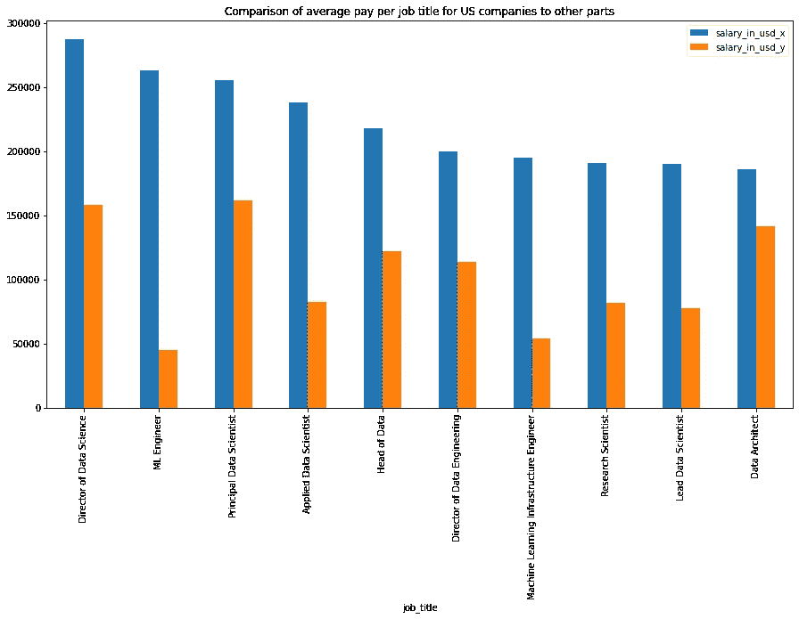

美国和非美国国家/地区每个职位的平均薪酬比较

在上图中，美国公司的平均工资用‘salary _ in _ USD _ x’表示，其他国家的平均工资用‘salary _ in _ USD _ y’表示。从这张图表中，我们可以看到，与其他国家相比，美国公司为所有职位提供了更多的机会。

# 3.经验水平对工资的影响

我的经验水平对我的工资有影响吗？我会说是的，但作为数据分析师，我们必须看看数据对此有什么看法。

```
#comparing avg pay by experience levelexp=data.groupby('experience_level').mean()['salary_in_usd'].reset_index()
exp=exp.sort_values('salary_in_usd',ascending=False)
exp
```

不能忘记我们的视觉效果；

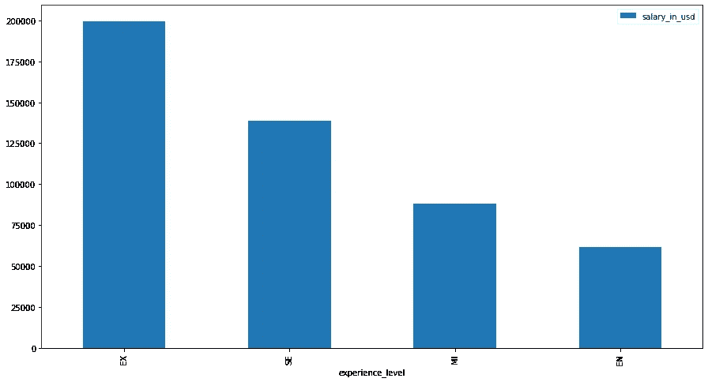

职位工资

数据证实了我们的怀疑。行政职位拿回家的袋子最大，而入门职位在订单的底部。

# 4.公司规模对薪酬的影响

在这项分析中，我们将比较美国公司规模对薪资的影响，以及数据集上其他地区的影响。

对于美国的公司:

```
#average pay by company size in the US
compsizeUS=data[data.company_location=='US']
compsizeUS=compsizeUS.groupby('company_size').mean()['salary_in_usd'].reset_index()
compsizeUS=compsizeUS.sort_values('salary_in_usd',ascending=False)
compsizeUS
```

对于美国以外的公司:

```
#average pay by company size outside the UScompsizeNOTUS=data[data.company_location!='US']
compsizeNOTUS=compsizeNOTUS.groupby('company_size').mean()['salary_in_usd'].reset_index()
compsizeNOTUS=compsizeNOTUS.sort_values('salary_in_usd',ascending=False)
compsizeNOTUS
```

为了进行比较，我们必须合并两个结果

```
sizecomp = pd.merge(compsizeUS,compsizeNOTUS[['company_size','salary_in_usd']],on='company_size', how='left')
sizecomp
```

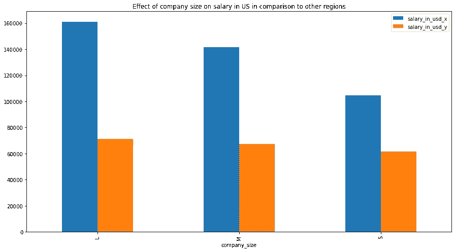

从上面的图表中，我们可以推断出，无论是在美国还是在其他地区，公司的规模对薪酬都有重大影响。

# 5.远程工作对薪酬的影响

接下来，我要确定远程工作对平均工资的影响有多大。根据我们的数据集，这被分为三类:0 无远程工作(不到 20%)，50 部分远程 100%和完全远程(超过 80%)。

```
#effect of remote work on payrem=data.groupby('remote_ratio').mean()['salary_in_usd'].reset_index()
rem=rem.sort_values('salary_in_usd',ascending=False)
rem#plot
rem.plot(kind='bar',figsize=(15,8),x='remote_ratio',y='salary_in_usd')
```

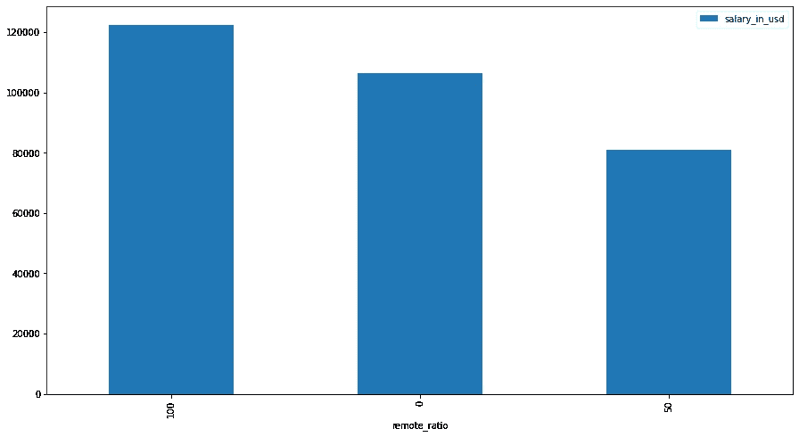

平均远程支付比率

# 6.雇佣类型对工资的影响

最后，我们来看看你的就业类型是全职、兼职、合同工还是自由职业者对你的工资有多大影响。

```
#employment type on average payemptype=data.groupby('employment_type').mean()['salary_in_usd'].reset_index()
emptype=emptype.sort_values('salary_in_usd',ascending=False).head(10)
emptype#plot
emptype.plot(kind='bar',figsize=(15,8),x='employment_type',y='salary_in_usd',title='employment type on salary')
```

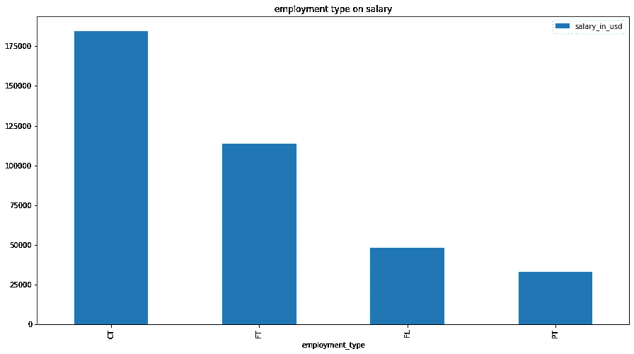

合同工排在第一位，其次是全职员工。收入最低的是兼职员工。

# 结论

1.  根据我们的分析，薪酬最高的角色是数据分析主管和首席数据工程师。然而，这些都是更高级的角色。
2.  尽管初级职位的薪酬最低，但在美国公司获得这些职位将非常有益。远程工作不会是一个障碍，而是一个优势，根据我们的分析，100%的远程角色工资最高。
3.  全职角色和合同角色是最赚钱的就业选择。
4.  大公司自然比小公司工资高。然而，美国的小公司比世界其他地方的大公司待遇好得多。在美国公司谋得一个职位将是加速你职业发展的最佳方式。
5.  在美国，同样的职位在其他国家的平均薪酬要高得多。