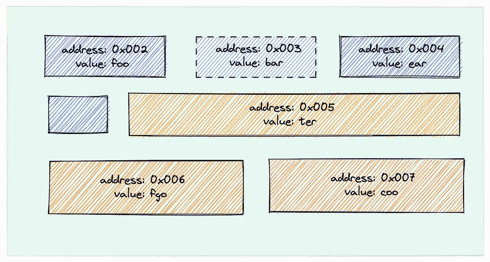

# Golang 中指针的详细解释

> 原文：<https://blog.devgenius.io/a-detailed-explanation-of-pointers-in-golang-87e659d29095?source=collection_archive---------2----------------------->

golang 中的指针教程


由 [Marvin Meyer](https://unsplash.com/@marvelous?utm_source=unsplash&utm_medium=referral&utm_content=creditCopyText) 在 [Unsplash](https://unsplash.com/s/photos/work?utm_source=unsplash&utm_medium=referral&utm_content=creditCopyText) 上拍摄的照片

计算机有两个重要组成部分，CPU 和内存。CPU 主要负责计算，内存负责存储。在我们编写的代码中，定义的变量将在运行时放在内存中。不同的变量长度不同，在内存中占用的块和大小也不同。

大概如下图所示，当然真实的样子不是这样的，这里只是举例。



为了方便 CPU 取数据，我们存储在内存中的任何数据都有一个地址，这个地址代表变量在内存中的位置，存储这个地址的变量就是指针。

记住:**每个变量都有地址，指针的值就是地址。**

在 C 语言中，对指针抱怨最多的就是指针的操作和内存释放，这往往会导致一些**缓冲区溢出**的问题。

Golang 中也保留了指针的概念，但是不能执行指针运算。

Golang 中关于指针有三个核心概念:

*   指示字地址
*   指针类型
*   指针值

**指针地址和类型**

指针变量可以指向任意值的内存地址，指针变量占用的内存大小是一个固定值，与它所指向的值大小无关。在 32 位机器上，指针变量占用 4 个字节，在 64 位机器上，它占用 8 个字节。当定义了一个指针变量并且没有给任何变量赋值时，它的默认值是`nil`。

在 Go 语言中，我们通过在变量前面加上`&`符号来获取变量的内存地址，这个操作也叫做**取地址**。同样，使用`*`来表示指针。

假设变量`p`的类型为`T`，其中`p`代表取地址的变量，结果由`addr`接收，即变量`p`的地址赋给变量`addr`，变量`addr`的类型为`*t`。

结果如下:

```
0xc00010c008 => *int
```

**指针值**

在我们通过`&`操作符获得变量的指针后，我们可以使用`*`操作符获得指针值。

结果如下:

```
addr type: *intthe address of pointer: 0xc0000b2008value type: intvalue: 1
```

地址运算符`&`和值运算符`*`是一对互补运算符，`&`取地址，`*`根据地址取地址所指向的值。

变量、指针地址、指针变量、地址和值的关系和特征如下:

*   使用`&`运算符取一个变量的地址，就可以得到这个变量的指针变量。
*   指针变量的值是指针地址。
*   使用`*`操作符获得指针变量所指向的原始变量的值。

**空指针异常**

执行上述代码后，将会报告一个错误:

```
panic: runtime error: invalid memory address or nil pointer dereference[signal SIGSEGV: segmentation violation code=0x1 addr=0x0 pc=0x1054ca2]
```

要操作指针变量，它必须是一个指向的地址。虽然我们在上面声明了变量`foo`，但是没有给它分配内存地址，所以在执行过程中会报告一个空指针异常。通常我们会优化到`foo := new(int)`。

**空指针交换**

在上面的代码中，你认为变量`foo`和`bar`的值会交换吗？结果将是:

```
1 2
```

意味着他们之间没有交换。执行`swap`函数时，已经声明了 4 个变量，如下所示:


需要注意的是，`&foo`和`&bar`在值传入`swap`函数时会产生新的变量，并有新的内存地址，但它们存储在内存中的值是一个地址。

交换后，`&foo`指向内存块`0x004`，对应的值是`0x002`，`&bar`指向内存块`0x003`，对应的值是`0x001`，他们进行了交换，但是对于地址块`0x001`和`0x002`，他们没有改变，所以最终打印结果没有改变。


**使用指针的注意事项**

指针的使用带来了对变量的有效访问。如果不使用指针，在传递值时只能使用复制方法，所以在传递复杂或大型数据时会消耗更多的性能。

但是在使用它时，有一些事情要记住:

*   尽量不要对`channel`这样的引用类型使用指针。
*   像 int 和 bool 这样的简单数据不需要使用指针。
*   最好不要嵌套指针，不要一个指针指向另一个指针。
*   需要并发安全、无用指针

感谢您阅读本文，如果您认为文章写得很好，请关注我。

如果发现本文有错误，欢迎留言讨论。

祝你愉快。