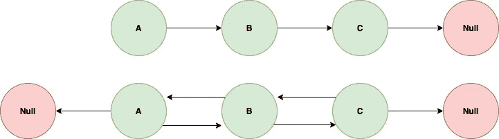
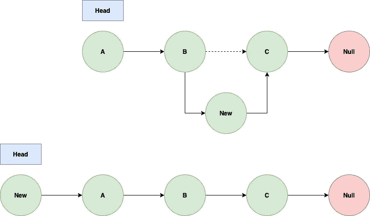
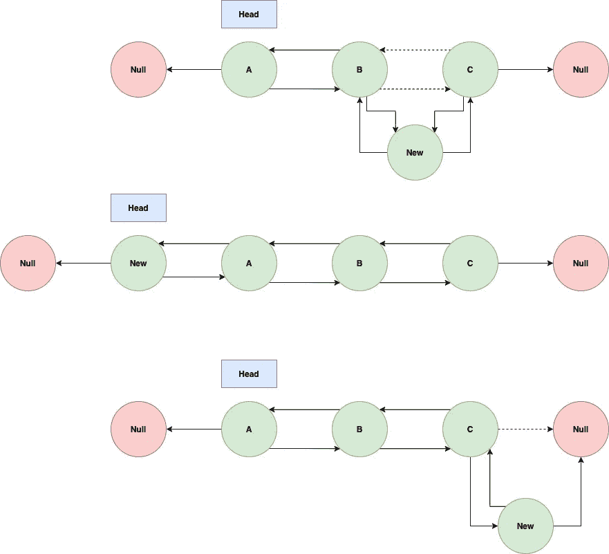
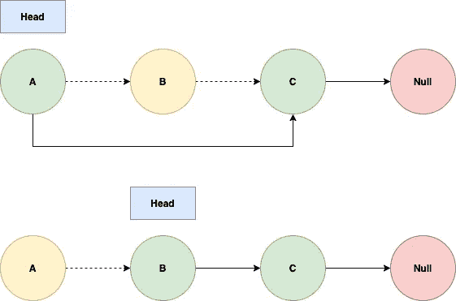
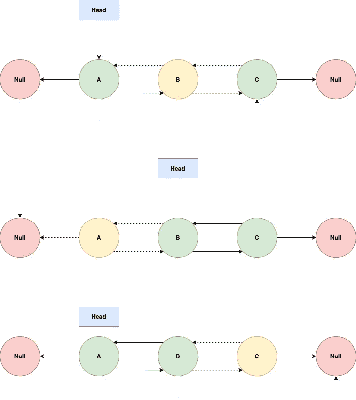
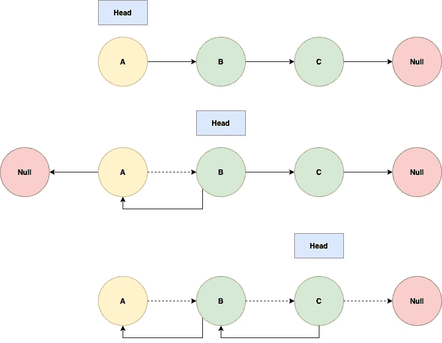

# 开发人员对链表的介绍

> 原文：<https://blog.devgenius.io/a-developer-introduction-to-linked-lists-fa748b9964a0?source=collection_archive---------5----------------------->

## 忙碌工程师的链接列表

来自 Unsplash 的强制照片

# 观众

任何工程师都可以阅读这篇文章，甚至是那些没有任何链表知识的人。然而，我想说，它对那些至少有短暂理解的人来说是最有用的，并且可以作为对要点的复习。

# 争吵

与[树](https://jc1175.medium.com/a-developer-revision-of-trees-d2923087b58a)不同，树是一种**层次**数据结构，链表是**线性**。链表有两种类型:**单向**链表和**双向**链表。

上面的图代表一个单向链表，下面的图代表一个双向链表

在单链表中，每个**节点**都有一个值(由上面的`A`、`B`和`C`表示)，以及一个指向下一个节点的**指针**(由箭头表示)。列表中的结束节点将指向`null`。双向链表是类似的，除了有两个指针:一个指向前面的节点，一个指向后面的节点。

下面是一个简单的 Java 实现。

通常我们将使用第一个节点(通常称为**头**)来表示整个列表。然后我们可以使用指针遍历列表。

因为我们需要遍历整个列表来查找一个元素，所以我们的搜索时间是`O(n)`。插入和删除略有不同。

1.  如果给我们一个节点，我们需要在它后面插入，那么我们的复杂度是`O(1)`。
2.  如果给我们一个需要删除的节点，那么单向链表的复杂度是`O(n)`，而双向链表的复杂度是`O(1)`。这就像在一个单链表中，我们需要通过节点回溯来找到我们想要删除的节点的前一个节点。
3.  如果我们需要搜索要插入或删除的节点，那么在所有情况下复杂度都是`O(n)`。

让我们就此展开讨论。

## 插入到单向/双向链表中

对于单链表，主要有两种情况:在列表中间插入和在列表开始插入。在列表末尾插入遵循与在中间插入相同的逻辑，但是“下一个”节点是`null`。

单链表中插入的两种情况

上面的图表示插入到一个单链表的中间。我们在`B`和`C`之间添加了`New`节点。为此，我们需要将`B`的下一个指针指向`New`，然后将`New`的下一个指针指向`C`。然后擦除`B`和`C`之间的指针，如虚线所示。

图的下部表示在列表的开始插入。我们需要重新分配头作为我们的新节点，指针现在必须指向前一个头。

让我们把这个编码起来。我们想要一个有两个方法的单链表:`addAtHead`和`addAtIndex`。

双向链表略有不同，我们现在需要担心两个指针。

双向链表的三种不同的插入情况。

前两种情况类似于单链表。首先，我们将前一个节点的下一个指针指向新节点，然后将新节点的前一个指针指向后面。同样，最初的下一个节点将被我们的新节点指向，并反过来指向它。

要在头部插入，我们需要将先前的头部指向我们的新节点，并将我们的新节点指向先前的头部。

要在尾部插入，我们需要将新节点指向前一个尾部，前一个尾部指向新节点。这与单链表不同，因为我们需要意识到`null`没有前一个指针的概念。

现在让我们把它编码起来。我们想要一个有三种方法的双向链表:`addAtHead`、`addAtIndex`和`addAtTail`。

## 从单向/双向链表中删除

掌握了插入的窍门后，我们转向删除。

单链表中删除的两种情况

如果我们在列表的中间删除，那么我们需要将前一个节点指向下一个节点，并将指针从要删除的节点上移开。如果我们在头部删除，那么我们需要从当前头部移除指针，并将头部移动到下一个节点。

让我们把它编码起来。我们这次只会有一个方法，`deleteAtIndex`。

对于双向链表删除，我们需要考虑更多的指针。

删除双向链表中节点的三种情况

在第一种情况下，我们从队列中间删除。我们需要将前一个节点指向下一个节点，反之亦然。

在我们从队列的头部删除的情况下，我们需要移除所有指向和来自要删除的节点的指针，然后将头部移动到下一个节点。

在最后一个场景中，我们也必须这样做，尽管我们不再关心头部。

## 指针问题

每当我在使用链表时遇到问题，我会想到“指针”。在链表上使用两个指针并以不同的速度迭代至少可以解决两个问题:在链表中查找循环，以及扩展，查找循环的开始。

最初的挑战是通过链表发送两个指针来解决的，一个一次移动一步，另一个一次移动两步。如果指针找到了列表的末尾，就没有循环。如果指针相交，那么就有。

寻找循环的起点稍微复杂一些。这要求我们首先找到节点冲突的地方(如前所述)，然后返回一个指向列表开头的指针，同时继续迭代另一个。

我们要解决的最后一个问题是反转一个链表。我们可以这样做:遍历列表，将当前节点指向前一个节点，然后移动头部。下面是一个直观的表示。

遍历列表并反转指针

这体现在下面的编码解决方案中。

# 结论

总之，我们已经介绍、探索和实现了链表，解决了各种问题。