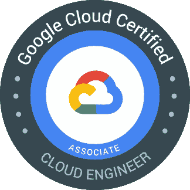
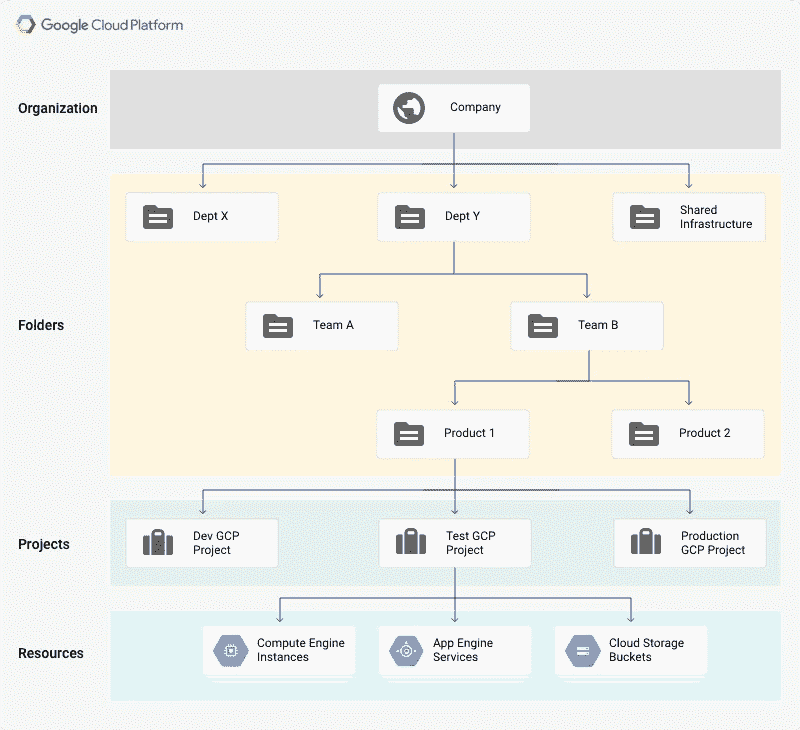

# 通过谷歌云助理云工程师考试的开发者指南

> 原文：<https://blog.devgenius.io/a-developers-guide-for-passing-google-cloud-associate-cloud-engineer-exam-8a95adb44721?source=collection_archive---------1----------------------->

## 我最近通过了云考试，这是我如何准备考试的旅程。


拉杰什瓦尔·巴楚在 [Unsplash](https://unsplash.com/s/photos/google?utm_source=unsplash&utm_medium=referral&utm_content=creditCopyText) 上的照片

我的目标之一是获得云计算认证。几年前，当他们说“*一切都在向云*移动”时，我并没有真正理解，但后来*微服务*架构随着 *Docker* 和 *Kubernetes* 而流行起来。作为一名软件开发人员，它改变了我的一切。我的组织开始对部署在内部环境中的应用程序进行“提升并转移”式迁移。我对云和云原生技术产生了热情。于是， ***我开始准备***[***Google Cloud 协理云工程师考试***](https://cloud.google.com/certification/cloud-engineer) ***并拿到了认证。***

# 为什么选择谷歌云？

**谷歌云(或 GCP)** 与**亚马逊网络服务**和**微软 Azure** 组成了**三大公共云提供商**。尽管谷歌云是这个独家俱乐部中最年轻的成员，但它也是近年来增长最快的云提供商。他们与[消费者信用报告机构- **Equifax** ，音乐流媒体巨头- **Spotify**](https://cloud.google.com/blog/products/identity-security/google-cloud-helps-equifax-achieve-digital-transformation) ，[芬兰跨国消费电子公司- **诺基亚**](https://medium.com/dev-genius/nokia-moves-data-centers-to-google-cloud-70dd0458ee84) 以及最近与[**美国职业棒球大联盟(MLB)**](https://cloud.google.com/blog/products/data-analytics/mlb-moves-to-bigquery-data-warehouse) 建立了庞大的合作关系。

我个人觉得谷歌云对开发者非常友好。它还解决了物联网(IoT)和混合环境(一些资源在内部，一些在云中)的问题，这两者都承认不是所有东西都在云上，而是都将在云上。

# 谁是云工程师助理？

根据谷歌的说法，

> “助理云工程师负责部署应用、监控运营和管理企业解决方案。这个人能够使用谷歌云控制台和命令行界面来执行常见的基于平台的任务，以维护一个或多个部署的解决方案，这些解决方案在谷歌云上利用谷歌管理或自我管理的服务。”



谷歌还表示，

*   87%的谷歌云认证用户对云技能更有信心。
*   30%的谷歌云认证用户在工作中承担了更多的责任或领导角色。

以上百分比表明那些强烈或多少同意这一说法的人。独立第三方研究机构于 2019 年 5 月对谷歌云认证个人进行的调查结果。

# 准备考试

在尝试考试之前，我已经创建了一个试用账户，可以支付 300 美元来试用所有的服务。目前，试用账户是 3 个月，但当我注册时是 12 个月。您可以访问下面的链接，创建一个试用帐户。

[](https://cloud.google.com/free) [## GCP 免费等级免费扩展试用和永远免费|谷歌云

### 20 多种免费产品免费体验热门产品，包括计算引擎和云存储，最高可达…

cloud.google.com](https://cloud.google.com/free) 

显然，最佳实践是亲自体验谷歌云提供的服务。尽管我在 GCP 为我的组织工作了 3 个月，但我可以告诉你，准备考试需要你了解所有的服务，而且，这是一个很难通过的考试。

# 关于考试

这是一道 ***选择题*** 考试用*共 50 道题要在**2 个小时内答完。*有些问题你可以在 30 秒内回答，有些问题至少需要 2 分钟，因为这些问题会很长。我能够在 50 分钟内回答所有的问题。 ***因此，如果您熟悉自己的服务，您可以轻松完成考试，并且还有充足的时间来复习您的选项。*** 可以，提交前可以审核自己的答案。如果你对这个问题没有信心，你可以标记一个问题进行回顾，然后如果你有时间的话再来看看。**

*****没有否定标记*** ，所以即使你不知道一个答案，也只是取最好的猜测。有 ***无正式及格分数*** 参加考试。谷歌似乎有自己的算法来确定你是否通过了考试。**

> **谷歌云考试旨在确定一个人是否达到最低及格标准。它们并不是为了诊断或者将人们分散到不同的能力范围。他们甚至不会给你一个考试分数，更不会告诉你离及格还有多远。只是及格或者不及格。**

**简单来说，备考没有单一的资源可以参考。事实上，你对服务了解得越多，你就能更好地留住客户。有一点要注意——Google 绝不会问你类似“*哪个是最便宜的存储这样直截了当的问题？*”，确切地说应该是，“*假设你是云工程师……*”，或者“*……是谷歌*推荐的做法”。这些问题大多基于简短的场景。**

**谷歌推荐你有 ***实际操作经验*** 为 at 最少 ***6 个月以上*** 。但那只是建议。我见过有人在一个月内通过考试。然而，你需要在学习的时候练习不同种类的场景，并且总是试图将任何系统与 GCP 联系起来。**

# **我用于考试的资源**

**为了准备，我通过探索官方考试指南中列出的所有内容进行了大量练习。**

**[](https://cloud.google.com/certification/guides/cloud-engineer) [## 云工程师助理认证|考试指南|谷歌云

### 认证考试指南助理云工程师部署应用程序，监控多个项目的运营…

cloud.google.com](https://cloud.google.com/certification/guides/cloud-engineer) 

另外，我还参加了 Dan Sullivan***官方 Google Cloud 认证助理云工程师学习指南*** *作者的[**Udemy 课程。这门课非常棒，所有你需要知道的考试要点都被强调出来了。我的一些同事选择了这本书，并毫无保留地向我推荐了作者。**](https://www.udemy.com/course/google-certified-associate-cloud-engineer-2019-prep-course/)*

要通过考试，你肯定要 ***对 VPCs、子网、VPN、云互联*** *和* ***云路由器有广泛的了解。为此，你必须阅读王从希的文章。下面的文章对我来说是黄金。***

[](https://swongful.medium.com/migrating-to-gcp-first-things-first-vpcs-c0cf00d9adff) [## 移民到 GCP？第一件事:王从希

### 谷歌云的全球网络和如何开始

swongful.medium.com](https://swongful.medium.com/migrating-to-gcp-first-things-first-vpcs-c0cf00d9adff) 

同样重要的是你要知道关于 ***Kubernetes*** 和 *Google 实现的 Kubernetes 引擎*叫做 ***GKE*** 的一切。你可以很容易地在 YouTube 上找到很多很棒的视频。我指的是下面来自谷歌的 Kubernetes 上的漫画。

## **Kubernetes 漫画**

[](https://cloud.google.com/kubernetes-engine/kubernetes-comic) [## 更快地部署代码:使用 CI/CD 和 Kubernetes | Kubernetes 漫画

### 使用持续集成和部署(CI/CD)更快地部署代码，防止停机，并节省资金。

cloud.google.com](https://cloud.google.com/kubernetes-engine/kubernetes-comic) 

## **GKE YouTube 视频**

“GKE 是什么？”由谷歌在 YouTube 上发布

了解 GKE 的另一个很好的资源来自 Priyanka Vergadia 关于 GKE(和其他服务)的系列报道和她的 YouTube 视频。

什么是 Kubernetes 发动机？YouTube 上的 Priyanka Vergadia

## GCP 流程图

我读过的最好的文章之一(就在考试前)是*Grace[Grace](https://medium.com/u/a5f7a3cf7766?source=post_page-----8a95adb44721--------------------------------)的《*GCP 每日流程图》*，如果你每天盯着她的流程图文章看，记住所有事情会非常容易。*

[](https://medium.com/google-cloud/a-gcp-flowchart-a-day-2d57cc109401) [## 一天一张 GCP 流程图

### 这只是三个 GCP 流程图的第一部分

medium.com](https://medium.com/google-cloud/a-gcp-flowchart-a-day-2d57cc109401) 

谷歌还强调 ***了解企业组织通过考试的最佳实践*** ，你必须通读谷歌文档。

[](https://cloud.google.com/docs/enterprise/best-practices-for-enterprise-organizations) [## 企业组织的最佳实践|文档

### 本指南介绍了最佳实践，以帮助像您这样的企业客户踏上谷歌云之旅。指南…

cloud.google.com](https://cloud.google.com/docs/enterprise/best-practices-for-enterprise-organizations) 

# 简而言之，高层次的概述

每个人都有自己学习课程的方法，我也不例外。我经常做一些看起来有用的笔记，但是这篇文章将会是 30 分钟。我会试着对我认为重要的事情给出一个高层次的概述。但是有太多的事情我可能无法涵盖，所以请做你自己的笔记(如果你做的话),并与我的相比较。

## GCP 的资源等级制度

组织>文件夹>项目>资源



资源层级图由[谷歌云](https://cloud.google.com/resource-manager/docs/cloud-platform-resource-hierarchy)

## GCP 的 IAM 和安全

*   使用 ***gcloud CLI*** *您必须了解服务账户、其密钥管理和使用方法。*
*   阅读并理解角色和权限。参见 [*参考*](https://cloud.google.com/iam/docs/understanding-roles) 。
*   在分配角色 时，你必须遵循 Google 的***最小特权原则。参见[参考](https://cloud.google.com/blog/products/gcp/iam-best-practice-guides-available-now)*T21。**

## GCP 的计算机选项

在 GCP 有 4 种计算机选项。

1.  **计算引擎** : *基础架构即服务*，*构建* ***高性能*** *，* ***容错*** *，* ***可大规模扩展的*** *计算应用，有不同的选项来定制您自己的虚拟机，您可以选择 RAM、磁盘、vCPUs 等。*
2.  **App 引擎** : *平台即服务，* ***两种类型:标准&灵活*** *，* ***全托管*** *，* ***自动伸缩*** *，支持 Node.js，Java，Ruby，C#，Go，Python 等， ***部署*** 后不能修改，*支持流量分流，新版本**
3.  **Google Kubernetes 引擎(GKE)** : *Google 实现的 Kubernetes 引擎，完全托管，支持 Stackdriver 监控，编排 Kubernetes 容器，* ***自动伸缩*** *，* ***自动升级*** *，* ***节点自动修复***
4.  **云函数** : *专用函数* ***触发*** *基于* ***事件*** *，* ***完全*** ***无服务器*** *。*

## GCP 的存储选项

1.  **云存储** : ***基于对象的*** *存储在* ***桶*** *，* ***非结构化*** *存储文件、视频(例如。CCTV footages)，* ***【自动缩放】由 GCP 管理，4 个存储类，*** *支持**[***对象生命周期***](https://cloud.google.com/storage/docs/managing-lifecycles) ***。*** *见* [*参*](https://cloud.google.com/storage/docs) *。**
2.  ***云 SQL** : ***全托管关系数据库*** *，用于* ***区域用例，不太贵的关系数据库*** *。**
3.  ***云扳手** : ***高可扩展，*** *企业级，* ***全球分布式*** *，以及* ***强一致关系型*** *数据库* ***，比云 SQL 贵。****
4.  ***BigQuery: *分析型数据库，Pb 级，用于数据仓储，支持 SQL 查询，*** *非事务性，部分联接支持。参见* [*参考*](https://cloud.google.com/bigquery#section-5) *。**
5.  ***Datastore/Firestore**:***NoSQL 数据库*** *，商店半结构化，* ***灵活模式*** *，无连接支持，Firestore 是 Datastore 的下一代数据库**
6.  ***Bigtable**:****低延迟写*** *，****Pb 级*** ，*理想用于* ***摄取*** *和* ***分析来自传感器的*** *大容量* ***时间序列数据参见* [*参考*](https://cloud.google.com/bigtable#section-5) *。*****
7.  ****Filestore:** *托管网络文件系统* ***，通过实例*** 持久化文件和共享**

**熟悉 ***Bigtable*** ， ***BigQuery*** ， ***云扳手*** ， ***云 SQL*** ， ***云存储*** 的用例。**

## **云存储中的存储类别**

**Google 建议你根据对象的频率来使用云存储的存储类别。**

****标准**存储类-访问频繁
**近线**存储类-访问对象每月一次
**冷线**存储类-访问对象每季度一次
**归档**存储-日志归档**

**熟悉 ***云存储中的 ***对象生命周期管理*** 。*****

## *托管实例组(MIG)*

*托管实例组(MIG)包含基于实例模板的相同虚拟机(VM)实例。MIG 支持自动修复、负载平衡、自动伸缩和自动更新。自动伸缩的工作方式是，当负载增加时，向实例组添加更多实例(向上伸缩)，当对实例的需求降低时，删除实例(向下伸缩)。参见 [*ref*](https://cloud.google.com/compute/docs/instance-groups/creating-groups-of-managed-instances) *。**

## *非托管实例组*

*非托管实例组只是驻留在单个区域、VPC 网络和子网中的虚拟机(VM)的集合。非托管实例组 ***可用于将需要单独配置设置的虚拟机分组在一起，或者调整*** 。参见[参考参见](https://cloud.google.com/compute/docs/instance-groups/creating-groups-of-unmanaged-instances)。*

## *GCP 的网络选项*

*网络是考试中最重要的话题之一。我强烈建议你多读一些，了解它。*

*   ***虚拟私有云(VPC):** *您在 Google Cloud 中管理的私有云，您可以在其中运行您的资源。他们拥有 VPC 网络，这些网络具有高度的可扩展性、全球性和灵活性。**
*   ***虚拟专用网络(VPN)** : *网络抽象，允许您使用安全 IP 或 IPsec 保护网络安全并通过互联网传输数据。**
*   ***云路由器** : *它使您的 GCP 资源能够通过使用边界网关协议(BGP)交换路由，与您的非 GCP 资源(如部署在内部的资源)进行通信。**
*   ***VPC 对等:** *不同组织中的 VPC 之间的私有通信链路(记住资源层次)。**
*   ***共享 VPC** : *在同一组织内跨资源共享 VPC。**
*   ***云互连** : *将 VPCs 中的资源链接到本地数据中心的服务。可以是直接连接(专用)或通过第三方(合作伙伴)**
*   ***防火墙** : *控制网络间流量流动的规则**
*   ***云 CDN** : *允许你缓存离用户最近的对象，从而减少延迟。**
*   ***云负载平衡** : *在即将到来的流量上扩大和缩小后端实例。**

*我怎么强调这些题目对考试的重要性都不为过。你必须知道如何[选择你的负载平衡器](https://cloud.google.com/load-balancing/images/choose-lb.svg)。关于 VPN 和 VPCs 的一切都应该知道。您只需知道子网是在 VPC 网络创建时创建的。 ***子网是区域资源*** 但是它们可以与 VPC 内部的任何其他子网通信。*每个* ***子网*** *定义了一个 IP 地址范围。**

*当您自己创建子网时，您需要提供 IP 地址范围。*

## *DNS 解析*

*创建虚拟机实例时，会自动创建解析为格式化主机名的 DNS 条目。一个 ***全限定域名*** ( ***FQDN*** )是互联网上特定计算机或主机的完整域名。FQDN 由两部分组成:主机名和域名。*

```
***FQDN = <pre>[hostname].c.[project-id].internal</pre>***
```

*例子，*

*如果您有一个项目 id 为“my-project”的 VM 实例“kangaroo ”,那么 DNS FQDN 将是，*

```
***kangaroo.c.my-project.internal***
```

## *专用互联网的地址分配*

*这是从一份文件中摘录的，该文件为互联网社区指定了互联网最佳实践，并请求讨论和改进建议。*

*互联网号码分配机构(IANA)为私有互联网保留了以下三个 IP 地址空间:*

```
 *** 10.0.0.0        -   10.255.255.255  (10/8 prefix)
     172.16.0.0      -   172.31.255.255  (172.16/12 prefix)
     192.168.0.0     -   192.168.255.255 (192.168/16 prefix)***
```

*我们将第一个块称为“ *24 位块*，第二个块称为“ *20 位块*，第三个块称为“ *16 位*块。注意(在 CIDR 之前的符号中),第一个块只是单个 A 类网络号，而第二个块是一组 16 个连续的 B 类网络号，第三个块是一组 256 个连续的 C 类网络号。*

 *[## RFC 1918 -专用互联网的地址分配

### 网络工作组 Y. Rekhter 征求意见稿:1918 思科系统过时:1627，1597 B。

tools.ietf.org](https://tools.ietf.org/html/rfc1918)* 

## *一些其他重要的事情*

*   *您必须 ***了解如何根据场景选择负载均衡器*** 。[*参见*](https://cloud.google.com/load-balancing/docs/choosing-load-balancer) 。*
*   *Google 强调你要知道 ***gcloud*** ， ***bq*** ， ***gsutil*** 和 ***kubectl*** 命令行实用程序。谷歌已经创建了 [***备忘单***](https://cloud.google.com/sdk/docs/images/gcloud-cheat-sheet.pdf) ，我强烈推荐你每天阅读并在 ***云壳*** *中练习。**
*   *了解一切 ***Google Kubernetes 引擎(GKE)*** 从了解 ***Kubernetes 架构*** 到 ***在 GKE 集群部署应用*** 。参见 [*参考*](https://cloud.google.com/kubernetes-engine#section-5) 。*
*   *了解 ***部署管理器。*** 见[*参*](https://cloud.google.com/deployment-manager/docs) ***。****
*   *了解 ***堆栈驱动程序监控、跟踪、调试和日志记录。****
*   *了解 ***创建快照来定期备份区域持久磁盘或区域持久磁盘中的数据*** 。为了降低意外数据丢失的风险，可以考虑设置快照计划的最佳做法，以确保定期备份数据。参见 [*参考*](https://cloud.google.com/compute/docs/disks/create-snapshots) 。*
*   *了解 ML 工具像 ***云数据流******云数据报******云融合*** 等。*

# *阅读。练习。重复一遍。*

*正如文章中多次强调的那样，拥有实践经验对你来说极其重要。在参加云考试之前进行模拟考试也很重要。我参加了谷歌免费提供的官方模拟测试。*

*[](https://cloud.google.com/certification/sample-questions/cloud-engineer) [## 联想云工程师示例试题|认证

### 云工程师示例问题将使您熟悉考试问题的格式和示例内容，这些内容可能…

cloud.google.com](https://cloud.google.com/certification/sample-questions/cloud-engineer) 

你练习得越多，你就越能意识到基于场景的问题。我认为不参加模拟考试就不应该参加云考试。

# 最后的想法

云计算是开发人员必备的最受欢迎的技能。我想获得认证，很高兴我做到了。我想在文章中分享我的旅程。相信我，当你阅读、研究和练习证书时，你会学到很多东西。

我在这篇文章中仅仅触及了皮毛。我建议你做好自己的准备，做好自己的笔记，选择自己的课程，一切都在那里，重要的是随着旅程和你对服务的研究，你会学到很多东西。* 

*如果你喜欢读这篇文章，你可能也会发现下面的文章值得你花时间去读。*

*[](https://medium.com/dev-genius/everything-a-developer-must-know-about-microservices-dae854782ab) [## 开发人员必须了解的关于微服务的一切

### 微服务是首选的应用平台，每个开发人员都必须了解它。

medium.com](https://medium.com/dev-genius/everything-a-developer-must-know-about-microservices-dae854782ab) [](https://medium.com/dev-genius/features-that-every-developer-must-know-about-spring-boot-c1c0d7f1c0a8) [## 每个开发人员都必须知道的关于 Spring Boot 的特性

### 该框架通常被称为“类固醇上的弹簧”，的确如此。

medium.com](https://medium.com/dev-genius/features-that-every-developer-must-know-about-spring-boot-c1c0d7f1c0a8) [](https://medium.com/dev-genius/best-coding-practices-every-developer-must-follow-b9f93af9b6f8) [## 每个开发人员都必须遵循的最佳编码实践

### 这些非正式的规则可以帮助你提高代码的质量。

medium.com](https://medium.com/dev-genius/best-coding-practices-every-developer-must-follow-b9f93af9b6f8) 

如果你喜欢阅读有助于你更好地学习、生活和工作的故事，可以考虑 [*成为*](https://viveknaskar.medium.com/subscribe) *的订阅者。成为会员后，你可以无限制地阅读 10000 篇故事、文章和作家。每月只要 5 美元。* [*如果你使用我的链接*](https://viveknaskar.medium.com/membership) *注册，我将获得一点佣金，帮助我写更多的文章。****