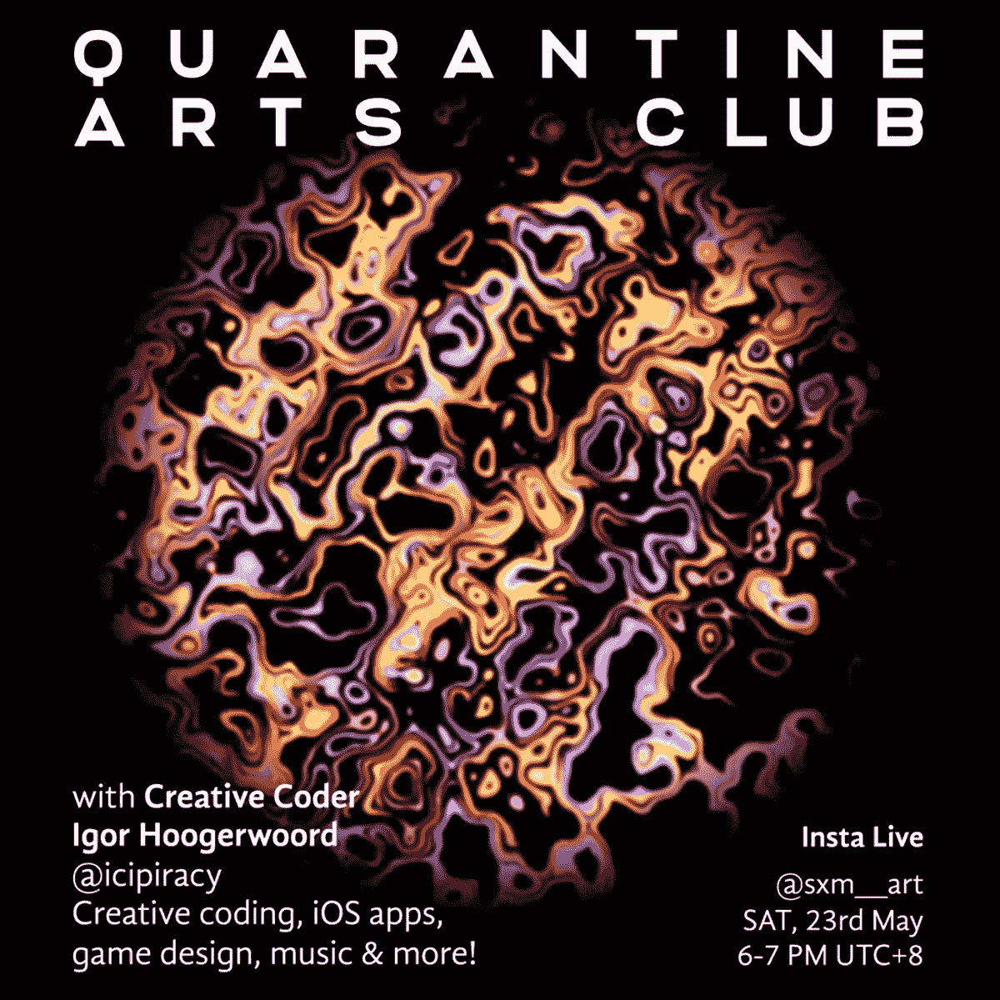
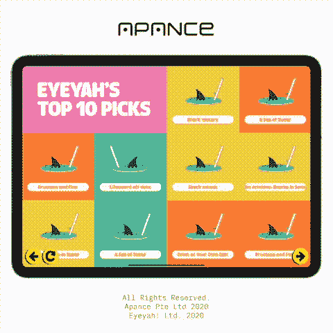
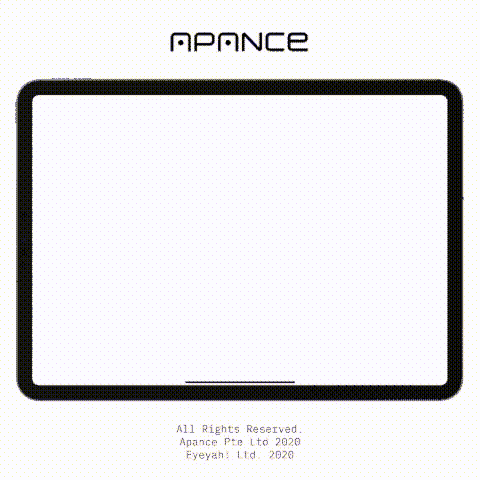
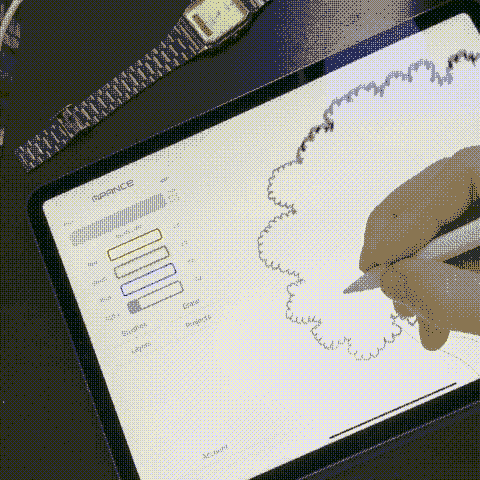
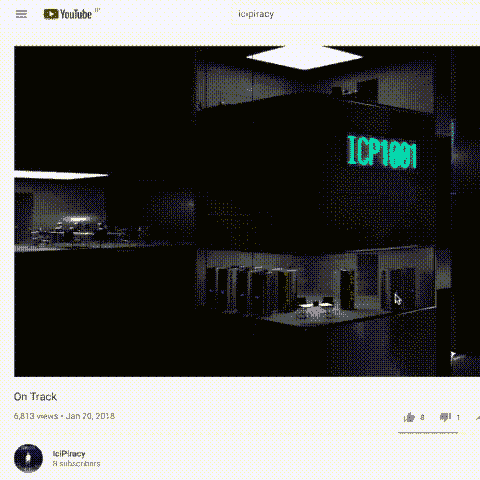
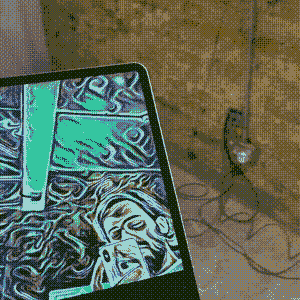
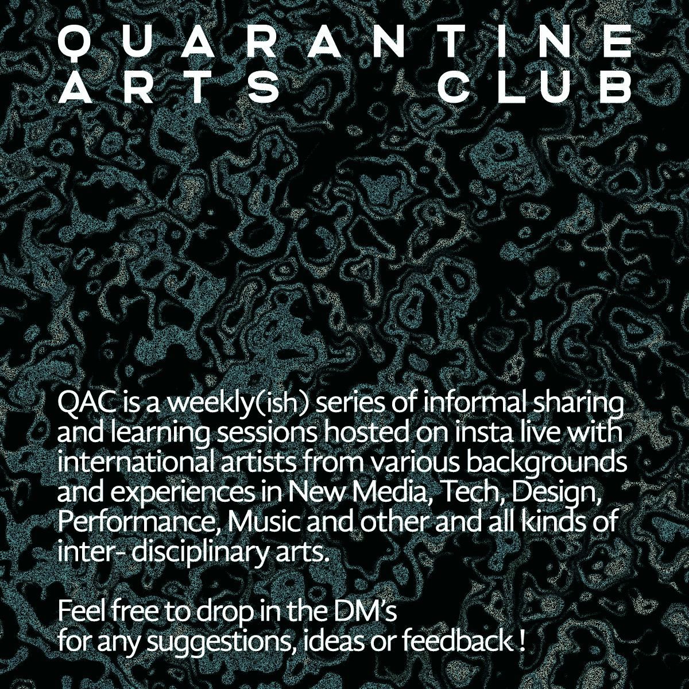

# 创造性编码和新媒体艺术(初学者)

> 原文：<https://blog.devgenius.io/a-discussion-on-creative-coding-and-graphics-visual-programming-for-beginners-e5051f4936d8?source=collection_archive---------9----------------------->

## 创意编码与图形/视觉编程——兼谈创意编码与企业家盗版

[**伊戈尔·胡格伍德**](https://www.igorhoogerwoord.com/) **又名** [**盗版**](https://www.instagram.com/icipiracy/) **是一名软件工程师和企业家，目前居住在东京，专门从事苹果设备和网络的开发和设计。**
一个极具天赋的创意者，拥有从音乐制作到 3D 视觉艺术，从音乐视频到游戏设计和应用程序开发的各种经验，我与 Igor 就他的项目和经验进行了交谈，我们讨论了初学者创意编码的学习之旅和挑战，以及作为一名艺术家或没有行业经验的人开始进入视觉或新媒体艺术领域的一些创意灵感和方法。

**展示了伊戈尔在应用、游戏、可视化软件、视频和人工智能领域令人难以置信的尝试**

在 IG live 的一个多小时里，我们讨论了进入音乐制作的人的提示和技巧，创意编码和编程初学者的学习旅程和曲线，iOS 与 android 与控制台应用程序编程，人工智能在动画中的出现，游戏设计和个人叙事的重要性，东京的创意社区，创意工作中合作的关键性质等等！

您可以选择一杯饮料放松一下，并在 IGTV、**或**上观看以下会议的完整编辑记录。我在下面提供了一些视频的时间戳，可以更直接地浏览一些主题。

 [## 山姆在 Instagram 上说:“很高兴能和多才多艺的创意伊戈尔谈论音乐……

www.instagram.com](https://www.instagram.com/tv/CApwkOGnnjT/) 

**时间戳:**

00:14:30 —简介

01:03:00 — Icipiracy 的艺术家介绍

02:54:00—Igor 进入新媒体领域的学习之旅+他的第一个互动项目！

05:25:00 —传统编程方法和图形/可视化编程方法之间的区别

08:30:00 — Igor 分享了他当前创造性编码项目的更多细节

11:14:00 — Igor 分享了他在学习和工作视觉创意+ Blender 3d 编码的工具和系统方面的经验和专业知识！

13:45:00 — **一只野猫出现了！**

14:00:00 — Javascript vs python？？？关于 iOS 开发的一些信息

16:00:00 —为 PS/任天堂游戏机和 iOS 游戏编程和开发游戏

17:45:00 — iOS 游戏和内容编码/编程与 Android 开发

20:59:28 — Igor 为视觉艺术展设计的历时 1 个月的 crunch 复古迷你游戏，从概念到开发

24:59:29 —他自己创造的方法—如何从零开始快速创造

27:59:29 — Igor 为艺术家构建神经网络和人工智能算法的经验及其面临的挑战

29:30:00 —叙事和人类体验在自动化和动画/游戏中的重要性

32:44:29 —创意灵感

33:15:00 —关于小岛秀夫和死亡搁浅—游戏设计的机制

35:30:00 —伊戈尔在东京的创意体验，以及东京的创意社区

39:30:00 — Igor 给编码初学者的魔术

41:30:00 —伊戈尔为音乐制作初学者准备的魔术

44:05:00 —如何从音乐制作的白板开始创作/Ableton

46:00:00 —不要试图自己做所有事情！(作为创作者)和协作的重要性

47:30:00 —开始学习创造性编码最有效的方法是什么？

50:30:00 —如何让自己保持动力，不断学习，不断编码

51:40:28 —学习编码/编程的一些推荐在线课程

52:39:00 — Igor 的新媒体和创造性编码对未来的预测以及一些有趣的项目示例

55:35:00 —关于国际生成艺术社区和设计软件的未来的最终笔记

谢谢大家！