# React 路由器的深入研究:再简单不过了

> 原文：<https://blog.devgenius.io/a-drill-down-of-react-router-cant-be-any-simpler-7bf59c917284?source=collection_archive---------30----------------------->


# 向下钻

最近，我开始深入那些工具和框架的源代码，以便在软件/系统设计方面启发我(作为一个自命不凡的开发人员)。

我想你已经看到了 Github 上有很多 kernel 只有几行代码的库(比如 Reselect)，它们都是 1000+的星号。(实际上，react-router 不是他们中的一员)因此，我开始反思自己:是不是太简单了？我甚至可以自己做一个(不是自欺欺人，而是自大的:D)。但是看了他们的源代码，事实证明我错了:我年轻，我愚蠢。简单的东西很难做。

在深入研究了 [react-router](https://github.com/ReactTraining/react-router) 库之后，我想分享一些他们如何使路由器成为可能的关键点。因此，在本文中，我将演示如何从头开始创建一个可爱的自制反应路由器。

# 基本概念

一个非常基本的路由器行为是:

*   当用户点击`<a>`标签时，浏览器会重定向到目标页面，无需重新加载

根据上面的要求，让我们设想一个简单的解决方案来对 URL 的变化做出反应。

*   使用[历史 API](https://developer.mozilla.org/en/docs/Web/API/History_API) 以编程方式处理页面重定向
*   使用“链接”组件(`<a>`标签)拦截重定向点击
*   通过判断 URL，使用包装组件有条件地呈现内容

(不能再简单了)

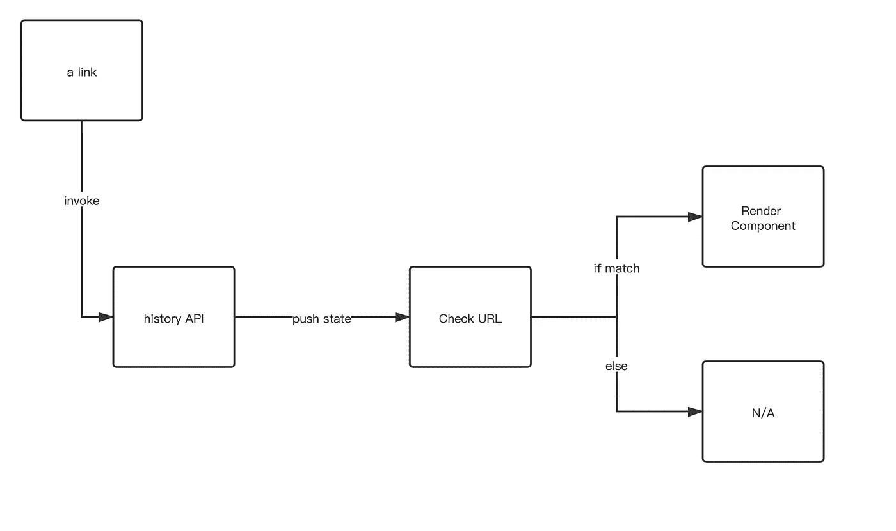

在 [react-router](https://github.com/ReactTraining/react-router) 中，有 5 个基本 API:

*   BrowserRouter:将[历史 API](https://developer.mozilla.org/en/docs/Web/API/History_API) 暴露给其子组件
*   路由器:浏览器路由器(和其他类型的路由器)的子组件，它将提供
*   链接:不重新加载的重定向
*   路由:决定是否渲染
*   RouterContext:提供 URL 相关的上下文，包括[历史 API](https://developer.mozilla.org/en/docs/Web/API/History_API)

有了以上这些组件，我将做一个迷你项目:hello world。

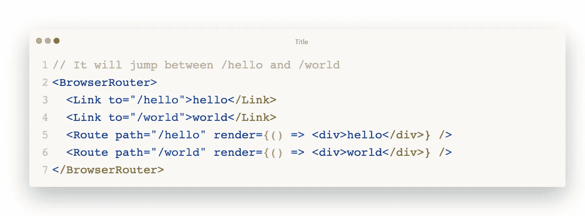

# 示例存储库

我用 [create-react-app](https://github.com/facebook/create-react-app) 创建了一个 repo。

回购网址:[https://github.com/daiyanze/react-router-tear-down](https://github.com/daiyanze/react-router-tear-down)

文件夹结构如下所示

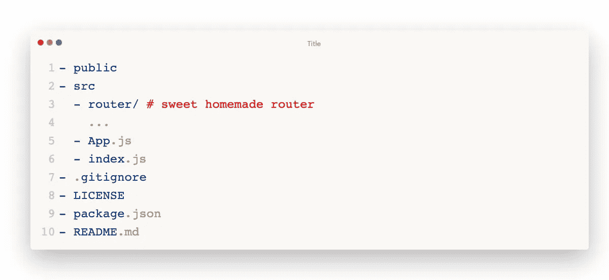

## 1.克隆

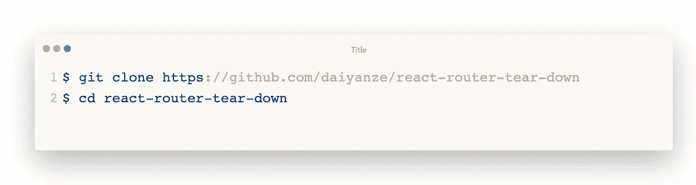

## 2.启动服务器

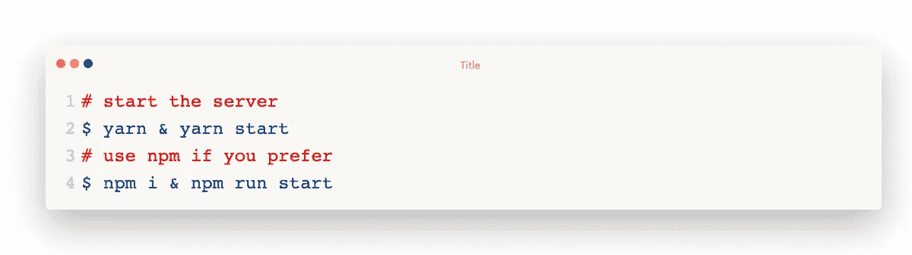

🎉我的反应是活的！

## 3.简化

我想我不太需要造型单和服务人员。所以我要去掉这些花哨的东西。

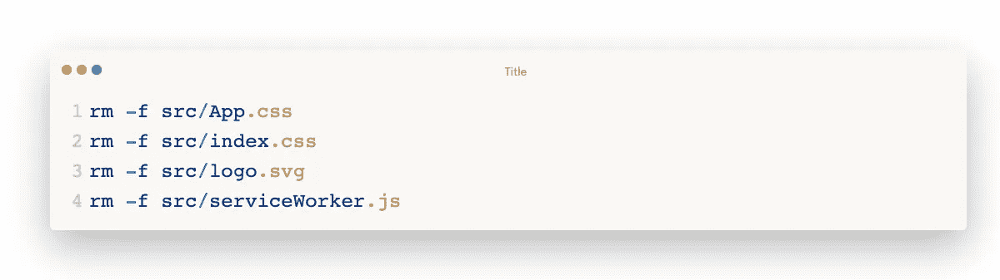

还有我小小的“你好世界”里的东西。

`./src/App.js`


`./src/index.js`

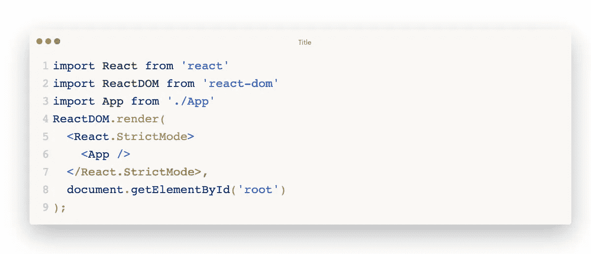

现在页面完全空白。让我来创建每一个组件，让它复活。

# 开始抓痒

现在我将开始在`./src/router`文件夹下实现这些文件。

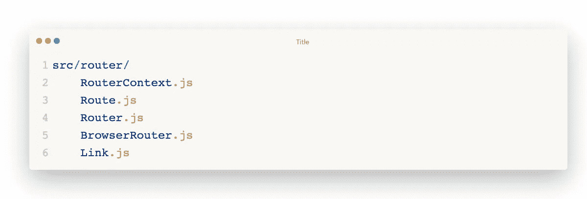

## 路由器上下文

为了让所有组件都能访问某些属性，我需要创建一个上下文来为派生组件提供与 URL 相关的对象。

`./src/router/RouterContext.js`

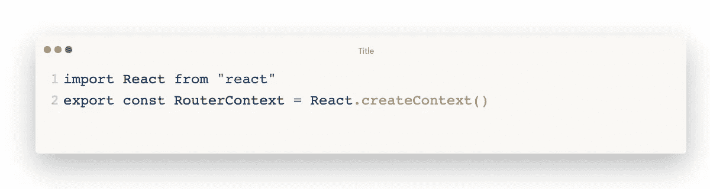

就这么简单！

## 途径

一旦`path`与当前 URL 匹配，该路由将呈现内容。

属性:

*   路径:匹配的 URL
*   children:忽略`path`匹配的 children 组件
*   render:类似于 children，但考虑`path`匹配
*   组件:调用`React.cloneElement`

对于组件属性，有一个渲染顺序。

```
children > component > render
```

这意味着当上述所有道具出现在同一个组件中时，只有`children`会渲染。如果`children`不存在，那么`component`就会生效。否则然后`render`...

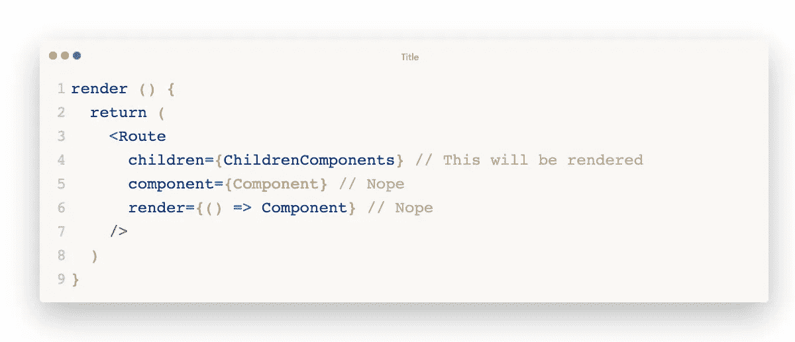

`./src/router/Route.js`

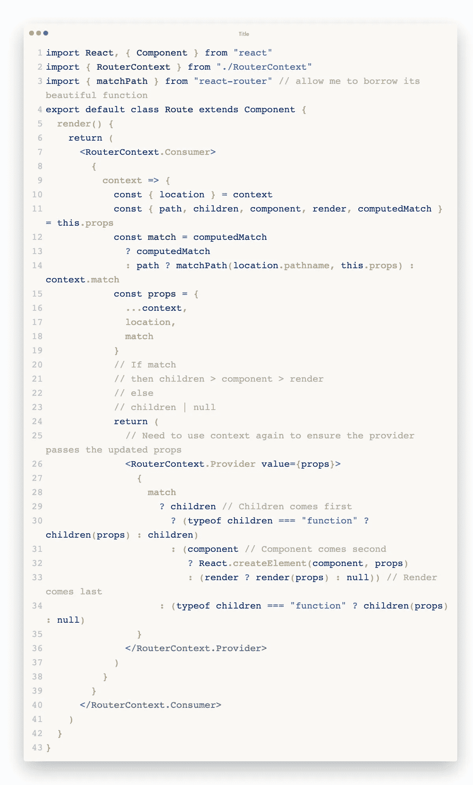

## 浏览器路由器

浏览器使用 HTML5 [历史 API](https://developer.mozilla.org/en/docs/Web/API/History_API) ( `pushState` `replaceState` `popState`等。)来同步 UI 和 URL。

所有需要[历史](https://developer.mozilla.org/en/docs/Web/API/History_API)上下文的组件都必须作为 BrowserRouter 子组件。否则，它将抛出错误。

属性:

*   basename:应用程序的整个 URL 的基础

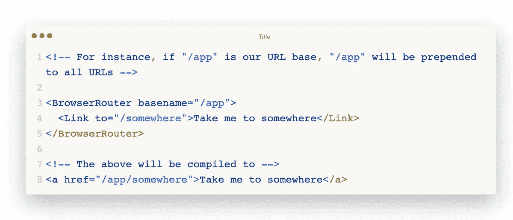

`./src/router/BrowserRouter.js`

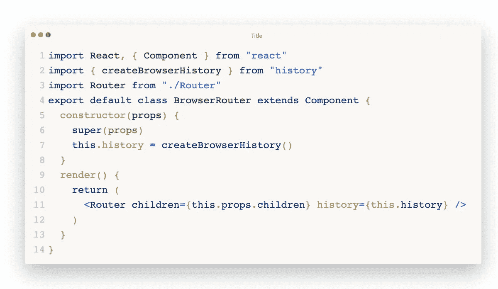

## 路由器

在 [react-router](https://github.com/ReactTraining/react-router) 中，路由器组件只是一个上下文提供者，它将监听`location`的变化。它吸收从 BrowserRouter 传来的[历史](https://developer.mozilla.org/en/docs/Web/API/History_API)作为其状态。

`./src/router/Router.js`

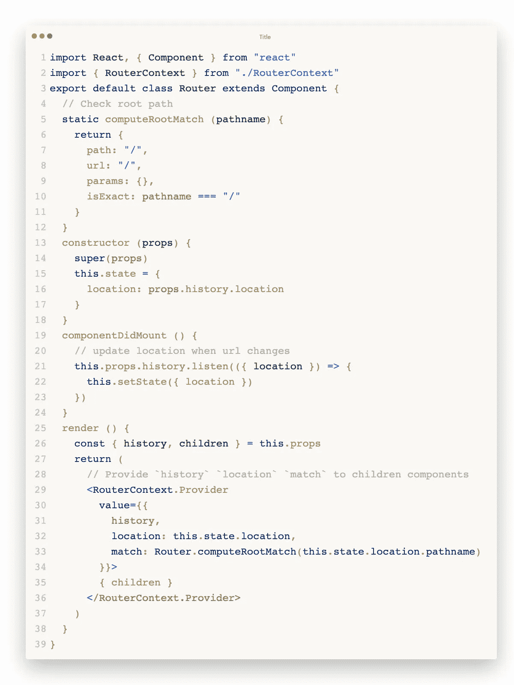

## 环

我需要做的就是拦截点击事件，并使用[历史](https://developer.mozilla.org/en/docs/Web/API/History_API) API 来更改 url。

`./src/router/Link.js`

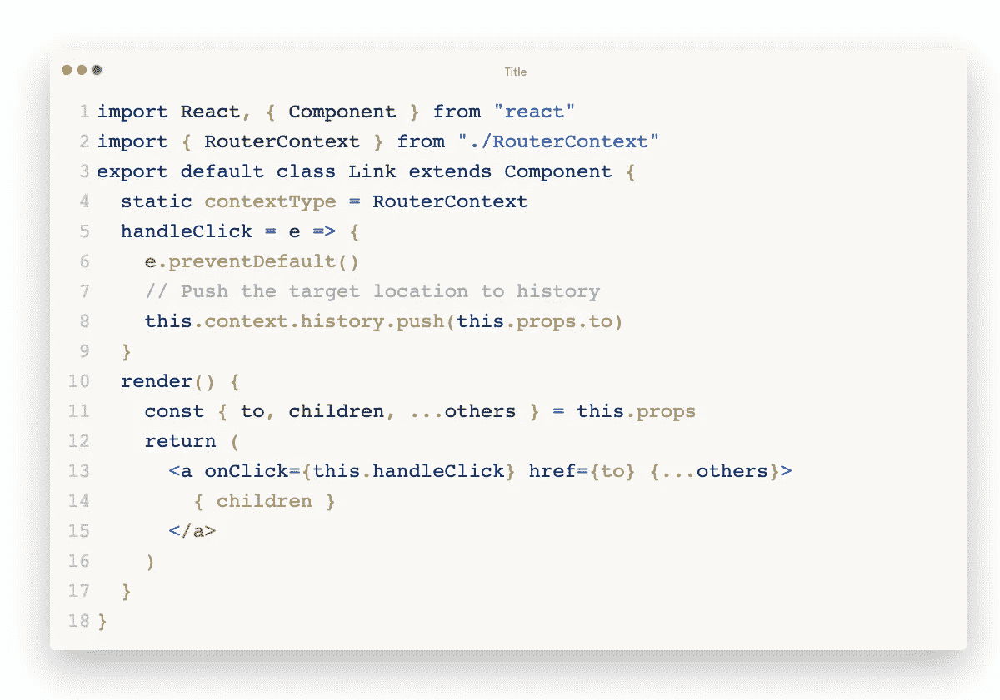

# 所有组件都完成了

还有一件事:我还需要添加到`App.js`的路线和链接。

`./src/App.js`


现在我的小“你好世界”结束了。让我们看看结果。

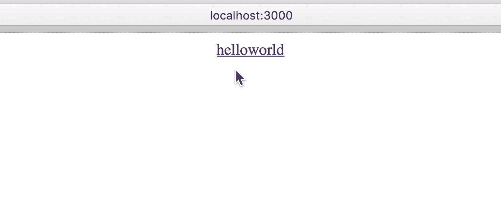

耶！有用！

# 结论

React-路由器确实是 React[和 React](https://reactjs.org/) 的一个非常非常可靠的中间件。在探索了整个项目之后，我可以看到有很多很大的努力让它尽可能简单。我自己创造的只是一个非常基本的东西，它基于 [react-router v1.0.0](https://github.com/ReactTraining/react-router/tree/v1.0.0) ，它只是一个帮助我理解路由器如何工作的例子。Gotta 不断学习和探索，这样我就可以提高，成为一名更好的工程师。

# 参考

*   [https://reactrouter.com/](https://reactrouter.com/)
*   [https://github.com/ReactTraining/react-router](https://github.com/ReactTraining/react-router)
*   [https://knowbody.github.io/react-router-docs/](https://knowbody.github.io/react-router-docs/)
*   [https://stack overflow . com/questions/42123261/programmable-navigate-using-react-router-v4](https://stackoverflow.com/questions/42123261/programmatically-navigate-using-react-router-v4)
*   [https://www . ki rupa . com/react/creating _ single _ page _ app _ react _ using _ react _ router . htm](https://www.kirupa.com/react/creating_single_page_app_react_using_react_router.htm)
*   【https://reactjs.net/features/react-router.html】

原载于[上**Pitayan.com**上](https://pitayan.com/posts/react-router-mvp/)

[https://pitayan.com/posts/react-router-mvp/](https://pitayan.com/posts/react-router-mvp/)

[](https://pitayan.com/posts/react-router-mvp/) [## React 路由器的深入研究:再简单不过了

### 最近，我开始深入到这些工具和框架的源代码的底部，以便在…

pitayan.com](https://pitayan.com/posts/react-router-mvp/) 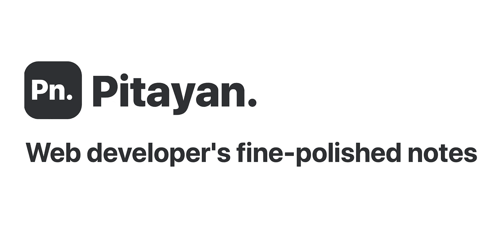

[https://pitayan.com](https://pitayan.com)