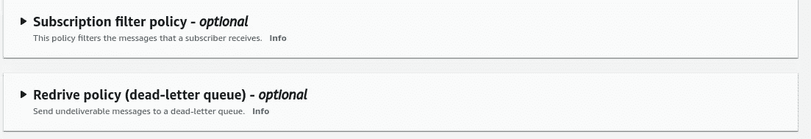

# 在你的商业案例中使用 AWS 社交网站的傻瓜指南

> 原文：<https://blog.devgenius.io/a-dummies-guide-to-using-aws-sns-for-your-business-case-f3ed240687e9?source=collection_archive---------1----------------------->


AWS 文档的 SNS 流程

本文是虚拟云系列的一部分。我倾向于用外行的术语解释事情，如果你对我在云上讨论的其他话题感兴趣，请查看我的其他文章。在我们继续之前，我假设如下。

> I .您对 AWS 和有所了解
> 
> 二。如果您愿意，可以拥有一个 AWS 帐户来指导本教程

作为本文的一部分，我们将了解以下主题。

> a.什么是 SNS？
> 
> b.什么是发布订阅模式？
> 
> c.什么是话题？
> 
> d.SNS 主题有哪些不同类型的订阅者？
> 
> e.可以应用于 SNS 主题的各种控件。

此外，我们将有一个实践指南来实现我们所学的内容。

# SNS —简单通知服务

SNS 是 AWS 提供的通知服务。我一放下通知这个词，你就会明白它与“通知”有关。但是在后台和通知周围会发生很多事情。让我们更好地理解它。

**什么是通知？**

通知本质上是由**“发布者”**发送给**“订阅者”的消息。发布订阅只不过是发布者-订阅者二人组的简称。**

**来自 SNS 的通知包含什么？**

正如我所说的，一个通知有很多信息来处理后台发生的事情。请看一下我用粗体字标出的全部内容。

```
{
  "**Type**" : "**SubscriptionConfirmation**",
  "MessageId" : "xxxxxxxxxxxxxxxxxxxxxxxxxxxxx",
  "Token" : "xxxxxxxxxxxxxxxxxxxxxxxx",
  "TopicArn" : "arn:aws:sns:us-east-1:xxxxxxxxxxxxx:MediumTopic",
  "**Message**" : "**You have chosen to subscribe to the topic arn:aws:sns:us-east-1:xxxxxxxxxxxxx:MediumTopic.\nTo confirm the subscription, visit the SubscribeURL included in this message.**",
  "**SubscribeURL**" : "[https://sns.us-east-1.amazonaws.com/?Action=ConfirmSubscription&TopicArn=arn:aws:sns:us-east-1:xxxxxxxxxxxx:MediumTopic&Token=x](https://sns.us-east-1.amazonaws.com/?Action=ConfirmSubscription&TopicArn=arn:aws:sns:us-east-1:652890774194:MediumTopic&Token=2336412f37fb687f5d51e6e2425e90ccf23f36222803291e6b44e184c05e7fb35aeab870986cfc9b3e06671a4b334b3aafea55de0a8110c38cb15e2335eddc82c666b6734e81ad9ad83e26fd095bc1aa706bc6b82667b82f9b4c378bd101d1a4fa4527ffafaa9a0eec2548ae0a28e65c)xxxxxxxxxxxxxxxxxxx",
  "**Timestamp**" : "2021-03-11T10:15:45.844Z",
  "SignatureVersion" : "1",
  "Signature" : "xxxxxxxxxxxxxxxxxxxxxxxxxxxxxx",
  "SigningCertURL" : "[https://sns.us-east-1.amazonaws.com/SimpleNotificationService-x](https://sns.us-east-1.amazonaws.com/SimpleNotificationService-010a507c1833636cd94bdb98bd93083a.pem)xxxxxxxxxxxxxxxxxxxx"
}
```

通知包含如下属性

a.通知类型

b.通知中的消息

c.像 SubscribeURL 这样的附加属性(因为我们收到的通知属于“SubscriptionConfirmation”类型。

**So that 指出通知可以具有动态属性，这些属性由我们正在处理的通知类型驱动。我们还可以为这个“通知”定制属性。那是相当有用和强大的功能。**

# PubSub 模型

发布-订阅模型本质上是在发布者和订阅者两方之间传递消息的协议。简单地说，发布者将只能够**“推送”**消息，订阅者将能够**“接收”**消息。

SNS 支持多对多的发布订阅模式，一个主题可以有多个发布者和多个订阅者。因此，本质上，当一个发布者推送一条消息时，它可以被“已经订阅了它的”多个订阅者立即接收到。顾名思义，订阅是订阅者需要执行的自愿操作(可以是点击订阅 URL、点击 OTP ),以让系统知道他们是可以被推送消息的合法订阅者。

想象一下，如果你是一个电子商务巨头(**让我们看看亚马逊**)有很多订户(**让我们看看 Prime 订户**)，每当 Prime 会员预览发生时，你所要做的就是通过主题发送通知，瞧，你所有可以联系到的**用户**都会收到通知。

**发布者和订阅者是真实的人吗？**

答案是，严格来说，发布者和订阅者不需要是真实的人。它甚至可以由一个发布消息的应用程序和另一个订阅该消息的应用程序来完成。因此，根据用户的类型，您可以定制您的消息。

# 主题

AWS 官方的解释是，一个话题就是一个消息通道。当您发布一个消息到一个主题时，**它将消息扇出**到所有订阅的端点。

简单地说，把一个主题看作一个文件夹，发布者将把消息"**推**"到那里。

但是官方解释中还有一个词**“扇出”**需要我们去理解。

扇出是使消息能够被发布者一次推送到所有订阅者的功能。还记得我之前举的 Prime 订户的例子吗？同样，您也可以在 CRM 或 AWS 基础设施中触发操作。

# 社交网站主题的订阅者

如前所述，一个 SNS 主题可以有多种类型的订阅者。让我们快点看到他们。

在教程的后面，我们会遇到更多的细节。但是现在，让我们关注 SNS 允许整合的订阅类型。


您可以识别其中一些订阅协议的性质，如**电子邮件、Email-JSON、SMS** 。这些可能是潜在的最终客户，或者是对收到的 SMS 或电子邮件作出反应的系统。

还有 HTTP(s)，应用程序端点，它允许您将 SNS 订阅扩展到您自己的内部系统。

再往下是 AWS 服务，如 Lambda、SQS、Kinesis Data Firehose，它们可以接收来自 SNS 的消息并做出相应的反应。

如何为主题选择正确订阅的快速流程图。(假设您不希望只有特定的协议来接收消息)。


选择合适订户的流程

# **消息控制**

当一个消息发布到一个主题时，我们可以有多个过滤器来维护发布者和订阅者的安全性和完整性。这可通过以下选项实现。



订阅过滤器策略允许我们设置可用于过滤消息的过滤器，重新驱动策略允许我们重新尝试消息传递中可能发生的任何失败。

我们将在下面的教程中看到更多。

# 辅导时间到了

对于本教程的范围，我将驱动下面的用例。

我们需要创建一个名为 Medium Tutorial 的主题，并向该主题发布一条消息。制约因素是

a.我们将有一个电子邮件用户和一个短信用户。

b.对于电子邮件订阅者，我们将设置订阅过滤器策略

c.对于短信用户，我们将有一个开放的政策。

**第一步:**

创建一个名为“媒体主题”的主题


**第二步:**

选择主题的类型。**这不应与我们之前看到的“通知类型”相混淆。**


这里有一个 FIFO(先进先出)和一个标准选项。

FIFO 有一些限制，你可以在上图中看到。对于本教程的范围，我们将选择“标准”。

**第三步:**

设置其他选项。对于访问，我们将接受默认值，尽管这是一个非常强大的设置，可以将发布/订阅的访问控制到精细的粒度级别。

只需向下滚动并点击创建主题。


**第四步:**

创建我们主题的订阅者。既然已经创建了主题，我们必须设置一个可以接收消息的订阅者。

单击“创建订阅”按钮(我已经为我的电子邮件 ID 创建了一个订阅)


> 选择 Email-JSON 作为协议。


现在，在端点中输入您的电子邮件 ID，您会得到通知，您需要验证您的订阅。


让我们设置一个订阅过滤器，只允许属性为“MessageSource”且值为“Medium”的消息。注意，您可以传递多个值来限定属性“MessageSource”


点击创建订阅按钮保存您的订阅


**第五步:**

验证您的订阅

此时，您应该看到订阅已成功添加到您的主题下。如前所述，当用户要求明确确认时，例如电子邮件/短信，状态显示为“待定确认”。


现在，到你的电子邮件收件箱去查看你将会收到的邮件。

我的收件箱里有这个。

> 注意:主题名称显示为发件人姓名


**第六步:**

让我们使用相同的步骤创建另一个订阅，并进行以下更改。

1.  选择“短信”的协议
2.  端点是您的手机号码(警告:并非所有国家都支持小心操作)


对于 SMS 协议，我们将保留订阅过滤器策略为空。

这样，不管任何过滤器，我们应该收到短信。

**第七步:**

是时候为我们的电子邮件订阅范围发布消息了。

设置好以下所有内容后，点击“发布消息”按钮。


现在检查你的邮箱，你应该有一封邮件。


让我们检查一下电子邮件的内容。

观察突出显示的项目。从上面的步骤认出他们了吗？

```
{
  "Type" : "Notification",
  "MessageId" : "xxxxxxxxxxxxxxxxxxxxxxxxxxxx",
  "TopicArn" : "arn:aws:sns:us-east-1:xxxxxxxxxxx:MediumTopic",
  **"Subject" : "Medium Topic Message with Attributes",**
  **"Message" : "This is a test message for the tutorial with attributes "**,
  "Timestamp" : "2021-03-11T13:43:26.211Z",
  "SignatureVersion" : "1",
  "Signature" : "xxxxxxxxxxxxxxx",
  "SigningCertURL" : "[https://sns.us-east-1.amazonaws.com/SimpleNotificationService-xxxxxxxxxxxx.pem](https://sns.us-east-1.amazonaws.com/SimpleNotificationService-010a507c1833636cd94bdb98bd93083a.pem)",
  "UnsubscribeURL" : "[https://sns.us-east-1.amazonaws.com/?Action=Unsubscribe&SubscriptionArn=arn:aws:sns:us-east-1:xxxxxxxxxxxx:MediumTopic:x](https://sns.us-east-1.amazonaws.com/?Action=Unsubscribe&SubscriptionArn=arn:aws:sns:us-east-1:652890774194:MediumTopic:4c1cc1e1-030b-49b5-bc85-0629f9d6571e)xxxxxxxxxxxxxxxxxxxxxxxxx",
 ** "MessageAttributes" : {
    "MessageSource" : {"Type":"String","Value":"Medium"}**
  }
}
```

同样，您的手机号码也应该收到同样的消息。

现在，重复第 7 步，只是有一个变化，不要指定任何消息属性。

当你这样做的时候，你应该只在你的手机上收到这条信息，而不是在你的电子邮件上。

我设置消息来表示它是不带属性发送的。


因此，我们设置了一个 SNS 服务，可以向多个订阅者大规模发送通知。有大量的用例，我将在接下来的文章中讨论其中的一些。

查看我在 Medium 上的其他文章。