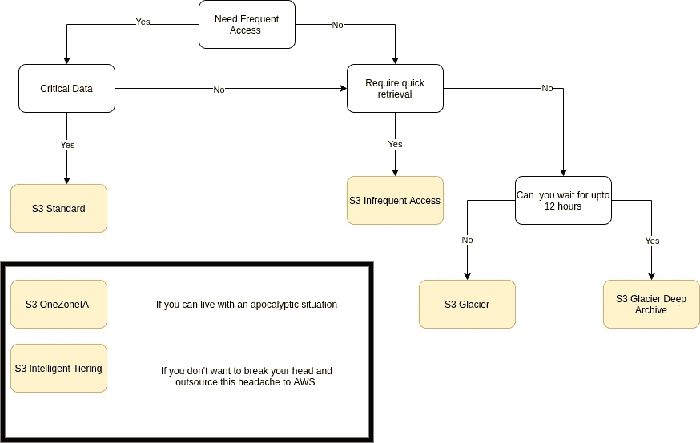

# 使用 S3 存储类降低存储成本的傻瓜指南

> 原文：<https://blog.devgenius.io/a-dummies-guide-to-using-s3-storage-classes-to-reduce-storage-costs-80d9f4978934?source=collection_archive---------2----------------------->

AWS S3

本文是我的 CloudForDummies 系列的一部分。如果您对我在云上讨论的其他主题感兴趣，请查看我的其他文章。

作为本文的一部分，我们将探索各种存储类别，并就如何使用生命周期策略在不同类别之间迁移对象进行快速实践培训。

我假设你对 S3 有一些基本的概念。如果你没有，我建议你看看下面这篇文章，这篇文章简要介绍了 S3 是什么

 [## 在 AWS S3 上托管一个免费网站，为傻瓜提供免费域名

### 这是我的傻瓜指南系列教程的一部分。

rajesh-r6r.medium.com](https://rajesh-r6r.medium.com/hosting-a-free-website-on-aws-s3-with-freenom-domains-for-dummies-a363aac39b1e) 

然而，让我们快速回顾一下 S3。

S3 是一项 AWS 对象存储服务，它允许你以极具竞争力的[价格](https://aws.amazon.com/s3/pricing/)在 AWS 云上存储任何东西。

如果你仔细观察价格，你会发现如果你迁移到提供较低 SLA 的班级，价格会减半。自然对吗？

让我们简单解释一下每个存储类。

**S3 标准:**

任何对象的默认存储类。主要特性包括高可用性(因此延迟低)，使用生命周期策略将对象自动迁移到更便宜的存储类别。

**S3 智能分层:**

AWS 提供的一种混合类型，它根据访问趋势对对象的存储类进行更改。简而言之，AWS 监控你的所有对象，并自动将它们中的一些移动到冰川，其他的移动到不经常访问的位置，如果需要，将相同的对象提升回 S3 标准。主要功能包括少量监控/自动分层费用和相同级别的 S3 服务级别协议。

**S3 不常访问:**

低可用性 SLA 为 99%，而 S3 标准为 99.9%。如果你能接受，那很好。关键特征包括转到班级的费用。当您将 1 GB 的数据从 S3 标准迁移到 S3 非频繁类时，除了存储本身之外，还会产生一些费用。再次非常微不足道相比，它提供的竞争价格对 S3 标准。

**S3 OneZone 非频繁访问:**

这有点危险，应该只用于可能永远不会用到的数据，直到出现后世界末日的情况。因为顾名思义，这个类只在一个可用性区域中存储数据。假设您将数据存储在美国西部的 OneZone IA 中，one zone IA 的数据中心位于洛杉矶，鉴于好莱坞的事实，即洛杉矶是第一个受到天启、海洋生物、外星人攻击的城市，您可以放心地假设您的数据已经丢失。

**除非数据绝对不重要，否则不得使用。**

**S3 冰川:**

与其他产品相比非常便宜。主要特征包括低可用性和从几分钟到几小时的可配置检索时间。适用于存储数据以满足法定/合规性要求

**S3 冰川深处档案:**

最便宜的选择。至少需要 12 个小时的检索时间。这意味着，为了检索存储在该类中的对象，您必须在发出请求后等待 12 个小时，以便在控制台或 CLI 中检索它。

**了解 S3 存储类及其 SLA 的绝佳表格。**

 [## 对象存储类-亚马逊 S3

### 亚马逊 S3 提供了一系列针对不同用例设计的存储类别。这些包括 S3 标准…

aws.amazon.com](https://aws.amazon.com/s3/storage-classes/#Performance_across_the_S3_Storage_Classes) 

现在的问题是，为什么您会满足于较低的 SLA？。

一些原因:

1.  频繁访问可能不需要所讨论的数据。因此，您可以将它移到收费较低的不常用存储类别。
2.  可能是有问题的数据，如果需要，交付的交付周期可长达 8-12 小时。你可以将数据转移到冰川/深冰川档案中。
3.  如果发生灾难，您可能不需要这些数据，但在其他情况下，您需要这些数据。您可以将它存储在一个不经常访问的区域中。

最终，您的数据性质、访问频率、数据可用性和冗余要求是您决定正确存储类别的驱动因素。

**选择 S3 类的快速决策过程:**

请注意，由于实施的性质，我在此决策过程中没有使用 OneZoneIA 智能分层。

该是动手的时候了。

**第一步:**

为存储桶中的所有对象创建生命周期策略。我正在使用我在 2020 年收集 Covid19 统计数据时使用的样本桶。如果你对我是如何做到的感兴趣，可以看看这篇文章。

 [## 新冠肺炎统计收集与 AWS 一个无服务器的食谱，成本为 0.00 美元

### 新冠肺炎疫情无疑破坏了经济、正常生活等等。但是有些事情是…

medium.com](https://medium.com/dev-genius/covid-19-stats-collection-with-aws-a-serverless-recipe-that-costs-0-00-df0af9b8229c) 

生命周期策略的快速介绍:

简单的自动化使我们能够指定在不同存储类别之间移动对象的规则。**自动迁移对象由 AWS 在预先安排的时间触发，并且不能更改**。

选择“管理”选项卡并点击“创建生命周期规则”按钮。

在这里，您可以通过应用简单的规则来过滤需要移动到特定类的对象。漂亮吧？

选择适当的操作。在我们的练习中，选择“过渡对象的当前版本”

当你点击这个你会看到下面的选项。让我们选择 Standard-IA，并将对象创建后的天数设置为 30 天。实际上，我们现在已经设置了一个规则，将所有对象在第一次存储在桶中 30 天后移动到一个不经常访问的类中。

**生命周期过渡策略规则:**

设置生命周期策略时，它不会立即触发。根据 AWS 文档，生命周期规则在世界协调时(UTC)每天午夜运行一次。因此，不要期望您已经使用了 30 天的对象会在您设置后立即移入新的存储类。

 [## 解决 S3 生命周期规则无法将对象转移到智能分层的问题…

### 我在我的亚马逊简单存储服务(亚马逊 S3)桶上设置了一个生命周期配置规则

aws.amazon.com](https://aws.amazon.com/premiumsupport/knowledge-center/s3-lifecycle-rule-intelligent-tiering/) 

**我能立即看到转变吗？**。

您可以通过手动将一些对象移动到不同的存储类。

**第二步:**

让我们学习如何将一些对象迁移到不同的存储类。对于这个例子，让我们再次使用我拥有的同一个例子桶。正如您在此图中看到的，所有这些文件都在标准类中，我希望将其中一些移动到 OneZone-IA(我知道)

选择要迁移的对象，并点击操作下拉菜单

现在，您将获得以下选项。选择 OneZone-IA。不要错过点击页面底部的“保存更改”按钮。

完成后，您可以看到这些对象的存储类立即发生了变化。

暂时就这样了。敬请关注。

你可以滑动订阅我的新闻信。