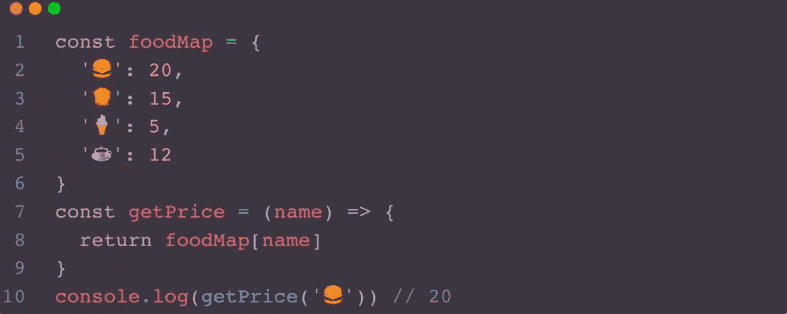

# 一些必须学习的 JavaScript 技巧

> 原文：<https://blog.devgenius.io/a-few-must-learn-javascript-hacks-50c84dfb5010?source=collection_archive---------0----------------------->

布莱克·康纳利在 [Unsplash](https://unsplash.com?utm_source=medium&utm_medium=referral) 上的照片

# 减少如果…其他面条代码

*   一旦我们开始写两个以上，如果…else 函数是时候考虑是否有更好的方法来优化它们了。
*   例如，如果我们需要根据麦当劳的名称来计算食物的价格，您可能会这样做。

*   这种编写方式会使函数体有很多条件判断语句，下次要添加产品时需要修改函数内部的逻辑，添加一个 if…。else 语句，这在某种程度上也违背了开放和封闭的原则，当我们需要添加一个逻辑来尝试扩展软件实体来解决变更的需求，而不是通过修改现有代码来完成变更。
*   这是一种非常经典的优化方式，我们可以使用类似 Map 结构的数据来保存所有的商品，这里我们直接创建一个对象来存储。

*   这样下次我们需要添加一个商品的时候就不需要改变 getPrice 的逻辑了，当然这里其实更多的人喜欢直接在地方直接使用 foodMap，我这里只是举了一个简单的例子来表达这个想法。
*   那么这个时候就有同学会问，如果我不想只用 string 键的话，这个时候你可以用 new Map，思路是类似的，额外扩展一个实体来存储修改。

# 流水线操作而不是冗余循环

*   有这样一份麦当劳食品清单

*   如果你想找到属于套餐 1 的食物，你会怎么找？
*   上面的方法是我们以前使用的方法，显然我们用 filter 和 map 代替 for 循环不仅是为了让代码更简洁，也是为了让语义更清晰，所以我们一眼就能看出它是先过滤数组，再重组数组。

# 查找替换冗余循环

*   和上面的例子一样，如果我们想通过属性值在这个 food 对象数组中查找特定的食物，find 就很有用。

# 包括替换冗余环路

*   类似上面两个细节，这些都是已有的函数，也就是我们不用重写内置函数，明智地使用它会节省很多时间。
*   众所周知，一碗康某福老坛酸菜牛肉面有酸菜、面条、牛肉粒、香烟、脚皮，那么我们想用函数确认面条里面有没有脚皮我们怎么写会更简洁呢？

*   同样的，也不只是康某福的酸菜牛肉面可以这么杂耍；查找数组中特定元素的所有类似操作都可以使用 includes 函数调用。

# 结果返回值

*   我们通常在编写一些带有返回值的函数时经常会为返回值变量的命名而纠结，甚至对于一些长函数不使用变量而是直接返回，这样的习惯其实是不好的，因为下次我们引用代码时还需要重新理清逻辑。
*   通常，在一个小函数中，我们可以使用 result 作为返回值。

# 提前返回

*   但是，上面使用 result 作为返回值并不适用于所有情况，经常会有一些时候，我们需要提前结束函数体，以避免稍后同事对程序的冗余读取。
*   下面的例子中当我们选择的 Key 不存在时应该立即返回，这样你就不必继续阅读下面的代码，否则面对更复杂的函数会增加很多阅读成本。

# 保持物体完整

*   往往当我们通过请求得到后端返回的数据时会根据一些属性进行处理，如果要处理的属性数量较少，很多同学会习惯使用第一种方法。
*   但实际上，这种习惯并不好，因为当你无法确定函数后来是否需要添加依赖属性时应该保持对象的完整性，正如我在上一篇文章中提到的，学会拥抱变化，如果 getDocDetail 不仅要使用图标和内容，还可能有标题、日期和其他属性，那么我们还不如直接将完整的对象传递进来，这样不仅增加了更短的参数列表，还使代码更具可读性。

# 使用运算符

*   当我们需要创建一个新的变量时，有时我们需要检查其值所引用的变量是否为 null 或未定义，因此我们可以使用简单的方法来编写它。

