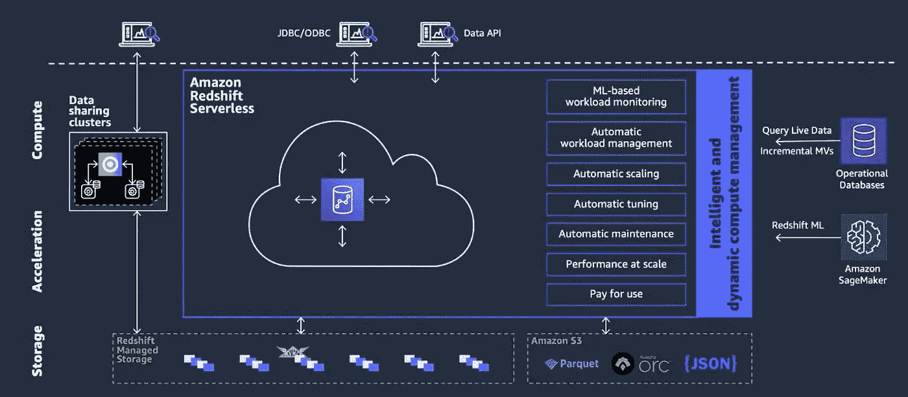
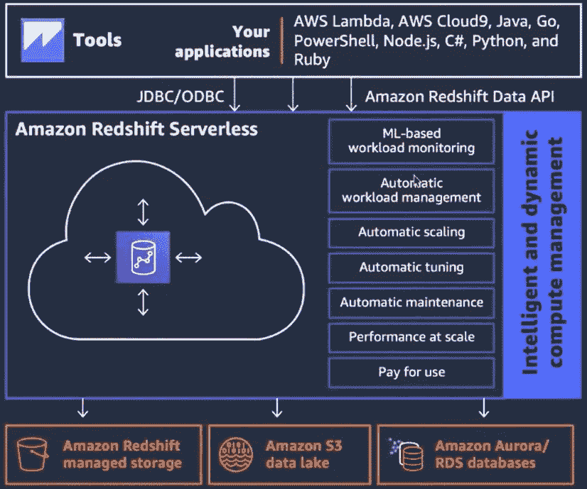
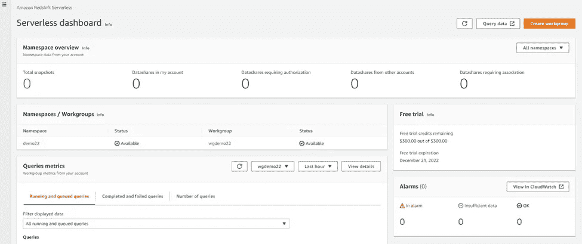
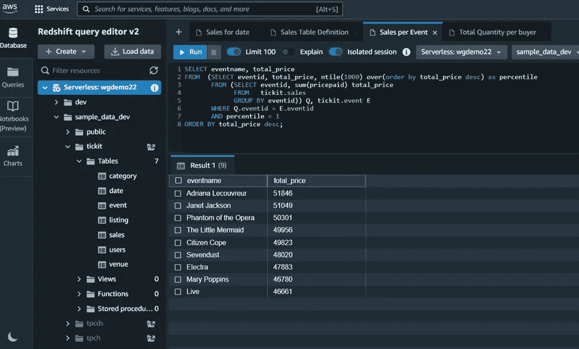
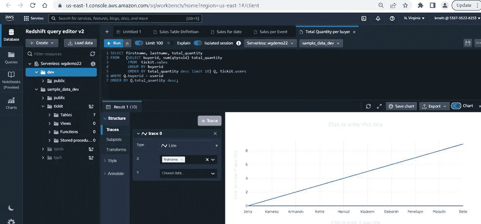
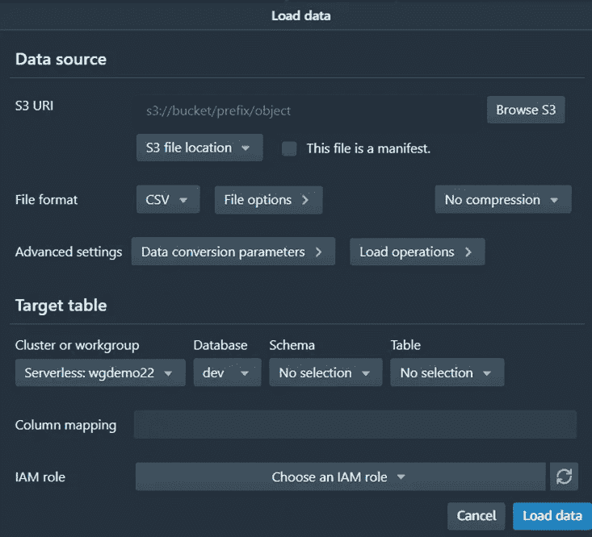
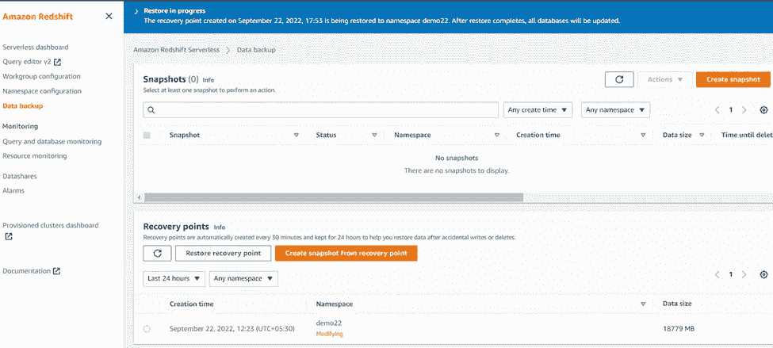
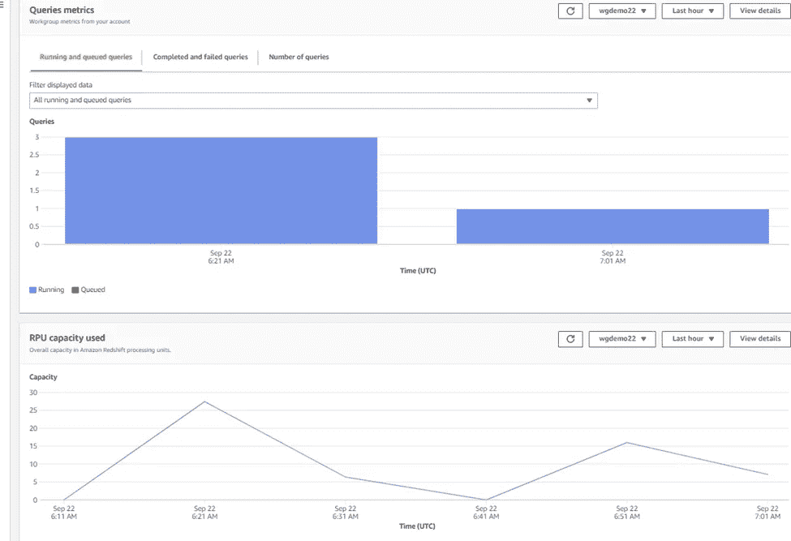

# 游戏改变者——AWS Redshift 无服务器数据仓库

> 原文：<https://blog.devgenius.io/a-game-changer-aws-redshift-serverless-data-warehouse-246dad29f1b5?source=collection_archive---------2----------------------->

# 概观

在自动化的世界里，有一些长期存在的问题，想知道为什么人们在管理数据仓库时会遇到很多障碍，为什么他们必须深入理解、深入学习&彻底阅读白皮书等等。例如，您可能已经学习了表设计策略、启用压缩和加密的方法、调整各种数据库参数的方法等。为什么有人必须为红移集群选择计算或存储节点！为什么计算和存储没有分开！为什么必须有人来处理性能问题！所有这些挑战现在都已经被亚马逊通过红移平台的各种创新解决了。

# 体系结构

形象说话很多。每个形象都有自己的故事。因此，这里值得一提。在下面的图片中，组件是不言自明的。因此，我不打算详细描述它们。

红移无服务器架构，图片提供:AWS

在 Redshift 无服务器中与其他服务的交互，图片由 AWS 提供

# 红移无服务器背后的创新

为整个团队竖起大拇指，他们进行了许多创新和自动化，并在无服务器红移中实现了许多新功能。让我在这里提几个例子:

## 现代化

*   ***近零*** 行政
*   使用 ***RA3 节点类型*** 将计算和存储分开
*   自动资源缩放
*   自动故障转移
*   自动修补
*   ***自动工作量管理***
*   **自动调谐**
*   自动真空删除
*   ***自动分配*** 键
*   自动排序键
*   ***自动表格排序***
*   ***自动列压缩***
*   自动分析
*   ***自动刷新&重写物化视图***
*   ***自动化不收费***
*   对操作数据库的联邦查询
*   ***数据共享***
*   ***简单计费—红移处理单元(RPU)基础计费***
*   ***默认情况下启用加密***
*   启用机器学习
*   报告和仪表板
*   实时分析
*   ***将数据发布为 API***

## 迁移路径，备份和恢复

*   ***使用快照从调配的红移无缝迁移到红移无服务器，反之亦然***
*   非常划算
*   可变工作负载、具有峰值的稳定状态、周期性工作负载、非生产、UAT、测试环境— ***推荐给*** ***使用无服务器红移***
*   对于持续的繁重工作负载— ***建议使用调配的红移***
*   从其他数据仓库轻松迁移到 Redshift 无服务器

## 操作的

*   部署在您自己的 VPC
*   公共端点
*   增强型 VPC 端点
*   事件通知
*   磨尖

## 安全性

*   **认证** : *IAM，ID 联盟，Azure AD，AD，Okta，多因子*
*   **访问控制**:列级、基于角色、行级、细粒度
*   **审计**:云轨迹，Macie 集成
*   **加密** : AWS KMS，动态加密& rest，使用λUDF&第三方工具进行令牌化。
*   **合规性** : SOC、PCI、FedRAMP、HIPPA

# AWS 红移控制台的一些快照

命名空间，演示中的工作组无服务器红移，图片作者:作者

# 分析数据并在图表中探索数据

查询编辑器 2，示例查询，图片作者

图表探索，图片作者:作者

# 数据源选项

S3 数据来源，图片作者:作者

# 从快照恢复

18GB 大约需要 3 分钟才能恢复到同一个无服务器群集。

从快照恢复，图像由:作者

# RPU 和查询使用度量

查询和 RPU 指标，图片作者:作者

# 结论

我试着提到了架构演进的几个要点&在我执行快速测试时拍摄的几个快照。人们应该进行实验、测试、加载数据、检查延迟、将快照恢复到所提供的红移，反之亦然，等等。如果您阅读了这篇文章并体验了这项技术，请分享您的观点、评论和挑战。

参考:

*   [*https://aws.amazon.com/redshift/redshift-serverless/*](https://aws.amazon.com/redshift/redshift-serverless/)
*   [*https://AWS . Amazon . com/blogs/AWS/Amazon-redshift-server less-now-generally-available-with-new-capabilities/*](https://aws.amazon.com/blogs/aws/amazon-redshift-serverless-now-generally-available-with-new-capabilities/)