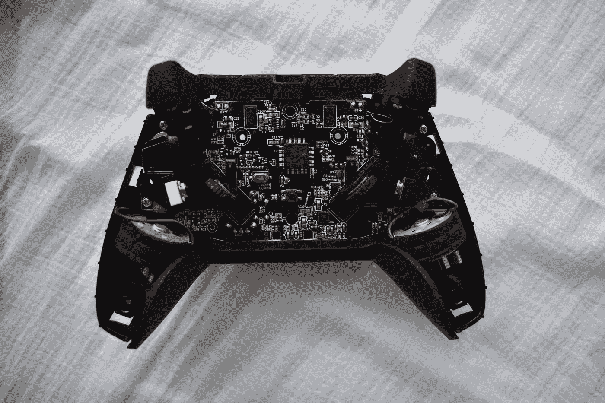
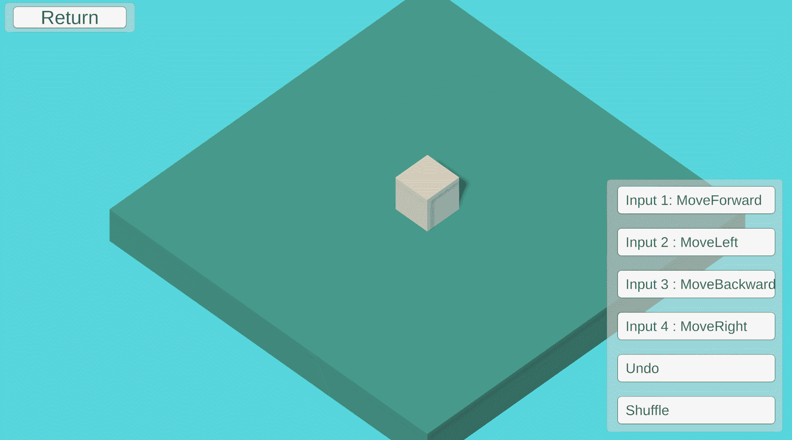

# 带有命令模式的游戏设计

> 原文：<https://blog.devgenius.io/a-game-designers-thoughts-on-programming-patterns-command-pattern-4f6329f9b30d?source=collection_archive---------8----------------------->

## 一个数字游戏动词

这是游戏设计与编程模式系列的第一篇文章，着眼于编程的游戏设计方面。这个系列的互动部分可以在这里找到:*[*https://ovenfresh.itch.io/design-with-patterns*](https://ovenfresh.itch.io/design-with-patterns)*

**

*行动的基础| Lynda Sanchez 在 [Unsplash](https://unsplash.com?utm_source=medium&utm_medium=referral) 上拍摄的照片*

## ***是什么格局？***

*命令模式是将方法调用转换成对象的策略。不是直接调用方法来执行函数，而是创建一个可以调用一般执行函数的对象。在游戏中，这些对象可以链接到特定的按钮输入或触发器，以创建可以相对容易地交换命令的空间。它还创建了一个结构，您需要这个结构来拥有重做/撤消功能以及命令/输入历史。这让我们能够追溯游戏中发生的动作，检查它们，甚至替换它们。*

# ***我如何使用它***

**

*用洗牌命令输入控制立方体*

*命令模式用于创建动作对象，因此场景使用洗牌袋中的一组命令。向前、向后、向左和向右移动的命令随机分配给四个输入按钮中的一个。点击它们可以移动立方体。一个随机按钮可以让你改变每个输入被分配的命令。然后，一个撤销按钮让命令返回，并删除命令堆栈中的条目。这获得了命令功能的大部分基础:堆栈中的动作、重新分配和撤销。*

# ***设计印象***

*当命令只有一个单一的目的时，它们才能取得最大的成功*

*命令模式将动作放在离散的单元中，因此命令对象将功能和行为转化为具有历史的对象。将历史添加到动作中比非历史操作有明显的好处:可以检查动作的执行顺序，可以分离它们的效果，并且可以撤销它们。将它们视为数字游戏对象的一部分，可以让动作转移和移动。在任何情况下，如果动作是离散的且定义明确的，那么命令是实现的最佳方式。*

# ***前进***

*动词是游戏设计的基础之一:游戏需要动作。Command 很容易将这些游戏动词的概念翻译成程序。一个动词可以应用在几种场景中，不管它们是否有意义，一个命令也可以这样使用。创建命令不一定限制它能做什么，为游戏中富有想象力的动词用法奠定基础。命令支持人们在设计动词时可能期望的插入和退出类型的语法。探索命令的这种扩展属性使它在数字游戏的实验中变得强大。*

***接下来:** [**轻量级**](https://medium.com/dev-genius/game-design-with-programming-patterns-flyweight-6914f1cc4772)*

***代号**:[https://github.com/jasonzli/game-programming-study](https://github.com/jasonzli/game-programming-study)*

***参考:**游戏编程模式， *Nystrom，Robert 2014*[*http://gameprogrammingpatterns.com/command.html*](http://gameprogrammingpatterns.com/command.html)*

> **用 C#统一游戏编程模式*诺德乌斯，埃里克*2020*[https://www . habrador . com/tutorials/programming-patterns/1-command-pattern/](https://www.habrador.com/tutorials/programming-patterns/1-command-pattern/)***