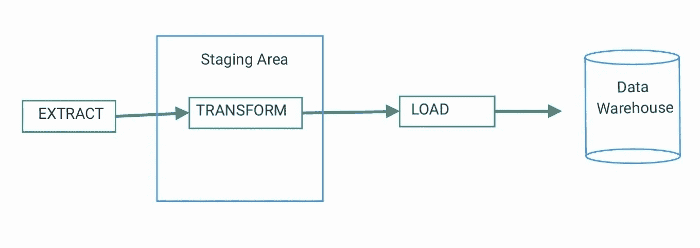
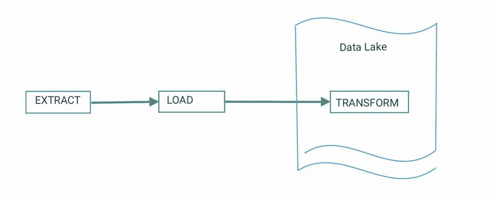
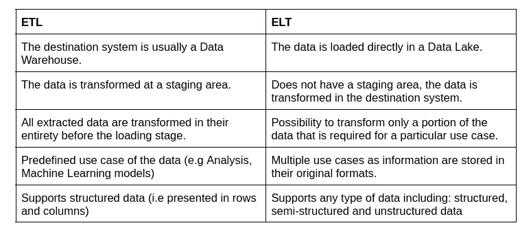

# 对 ETL 过程的简单介绍

> 原文：<https://blog.devgenius.io/a-gentle-introduction-to-an-etl-process-19925e16367c?source=collection_archive---------9----------------------->

马达加斯加安齐拉贝附近的农田

最常见的数据工程任务之一是建立和维护管道，不是为了供水，而是为了收集数据、进行转换并加载到数据存储库中。

在收集阶段，可以通过流处理(对于连续的数据)或批处理(对于一起输出的大块数据)来检索数据。本文将关注一种流行的批处理模式，称为 ETL，代表提取转换负载。而一个现代的 ETL 需要使用几个流行的框架，包括 [Apache Spark](https://spark.apache.org/) 、 [Apache Kafka](https://kafka.apache.org/) 、 [Apache Airflow](https://airflow.apache.org/) 等；本文的目标是在不深入研究这些框架的情况下，提供一个关于 ETL 的简单介绍。

此外，本文还创建了一个 Python 笔记本，展示了一个简单的 ETL 示例。这个笔记本的目的是收集世界上不同国家的幸福水平信息。这个迷你项目可以在我的 [ETL with Python](https://github.com/HoracioSoldman/etl-with-python) Github 仓库中找到。

## 那么什么是 ETL 呢？

> 提取、转换和加载数据的过程，即从数据源提取数据到暂存区，进行转换以添加结构或清理数据，以及将数据加载到最终目的地。— [实时大数据仓储](https://doi.org/10.4018/978-1-5225-5516-2.ch002)

典型的 ETL 如下所示:

典型 ETL 的不同阶段

好吧，但是实际上，**我们应该在提取、转换和加载阶段做什么呢？**

## 提取

ETL 过程的第一步是从原始数据源检索数据。如今，有多种类型的数据源可用于多种目的，包括数据库、网站、API、设备传感器、备份文件等等。根据数据源或数据提供者的不同，在这一阶段采用不同的方法。例如，为了从一个网站上收集信息，我们可以执行 web 抓取，这实际上是读取一个网页的内容，并从中提取有意义的信息，而不需要在浏览器上打开该网页。类似地，为了从 API 中提取数据，我们可以简单地进行 API 调用，这通常包括发送一个带有或不带有 API 键的 GET 请求。对于传感器数据，采用其他方法。简而言之，在这一步中，许多数据集被收集在一个临时位置:临时区域，并为转换做好准备。

在上面提到的示例项目中(即[用 Python](https://github.com/HoracioSoldman/etl-with-python) 进行 ETL)，来自[世界幸福报告](https://worldhappiness.report/ed/2021/)和[世界人口评论](https://worldpopulationreview.com/country-rankings/happiest-countries-in-the-world)网站的数据被导入到暂存区。

## 改变

通常，来自不同来源的数据也有不同的格式。有些数据是 CSV 文件格式，有些是 JSON、XML 等。在这个阶段，挑战不仅在于处理各种数据类型和格式，还在于确保它们的质量和可用性。因此，这一步骤的目的是以这样一种方式转换这些原始数据，使它们在未来的使用中更加统一、清晰和易于处理。根据数据管道的目的，是为机器学习模型提供数据，还是为分析或可视化提供数据；这里可以使用大量的技术，包括格式化数据类型(例如从字符串到日期时间格式)、删除重复条目、输入缺失值、合并数据集等等。

此外，这个阶段的操作可能非常特定于领域。例如，我们可能在财务数据中执行大量的货币转换，而在医疗数据中可能需要更多的聚合操作。

## 负荷

ETL 过程的最后一步是加载转换后的数据。这是数据实际移动到目标系统的地方。同样，根据管道的目的，数据可以插入到数据仓库或任何类型的存储库中，数据分析师、数据科学家或 ML 工程师可以在这里检索和使用预处理的数据。

为了跟踪所有过程的进展，在管道中有一个记录系统也是很重要的。这可以通过一个简单的日志函数来实现，该函数用时间戳记录每个阶段的开始和结束，以及过程中可能出现的错误。

近年来，另一种模式也越来越受欢迎:ELT 或提取加载和转换。

## 那么英语教学呢？

令人惊讶的是，除了 ELT 中流程的顺序(即加载之后的转换)之外，还有几个关键的区别将 ELT 与通常的 ETL 管道区分开来。

典型英语教学的不同阶段

ETL 和 ELT 的区别

由于云存储和数据库即服务(DBaaS)的出现，ELT 越来越受欢迎，它们提供了高度可伸缩性、可用性和容错存储库。

在更高级的 ETL/ELT 过程中，通常使用工具如 [Apache Spark](https://spark.apache.org/) 、 [Apache Kafka](https://kafka.apache.org/) 、 [Apache Airflow](https://airflow.apache.org/) 等来提高管道的性能和效率。在我们的下一篇文章中，我们将把这些框架用于另一个 ETL 过程。敬请关注！

在那之前，快乐编码；)