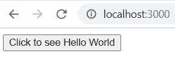
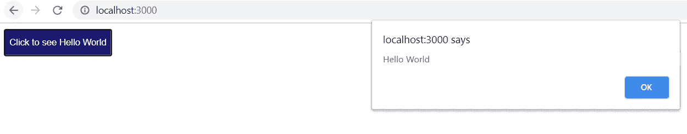

# 新手编程指南

> 原文：<https://blog.devgenius.io/a-guide-into-programming-for-newbies-47ace2506afb?source=collection_archive---------23----------------------->

如果你看到这个页面，我相信你要么是科技新手，要么是编程新手，需要一个指导来帮助你选择在其他领域学习什么，以成为你想在科技世界中成为的人。这篇文章的主要目的是在你不知道该走哪条路的情况下指导你选择一条路，同时也为你提供了几种选择。

首先，如果你不确定要走哪条路，在你决定选择哪条路时，有几件事你可能要考虑，你需要问自己的一些个人问题是:

1.  **我对科技真正感兴趣的是什么，或者我原本擅长什么？(这个问题的答案应该是你的渴望，你对漂亮的设计感兴趣吗，或者你对数据或其分析着迷吗，或者是功能和行为让你兴奋吗？etc)**

**2。学习我感兴趣领域的技术需要多长时间？(我说的技术是指一种编程语言或者一个框架。如果你不明白什么是框架，不要担心，在阅读这篇文章的过程中，你会明白的。)**

**3。就业市场是什么样的？招聘人员对这项技术的需求有多大？**

**4。我能多高效或多轻松地使用这项技术？**

**5。社区是什么样的？(社区，我指的是目前使用这项技术的人数)**

**6。这项技术有多老或多新？**

在很大程度上，如果你能找到上述问题的答案，这将极大地影响你做出选择的决定。

**根据你的兴趣领域选择道路的提示；**

1.  如果你有平面设计背景，对数码产品感兴趣，那么成为一名 UX 或用户界面设计师可能是你的必经之路。

**2。如果你对数据库情有独钟？您可能想深入数据库世界，成为一名数据库管理员。**

**3。如果你喜欢分析数据的趋势，那么你肯定会想从事数据科学。**

**4。如果您喜欢实现功能，或者经常对任何 web 应用程序中的功能感到好奇，那么您可以探索 web 开发(后端)。**

**5。如果你喜欢设计网页，那么你可以探索 web app 开发(前端)。**

6。如果成为开发可以在移动设备上运行的应用的团队的一员让你感到兴奋，那么移动应用开发应该是你的必经之路。

其次，假设你选择了一条道路，但是你不知道要学习什么编程语言，在一个编程语言成百上千的时代，做出这种语言的选择有困难是正常的，一旦你选择了一种语言并广泛学习，适应其他技术就不再困难。

现在，你应该对你的前进道路有个概念了。

**如果你认为你对 Web 应用开发感兴趣，请继续阅读:**

任何 web 应用程序都有两个方面，你可以关注其中的任何一个；

1.前端开发

2.后端开发

# **前端开发:**

前端就像一所房子、一辆车或任何东西的外部，它显示了一个美丽的界面，人们可以看到它并与之交互。

前端开发包括开发用户看到的和与之交互的内容。此外，前端与数据库的交互没有任何关系。在其他新闻中，一名前端开发人员将 UI/UX 设计转换成代码(同样，如果您还不理解 UI/UX 的意思，也不用担心)。

**要成为一名前端开发人员，我需要什么？**

成为前端开发人员所需的基本技能是:

*   HTML(必需)
*   CSS(必需)
*   JavaScript(必需)
*   框架(可选)

**1) HTML:**

HTML 是定义网页结构的标记语言，注意 HTML 不是编程语言。通俗地说，HTML 就是你用来在网页上显示文本、图像、视频等的东西，它将定义网页的布局。不使用 HTML 是不可能做网站的。例如，您可以创建一个带有文本“单击查看 Hello World”的按钮，并在您的浏览器上显示它。HTML 被比作人体，就像人体的骨架，HTML 和 CSS 一起工作，没有 CSS，你的网页将会是最丑的，就像下面的图片。

**2) CSS:**

CSS 是一种样式表语言，用于描述 HTML 元素如何在页面上呈现。就像上面的例子，CSS 可以用来改变按钮的颜色为蓝色。CSS 被比作人体，就像是人体的肌肉，给骨骼增添了美感。下面的按钮是用 CSS 设计的。

**3) JavaScript:**

JavaScript 提供 HTML 页面使用的功能。JavaScript 决定了你的网页的行为。在上面的例子中，JavaScript 用于控制按钮的行为，比如当点击按钮时，可以弹出一条消息。当 JavaScript 被比作人类时，它就像是控制人类运动或任何其他行为的机械装置。在下图中，当单击按钮时，类似 JavaScript 的脚本会触发窗口弹出一条消息。

HTML、CSS 和 JavaScript 是成为前端开发者所需的必备技术。在学习这些技术的时候，按照这个顺序学习**HTML =>****CSS =>JavaScript。**

学完这些，你可以进一步学习一个**框架**。

**什么是框架？**

上图是一个框架的想法。它给了你一个修复某些东西的结构，在这个例子中是你的代码。框架将控制你的应用程序的设计。它会迫使你以一种标准的方式工作。例如，一个特定的框架会强迫你以一种特定的方式编码你的登录功能，或者以一种特定的方式发出一个 HTTP 请求(一个 HTTP 请求就像你试图从你的应用程序访问 google.com)，而另一个框架会强迫你以另一种方式做这些事情。同样，一个框架可以由你必须使用的**库**组成。(不知道**库**是什么，不用担心，继续读下去)。

如果框架是可选的，我为什么要学习它呢？

虽然学习任何框架都不是强制性的，但是学习也很重要。原因是框架会让写代码更快更标准化。此外，大多数公司采用某些框架来帮助他们的发展，并且相信你想要拥有你最喜欢的公司所需要的技能。

**应该学习什么 HTML 框架？**

有几个 HTML 框架我不会在这篇文章中介绍，如果你喜欢，你可以探索它们，但通常情况下，基本的 HTML 对于你想要构建的任何网页都是足够的。

**应该学习什么 CSS 框架？**

首先， **Bootstrap** 是个好地方。这是因为 Bootstrap 被广泛使用。现有超过 15 个 CSS 框架。Bootstrap 是最流行的 CSS 框架，作为一个新手，从这个框架开始将是一个不错的决定。

**注:**没有掌握基础知识就学习框架会让你很难理解它，还会从一个框架跳到另一个框架，因为这些框架很少会持续很长时间，一个更新的框架会出现取代它们。

**应该学习什么 JavaScript 框架？**

可以选择学习的流行 JavaScript 框架:

**1。Angular:** Angular 用于开发单页面应用。

**2。Vue:** Vue 也可以用来开发单页面应用。

你可以探索的其他 JavaScript 框架有 ember、nextjs、Svelte、Backbone 等。

什么是库？

库是一组可重用的代码，可以包含在程序中。一个常识性的解释是这样的，假设你有一堆每次都在应用程序的不同部分编写的代码，你可以编写一次这些代码并保存在一个文件中，然后在每次需要时调用它。所以作为程序员，你可以编写和使用自己的库，也可以使用外部库(别人写的库)。

**应该学习什么 JavaScript 库？**

您可以选择使用任何一个，但是下面的 JavaScript 库是最常用的；

**1。React JS:** 目前这个比其他库用的多。

**2。jQuery:** 随着时间的推移，jQuery 的使用减少了，因为出现了许多其他提供更好功能的库。不管怎样，jQuery 是如此简单和强大，仍然可以和其他框架一起使用。

# **后端开发:**

后端就像一个汽车发动机，它并不总是被看到，但它是汽车的动力室。

你认为当你在网上填写表格并提交时会发生什么？你看不到的幕后发生的任何事情都是由后端开发驱动的。所以后端开发者就是为后端编码的人。在大多数情况下，后端开发中通常会有数据库交互，因此在学习任何后端技术时，请记住您需要将数据存储在某个地方，这意味着您需要对与数据库交互有基本的了解。

**成为后端开发人员需要什么？**

您可以学习以下任何(仅一种)技术/语言:

**1。使用 Django 框架或 flask 框架的 Python:**为了构建 web 应用程序的后端，您必须学习使用 Django 框架或 Flask 框架的 Python。其数据库支持包括 PostgreSQL、MariaDb、MySQL、Oracle、SQLite。

**2。Ruby:**Ruby 的好处是它有助于更快地开发 web 应用程序。然而，Ruby on Rails 正在失去它的受欢迎程度，Ruby 没有一个庞大的社区。一些支持的数据库是 SQLite，PostgreSQL，MySQL。

**3。PHP:** PHP 适合制作功能强大的动态网页。PHP 支持 MySQL、Oracle、PostgreSQL、Sybase、IBM-DB2 数据库。

**4。JAVA:** JAVA 有一个庞大的开发者社区。超过几千万的开发者。JAVA 支持 JAVA DB、MySQL、Oracle、PostgreSQL、SQL Server、Sybase、DB2 数据库。

**5。C#:** 使用像 ASP.NET MVC 或。NET 核心，可以为后端开发应用程序。NET 支持 SQL Server、MySQL 等。

6。C++: C++可以为任何平台编码。但是学起来就没那么容易了。C++支持 SQL Server，Oracle，Sybase，MySQL，PostgreSQL 数据库。

**7。NodeJs:** node 是运行 JavaScript 代码的运行时环境。注意，node 需要 JavaScript，所以你必须在 node 之前了解 JavaScript。节点支持几个数据库，如:MongoDB，Redis，CouchDB，SQL Server，MySQL，PostgreSQL，Oracle，SQLite。

**你希望开发在移动设备上运行的应用程序吗？如果是，那么你肯定想成为一名移动开发者。所以进一步阅读。**

移动应用程序是专为在智能手机和平板电脑等移动设备上运行而设计的应用程序，大多数用于后端的技术也用于移动开发。同样，它需要一个数据库来存储数据，也需要一种编程语言。

**作为一名移动应用开发者，我需要哪些框架或技术？**

了解如何使用下面列出的任何技术:

**1。Xamarin Framework** :配合 c#语言使用，支持 SQLite 和 Realm 数据库。

**2。Flutter SDK:** Dart 语言与 Flutter 一起使用。它支持 SQLite 数据库。

**3。React Native:** 配合 JavaScript 使用，支持 Firebase，SQLite，Realm，PouchDb 数据库。

**4。Ionic 框架:**配合 Angular JS 使用，支持 SQLite，Firebase。

**5。Cordova-Apache:** 它使用 HTML、CSS 和 JavaScript。它支持 SQLite。

**6。Java:** 配合 Java 使用。它支持 SQLite，Realm。

**7。目标 C:** 这是开发 iOS 应用的主要编程语言。它逐渐被 Swift 取代。使用的语言是 c .它可以支持 SQLite，Realm

8。Swift: Swift 用于开发 iOS、macOS、watchOS、tvOS 和 Linux 应用程序。它可以支持 SQLite 和 Realm DB。

9。Kotlin: Kotlin 是围绕 JAVA 构建的，但是它提供了比 JAVA 更大的优势，其中之一就是它可以跨平台编码。它可以在同一个项目中很好地使用 JAVA。它可以支持 SQLite，Realm，Firebase 等。

# 你希望成为一名 UI/UX 设计师吗？

**UI** 和 **UX** 是不同的技能，但却是相辅相成的。

**UX(用户体验):**

一般来说，用户体验关注的是事物如何工作以及人们如何与之交互。一个 UX 设计师应该确保一个产品，无论是软件还是任何东西，对最终用户来说都是有意义的。想想看，安装和使用 WhatsApp 这样的应用程序是多么容易，对用户来说又是多么有趣，第一次使用的用户可能需要很少或不需要帮助。导航您的 Android 设备有多容易？用户需要点击多少次才能在你的软件上实现特定的功能？叫做用户体验。作为一名 UX 设计师，你首先应该具备的技能是站在用户的角度考虑问题。

**UI(用户界面):**

用户界面关注设计的外观和布局。UI 设计师设计产品的图形，应该有很好的图形知识才能成为一名优秀的 UI 设计师。UI 设计师是创建图形设计(称为模型)并将其交给前端开发人员的人，前端开发人员会将其转换为代码并在网络浏览器上运行。

**成为一名 UI/UX 设计师需要哪些工具？**

UI/UX 设计者使用他们力所能及的一系列工具；例子有

Photoshop，Adobe XD，Sketch，Illustrator，Figma，MockFlow 等。

# **你想成为数据库管理员吗？**

简单地说，数据库管理员就是确保一切就绪以确保数据库对其用户可用的人。操作数据库最流行的语言是结构化查询语言(SQL)，理解这种语言对大多数数据库来说是关键。

存在几种数据库和数据库管理系统，

甲骨文，MySQL，微软 SQL，PostgreSQL，DB2，微软 Access，SQLite，Redis。

# 你想成为一名数据科学家吗？

你可能听说过未来是数据，这是绝对正确的。每个公司都有并使用数据。利用现有数据提取对任何人都有益的见解和知识的能力是让你成为数据科学家的原因。2020 年，对数据科学家的需求正以几何级数增长。

**成为数据科学家需要什么？**

1.了解如何使用 Python

2.稀有

3.结构化查询语言

4.基本统计学:你的基本均值，众数，中位数等。

*在科技领域，还有几个你可能感兴趣但本文没有涉及的选项，其他领域的例子包括机器学习、IOT、自然语言处理、道德黑客、机器人等。最终目标是做让你快乐的事情，同时为人们增加价值，并获得回报。*

*今天就选择一条道路，开始一路学习，直到你能够创造出满足一个人需求的解决方案。*

# ***我们改变世界，一次一行代码！！***

如果你觉得这篇文章有帮助，别忘了为它鼓掌。在 twitter 上关注我，让我们分享更多的想法。[www.twitter.com/@nollykalz](http://www.twitter.com/@nollykalz)