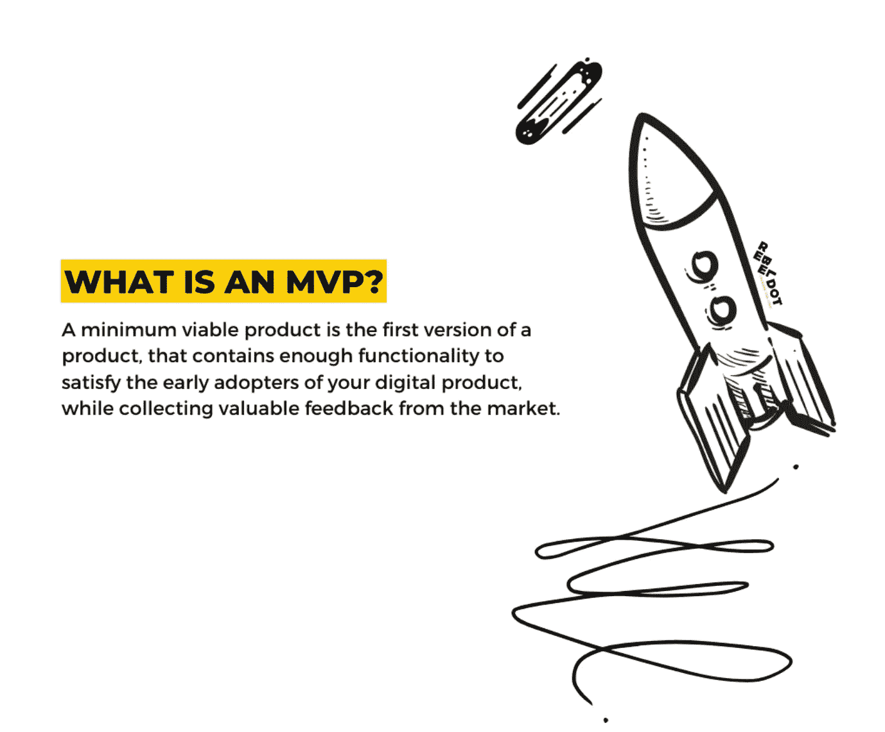
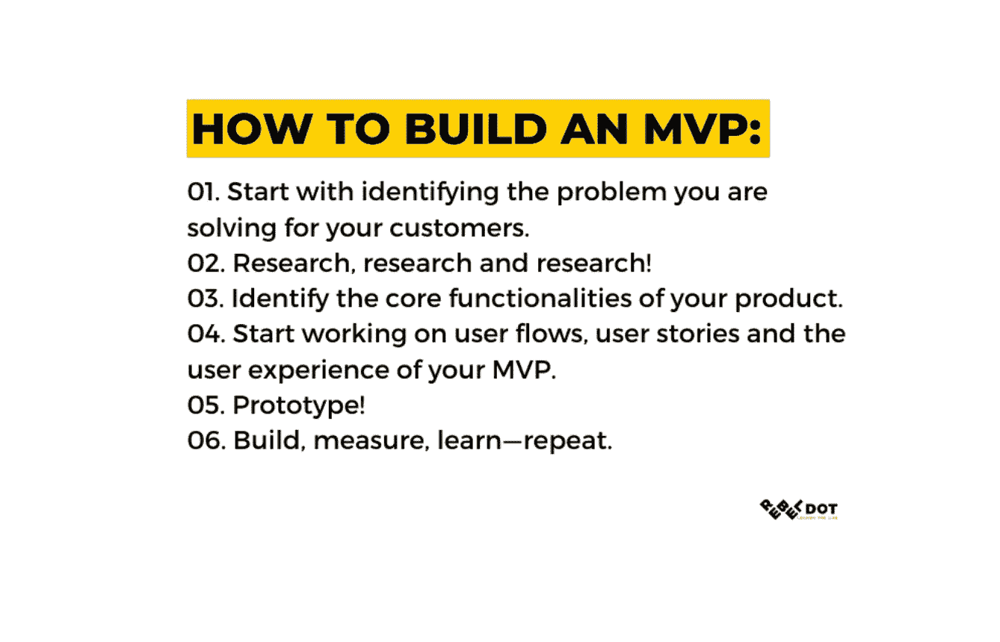

# 构建 MVP 指南。我们如何利用最少的可行产品和快速的客户反馈进行创新。

> 原文：<https://blog.devgenius.io/a-guide-to-building-an-mvp-6d22cee843fa?source=collection_archive---------36----------------------->

## 在这篇文章中，我们将阐明什么是 MVP，为什么你应该从 MVP 开始，我们将帮助找出你的第一个版本的产品实际上可能花费你多少。

在数字产品领域工作了十多年，我们有机会与众多希望为其行业带来创新的企业家进行互动。我们看到老牌企业希望在技术的帮助下实现流程数字化，热情的初创企业创始人在职业生涯的初期投入所有的时间和金钱来建立成功的东西，最后但并非最不重要的是，连续创业者已经习惯了初创企业的场景，试图在科技初创企业的竞争世界中取得成功。

我们接触的客户不仅在创业历程上不同，在技术理解和业务场景上也不同。因此，很明显，在帮助企业主将新产品推向市场时，一刀切的方法无疑是失败的。过程是好的，但是我们知道为了沉浸在特定的商业故事和场景中，知道什么时候把它们放在一边同样重要。

在一个适应性、灵活性和特殊性的世界里，有一件事是永恒不变的。对于一家初创公司来说，要想有机会推出成功的产品，研究和 MVP(最小可行产品)的创建是必不可少的。而且，我们怎么强调这一点都不为过。

在这篇文章中，我们将阐明什么是 MVP，为什么你应该从 MVP 开始，我们将帮助找出你的产品的第一个版本可能花费你多少。

# 什么是 MVP？

最小可行产品是产品的第一个版本，它包含足够的功能来满足您的数字产品的早期采用者，同时从市场收集有价值的反馈。

一个 MVP 来帮助你在产品开发过程的早期验证你的想法。在敏捷开发的情况下，它应该帮助你的产品团队基于输入来验证和迭代你的产品。

直截了当地看一下整个 MVP 概念，你想用产品的第一个最小版本来测试市场，以确保在投入大量资金进行更多的设计和功能之前，你的想法得到了市场的验证和认可。

# 为什么要打造 MVP？

虽然我们已经触及了建立 MVP 的最重要的原因之一，即验证你的产品想法，我们将阐明为什么你应该从建立 MVP 开始的其他重要方面。

首先我们要提醒你，罗马不是一天建成的。传说中，建筑工人每天都在那里砌砖。同样，我们建议所有者将 MVP 视为一个过程，而不是一个产品。构建 MVP 是一个旅程，它允许您测试、优化和发展您的 web 或移动应用程序，与市场需求保持同步。倾听客户的需求和愿望可能是这一过程中最重要的一步。将所有这些有价值的输入转化为特性和功能是有趣的部分开始。

MVP 为您提供了一个框架，使您能够对那些与您的产品旨在解决的问题相关的最优先的特性进行本质化。假设你正计划开发一款产品，让狗主人可以接触到在线训狗师。尽管你可能有很多关于产品外观的想法，但确定产品的核心功能是很重要的。实时聊天可能是这个特定用例的正确答案。重要的是要记住，MVP 是第一个被剥离到数字产品核心的版本，你应该像这样保存它。

一个 MVP 可以节省大量的钱，这些钱可以用于你的产品的预发布广告。因为构建小的迭代是 MVP 的全部内容，发布产品的小版本，测试和改进反馈可以帮助你不陷入投资用户不需要的功能的陷阱。

# 如何建立一个 MVP

既然我们已经触及了构建 MVP 背后的理论，那么让我们来看看如何构建 MVP。

## **1。从确定你正在为客户解决的问题开始。**

如果你接触过产品和创业领域，这听起来可能已经是老生常谈了。然而，在开始建造任何东西之前，这是你清单上最重要的一项。

看看一些最热门的创业公司，他们都是从确定一个真正的问题开始，并围绕这个问题设计他们的解决方案。

## **2。研究，研究，研究！**

重要的是，你要花时间对你的买家角色、竞争以及他们的产品给市场带来的优势进行广泛的研究。

寻找产品开发中一些最重要问题的答案:你为什么要构建数字产品？你的产品为市场解决了什么问题？你的目标市场是谁？你的竞争对手是谁？

## **3。确定产品的核心功能。**

正如你已经知道的，尽管你可能有很多有趣的想法，但构建 MVP 的全部目的是发布一个最小版本的数字产品，而不增加太多的功能。问问你自己，我希望我的用户完成的最重要的行动是什么？然后，将所有功能分为好的、必须的和不需要的。

## 4.开始研究你的 MVP 的用户流、用户故事和用户体验。

有了研究作为坚实的基础，现在是时候考虑你的 web 或移动应用程序中的用户流了。你知道你的产品的核心功能是什么，所以这是一个很好的时机来考虑用户在应用程序中的体验。

## 5.原型！

您的移动或 web 应用程序的用户体验对于您的第一批用户与数字产品的交互方式极其重要——想象用户与您的应用程序交互的真实场景，并根据他们的期望开始设计。

最后但同样重要的是，加入你公司的品牌元素，想办法借助颜色、动画过渡和互动来增强用户体验。记住，要吸引用户；一个 MVP 不仅应该是功能性的，也应该是令人愉悦的。

一旦你做好了一切准备，我们建议你收集所有的应用程序屏幕，并使用 InVision 构建一个交互式原型——这样，你就会对应用程序的感觉和外观有所了解。

## **6。构建测量学习-重复。**

一旦你有了完整的应用程序设计，开始编写你的 MVP。我们建议创业公司确保进入开发的应用程序屏幕是他们想要的，消除在产品开发阶段的开发阶段进行重大更改的风险。

启动应用程序的第一个版本只是这个过程的开始。把它放在你的用户手中会给你改善体验所需要的反馈，让它对你的用户来说更有存在感和吸引力。

# 打造一个 MVP 要花多少钱？

在开始问这个问题之前，确保你已经做了调查，这样你就知道你的产品解决的主要问题，你的竞争对手，最后但同样重要的是，你的潜在用户群。

如果您已经知道您的应用程序的一些核心功能，以及 UI 的复杂性，那么估计构建 MVP 的开发工作会变得更加准确。

在 RebelDot，我们确保在提供任何评估之前，我们对我们将要建立的东西有一个非常清晰的想法，并且我们已经将自己沉浸在我们正在处理的业务的愿景、目标和挑战中。我们这样做是因为我们希望能够为我们的客户提供良好的财务可预测性，尤其是在许多情况下正在寻求投资的初创公司。

总的来说，打造 MVP 和数字产品的棘手之处在于，它们最终会让你付出的成本很大程度上取决于与你对话的公司的时薪。

工作范围和应用程序的创新水平是你的 web 或移动 MVP 总成本中两个非常重要的因素。涉及区块链、机器学习和任何人工智能或虚拟现实组件的 Web 和移动应用程序比具有标准功能的应用程序成本更高。

正如你可能会想到的，很难，几乎不可能给一个我们一无所知的数字产品定位——就像在黑暗中猜测一样。如果你想知道一个 MVP 会花你多少钱，我们的建议是你寻求开发团队的帮助。

你走到这一步了！

我们希望这篇文章能帮助你找到为什么你应该为你的创业公司建立一个 MVP 的一些最重要的方面，并就如何建立一个 MVP 提供重要的见解。如果您对如何实现您的数字产品创意有任何其他问题，请联系我们——我们将助您一臂之力。

在你走之前，我们最近推出了自己的创业公司 Visidot，并写了一篇关于构建数字产品的整个过程的文章，从想法到推出，以及…旋转？我们将如何构建 Visidot 的故事，即[联系人追踪和访客管理应用](https://visidotapp.com/)，留在这里供您阅读。