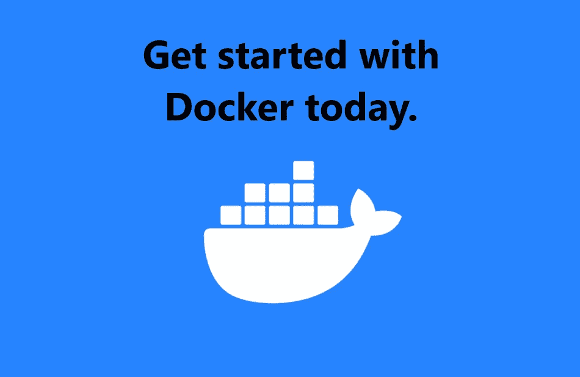

# 创建第一个 Docker 应用程序的指南

> 原文：<https://blog.devgenius.io/a-guide-to-creating-your-very-first-docker-application-d4a444b30a65?source=collection_archive---------11----------------------->



# Docker 如何工作

Docker 用于开发、测试、发布和运行应用程序。Docker 的关键之处在于它允许程序员将应用程序与其运行的基础设施分离开来。

在 Docker 之前，虚拟机(VM)是很常见的。

Docker 和传统 VM 的区别在于 Docker 运行在 Docker 引擎上。它不需要虚拟机管理程序和来宾操作系统。

这使得 Docker 容器更轻，并增加了启动时间。

Docker 容器还可以在几乎任何环境中运行，这使得它比 VM 更具可移植性。

容器的构建和销毁速度比虚拟机快得多。

在云服务器上部署 Docker 容器比在虚拟机上部署要容易得多。


# 创建您的第一个 Docker 应用程序


## 1.首先，在 Linux 上安装 Docker

更新包:

```
sudo apt update
```

安装 Docker:

```
sudo apt install docker.io
```

测试 Docker 安装:

```
sudo docker run hello-world
```


## 2.编写项目

我们需要两个文件来运行我们的应用程序。一个`Dockerfile`和一个 Python 文件。

*   Python 文件`main.py`包含将由 Docker 容器运行的代码
*   `Dockerfile`用于配置 Docker 容器将如何运行

Python 文件非常简单，只输出一些文本:

```
#!/usr/bin/env python3

print("Hello from Docker!")
```

`Dockerfile`是奇迹发生的地方:

```
# A Dockerfile must always begin with a FROM instruction.
# The FROM instruction specifies the Parent Image from which you are building.
# In this case the latest version of Python is the image from which we are building.
FROM python:latest

# The COPY instruction copies new files or directories from <src> 
# and adds them to the filesystem of the container at the path <dest>
# In this case the main.py file is added to the root directory
COPY main.py /

# There can only be one CMD instruction in a Dockerfile.
# The main purpose of a CMD is to provide defaults for an executing container.
CMD [ "python", "./main.py" ]
```

`Dockerfile`的目标是发布 Python 代码。

首先，使用`FROM`指令加载一个 Python 图像。

然后使用`COPY`指令将 Python 文件(在本例中为`main.py`复制到容器中。

最后，`CMD`指令告诉容器执行 Python 文件。

本指南中使用的代码可以在我的 GitHub 上找到:
[https://github.com/conanmercer/docker-application-example](https://github.com/conanmercer/docker-application-example)


## 3.首次创建 Docker 图像

使用终端时，首先需要创建映像，然后才能运行它。以下命令创建名为“docker-python-test”的映像

```
docker build -t docker-python-test . 
```

`-t`命令允许我们将图像命名为`docker-python-test`


## 4.首次运行 Docker 映像

现在我们已经创建了一个要运行的映像，是时候实际运行它了。

```
docker run docker-python-test
```

万岁！

你应该看到“你好，来自码头！”终端屏幕上的输出。

## 5.结论

从这里开始，您就可以开始在 Docker 中构建和运行应用程序了！

天空是极限！

