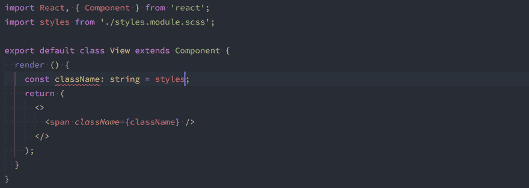

# 使用 React 的 CSS 模块指南

> 原文：<https://blog.devgenius.io/a-guide-to-css-modules-with-react-ebbb94f9038b?source=collection_archive---------19----------------------->


有许多不同的方式为 React 组件提供样式，如导入普通 CSS、使用样式化组件、JS-in-CSS 或 CSS 模块。这些都有各种[的优缺点](https://riichardwilson.wordpress.com/2020/05/15/styling-components-in-react/)。

对我来说，CSS 模块为初学者到中级用户提供了最好的解决方案。我们可以使用标准的 CSS 语法，它允许有效的[复制和粘贴编程](https://kosovojavaprogrammers.wordpress.com/2013/09/10/is-copy-and-paste-programming-really-a-problem/)，并且我们可以确保良好的客户端性能。

在这篇文章中，我介绍了使用 CSS 模块时的一些注意事项。具体来说，我感兴趣的是以一种框架不可知的方式来看待这个问题。很多框架，比如 [Next.js](https://nextjs.org/docs/basic-features/built-in-css-support) 都提供了对 CSS 模块的内置支持。然而，我认为探索 CSS 模块如何用于更普通的设置是值得的。我还将探索 CSS 模块如何用于框架无关的服务器端渲染。

# CSS 模块基础

CSS 模块是简单的 CSS 文件，我们可以与 React 组件一起开发:

要在 React 组件中使用 CSS 模块，我们需要“导入”我们想要使用的 CSS 源文件:

然后，我们可以在声明组件时引用 CSS 文件中的样式:

CSS 模块的神奇之处在于，像`myclass`这样的类名被转换成唯一的类名，保证不会与我们可能想要加载到页面上的任何其他类名发生冲突。例如，`myclass`可以转换成`mycomponent-myclass-78Sdd1`。

当使用 CSS 模块定义 React 组件时，我们面临两个挑战:

*   我们需要指示我们的 bundler 将 CSS 转换为带有生成的类名的 CSS，并将该 CSS 与我们发送给客户端的其他文件放在一起。
*   我们需要确保当运行我们的 JavaScript 源代码时，被引用的类名被正确解析(例如，访问上面的`styles`导入)。

下面我将描述我们如何在开发和部署的不同阶段应对这些挑战。

# CSS 模块智能感知

在编写 React 组件代码时，能够查找包含在 CSS 中的类名非常有用。这使我们不必将 CSS 中的类名复制并粘贴到 JavaScript 中，从而避免了错误。

为此，我们可以使用[typescript-plugin-CSS-modules](https://www.npmjs.com/package/typescript-plugin-css-modules)库。



只需将此库添加到您的项目中:

```
yarn add -D typescript-plugin-css-modules
```

然后用下面的插件扩展你的`tsconfig.json`文件:

```
{
  "compilerOptions": {
    "plugins": [
      {
        "name": "typescript-plugin-css-modules"
      }
    ]
  }
}
```

这将支持在各种编辑器中处理您的 TypeScript/JavaScript 代码时从 CSS 文件中查找类名，例如 VSCode。

请注意，该插件仅在开发期间生效，不会在编译期间捕获任何错误(请参见 TypeScript 问题 [#16607](https://github.com/microsoft/TypeScript/issues/16607) )。

# 编译 CSS 模块

当我们试图将一个文件导入到一个本身不是 TypeScript 文件的`.ts`或`.tsx`文件中时，TypeScript 编译器会发出一个错误。

为了解决这个错误，我们需要定义一个`[.d.ts](https://www.typescriptlang.org/docs/handbook/declaration-files/templates/module-d-ts.html)`模块，指示 TypeScript 如何解析我们要导入的`.css`文件:

```
declare module '*.css';
```

我们还可以为 TypeScript 提供一些关于导入数据的结构的提示，比如使用下面的声明代替上面给出的简单声明:

```
declare module '*.css' {
  const classes: { [key: string]: string };
  export default classes;
}
```

确保您声明的`.d.ts`文件实际上是由 TypeScript 加载的。最简单的方法是在您的`tsconfig.json`文件中扩展`"include"`数组:

```
{
  "include": [
    "./src/typings.d.ts"
  ]
}
```

# 用于服务器端呈现的 CSS 模块(Node.js)

一旦我们将我们的 TypeScript 代码转换成 JavaScript，我们就可以在浏览器环境中或使用 Node.js 运行代码。本节讨论如何运行引用 Node.js 中 CSS 文件的 JavaScript 代码。下一节将讨论如何在浏览器中运行该代码。

随着服务器端呈现的出现，我们可能需要在服务器环境中运行 React 组件代码。如果我们尝试这样做，我们很可能会遇到如下的`SyntaxError`:

```
C:\Users\Max\repos\my-awesome-project\src\index.css:1
.myclass {
^SyntaxError: Unexpected token '.'
    at Object.compileFunction (node:vm:352:18)
    at wrapSafe (node:internal/modules/cjs/loader:1033:15)
```

这是因为 Node.js 无法加载 CSS 文件的源代码；因为解释器不了解 CSS 语言。有许多方法可以解决这个问题，但是我发现最简单的方法是挂钩节点加载所需源文件的机制。

为了使这更容易，我开发了一个简单的库 [node-css-require](https://www.npmjs.com/package/node-css-require) 。该库有两种用途:

首先，我们可以在代码中导入库并运行`register()`方法。这需要在加载任何具有 CSS 导入的源文件之前发生:

```
import { register } from 'node-css-require';register();
```

或者，我们可以用以下内容定义一个文件`register.js`:

```
const { register } = require('node-css-require');register();
```

然后在调用 Node.js CLI 时手动要求加载该库:

```
node -r register.js myscript.js
```

当部署我们的服务器端代码时，我们经常想要使用捆绑器来[最小化我们需要部署](https://ahamedblogs.wordpress.com/2020/02/11/reducing-js-bundle-sizes-using-tree-shaking/)的代码的大小。流行的捆绑器有 [webpack](https://webpack.js.org/) 和 [esbuild](https://esbuild.github.io/) 。

我们需要指导我们的 bundler 如何处理导入的 CSS 文件。对于服务器端渲染，我们需要捆绑器的两个输出:

*   包含从原始类名到生成类名的映射的 JavaScript 文件
*   一个包含 CSS 的 CSS 文件，为我们要呈现的页面中包含的所有组件生成类名

有许多插件可以帮助实现这一点，例如 webpack 的 [css-loader](https://elfi-y.medium.com/webpack-with-css-modules-93caa1062baa) 或 esbuild 的[es build-CSS-modules-plugin](https://dev.to/marcinwosinek/how-to-set-up-css-modules-with-esbuild-260g)。

然而，我发现现有的插件非常复杂，很难在自定义设置中工作，并且通常专注于为客户端而不是服务器应用程序捆绑 CSS 模块。因此我创建了另一个小库[es build-CSS-modules-server-plugin](https://www.npmjs.com/package/esbuild-css-modules-server-plugin)。

[es build-CSS-modules-server-plugin](https://www.npmjs.com/package/esbuild-css-modules-server-plugin)不到 50 行代码[为我们提供了服务器端渲染所需的一切。](https://github.com/goldstack/goldstack/blob/master/workspaces/utils/packages/esbuild-css-modules-server-plugin/src/esbuildCssModulesServerPlugin.ts#L9)

要使用这个插件，只需将它安装到您的项目中，然后将其添加到 esbuild 配置中的`plugins`数组中:

捆绑脚本

该插件确保所有 JavaScript 源文件被正确捆绑，例如,`*.css`导入被解析为对象，这些对象可以在服务器端呈现期间用来将原始类名解析为生成的类名。通过使用`onCSSGenerated`回调，我们可以收集所有生成的 CSS，并将其与生成的 JavaScript 一起存储，供服务器使用。

例如，当将代码发送到一个无服务器函数时，我们可以部署一个包含所有 JavaScript 逻辑的`bundle.js`文件，并在它旁边放置一个`bundle.css`文件，我们可以在请求时发送给客户端。或者，我们也可以将`bundle.css`上传到一个[静态网站/CDN](https://goldstack.party/templates/static-website) 。

# 用于客户端绑定的 CSS 模块

在客户端处理 CSS 模块要比在服务器端处理它们容易得多。与 Node.js 相反，浏览器本身理解 CSS，因此我们可以轻松地根据需要加载 CSS 文件。

然而，要使我们的代码在浏览器中可执行，我们还需要做一些工作。为此，我们可以再找一个捆扎机。前面提到的 [css-loader](https://elfi-y.medium.com/webpack-with-css-modules-93caa1062baa) 或[es build-CSS-modules-plugin](https://dev.to/marcinwosinek/how-to-set-up-css-modules-with-esbuild-260g)通常对客户端绑定很有效。

然而，我再次构建了一个小型的轻量级库，来帮助使用 esbuild 为客户端捆绑我们的代码。

不到 50 行代码中的[es build-CSS-modules-client-plugin](https://www.npmjs.com/package/esbuild-css-modules-client-plugin)完成了客户端绑定所需的一切。

我们可以如下使用该库:

这个插件通过在页面加载时注入所需的 CSS 来工作。理想情况下，我们希望将此与[es build-CSS-modules-server-plugin](https://www.npmjs.com/package/esbuild-css-modules-server-plugin)结合起来。当我们在服务器端编译所有的 CSS 并将它与我们的前端代码一起发布时，我们只需要在页面上加载一次生成的 CSS。在这种情况下，没有必要在组件加载时加载注入的 CSS。

如果我们已经将生成的 CSS 与我们的包一起发布，我们可以在加载插件时使用`excludeCSSInject`选项:

如果你想一次性生成客户端 JavaScript 和捆绑的 CSS，你可以同时使用[es build-CSS-modules-server-plugin](https://www.npmjs.com/package/esbuild-css-modules-server-plugin)和[es build-CSS-modules-client-plugin](https://www.npmjs.com/package/esbuild-css-modules-client-plugin):

只需将生成的 CSS 与 esbuild 生成的 JavaScript 文件存储在一起，并将它们部署在一起。

# 最后的想法

使用 CSS 模块最简单的方法就是利用框架中提供的支持，比如 [Next.js](https://nextjs.org/) 或者 [Create React App](https://create-react-app.dev/docs/adding-a-css-modules-stylesheet/) 。然而，在 CSS 模块中有很多隐含的复杂性，可能会导致意想不到的行为和错误。

在本文中，我的目标是提供一个关于 CSS 模块的更底层的视图。我想证明我们可以用相对较少的代码行实现我们需要的任何东西。我提供的三个库都非常简单，由一个简短的源文件组成:

*   [节点-CSS-要求](https://github.com/goldstack/goldstack/tree/master/workspaces/utils/packages/node-css-require#readme)
*   [es build-CSS-modules-server-plugin](https://github.com/goldstack/goldstack/tree/master/workspaces/utils/packages/esbuild-css-modules-server-plugin#readme)
*   [es build-CSS-modules-client-plugin](https://github.com/goldstack/goldstack/tree/master/workspaces/utils/packages/esbuild-css-modules-client-plugin#readme)

虽然这些不太可能神奇地解决您的所有问题，但我希望通过探索这些的源代码，您可以找到您独特问题的解决方案。

我在为 React 应用程序的无服务器端呈现构建轻量级框架的背景下研究了这一点。这方面的主要挑战是支持部署到云的捆绑和本地开发，以及如何在服务器端动态呈现页面。

如果您有兴趣探索包含端到端支持的框架，请参见 Goldstack [服务器端渲染模板](https://goldstack.party/templates/server-side-rendering)。

如有任何建议、想法和评论，欢迎前往 GitHub 并[创建一个问题](https://github.com/goldstack/goldstack/issues)🤗。