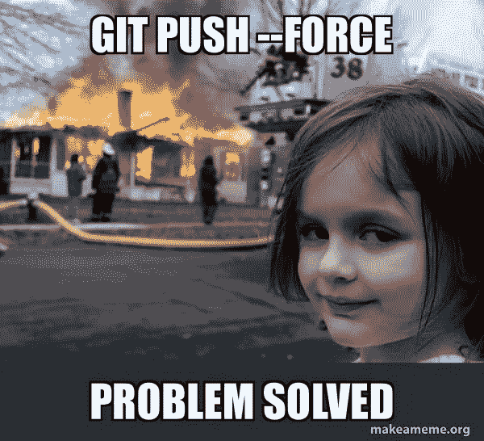
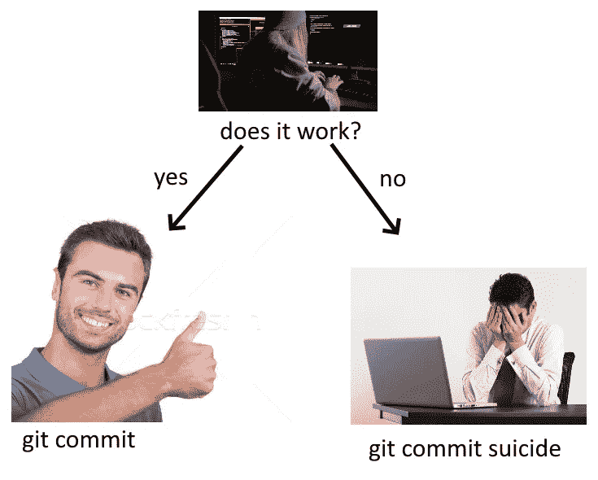
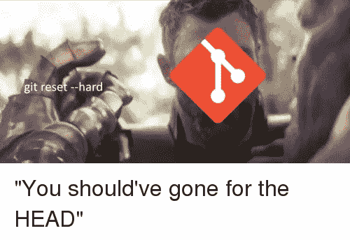
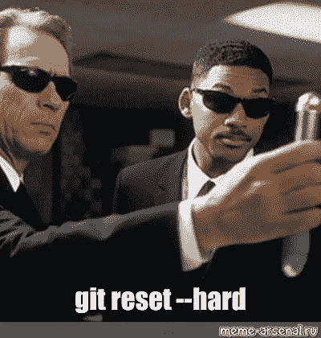
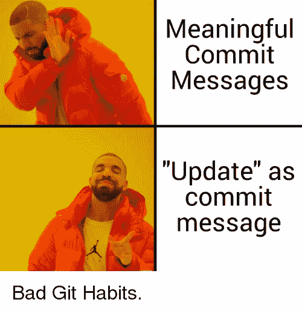
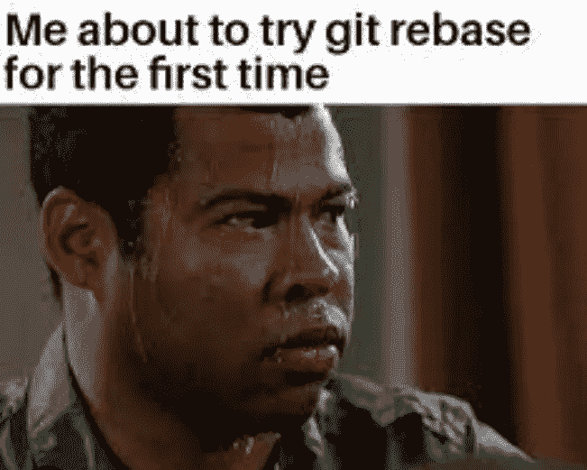

# ✅️消除 Git 错误指南👨🏻‍🏭

> 原文：<https://blog.devgenius.io/a-guide-to-undoing-git-mistakes-%EF%B8%8F-da357f0136b?source=collection_archive---------10----------------------->



**失误！**软件开发不需要这些。然而，他们总是设法破坏软件创作的美感。🙀

因此，错误是不可避免的。你如何克服你的错误？

撤销的能力是版本控制系统的一个有用的特性。
Git 是一个很好的安全网，如果你做了一个错误的决定，它会给你另一个机会。😎

想浏览一些有用的 Git 命令吗？这对你可能很有价值。

[](https://devangtomar.medium.com/git-commands-you-must-unquestionably-know-69aeb8594bd3) [## 你肯定知道 Git 命令！🚀

### 全球使用最广泛的分布式版本控制系统叫做 Git。这个项目是在…开发的

devangtomar.medium.com](https://devangtomar.medium.com/git-commands-you-must-unquestionably-know-69aeb8594bd3) 

在本文中，我描述了您可能犯的错误类型，以及帮助您摆脱这些错误的 Git 方法。

## 1.删除未被跟踪的文件☠️

您向项目中添加了一些新文件，并更新了其他一些文件。您改变了主意，决定不再需要您创建的任何新文件，并将坚持使用修改后的文件更改。


Git 有一个删除未跟踪文件的命令:

```
git clean -f
```

git clean 命令需要-f 参数，该参数表示强制指令(也称为— force)。因为这个操作涉及到删除未跟踪的文件，所以您必须确定您正在做什么，因为在 Git 中删除未提交的工作是不可能的。

此命令不会删除由定义的未跟踪的文件夹或文件。默认情况下 gitignore 文件。要删除忽略的文件，请使用-x 选项。

此外，git clean 不会在目录上递归执行。这是防止无意永久擦除的又一安全措施。

使用-d 开关也可以删除目录。

```
git clean -df
```

这将删除未跟踪的文件和目录，但不会删除。gitignore 文件。

## 2.停止跟踪被跟踪的文件⛔

您有一个不希望 git 跟踪的节点模块文件夹。
您提交了节点模块文件夹，但是您未能使用. gitignore 文件忽略它。在提交之前，创建. gitignore 文件并在其中包含节点模块文件夹。


但是，Git 仍然在跟踪它(节点模块)。这是因为一旦文件被创建并提交到 Git 数据库，Git 将继续跟踪对它的更改。

您希望 Git 停止跟踪节点模块子目录。

只需运行:

```
git rm -r  --cached node_modules
```

## 3.修改上次提交🔨

您已经向本地 Git 数据库提交了一个请求。之后，你意识到你忽略了在提交中添加文件修改(你可能没有保存文件)。或者您添加了一个新文件，并希望它链接到您最近提交的文件。



Git 将允许您在解锁之前的提交后添加新文件。

只需遵循以下步骤:

首先，添加缺少的文件:

```
git add newfile.ts
```

然后，运行:

```
git commit --amend --no-edit
```

`--no-edit`标志修改提交而不改变提交消息。

## 4.放弃工作目录🗑️中的所有更改

你在努力做你的项目。例如，您可以修改您的代码，以遵循更好的模式和干净的代码标准。重构时你破坏了程序中的一个功能，却不知道哪里出错了。您希望返回到应用程序正常工作的前一个状态(提交),以便重新找到方向。


因此，您希望撤销所有未提交的更改，并将 Git 工作树返回到上次提交时的状态。

使用命令:

```
git restore .
```

> ***注意:*** *该命令将您的工作副本恢复到您本地 git 数据库中的最近提交。您尚未提交的更改将永久丢失。*

## 5.放弃对文件所做的所有更改🚮

您已经对本地 git repo 中的文件进行了更改。您随后发现您对特定文件(connect.js)所做的更改并不明智，应该撤销。但是，您希望保留对其他文件所做的任何更改。


因此，您希望将文件 connect.js 恢复到之前的状态。

Git 允许您这样做:

```
git restore index.js
```

## 6.修改最后一条提交消息🏭

这是一个类似于上面描述的场景。但是这一次，您已经提交了 git，并且对您选择的提交消息并不感到兴奋。你希望信息在描述你所做的事情时更有意义。


Git 又一次宽容了，允许您修复之前糟糕的提交消息。

简单来说，运行:

```
git commit --amend -m "Phew! A better commit message this time"
```

## 7.将文件还原到⌛以前的旧版本

与前面的命令不同，您希望将项目中的特定文件恢复到比上次提交更早的状态。

因此，如果版本 3 是您的前一次提交，您希望这个特定的文件显示为它在版本 3 之前的版本 2 中的样子。


使用 Git:

随时查找并复制提交哈希:

```
git log
```

然后:

```
git restore --source <commit-hash> <filename>
```

就这么简单，对吧？

## 8.恢复已删除的文件(以前提交的)♻️

当您注意到一个过期的文件时，您正在对项目进行更改。您继续删除文件以释放空间。你后来意识到你需要刚刚删除的文件。

要取回您的文件:

```
git restore deleted-file.css
```

这将向您呈现文件，就像它在之前的提交中一样。

## 9.放弃本地存储库中的所有更改，恢复到远程存储库中的精确状态🎒

您对本地回购分支机构进行了一些更改和提交。你已经重接了线路，你在想，“为什么我一开始就要做这些改变？”



因此，您希望删除当前本地分支上的所有内容，并用远程主分支替换它。

只需按如下方式撤消:

```
git reset --hard origin/main
```

> ***警告*** *:未提交的更改将永久丢失。*

**10。将提交切换到不同的分支🔼🔽**

您目前正在处理项目的两个特性:创建一个时事通讯和微调页脚布局。您已经建立了两个不同的分支:新闻稿和页脚布局，每个分支都有自己的功能:新闻稿和页脚布局。

您目前正在添加简讯功能并提交到简讯分支。当您返回到您的项目时，您希望使用页脚布局功能，但是却忽略了切换到页脚布局分支。您提交了不正确的新闻稿分支的页脚布局功能。

后来，您发现您对新闻分支的提交实际上属于页脚分支。


因此，您希望将添加页脚布局功能的提交从新闻稿分支移到页脚布局分支。

在 Git 中，执行以下操作:

查看时事通讯部分:

```
git checkout newsletter
```

找到并复制添加了*页脚布局特性*的提交的*提交散列*。运行命令:

```
git log
```

签出您希望通过此提交应用的合法分支。在我们的案例中:

```
git checkout footer-layout
```

然后应用提交:

```
git cherry-pick <commit-hash>
```

然后检查`newsletter`分支:

```
git checkout newsletter
```

并去掉这个不需要的提交，这个提交添加了*页脚布局*:

```
git reset HEAD~1 --hard
```

HEAD~1 表示我们正在将时事通讯分支重置为最近提交之后的一个提交，并删除我们已经离开的提交。请记住，最近提交的新闻稿分支是带有页脚布局功能的。

## 11.复活已删除的分支🔙

您决定不再需要某个特性分支，并将垃圾桶放在它上面(删除它)。下次报警的时候，不小心删了。你现在处于“恐慌模式”你希望你能回到过去把它找回来。


所以你想要恢复你被删除的分支。

以下是恢复已删除分支的方法:

找到并复制已删除分支的提交哈希，它将在您运行命令时显示:

```
git reflog
```

然后重新创建您的分支，如下所示:

```
git branch <branch-name> <deleted-branch-commit-hash>
```

这将建立到 deleted-branch-commit-hash >的所有工作的分支。如果 deleted-branch-commit-hash >不是已删除分支中最近的工作，您仍然可以找到新的提交散列，直到找到包含您最近工作的散列。当您键入 git branch 时，您之前删除的分支将再次列出。即使源中的分支被删除(远程),这也是有效的。

如果 branch-name >不是您要找的，只需用 git branch-m branch-name > new-branch-name >重命名它。

不用说，成功恢复被删除的分支的关键是定位正确的提交散列，所以明智地命名提交；会有很大帮助。

## 12.倒带/撤销错误的提交⏪

您的团队已经发布了项目的新版本。你们都确信新功能是一件艺术品。几秒钟后，团队领导打来紧急电话，称新发布的版本包含一个重大错误，必须立即解决。技术团队必须快速响应，坐下来发现问题并不是紧急情况下的适当解决方案。


撤销对易出错版本的更改是最快的反应之一。

所以您希望回滚对提交所做的更改。

在 Git 中是这样做的:

找到并复制您要从中撤消更改的提交的提交散列(中断的提交)。

```
git log
```

还原由该提交指定的更改:

```
git revert <broken-commit-hash>
```

## 13.撤消 Git 合并👈🏻❌

您对特性分支中的新改进感到满意。您认为您已经准备好将功能分支合并到主分支中了。因此，您从主分支中合并特性分支，并将您的新修改推送到远程存储库中。


过了一会儿，你会明白合并根本不是一个好的举动。

所以你想逆转合并。Git 支持你。

从调查主要分支开始:

```
git checkout main
```

然后运行`git log`来获取*合并提交*的*提交哈希*。

```
git log
```

然后回复如下:

```
git revert -m 1 <merge-commit-hash>
```

合并中的分支是该合并的父级。

## 14.回滚到旧版本🎢🛼

您可以将项目恢复到以前的版本。这也可能是对不正确提交的响应:您想要恢复到最近中断的提交之前正常工作的版本。

警告:这个 git 命令重写历史。当与其他人一起工作于一个软件项目时，这是不合适的。

因此，您想要通过倒带存储库的历史来回到项目的早期版本。



在 git 中:

找到并复制您希望项目恢复到的提交哈希:

```
git log
```

将您存储库重置为由*提交散列*指定的状态:

```
git reset --hard <commit-hash>
```

## 15.修改旧的提交消息✂️

你对项目的进展感到满意。你在回顾你项目的历史。您会看到一条明显不明确的提交消息。

所以你想用一个更好的描述逻辑语义的消息来替换这个消息(只是一个有更好解释的消息)。



使用 Git 中的交互式 rebase，您可以更新更早以前的提交消息:

找到并复制要更改其提交消息的提交的提交散列:

```
git log
```

打开重置基础交互式会话:

```
git rebase -i <commit-hash>
```

将弹出一个编辑器，您可以在其中修复输入错误，并提供更好的描述性消息。

## 16.删除旧的提交😵

您可能会被一个旧的提交所困扰，并希望将其从您的项目历史中删除。

所以您希望从项目历史记录中删除该提交。



您可以通过执行以下操作来删除此提交:

首先，找到并复制注定要提交的提交散列。

```
git log
```

然后:

```
git rebase -i <commit-hash>
```

# 本文的 GitHub URL💻

[](https://github.com/devangtomar/git-guide) [## GitHub - devangtomar/git-guide

### width = " 5.0in 英寸" height = " 4.55in 英寸" }错误！软件开发不需要这些。然而，他们总是设法…

github.com](https://github.com/devangtomar/git-guide) 

# 结论💡

这就是你改正错误的方法。


只是几点:

*   在处理团队项目时，最好避免重写历史记录的指令。但是，您可以修改仅存在于您自己的回购协议中的专用分支的历史记录。规则是不要改变一个分支的历史，其他人已经在这个分支上建立了他们的工作。事情可能会变得棘手。
*   您可能使用过 git log 命令，该命令显示提交列表。git reflog 命令类似，但是它显示了 HEAD 更改的时间列表。
*   您的参考日志是您独有的。Reflog 记录自克隆存储库以来对每个分支所做的任何修改或提交。
*   Git 不会在 90 天后自动删除提交；它们可以在 reflog 中找到。这样一来，你又有了一次改正错误的机会。

谢谢你，reading✨

# 大家连起来聊聊天吧！向世界上任何事物开放🏖️🍹

**🐦推特:**
**🔗LinkedIn:**
**📚Stackoverflow :** [德旺托玛](https://stackoverflow.com/users/8198097/devangtomar)
**🖼️insta gram:**[be _ ayushmann](https://instagram.com/be_ayushmann)
ⓜ️**中:** [德旺托玛](https://medium.com/u/8f5e1c86129d?source=post_page-----e42119a306ca--------------------------------)
☊ **哈什诺德:** [德旺托玛](https://devangtomar.hashnode.dev/)
**🧑‍💻开发到:** [开发到](https://dev.to/devangtomar)