# 带协议缓冲区的 gRPC 指南

> 原文：<https://blog.devgenius.io/a-guided-tour-of-grpc-with-protocol-buffers-a8400b1ab361?source=collection_archive---------3----------------------->

# gRPC 和 Protobuf 简介:

gRPC 是一个现代化的开源高性能远程过程调用(RPC)框架，最初于 2015 年在谷歌开发。gRPC 使用 HTTP 2.0 作为其底层传输协议。

Protobuf 是最广泛使用的接口定义语言，也是 gRPC 的消息交换格式，我们通常以 proto 文件的形式存储数据和函数契约。

来源:[https://golangexample.com/](https://golangexample.com/)

Proto 编译器(protocol)使用序列化格式为。proto 文件以及特定于语言的运行时库，让系统表现为一个接口，公开外部系统调用的过程(像任何其他 RPC 模型一样)。

协议缓冲区提供了一种语言中立、平台中立、可扩展的机制，用于以向前兼容和向后兼容的方式序列化结构化数据。

在用 gRPC 和 Protobuf 设计我们的解决方案之前，我们应该记住的一个重要事实是:协议缓冲区倾向于假设整个消息可以一次加载到内存中，并且不大于一个对象图。在处理较大的数据(大于几兆字节)时，由于数据的多个序列化副本，Protobuf 可能会导致内存使用量出现惊人的峰值。

好吧！理论到此为止。让我们深入到使用 gRPC 和协议缓冲区实现一个小的动手项目。

# 设置指南:

在我们的本地环境中设置 Protobuf 需要遵循一些步骤。我使用的是 macOS Mojave 10.14.6，我的机器上已经安装了 go1.17.1。我用自制软件安装了协议缓冲区。为此发出的命令是:

> brew 安装 go
> brew 安装 protobuf

我们应该确保在*中正确地完成路径映射。bash_profile* 文件，以便*protocol*编译器可以找到所需的插件。我使用了下面四行代码。

> export go root =/usr/local/go
> export GOPATH = $ HOME/go
> export GOBIN = $ GOPATH/bin
> export PATH = $ PATH:$ go root:$ GOPATH:$ GOBIN

然后，执行下面的命令，让上面的更改生效。

> `source ~/.bash_profile`

或者，我们也可以在终端上使用下面的命令，用 GOPATH 设置和导出$PATH 变量的新值:

> 导出路径="$PATH:$(go env GOPATH)/bin "

我们需要使用下面两个命令分别安装主 *grpc* 包和*protocol-gen-go-grpc*包，以便使用 grpc 的协议缓冲区。

> 去安装 google.golang.org/protobuf/cmd/protoc-gen-go@latest
> 去安装 google.golang.org/grpc/cmd/protoc-gen-go-grpc@latest

# 动手::订单计费服务:

> ***如果订单是一份“* ***食品*** *”订单，我们应将送货费视为 25.0 印度卢比***
> 
> ***如果订单是“杂货”订单，我们应该将送货费视为 50.0 印度卢比***
> 
> ***如果订单是“时尚”订单，我们应考虑 15.0 印度卢比的送货费***
> 
> ***此外，对于所有其他类型的订单，我们应将送货费视为 10.0 印度卢比***

**我们还需要遵循一个约束条件，在这个约束条件下，我们应该限制系统在订单交付给客户之前准备订单总额的账单。**

**上述问题陈述中提到的用例完全是肤浅的。我认为这是一个简单的业务用例，因此很容易解释。**

****解决方案**:我创建了一个名为 */go-orders* 的文件夹来保存构建这个项目所需代码的实现。这个文件夹是在我的本地系统中除了 GOROOT 位置(/usr/local/go)之外的地方创建的。**

**现在，我们将在其中创建 *protos* 包，然后创建一个名为 orderBillingService.proto 的. proto 文件，以声明请求/响应数据结构(消息)和名为 CalculateOrderTotalForBilling 的 rpc 函数声明。**

**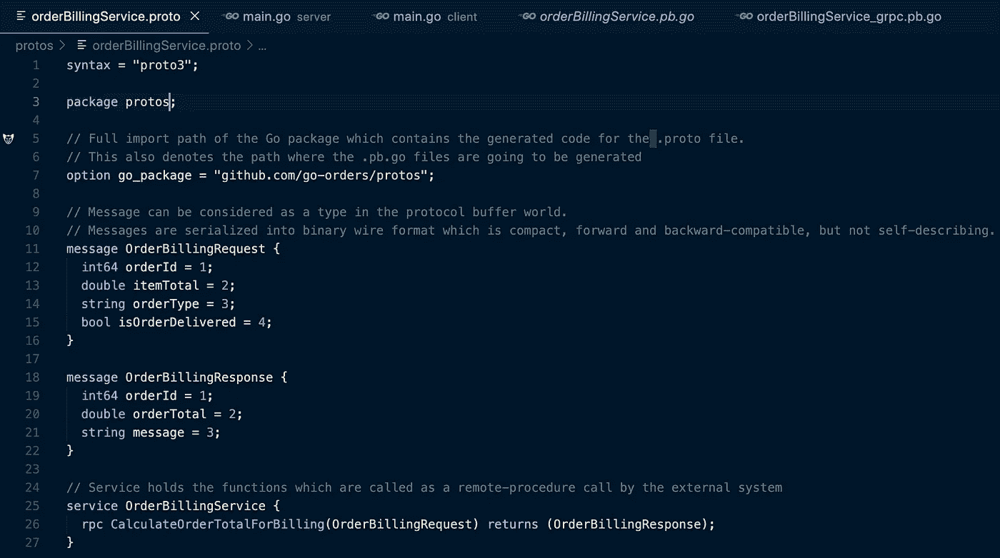**

****orderbillingservice . proto**的实现快照**

**请记住在你的原型文件中使用下面一行。否则，您可能会面临编译问题。 *go_package* 变量应包含 go 包的完整导入路径，它将保存为`.proto`文件生成的代码。**

> **option go _ package = "github.com/go-orders/protos"；**

**现在，我们已经完成了我们的原型文件(**orderbillingservice . proto**)的定义，我们可以使用下面的命令编译它以生成 **.pb.go** 文件:**

> ***协议外出=。-go _ opt = paths = source _ relative-go-grpc _ out =。-go-grpc _ opt = paths = source _ relative protos/orderbillingservice . proto***

**现在，我们可以看到，在成功编译 orderBillingService.proto 文件后，protos 包下自动生成了两个新的 *pb.go* 文件，分别命名为**orderBillingService _ grpc . Pb . go**和**orderBillingService . Pb . go**。**

**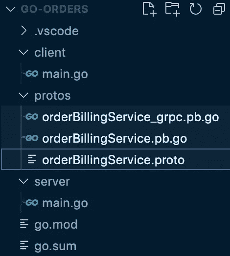**

**go-orders 的项目结构**

**现在，我们将实现*服务器*包中的代码来构建 gRPC 服务器。该 gRPC 服务器将运行在***localhost:4040****(因为我们已经在该端口上创建了一个监听器)*上，以使用客户端发送的请求。这也将包含在上面的原型文件中声明的 rpc 函数的业务逻辑。**

**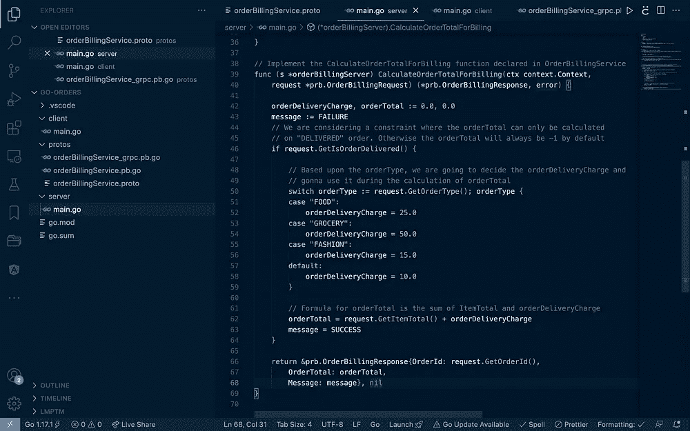****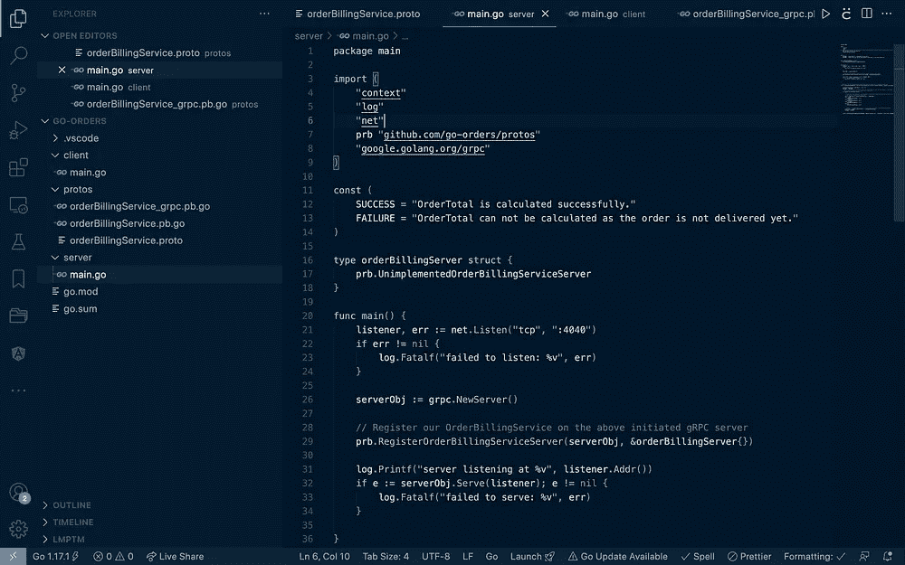**

**gRPC 服务器实现代码**

**下面是我开发这个项目时的终端截图。我在这里分享它，因为它可能会成为有用的参考。**

**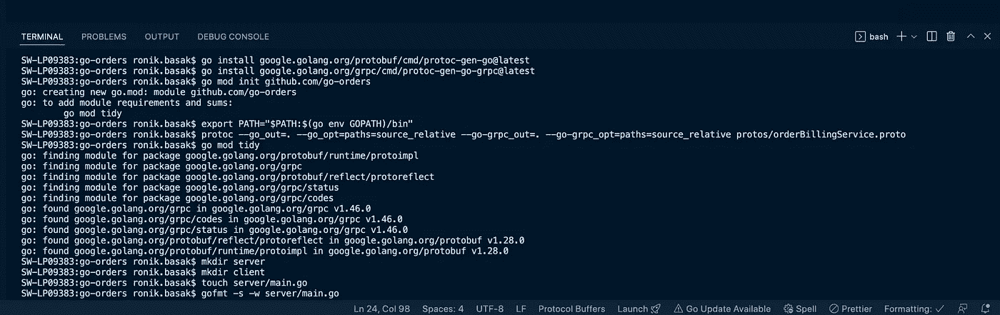**

**终端中正在运行的命令列表的快照**

**现在，我们使用命令"***go run server/main . go***"运行 gRPC 服务器。我们会注意到，我们的系统将请求允许接受 *localhost:4040* 上的传入网络。我们应该允许它，这样客户机现在就可以调用 gRPC 函数，根据我们的问题陈述获得必要的输出。**

**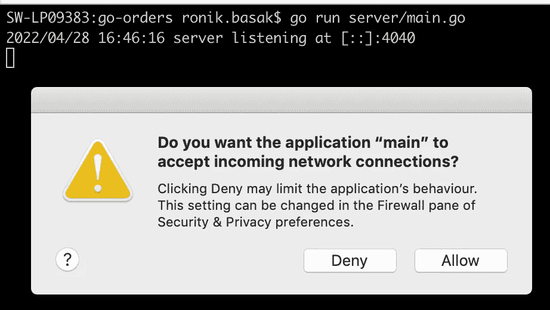**

**运行我们的 **gRPC 服务器**时的终端快照**

**现在，随着我们的 gRPC 服务器成功运行。我们将通过在 proto 文件中名为 **OrderBillingRequest** 的数据结构(消息)中传递所需的属性，来尝试调用名为**CalculateOrderTotalForBilling**的 RPC 函数。此外，我们还应该观察到，我们从 gRPC 服务器获得的响应符合我们的原型文件中定义的**orderbillingresson**的数据结构。**

**我将使用 [BloomRPC](https://github.com/bloomrpc/bloomrpc) ，一个用于 GRPC 服务的开源 GUI 客户端，通过传递 **OrderBillingRequest** 的两个不同值来触发对运行在 localhost:4040 上的 gRPC 服务器的调用。我们可以在下面看到相应的响应也被生成。**

**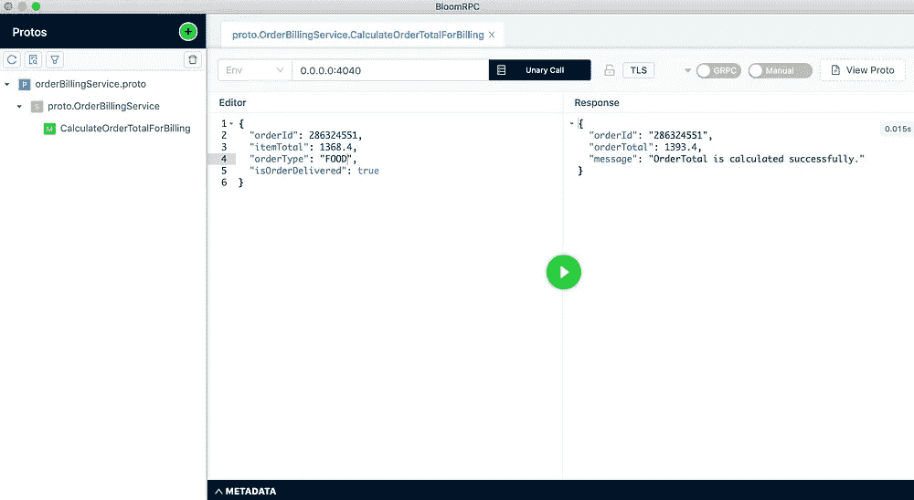****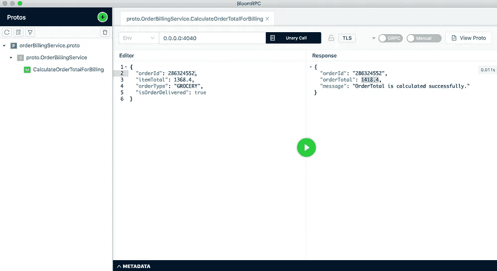**

**请求/响应的 BloomRPC 截图，其中为**食品** & **杂货**订单计算**订单总计****

**根据问题陈述，在 gRPC 函数**calculateordotoltotalforbilling**的实现中，我们保留了一个约束，如果订单还没有**交付**，我们将拒绝计算 OrderTotal，相反，我们将返回默认输出 0 作为 orderTotal 以及响应中的失败消息。**

**下面是我们将**iso order delivered**标记为“ **false** ”的用例示例，我们可以在输出中看到 **orderTotal** 为零，消息告诉我们失败背后的原因。**

**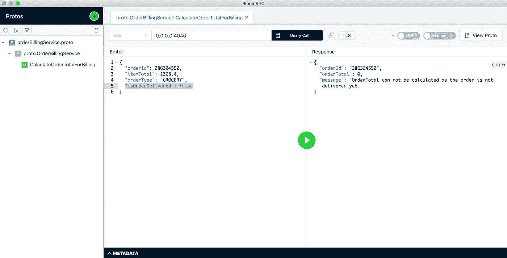**

**由于订单**未交付**，系统拒绝计算该订单的账单**

**现在，让我们看看如何以编程方式调用这个 gRPC 服务器。我们已经声明了一个名为“**客户端**的包，还定义了一个名为**runCalculateOrderTotalForBilling**的方法，该方法最终将调用 gRPC 服务器的**CalculateOrderTotalForBilling**函数来获取结果。**

**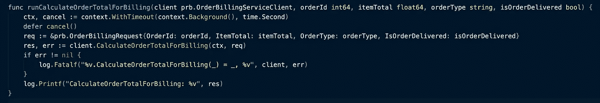**

**客户端中**runCalculateOrderTotalForBilling**函数的定义**

**对 gRPC 服务器的调用将通过调用编译 proto 文件期间生成的函数**NewOrderBillingServiceClient**来实现。该函数存在于**orderBillingService _ grpc . Pb . go**文件中，并接收 ClientConnInterface 的一个对象作为输入。**

**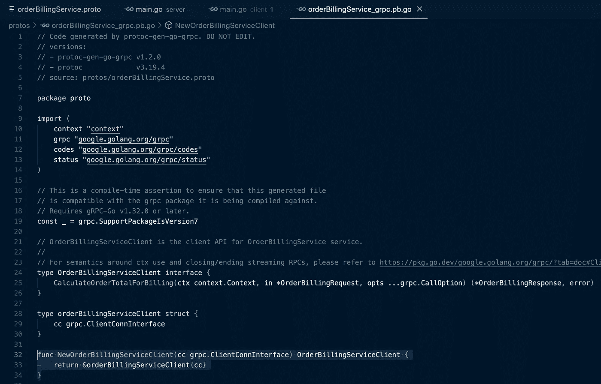**

**orderBillingService_grpc.pb.go 的快照，其中突出显示了**neworderbillingservice client**函数**

**我们还在客户机的 main()函数中实现了逻辑，以便为下面两组输入参数调用 gRPC 服务器。**

> **runCalculateOrderTotalForBilling(客户端，614352，500.0，“食物”，true)**
> 
> **runCalculateOrderTotalForBilling(客户端，987654，1000.0，“杂货店”，true)**

**现在，让我们使用命令"***go run client/main . go***"来运行客户端，我们可以看到，输出是按照上面两个函数调用的顺序生成和打印的。**

**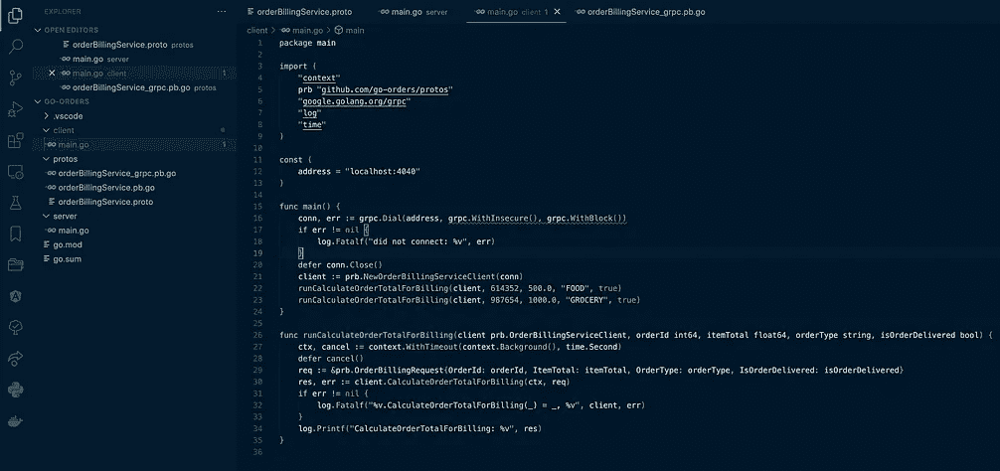****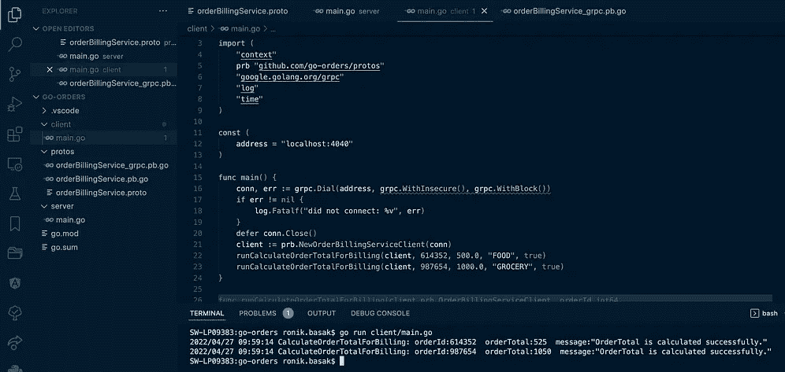**

**client/main.go 文件的定义和运行后的输出**

**好的多基。！希望我能够阐述我们如何构建第一个简单的 gRPC 服务器的过程，其中在客户端和服务器之间的数据序列化/反序列化期间使用协议缓冲区。**

**感谢阅读。希望你喜欢我的旅程。请随时分享您对本文的反馈。**

# **参考资料:**

** [## 概述|协议缓冲区| Google 开发者

### 协议缓冲区提供了一种语言中立、平台中立、可扩展的机制，用于在…

developers.google.com](https://developers.google.com/protocol-buffers/docs/overview)  [## gRPC -维基百科

### (gRPC 远程过程调用)也称为 Google 远程过程调用(或 good Remote Procedure Call)是一个开放的…

en.wikipedia.org](https://en.wikipedia.org/wiki/GRPC)**