# 为 web 开发人员提供的少量资源列表

> 原文：<https://blog.devgenius.io/a-handful-list-of-resources-for-web-developers-92f25d43aa04?source=collection_archive---------1----------------------->

## 这是一个在线工具的集合，你可以作为一个网页开发者戴上不同的帽子

背景图片由[大卫·范·迪克](https://unsplash.com/@dvandijk)在 Unsplash 上拍摄

作为一名开发人员，有时很难找到合适的工具来帮助您完成特定的任务。在下面找到一些我曾经使用过或遇到过的工具，它们可以帮助你提高开发过程或激发你工作中的创造力。

# 编码

## [碳 App](https://carbon.now.sh/)

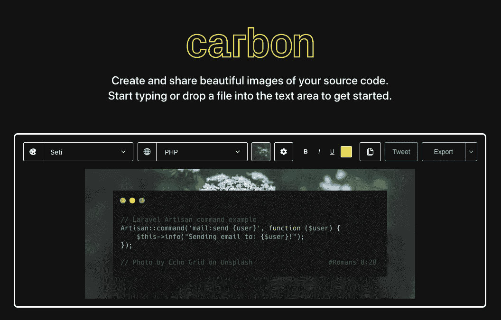

图片由作者提供。来源:[https://carbon.now.sh/](https://carbon.now.sh/)

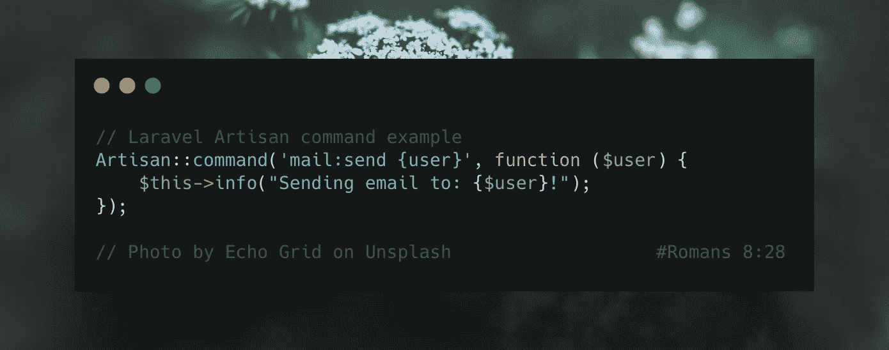

从 carbon.now.sh 导出图像

有了 [**Carbon**](https://carbon.now.sh/) ，分享您的代码片段从未如此简单！这个工具允许您创建和共享代码的美丽图像。您可以通过更改主题、字体、背景等来自定义片段的外观和感觉！完成后，您可以将文件导出为 PNG 或 SVG 文件。

✨备选: [Codekeep.io](https://codekeep.io/screenshot)

## [Crontab Guru](https://crontab.guru/)

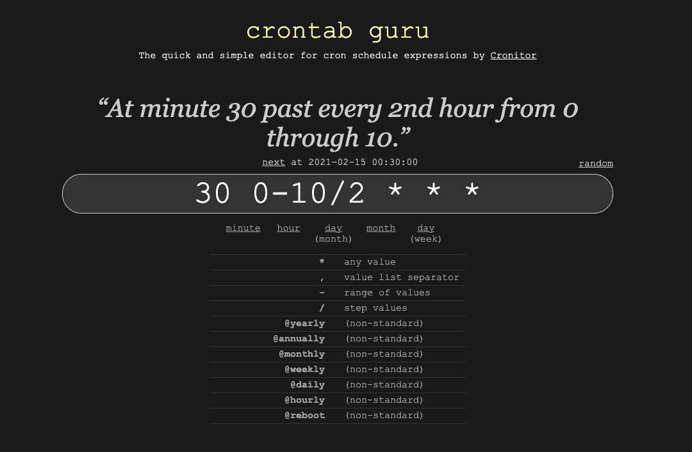

图片由作者提供。来源:https://crontab.guru/

简单地说，Cron 作业是设置为在特定时间运行的命令。它们最常用于调度需要定期运行而无需人工干预的任务。例如:每月第一天早上 6 点向客户发送批量发票，每天下午备份日志数据，发送提醒或检查更新。

Crontab Guru 是一个免费的编辑器，允许你编辑 Crontab 调度表达式，并查看它们下一次运行的时间。您可以轻松地测试简单或复杂的表达式来自动化您的任务。

例如，使用 [Laravel](https://laravel.com/docs/8.x/scheduling#schedule-frequency-options) ，您可以使用`cron()`方法指定 Cron 作业的频率，如下所示:

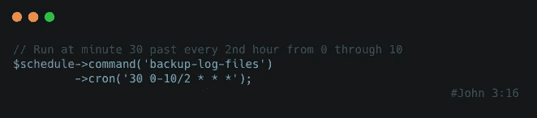

图片由作者提供。使用 Carbon.now.sh 生成

## [StackEdit](https://stackedit.io/)

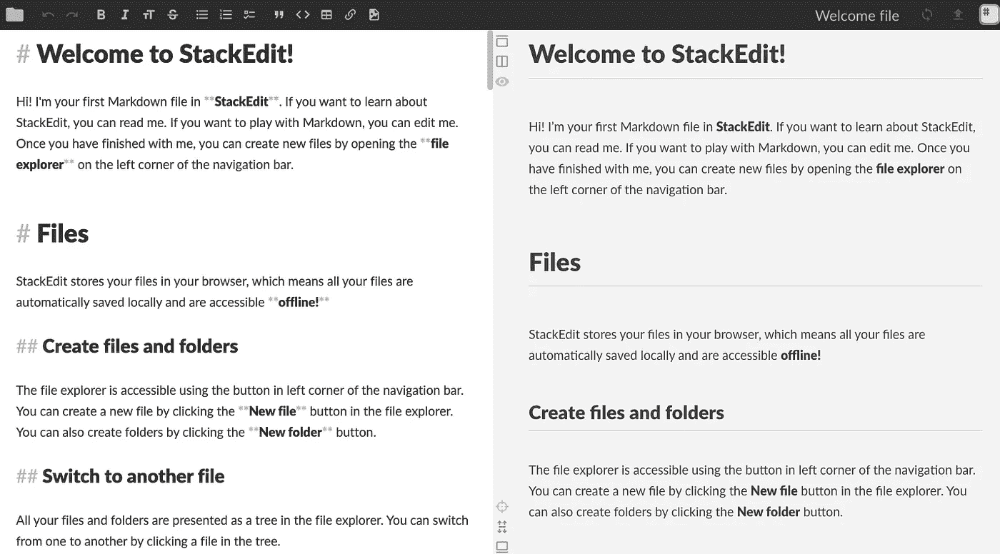

图片由作者提供。https://stackedit.io/app#

StackEdit 是一个开源的 markdown 编辑器。它易于使用的界面允许你格式化你的列表、标题、链接、图片和文本。它与其他 Markdown 扩展集成，以获得额外的漂亮特性，如呈现数学表达式或显示 UML 图。您可以使用 StackEdit 创建并预览项目的 README.md 文件，然后将其推送到 Github 之类的源代码控制平台。

## [Git 浏览器](https://gitexplorer.com/)

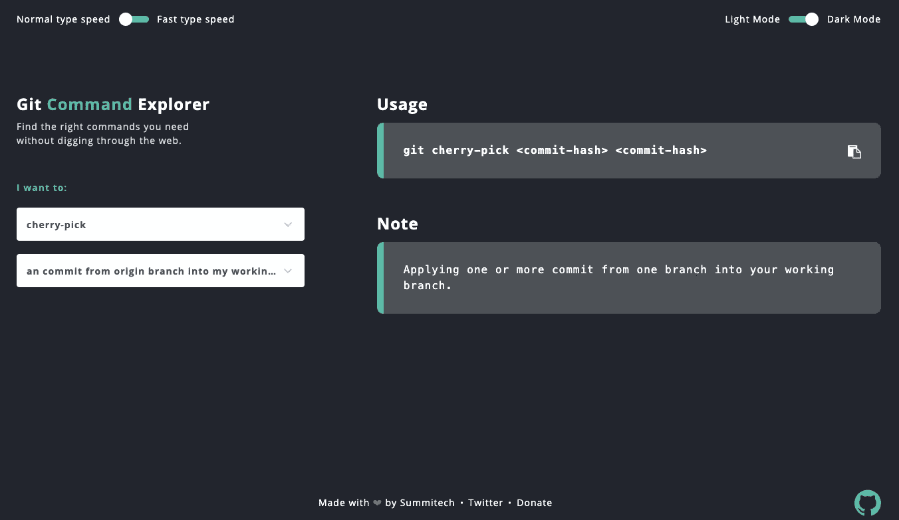

图片由作者提供。来源:https://gitexplorer.com/

如果你发现自己经常谷歌 Git 命令，那么这个工具就是为你准备的。使用 Git explorer，您可以在一个地方轻松地查找所有 Git 命令。它提供了一个通用 GIT 表达式的可视化备忘单，所有这些都在一个设计精美的界面中。

📄**注:** **如果想了解更多关于 Git 版本控制的知识，可以查看以下牛逼资源:** [**学习 GIT 分支**](https://learngitbranching.js.org/) **，** [**代码学院—学习 Git**](https://www.codecademy.com/learn/learn-git) **，** [**代码学院— Git 真实**](https://www.pluralsight.com/courses/code-school-git-real)

## [公共 API](https://public-apis.io/)

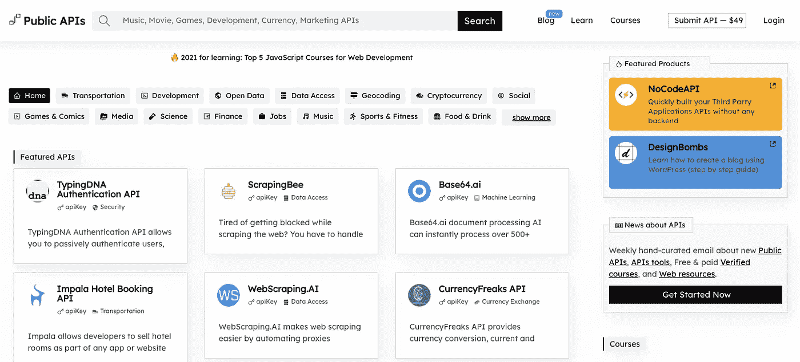

图片由作者提供。来源:[https://public-apis.io/](https://public-apis.io/)

在您的项目中使用的公共 API 集合，分为 40 多个类别，并定期更新。

✨类似:[免费开发](https://free-for.dev/)

# 样机研究

## [Draw.io](https://app.diagrams.net/)

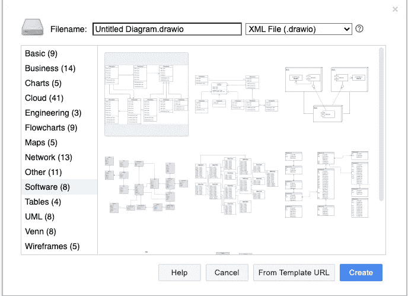

图片由作者提供。来源:[https://app.diagrams.net/](https://app.diagrams.net/)(原 draw.io)

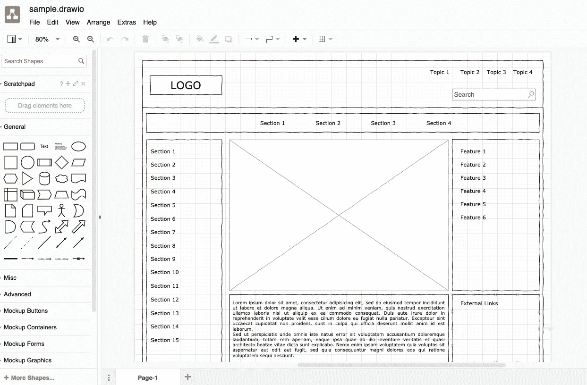

在[https://app.diagrams.net/](https://app.diagrams.net/)上提供的样本线框

这个免费的在线工具允许您创建各种图表，从基本流程图到 UML、实体关系图、地图、线框等等。您可以利用他们现有的模板或从头开始。

## [Excalidraw](https://excalidraw.com/)

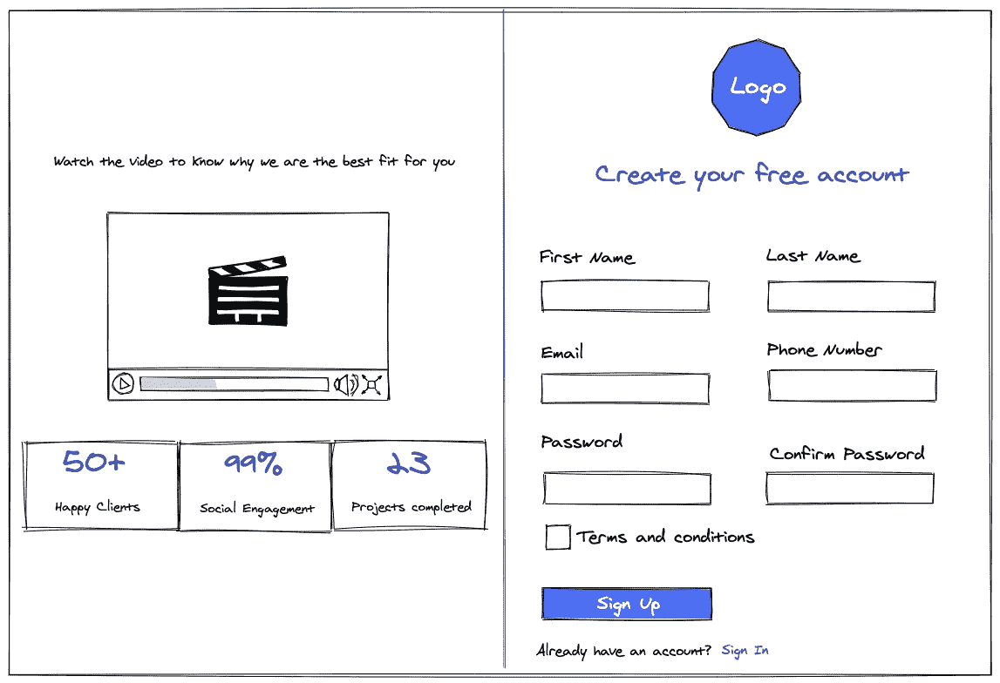

作者使用 Excalidraw 创建的线框

Excalidraw 为您提供了一个白板来绘制图表。它还具有一个不断增长的库，您可以使用它在您的设计中包含更多资源。这些库包括图表、表单组件、徽标、媒体元素等。您也可以创建自己的收藏并将其添加到库中。您还可以邀请他人参与您的设计。小缺点是在撰写本文时，它还不支持将您自己的图像文件导入到您的图表中。

# (第页)搜索引擎优化

简而言之，搜索引擎优化是一套技术，确保您的网站在搜索结果中排名更高。这可以让你的网站被正确地索引，并对相关关键词进行排名，从而帮助你的网站获得更多的流量。

> “即使你没有自己的网站，能够在网站的客户中实施最佳 SEO 实践也能让你更有竞争力。(最终对你的口袋更有利！) "
> 
> —来源:[学 SEO](https://learntocodewith.me/posts/learn-seo/)

作为一名开发人员，当涉及到 SEO 时，您的关注点将是创建具有良好语义标记的快速加载网站。这可以通过缩小你的 JS 和 CSS 文件，压缩你的图片并提供一个 Alt 文本，修复断开的链接，包括相关的元数据和模式信息，生成 sitemaps 和 robots.txt 文件，以及创建友好的 URL 来实现。

如果你想学习更多关于 SEO 的知识，这些是开始的好地方: [SEO 备忘单](https://moz.com/learn/seo/seo-cheat-sheet)，[开发者 SEO 指南](https://livecodestream.dev/post/essential-guide-to-seo-for-web-developers/)，[web 开发者 SEO 清单](https://www.searchenginejournal.com/complete-seo-checklist-web-developers/185410/)

你可能会被要求在谷歌分析网站上添加一个跟踪代码。下面是一些其他的工具，你可以用来找到任何与你的网站搜索引擎优化相关的问题。

## [Pingdom 速度测试](https://tools.pingdom.com/)

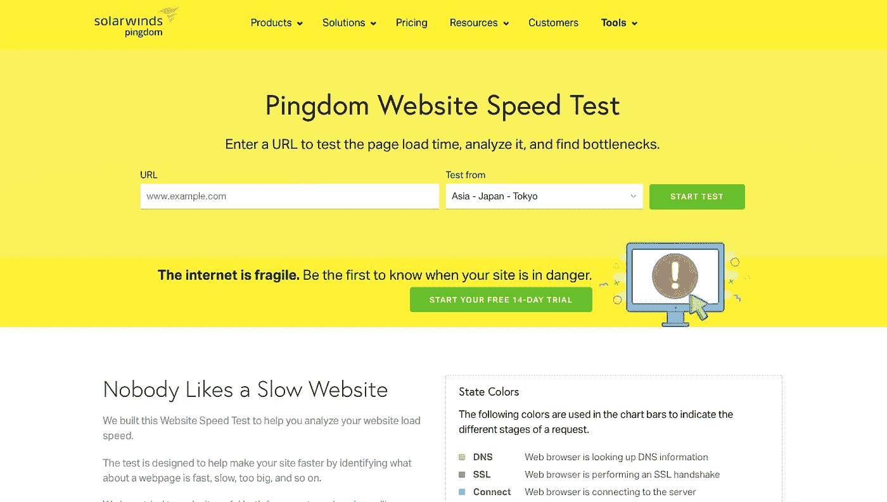

图片由作者提供。来源:[https://tools.pingdom.com/](https://tools.pingdom.com/)

对于 SEO 来说，页面速度至关重要。缓慢加载的页面会让你的用户感到沮丧，让他们远离你的网站。Pingdom，一个网站性能监控平台，提供了一个免费的工具来测试和分析你的网站速度。它还提供了关于如何提高页面性能的建议。

✨相似: [PageSpeed Insights](https://developers.google.com/speed/pagespeed/insights/)

## [优步建议](https://app.neilpatel.com/en/seo_analyzer/site_audit)

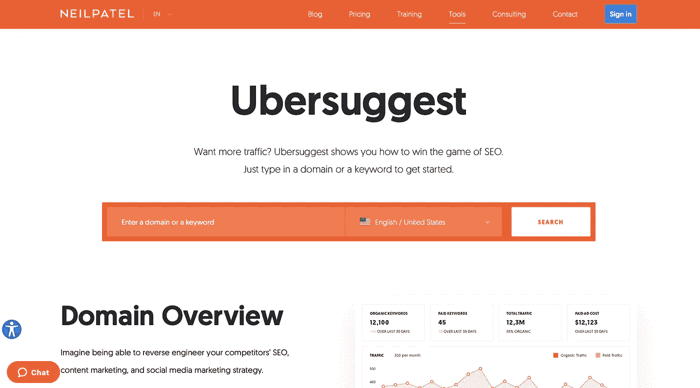

图片由作者提供。来源:https://neilpatel.com/ubersuggest/

Ubersuggest 包含[一个网站审计工具](https://app.neilpatel.com/en/seo_analyzer/site_audit)来识别和修复你网站上的 SEO 问题。它显示了你的网站加载的速度，突出了错误，并提供了你的整体搜索引擎优化得分。它还提供了关于如何提高排名的建议。

✨类似: [SEO Optimer](https://www.seoptimer.com/) ， [SEO Tester Online](https://www.seotesteronline.com/)

## [TinyPng](https://tinypng.com/)

图片由作者提供。来源:

图片的大小对你的网站加载速度有很大的影响。有几个在线工具可以让你缩小图片的尺寸。

**注意:请经常查看网站的使用条款**

✨相似:[压缩 JPEG](https://compressjpeg.com/) ，[视频化](https://www.iloveimg.com/compress-image)

# 图像和视频

**注意:始终检查许可证的使用条款和归属规则。**

## 岩谷

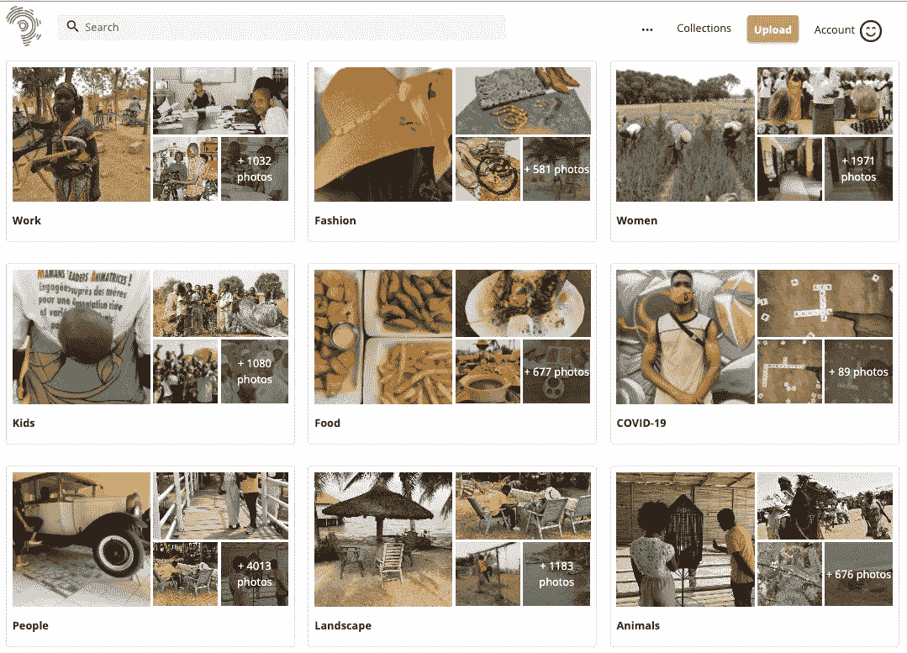

图片由作者提供。来源:图片由作者提供。来源:[https://iwaria.com/](https://iwaria.com/)

为您的项目提供免费的非洲高质量照片。

## [Unsplash](https://unsplash.com/)

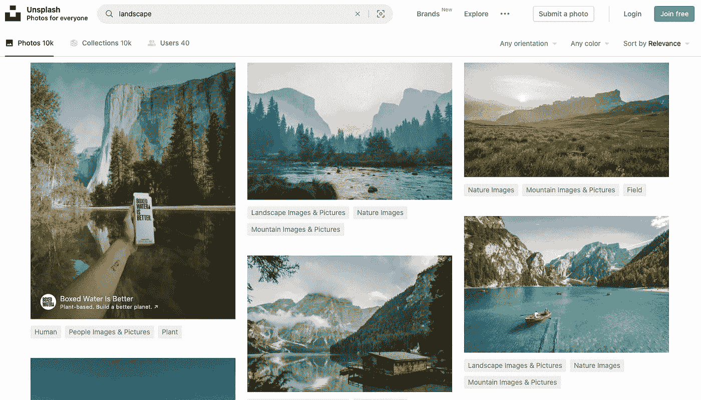

图片由作者提供。来源:[https://unsplash.com/](https://unsplash.com/)

免费高分辨率照片。

## [转换器](https://coverr.co/)

图片由作者提供。来源:[https://coverr.co/](https://coverr.co/)

美丽的免费视频素材。

## [移除 Bg](https://www.remove.bg/)

图片由作者提供。来源:[https://www.remove.bg/](https://www.remove.bg/)

移除图像的背景。

# 图标和插图

## [未绘制](https://undraw.co/illustrations)

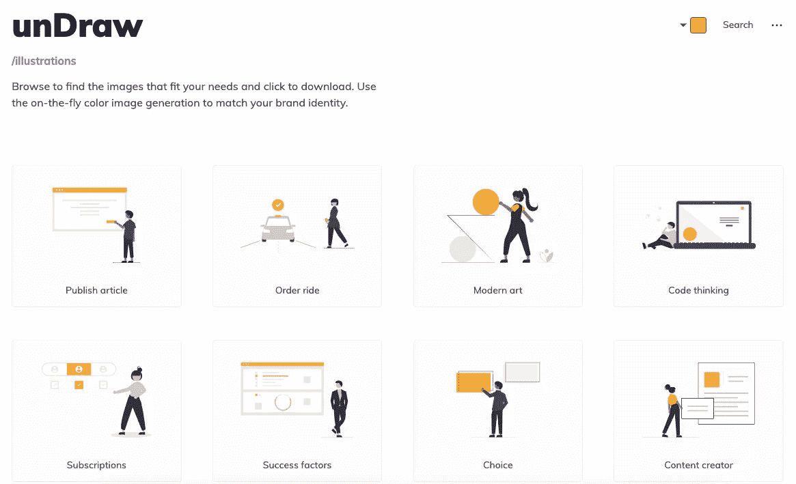

图片由作者提供。来源:https://undraw.co/illustrations

Undraw 是由 [Katerina Limpitsouni](https://ninalimpi.medium.com/) 创作的开源插图集。在网站上，您可以使用拾色器工具来匹配您的品牌标识，并使用搜索栏根据关键字轻松找到插图。插图可以 SVG 或 PNG 格式下载。你可以在他们的[推特账户](https://twitter.com/undraw_co)上关注他们的更新。

## [故事集](https://storyset.com/)

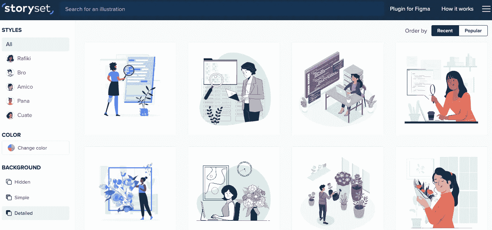

图片由作者提供。来源:[https://storyset.com/](https://storyset.com/)

以前([https://stories.freepik.com/](https://stories.freepik.com/search))，这是另一个伟大的网站，允许你定制，动画和下载美丽的插图，使难以置信的登陆页面，应用程序或演示文稿！您可以轻松地从插图中删除不需要的图层。

## [英雄图标](https://heroicons.com/)

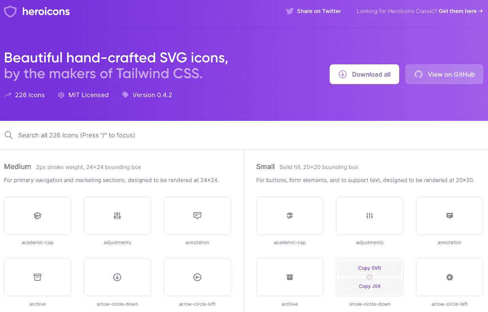

图片由作者提供。资料来源:https://heroicons.com/

漂亮的手工制作的 SVG 图标。

✨备选:[扁平图标](https://www.flaticon.com/)，[羽毛](https://feathericons.com/)

# 颜色；色彩；色调

## [酷派](https://coolors.co/)

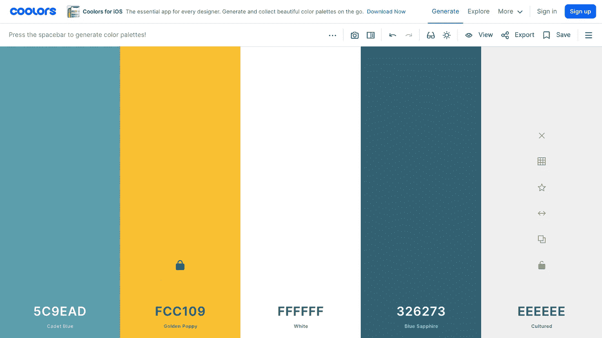

图片由作者提供。来源:[https://coolors.co/](https://coolors.co/)

为您的网页、手机或图形设计生成漂亮的颜色组合。通过切换锁定来设置原色。按空格键生成补色调色板。**查看** [**这篇博文**](https://stephaniewalter.design/blog/color-accessibility-tools-resources-to-design-inclusive-products/) **了解更多关于色彩辅助功能和可用于帮助您构建包容性产品的工具。**

✨相似:[色猎奇](https://colorhunt.co/)，[色六](https://www.colorhexa.com/)

# 最后的想法

感谢阅读！如果你喜欢这篇文章，请不要忘记给它一个👏，分享一下，或者留下评论。此外，我很乐意阅读在您的开发过程中对您有所帮助的其他工具。

保持祝福！🌼