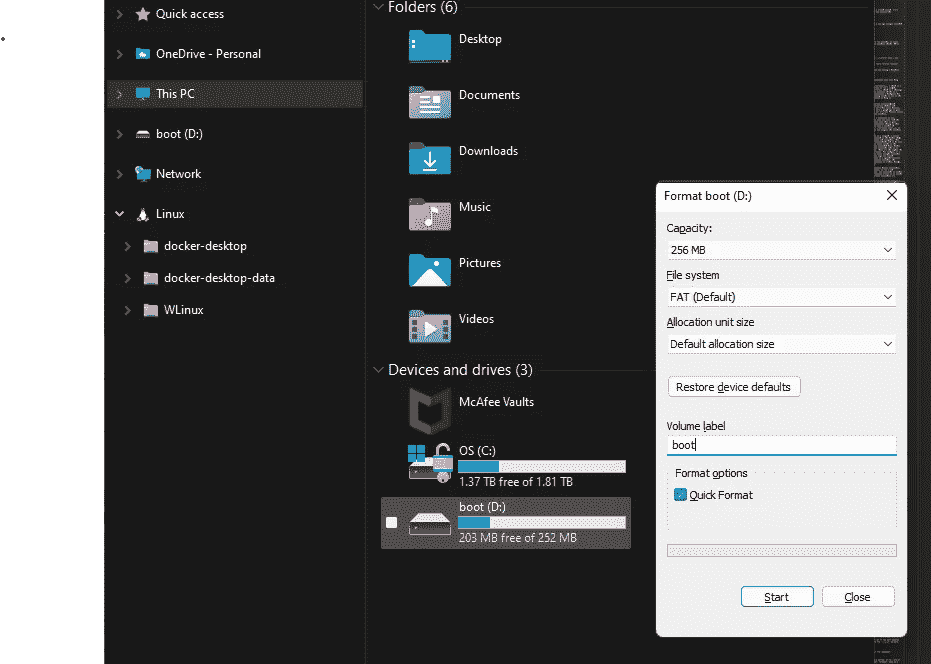
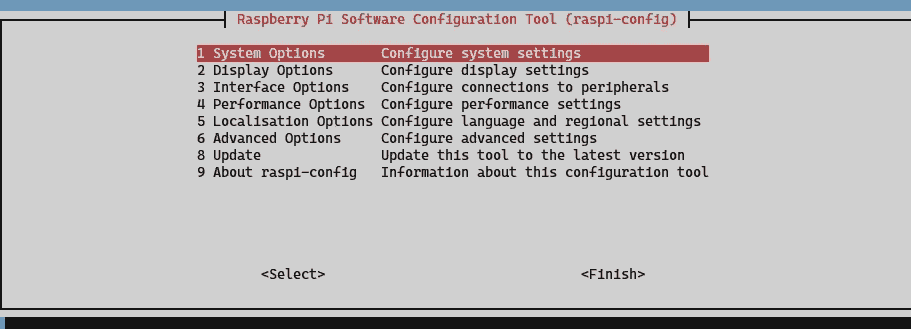

# 无头 Raspberry Pi 工作流

> 原文：<https://blog.devgenius.io/a-headless-raspberry-pi-workflow-90cd90596854?source=collection_archive---------10----------------------->


照片由 [**昆汀·舒尔茨**T3](https://unsplash.com/@0leil)[上**Unsplash**](https://unsplash.com/photos/51nYPDEafWc)

跟进一个很酷的爱好 IOT 实验总是很棒的，我已经收集了一些 Ardunios、小饰品和树莓 Pis，它们总是在等待一个免费的周末。Raspberry Pi 可以是一台非常多功能的小型计算机，它可以为外部控制器和传感器提供引脚，但它也可以是一台简单的 35 美元的家庭服务器，甚至是一台全功能的 Linux 桌面计算机。

我和我的孩子已经建立了我们自己的《我的世界》服务器，我已经做了一个小天气时钟，并试验了服务器部署配置和家庭媒体流。我希望有一天能尝试一些更复杂的项目，包括[树莓派 Kubernetes cluster](https://ubuntu.com/tutorials/how-to-kubernetes-cluster-on-raspberry-pi#1-overview) 或[感恩而死时间机器](https://www.gratefuldeadtimemachine.com/build-your-own)。由于整个操作系统都在一个微型 SD 卡上，所以很容易保存一些并刷新不同的操作系统，将它们交换出来用于不同的项目。事实上，由于我的工作需要学习所有复杂的 AWS 和 Azure，使用 Raspberry Pi 来测试配置一个基本服务器是一种很好的方式，当您通过一个简单的命令将您的工件发送到一些模糊的数据中心时，可以后退一步，了解实际发生了什么。

我发现自己一直在寻找和重复的一组步骤是创建一个无头的 Raspberry Pi——只需在 SD 卡上配置一个操作系统并打开它，没有键盘，没有显示器，只有机器。

你当然可以用它的定制操作系统，一个名为 Raspbian 的 Linux Debian 端口来加载一个 Raspberry Pi，把它像台式电脑一样挂起来，然后做上面所有的事情。但对我来说，最方便的方式是在我的本地 WiFi 网络上设置它，并从我做其他事情的工作站连接到它，使用我的个人开发环境和代码编辑器也可以将程序加载到 Raspberry Pi 上。这就是无头、无图形用户界面的树莓派的理想之选。

在本文中，我结合了我经常参考的教程中的步骤，这样每当我从头开始组装一个新的无头 Raspberry Pi 时，我都有一些快速、简单的步骤可以遵循。

# 先决条件

对于本文，您唯一需要的是一个覆盆子 Pi，型号并不重要。事实上，这些步骤中的大部分与供应一个简单的 Linux 服务器更相关，因此它们也适用于其他一些硬件。你还需要在台式电脑上安装某种 SD 卡读卡器。

# 创建您的 Raspberry Pi 图像

第一种快速设置树莓 Pi 操作系统的方法是使用[树莓 Pi 成像仪](https://www.raspberrypi.com/software/)。

*   [下载副本](https://www.raspberrypi.com/software/)
*   与此同时，将 SD 卡插入你所有的 SD 卡读卡器。
*   您可能需要重新格式化 SD 卡，以便全新安装操作系统映像。在 Windows 电脑上，我通过在文件浏览器中的“这台电脑”下找到 SD 卡驱动器，并右键单击它以查看其格式化选项。选择“FAT”作为文件系统类型，其他都是默认选择。请注意，卡上已有的数据将被擦除。



*   树莓 Pi 成像仪下载完成后，打开它。您可能需要在您的计算机上授予它管理权限。
*   你将有两个选择。选择 OS 和 **2。选择存储**。
*   点击“选择操作系统”，选择`Raspberry Pi OS (Other)`，然后选择`Raspberry Pi OS Lite (32-bit)`。这个版本的操作系统不包括桌面环境，所以只能从终端控制。
*   单击“选择存储”，其中一个选项应该是您之前格式化的 SD 卡的驱动器。
*   最后，单击“写入”按钮，成像仪将开始工作，将可启动的操作系统加载到 SD 卡上。在我的机器上，这个过程大约需要 5 分钟。

# SSH 和网络配置

映像完成后，您可以弹出 SD 卡，用监视器启动 Raspberry Pi，然后看到 Linux 命令行界面。但由于这将是一个无头、无外设的设置，我们需要给操作系统一些额外的信息，使其能够连接到本地 WiFi 网络，并使我们能够从工作站连接到它。

如果 SD 卡驱动器在映像写入后弹出，请将其插回并在文件资源管理器或 Finder 中打开:

*   在 SD 卡的顶层目录中添加一个名为`ssh`的空文件。该文件不应该有扩展名，也不应该包含任何内容。这告诉操作系统在启动时接受 SSH 连接。
*   用文本编辑器创建一个名为`wpa_supplicant.conf`的文件。您可以在这里添加信息，以便它可以在启动时连接到您的本地 WiFi 网络。粘贴以下文本，替换您自己的 Wifi 名称和密码:

```
country=US
ctrl_interface=DIR=/var/run/wpa_supplicat GROUP=netdev
update_config=1

network={
	ssid="<YOUR WIFI NAME>"
	scan_ssid=1
	psk="<YOUR WIFI PASSWORD>"
	key_mgmt=WPA-PSK
}
```

*   同时将该文件保存在 SD 卡的根目录下。

# 首次登录

你的树莓派操作系统应该可以用了。将卡插入树莓派并打开它。它应该只需要一两分钟启动。一旦完成，在您的工作站计算机上打开一个终端，并使用默认登录建立一个 SSH 连接:

```
$ ssh pi@raspberrypi.local
```

密码将是`raspberry`。如果成功，您将看到 Raspberry Pi 的命令行界面，并准备运行命令。

终端中的命令集如下所示:


我做的第一件事是更改主机名。这样，如果我在同一个本地 Wifi 上运行多个 Raspberry Pis，就不会出现混淆。

*   在 Raspberry Pi 终端中，键入`$sudo raspi-config`。这将显示配置选项。



*   选择`1 System Options`
*   选择`S4 Hostname`，系统会提示您更改主机名。现在，当你 SSH 进入机器，它将是`ssh pi@<NEW HOSTNAME>.local`
*   退出配置屏幕，如果你愿意，你可以重新启动。

接下来最起码要修改`pi`用户的密码。我喜欢用一个全新的管理员用户替换`pi`用户。这些只是普通的 Linux 命令。

*   为了安全起见，请更改`pi`的密码。键入`$ passwd`并按照提示进行操作。
*   创建一个新用户:`$ sudo add user <USERNAME>`。它会提示您输入密码，并询问一些用户配置文件信息。
*   然后将新用户添加到`sudo`组，以便他们可以运行管理命令:

```
$ sudo usermod -aG sudo <USERNAME>
```

*   您可以切换到您的新用户:`$ su - <USERNAME>`
*   或者，您可以退出并与新用户重新连接:

`$ sudo reboot
$ ssh <USERNAME>@<NEW HOSTNAME>.local`

*   重新连接后，您可以选择删除默认的`pi`用户。

```
sudo deluser -remove-home pi
```

*   为了安全地关闭树莓派:

```
$ sudo shutdown now
```

现在你的 Raspberry Pi 已经设置好了，可以在上面运行，而且至少是最低限度的安全。

# 直接在 Pi 上编辑代码

现在，您已经准备好了 Raspberry Pi，您可以让它做一些事情了。您需要添加一些代码来运行。默认情况下，它应该有一个工作的 Python 环境。但是你怎么把代码传给 Pi 呢？您可以启动一个基本的 vim 或 nano 编辑器，但是与您本地工作站上的配件齐全的代码编辑器相比，这可能会有点痛苦。

解决这个问题的一个方法是将您的 Raspberry Pi 代码设置为远程 Git 存储库，在本地存储库中编写文件，然后将它们推过来。我过去经常这样做，这并不太复杂，而且你有一个本地 repo 来存储你所有的代码和项目的优势，当你改变和重新配置多个 Raspberry Pi 设置时，它们会一直存在。[这篇文章](https://www.jeremywells.io/2022/01/10/headless-rpi.html)给出了一些关于如何着手建立你自己的远程 Git 仓库的很好的指导。

如果您是 VS 代码用户，一个更简单的解决方案是，使用一个新的插件，您可以通过 SSH 访问 Pi 上的目录，并在代码编辑器中直接在 Pi 上编辑文件。

在 VS 代码中，安装插件 [Remote — SSH](https://marketplace.visualstudio.com/items?itemName=ms-vscode-remote.remote-ssh) 。然后输入`CTRL/CMD + SHIFT + P`和`Remote - SSH Connect to Host`。它将要求一个 SSH url(完全如上所述)，提示您输入密码，然后一个新的 VS 代码编辑器将打开，可以访问 Raspberry Pi 文件系统。

有了这些，你就有了一个无负担的 Raspberri Pi 来做你所有的家庭修补工作。