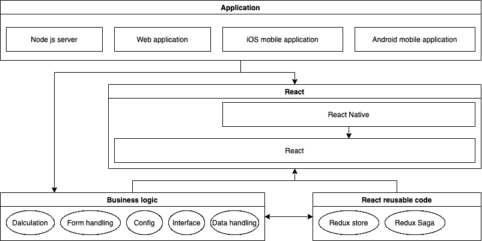

# 您可能错过的 React 本机应用程序的潜在价值

> 原文：<https://blog.devgenius.io/a-hidden-value-of-react-native-application-that-you-may-missed-be6c934909ff?source=collection_archive---------21----------------------->

在 [Unsplash](https://unsplash.com?utm_source=medium&utm_medium=referral) 上由 [Balázs Kétyi](https://unsplash.com/@balazsketyi?utm_source=medium&utm_medium=referral) 拍摄的照片

我想很多人都知道 React Native 的价值:加速开发、跨平台、背靠庞大的 javascript 社区等等。

但是有一个你可能忽略的价值是，React Native 如何帮助你集中业务逻辑。

# 跨平台应用程序之间的问题

请想象一下，您的应用程序正在为数百万人或国际公司提供服务。在这种情况下，无 bug 和良好的稳定性对您的应用程序来说具有很高的优先级。您必须确保您的服务在移动应用程序和 web 应用程序之间没有不同的结果。

这不是一件容易的工作，尤其是当您的应用程序是一个像 CRM 这样的系统，有成千上万行业务逻辑代码时。我知道一家金融跨国公司花了两年时间来解决这个问题，但结果是，他们失败了。

这太可怕了，这意味着您的团队无法自信地开发:

1.  你能确保所有的计算都和你的其他应用程序一样吗？
2.  你能确保在新的应用程序上复制你的业务逻辑复制了所有的副作用吗？

这总是导致，你的新一代应用程序必须使用 iframe 来确保你的所有业务逻辑不会受到影响。然后你不得不面对如何解决你的新应用程序和遗留系统之间的连接(你知道这总是集成遗留系统的痛苦)。

**花费数百万和数年的时间在一个插入了大量遗产的应用程序上值得吗？它真的解决了您的遗留应用程序的痛点吗？真的是你想要的吗？**

# 解决方案是这样的:React Native，React，Node JS 服务器和业务逻辑包。

解决方案图

如图所示，该系统包含许多不同的平台应用程序。但是这些应用程序没有开发自己的业务逻辑代码，也没有对可重用部分的生态系统使用做出反应，解决方案将这些部分拆分为独立的节点模块包，并将这些包安装到应用程序中。

在这种解决方案中，开发人员不再为开发业务逻辑重复而担心业务逻辑与其他应用程序不一样。**因为他们用的是同一个源代码！这些应用程序共享相同的 redux 存储、api 处理等等。**

此外，如果您的前端应用程序需要重用服务器端业务逻辑，您可以做同样的事情。如果您使用的是 Typescript，您可以做得更好:共享数据接口！你可以把这个包保存在一个私有的包注册中心，比如 Verdaccio，Gitlab 包注册中心。

即使岁月流逝。您想开发一个新的应用程序，业务逻辑包仍然可以重用:它们只是普通的 javascript 函数！您可以选择新的 UI 框架来开发您的新应用程序，替换您想要改进的部分，同时，您可以确保您的业务逻辑仍然正常工作！你可以想得更远，计划得更大，而不用担心任何问题！

必须意识到，版本控制和业务逻辑功能设计在开发中是非常重要的:

1.  每次你推送新版本的业务逻辑包时，大多数情况下，你可能需要部署所有的应用程序。
2.  如果您的业务逻辑功能参数设计遗漏了一些重要变量，您可能需要修复所有应用程序的用法。
3.  在您的业务逻辑函数开发中，您应该了解函数的用法、用户和潜在的副作用。

# 结论

总的来说，React Native 确实有价值，不仅在技术领域，在商业领域也是如此。对于构建可维护性良好的应用程序来说，这是一个很有价值的解决方案。