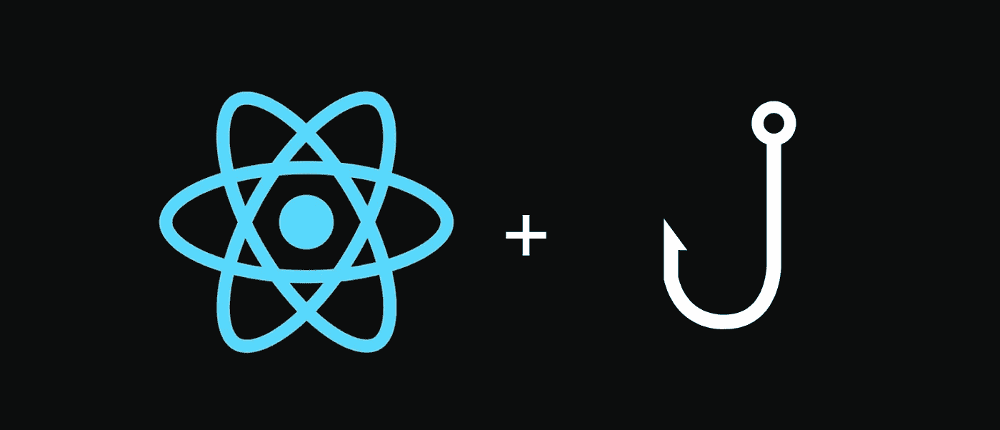

# React 中用于数据获取的钩子

> 原文：<https://blog.devgenius.io/a-hook-for-data-fetching-in-react-7a3f6bedd20?source=collection_archive---------42----------------------->

# 介绍

在这篇文章中，我将介绍为 React 中的数据获取创建一个[自定义钩子](https://reactjs.org/docs/hooks-custom.html)的过程。

我希望你熟悉 React 和 hook API，特别是 [useState](https://reactjs.org/docs/hooks-state.html) 、 [useEffect](https://reactjs.org/docs/hooks-effect.html) 和 [useReducer](https://reactjs.org/docs/hooks-reference.html#usereducer) 。

如果没有，你必须先检查[文件](https://reactjs.org/docs/hooks-intro.html)。

此外，我们将构建的挂钩是一种锻炼和获取灵感的手段，而不是针对您在现实项目中可能遇到的特定问题的改编版本。

# 构建自定义挂钩

我们将构建的钩子解决了我们在 web 应用程序中经常要做的一项任务:获取数据。

在这个例子中，我们将从 PokéAPI 获取数据，并在屏幕上呈现一些关于特定口袋妖怪的信息。

在本教程结束时，我们将会看到如下内容:

让我们快速设置我们的应用程序和它将呈现的 JSX。

别太在意，那不是有趣的部分。我把它放在这里只是为了给出上下文:

来自用户的数据的入口点是输入。

它将收到一个口袋妖怪名称，这将是我们要请求的 PokeAPI url 的端点。

正如您可能已经看到的，输入的形式有一个我称为`handleSubmit`的`onSubmit`处理程序。

为了在`handleSubmit`中获得输入值，我使用了一个名为`ref`的 React 特性。

它允许我保存一个输入的引用，而不需要用经典的`document.querySelector(selector)`访问 DOM

因为这是一个副作用，我需要把它放到一个`useEffect`钩子中。

(点击了解更多`refs`。)

让我们添加代码:

在这里，我用`useState`将`endPoint`定义为一个状态变量。

然后，当用户提交表单时，也就是当他单击按钮“Search”时，我们用输入值更新它。

好的。既然已经建立了与用户的交互，我们就必须从 API 中获取我们想要的数据。

因为这个任务是异步的，因此可能需要时间，我们必须在一个`useEffect`钩子中完成它，以便让浏览器在数据还不存在的情况下进行绘制。

让我们使用[获取 API](https://developer.mozilla.org/en-US/docs/Web/API/Fetch_API) 来完成:

我引入了一个名为`data`的新状态变量来存储我们从 API 收到的内容，并在应用程序呈现的 JSX 中使用它。

但是我们忽略了一些东西。

当数据不存在时，我们向用户显示什么？

如果请求失败会发生什么？

将会抛出一个错误，用户对此没有任何反馈。

因此，我们需要捕捉错误，并将其放入状态变量中，以便调整我们给用户的响应。

此外，我们将使用一个状态变量来跟踪加载状态:

到目前为止，我们做得很好！

但是仍然有一个 bug 可能发生。你看到了吗？

这个不好找。

假设组件在数据到达之前被卸载或重新呈现。

在浏览器控制台中，您会看到类似这样的内容:

但是我们怎么做呢？

嗯，`useEffect`回调可以返回一个在组件卸载后调用的函数。在重新渲染的情况下，该函数在下一次渲染之后，但在新的`useEffect`版本运行之前被调用。

因此，我们可以使用一个标志(`didCancel`)，我们将通过调用返回的函数来反转它，当调用`useEffect`时，它将通知我们组件是否已被卸载或重新呈现:

最后，我们可以通过将`err`和`isLoading`状态合并到一个对象中来做最后一点改进，我们将用一个缩减器来更新这个对象。

但是为什么会是一种进步呢？

在你发现自己同时写了多个`setSomething`的情况下，这可能是这些状态相关的迹象。因此，对它们进行分组是有意义的，这样可以降低复杂性。

所以让我们用`useReducer`来实现它:

在上面的代码片段中，我添加了一个名为`fetchReducer`的缩减器和一个`initialState`。

我把它们放在 App 组件之外，因为它们不依赖于任何道具或状态，所以每次组件重新呈现时都没有必要重新计算它们。

现在，我们不再调用`setErr`和`setIsLoading`，而是分派一个具有特定类型属性的 action 对象和一个可选的有效负载，该有效负载包含可能与更新状态相关的信息。

花时间阅读代码，以便理解发生了什么。

酷，我们完成了！

> *什么？但是定制的钩子在哪里呢？我没有看到任何* `*useFetch*` *的东西...*

呵呵😏，我开玩笑的…

最后一步相当简单。我们有了所有的状态逻辑，所以现在，我们只需要把它放入它自己的函数中，这将是我们的自定义钩子。

以下是完整的代码:

现在我们完成了！😄

点击查看最终版本运行[。](https://codesandbox.io/s/usefetch-11sps)

对于那些喜欢打字的人，我已经做了一个[打字版本](https://codesandbox.io/s/usefetch-with-typescript-14llq)。但是我鼓励你自己去练习。

# 结论

正如我在介绍中所说的，您可能需要调整该钩子的 API，以适应您的特定用例和您的偏好。

无论如何，我希望它能让你了解你认为可以用定制钩子做的事情。

作为一个自定义钩子的中级用户，我总是被它们所赋予的巨大力量所淹没。

当然，它们提供了一个吸引人的抽象领域，但最终，我认为人们必须努力找到针对特定问题的最佳和最简单的解决方案，而不是强制使用定制挂钩。

我的意思是，如果有状态逻辑块没有那么大或复杂，并且只在一两个组件中使用，就不要费心为它创建一个定制的钩子。

就我个人而言，我对它们感到非常兴奋，以至于我会直接尝试去想一个定制的钩子来解决我的问题。

但是我改变了我的方法，一步一步地做事情，首先使用内置的钩子，然后如果需要的话提取一个有状态逻辑块，就像我们在这篇文章中做的那样。

就是这样！我渴望阅读您的评论，并看到您可能已经建立了自己的调整版本！

# 灵感和更多资源

这篇文章的灵感来自 Robin Wieruch 的这篇文章。

如果你想更深入地了解 React，我强烈推荐他的博客和 React 团队的核心开发者 Dan Abramov 的博客。

无论如何，我相信事实的唯一来源是文档(除非它很烂…)，它一定会问你是否应该使用相关的工具。不过不用担心，React doc 真的很棒。生态系统真的很成熟，你会毫无问题的找到你需要的东西。).所以检查[它](https://reactjs.org/)出来。