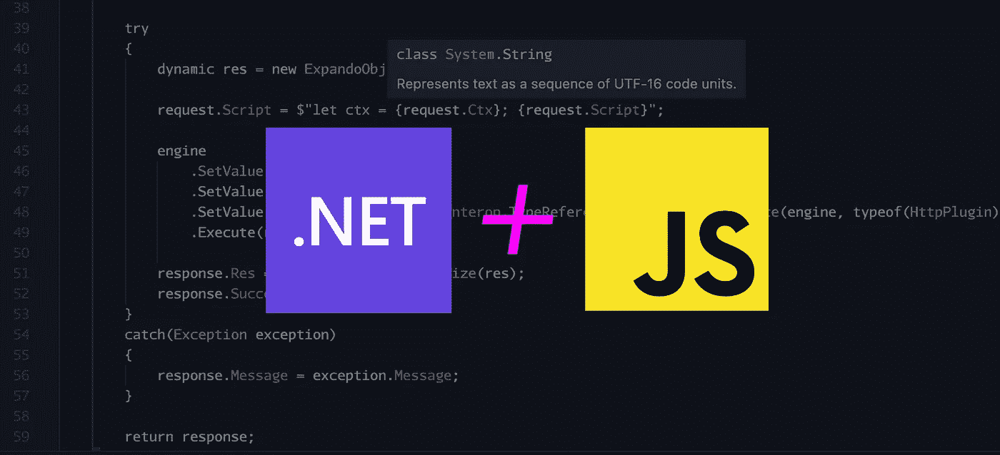
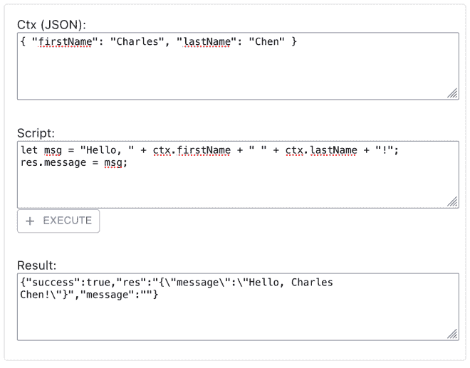
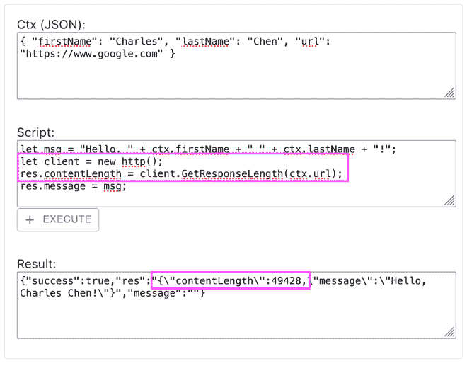
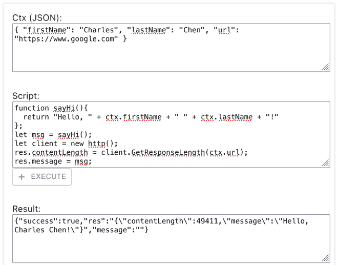

# 中的 JavaScript 规则引擎。NET 6 使用 Jint

> 原文：<https://blog.devgenius.io/a-javascript-rules-engine-in-net-6-fb092cdc44c?source=collection_archive---------3----------------------->



过去，当我需要一个用户定义的规则引擎时。NET，[我已经探索了使用讽刺语言实现工具包](https://charliedigital.com/2010/10/01/irony-net-language-implementation-kit/)编写定制的领域特定语言。但大多数时候，我用的是 SpringFramework.NET 的，它包括一个令人敬畏的[表情评估引擎](https://www.springframework.net/doc-latest/reference/html/expressions.html)。表达式求值引擎允许编写基于字符串的规则，甚至允许在中构建基本的、用户可配置的规则引擎的内联函数。网没有太多的大惊小怪。

这在构建集成时特别有用，因为它提供了一种控制级别，用于将输入转换为集成端点的输出，这可以将您的系统与上游和下游的更改(例如，合同的格式更改)隔离开来。

另一个关键用例是任何类型的规则驱动的工作流。能够利用表达式求值允许为不同的场景定制工作流的规则，而不必编写定制代码或复杂的配置。

[虽然 SpringFramework.NET 库仍然显示提交](https://github.com/spring-projects/spring-net/commits/main)，但是这个库似乎已经失败了，维护者已经将统治权交给了社区。

如果在 2022 年需要一个用户可配置的、可脚本化的规则引擎，该怎么办？NET 6？

输入 [**Jint**](https://github.com/sebastienros/jint) 。

> *Jint 是一个* ***的 Javascript 解释器*** *为。净哪能跑上* ***任何现代。NET 平台*** *为其提供支持。NET 标准 2.0 和。NET 4.6.1 目标(及以上)。因为 Jint 既不产生任何。NET 字节码也不使用 DLR，它运行相对小的脚本真的很快。*

检查支持的 JavaScript 特性列表，除了一些更高级的特性之外，它实际上非常丰富。

让我们看看如何使用它作为一个规则引擎来构建一个允许执行用户定义的规则和脚本的系统。

# 入门指南

如果你想跳过，完整的回购协议在 GitHub:

[](https://github.com/CharlieDigital/dotnet6-jint-rules-engine) [## GitHub-Charlie digital/dot net 6-jint-rules-engine:一个运行在。网络 6…

### 运行的 JavaScript 规则引擎。NET 6 使用 Jint 库。- GitHub …

github.com](https://github.com/CharlieDigital/dotnet6-jint-rules-engine) 

首先，我们将构建一个允许用户传入的简单前端:

1.  输入参数的上下文或集合，
2.  可以使用上下文并操纵结果输出响应的脚本


一个非常基本的 React UI，用于与我们的规则引擎进行交互。

当用户点击**执行**时，我们运行用户指定的**脚本**，传入上下文，然后在**结果**中显示结果。

对于上下文，我们希望传入一个 JSON 对象，它表示我们对规则的输入。这可以表示一些当前的前端状态、实体的一些 JSON 表示或者其他数据上下文。

例如:

```
{ "firstName": "Charles", "lastName": "Chen" }
```

我们可以编写一个简单的脚本来处理这些数据:

```
let **msg** = "Hello, " + **ctx**.firstName + " " + **ctx**.lastName + "!";
**res**.message = msg;
```

需要注意一些事情:

1.  我们可以声明像`**msg**`这样的变量，并给它们赋值
2.  我将输入上下文称为`**ctx**`，如`**ctx**.firstName`和`**ctx.**lastName`
3.  我将消息分配给一个对象`**res**`的属性`message`

这些对象名是任意的，我们将看到如何在后端连接 Jint 来执行这个脚本。

# 后端脚本执行

在服务器上，我们希望接收一个包含上下文和脚本的请求(当然，您也可以从数据库或设置中加载这个脚本)。

一个简单的。NET Web API 实现，它允许我们针对给定的上下文对象执行用户输入的 JavaScript。

在第 11 行，`request.Ctx`被连接到脚本中，使`**ctx**`变量对我们的脚本可用。

然后在第 16 行，一个`[ExpandoObject](https://docs.microsoft.com/en-us/dotnet/api/system.dynamic.expandoobject?view=net-6.0)` ( *谁想出这些名字的？*)以名称`**res**`传入。利用[。NET 的动态类型](https://docs.microsoft.com/en-us/dotnet/csharp/programming-guide/types/using-type-dynamic)，我们可以获得类似 JavaScript 对象的行为，允许我们在运行时给`**res**`对象附加任意属性。太棒了。


最后，在第 19 行，我们简单地序列化传入引擎的`ExpandoObject`,并得到结果 JSON。

这个超级简单的代码现在允许我们代表我们的用户在服务器上执行 JavaScript！如果我们运行这个:



注意，声明变量是可能的。

很容易理解如何使用它，例如，允许最终用户在配置工作流时具有高度的灵活性。附带默认规则，让最终用户决定如何修改工作流规则。

# 添加互操作

当然，这个简单的例子是人为的。在现实世界的用例中，我们可能有管理员配置的规则，我们从数据库中加载它们。

我们还想用这些规则做更复杂的事情，包括可能与其他服务交互、进行数据库调用、转换我们的数据、做其他有用的事情。当然，有许多方法可以做到这一点，包括动态地将用户代码放入无服务器运行时(例如 AWS Lambda)。但是使用像 Jint 这样的工具的美妙之处在于，它比成熟的无服务器功能的动态部署和编排更容易控制，实现、操作和沙箱化也更简单*。*

我还认为，在大多数情况下，对于用户定义的脚本和规则，限制运行时的功能可能是一个更好的主意。(稍后我们将研究如何限制运行时)。

现在，让我们引入一种机制，允许发出 HTTP 请求并检索响应的内容长度。

为此，我们可以在。网络端:

一个简单的“插件”,用于检索我们将向 JavaScript 公开的给定 URL 的内容长度。

这个类有一个简单的方法，它向指定的 URL 发出请求，并返回响应的内容长度头。

为了使这个对 Jint 引擎可用，我们简单地向 Jint 引擎注册这个类型，并在第 17–19 行给它起别名:

在第 17–19 行，我们添加了别名为“http”的自定义插件。请注意完全命名空间的 TypeReference 类，因为该类也存在于一个系统命名空间中。

*(这个注册可以通过反射自动完成，如果我们想为大量插件更动态地完成的话)*

现在，如果我们修改脚本来实例化插件并进行调用，我们可以检索目标 URL 的内容长度:



我们可以实例化。NET 类并调用来检索内容长度。

不错！


使用这种方法，我们可以移交一个预先配置好的 HTTP 客户端，它可以做很多事情，比如设置认证和授权、对域和 URL 的限制，以及其他控制访问的方式。我们可以预先构建一个动作库，脚本作者可以在服务器上以受控的方式利用并运行这个动作库。


我们也可以在脚本中包含函数并调用它们。查看脚本部分中的这个`sayHi()`函数，它替换了字符串连接:



脚本输入现在有了一个内联函数。

这意味着甚至可以创建一组标准的 JavaScript 函数，将它们注入到脚本中(通过连接)，并允许脚本作者访问一组标准的操作。

显然，如果您允许用户输入任意脚本，您将希望能够根据资源(如执行深度、内存和 CPU 资源)来控制执行范围。[Jint 文档显示了一些默认约束的例子](https://github.com/sebastienros/jint#execution-constraints):

Jint 允许通过内存、超时、语句计数以及自定义约束来约束执行。

也可以实现自定义约束(例如 CPU 限制、大小限制等。).

虽然 SpringFramework.NET 的表达式求值过去对我很有用，但 Jint 为在. NET 中构建 JavaScript 规则执行引擎提供了一套全新的选项

这不仅限于 web APIs，还可以集成到桌面应用程序中，让用户能够编写应用程序行为和数据处理的脚本。

将 Jint 合并到您的。NET 解决方案，并且从可用性的角度来看，这个库设计得非常优雅。使用这种方法避免了在服务器上执行任意 JavaScript 的缺陷和复杂性(例如，将其填充到节点容器中)，同时为用户定义的脚本提供了灵活、可控的运行时，并通过 JavaScript 函数和提供了标准操作。NET 互操作。