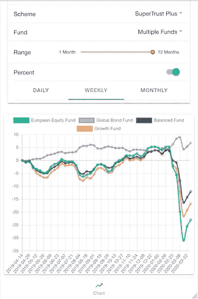
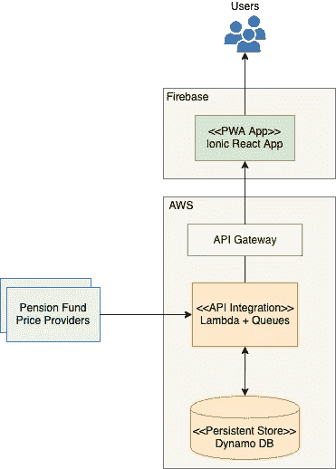
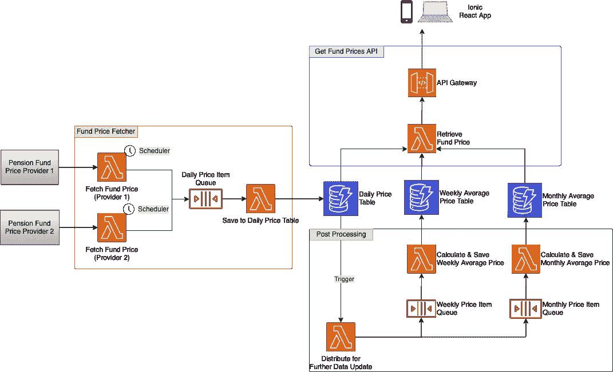

# 全栈应用开发之旅——养老基金价格分析

> 原文：<https://blog.devgenius.io/a-journey-of-full-stack-application-development-ae57ec7c5b5a?source=collection_archive---------1----------------------->

图片由 [Unsplash](https://unsplash.com?utm_source=medium&utm_medium=referral) 上的 [Alexandru Acea](https://unsplash.com/@alexacea?utm_source=medium&utm_medium=referral) 拍摄

构建应用程序是一种乐趣。如今，任何人都可以方便地利用互联网上丰富的各种资源开始开发，从而能够以最先进的体系结构构建现代应用程序。此外，还有来自开发者社区的强大支持，许多人积极地分享和贡献技术问题和评估。在本文中，我将分享从头构建一个典型应用程序的旅程。我将从想法开发、架构概述、技术使用决策和实现细节开始。您可以参考我在本文末尾的 GIT 源代码库。

# 动机

财富管理绝对是一个热门的应用，人们一直在寻找如何更好地管理和增加他们的资产。因此，我决定开发一个可以帮助我管理养老基金投资的应用程序。在我的家乡，法律规定必须从员工的收入中扣除一定比例的养老金，而这些钱通常只能在 65 岁之前提取。虽然养老金是由法律强制执行的，但它不是由政府管理的，公民有责任管理自己的投资。

# 这个想法

该应用程序提供了一种简单的方法，用历史数据显示各种养老基金的价格。它不仅显示了不同时间段的日、周、月平均价格的变化趋势，还以百分比的形式呈现了变化趋势。进一步的功能，如技术分析可能会建立在后期阶段。其目的是促进在不同基金之间调整配置的决策，以保护财富，甚至实现增长。

下面的示例截图显示了该应用程序如何工作，它显示了基金价格或百分比的变化。我们很容易确定趋势，并比较每个基金的近期表现

# 体系结构

首先，建筑设计是一开始就要做的最重要的工作，它就像房地产建设的蓝图。如果我们跳过它，直接开始编码，我们肯定会有麻烦或者走错方向。下图描述了整个系统的整体数据流。该系统从各种数据源检索基金价格——养老基金价格提供商，然后在后端流程中进行数据格式化和计算。所有数据都存储在持久性存储中，可以通过 API 访问。然后，前端应用程序可以使用 API 来检索基金价格，并在仪表板和折线图中显示信息。

架构概述

# 技术栈

## 概观

主要考虑的是避免不必要的运行硬件成本。这对于预算很少的个人项目尤其重要。无服务器 lambda 是一个理想的选择，因为它根据请求的数量来收取运行成本。换句话说，闲置的 CPU 资源没有浪费，也没有运行成本。此外，许多云提供商通常会免除几百万次请求的费用。毫无疑问，在数量相对较少的情况下，它无疑最大限度地减少了孵化阶段的应用费用。

此外，无服务器架构提供了支持自动伸缩和错误处理的强大功能。我们可以专注于构建应用，而云提供商则负责其余的非功能性需求。

## 无服务器框架

为了简化组件(如队列、lambda 函数、API 网关和其他权限设置)的供应，开发基于无服务器框架，该框架基于 YAML 定义生成所有组件。使用该框架的另一个好处是使应用程序在一定程度上不受云提供商的影响。

考虑到无服务器架构，Node JS 是首选语言，与 Java Spring Boot 相比，它相对更轻量级，内存占用更少。此外，它为后端数据后处理和 API 获取基金价格提供了很好的服务。

## 持久数据存储

NoSQL 允许灵活性，例如，为新特性引入新列，例如，开发后期的技术分析数字将破坏整个设计或代码重构的重要工作。DynamoDB 是 AWS 上现成的托管服务，因此它是首选。

## 软件框架

为了覆盖互联网上的大多数人群，目标客户端设备是浏览器、Android 和 iOS。因此，混合应用程序被选择用于将单个前端源代码部署到大多数设备。Ionic + React 因其受欢迎程度和强大的社区支持而被选为框架。

# 无服务器架构设计

让我们深入到无服务器架构的细节，整个设计包括三个部分:基金价格爬虫，基金价格后处理和 API 公开给前端客户端检索基金价格。

无服务器架构设计

## **基金价格爬虫**

有几种方法可以通过直接使用 API 或从网站抓取来从提供商那里检索数据。大多数基金提供商只提供 web 门户而不提供 API，然而，利用浏览器开发工具仍然可以发现 web 门户的底层数据源。通常，有 AJAX 调用或 API 使得 Lambda 函数可以直接检索基金价格。在最坏的情况下，网页抓取是最后的手段。人们可以使用 Selenium 等框架从网页中抓取信息，就像使用浏览器一样。

该应用程序目前有基金价格爬虫来使用 2 个不同提供商的 API 来获取每日基金价格。该进程由调度程序(AWS CloudWatcher 事件)触发，然后数据被放入队列，等待另一个 lambda 函数保存到持久存储中。

## **基金价格后期处理**

一旦每日基金价格被存储到持久存储器中，异步后处理就会触发连锁反应。目的是根据每日基金价格计算分析数字和衍生值。例如，每周和每月平均价格。可以添加其他处理，如移动平均线、RSI、MACD 等，并存储在 DynamoDB 中。设计模式是将队列放在每个 lambda 函数的前面，以满足大数据量的需要。

## **获取基金价格 API**

这是前端 app 或外部方消费基金价格数据的前端门。因为到目前为止，API 只是简单地查询基金价格，所以一个 lambda 函数就足够了。API 网关有助于公开 API、提供保护和控制流量。

## Git 储存库

这里是 lambda 函数和无服务器组件的 git 存储库

【https://gitlab.com/gavinklfong/mpf-price-service.git 

## **未完待续——前端应用**

前端应用是一个大话题，我将在下一篇文章中介绍 Ionic + React 应用的架构和框架。