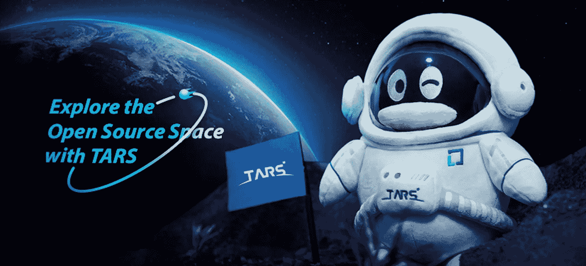

# 开源贡献之旅

> 原文：<https://blog.devgenius.io/a-journey-to-contribute-in-open-source-f3c1e4848c6b?source=collection_archive---------34----------------------->

## TARS 基金会的贡献者角色和认可结构

这里有一些显而易见的理由来说明为什么你应该为开源做贡献。为一个开源项目做贡献有助于你牢牢掌握软件，同时你的贡献可以提升你的声誉，让你作为一名开发人员充分利用你的职业生涯。事实上，积极的开源贡献比证书本身更能展示你的专业技能和知识。更重要的是，你贡献的想法可以在整个社区中成形和成长。但是，鉴于 GitHub 上有大量的资源库和项目，您如何导航适合您的开源项目，并使您的项目有助于您的个人成功呢？如果你不确定从哪里开始，这篇文章可以给你一些提示，帮助你开始开源之旅。

# TARS 基金会的捐助者系统

> TARS 项目最初由全球最大的在线游戏公司腾讯开发，它在 TARS 框架中使用用户友好的技术，为现代企业创建了一个开源微服务平台，以快速实现创新想法。2020 年 3 月，TARS 项目转变为 Linux 基金会旗下的 TARS 基金会，旨在通过 DevOps 最佳实践、全面的服务治理、高性能数据传输、海量数据请求的存储可扩展性和内置的跨语言互操作性来支持微服务开发。TARS 的使命是支持致力于构建强大的微服务平台的社区的贡献和成员的快速增长。

TARS 基金会为那些对开源项目感兴趣的开发者提供了一个很好的平台。该组织不仅为开发人员提供了为开源项目做出贡献的不同机会，还提供了在更广泛的开源社区中担任领导角色和做出重大贡献的可能性。

在他们的开源生态系统中有**贡献者、提交者、维护者和大使**的角色，每个角色都有不同的需求和职责。

# 如何成为一名贡献者

要参与 TARS 开源项目，您可以首先成为一名贡献者，参与软件构建，并将至少一个 pull 请求合并到源代码中。

软件开发人员可以通过多种方式加入 TARS 社区并成为贡献者:

*   帮助其他用户并回答问题。
*   提交有意义的问题。
*   在生产中使用 TARS 项目来增加测试场景。
*   改进技术文件。
*   发表与 TARS 项目相关的应用和案例研究文章。
*   报告或修复在 TARS 软件中发现的错误。
*   写源代码分析或者注释。
*   提交您的第一个拉取请求。

以下是提交拉动式请求的步骤:

*   将项目从 [Tars 仓库](https://github.com/TarsCloud)转移到你的 GitHub 账户。
*   Git 将存储库克隆到您的本地机器。
*   创建子分支。
*   对代码进行修改，并在本地机器上进行测试。
*   提交这些更改。
*   将提交的代码推送到 GitHub。
*   打开一个新的拉式请求，提交您的更改以供审查。
*   如果接受，您的更改将被合并到主分支中。
*   现在你做到了！您已经成为 TARS 贡献者，您将获得一件独家贡献者 t 恤！

# **如何成为一名提交者**

提交者是对 TARS 存储库做出显著贡献的贡献者，并且至少完成了一个基本的构建项目或者修复了关键的 bug。他或她也可以获得一些领导机会。

委托人应:

*   表现出优秀的技术决策能力。
*   已成功提交并合并了 5 个拉取请求。
*   有助于项目代码质量和性能的提高。
*   已经实现了重要功能或修复了主要错误。

满足上述要求后，您可以提交提交者请求:

*   第一步:在回购发行项下提供上述标准的证据。
*   步骤 2:在收到带有说明的回复后，提交您的拉式请求
*   第三步:一旦你的申请被接受，你将成为一名 TARS 委员会成员！

作为提交者，您能够:

*   从整体上控制代码质量。
*   响应社区提交的请求。
*   指导贡献者促进开源社区的合作。
*   参加委员会的定期会议。
*   提前了解项目更新和趋势。

# 如何成为维护者

维护人员负责设计 TARS 社区中的子项目，他们将领导制定与项目开发相关的决策，同时掌握合并分支的权力。他们应该表现出对子项目的良好状态的良好判断力和责任感，因为他们需要定义或批准适合开发子项目的设计策略

维护人员应该:

*   牢牢掌握 TARS 技术。
*   积极组织技术研讨会，提出建设项目。
*   能够处理更复杂的编码问题。
*   获得技术支持委员会(TSC)的一致批准。

作为维护者，您有权:

*   设计和决定子项目的顶层技术设计。
*   定义子项目的技术方向和优先级。
*   参与版本发布并确保代码质量。
*   引导贡献者和提交者在开源社区中合作。

# 如何成为一名大使

大使们对开源技术和社区充满热情，向更广泛的软件开发人员推广和支持 TARS 技术的广泛使用。大使的专业知识和对 TARS 项目的参与也将使您在社区中获得更大的认可。

大使能够:

*   成为 TARS 基金会的普通会员。
*   作为贡献者、讲师或博客作者参与 TARS 基金会的项目。
*   通过在社区活动中展示或在在线媒体平台上分享技术文章，与开发人员互动。

# 展望未来

最终，TARS 基金会鼓励他们的捐助者成为理事会和技术支持委员会(TSC)的成员。在这一阶段，你将关注整个组织的战略方向和决策。

如果你有兴趣了解更多，你可以看看他们的网站:[GitHub.com/TarsCloud](https://github.com/TarsCloud)或[TarsCloud.org](https://tarscloud.org/)

# 结论

为开源项目做贡献有很多好处。它加强了你的开发技能，你的代码被其他能提供新观点的开发人员审查。在贡献的过程中，你也与志同道合的开发者建立了新的联系，甚至是一生的友谊。这是一种开源模式，它创造了许多我们今天都在享受的技术创新，它的可持续性取决于我们全球社区中思想和技术的自由交流。开源的价值和创新根植于像您这样的开发人员，他们可以尝试开发挑战并与更广泛的社区分享见解。