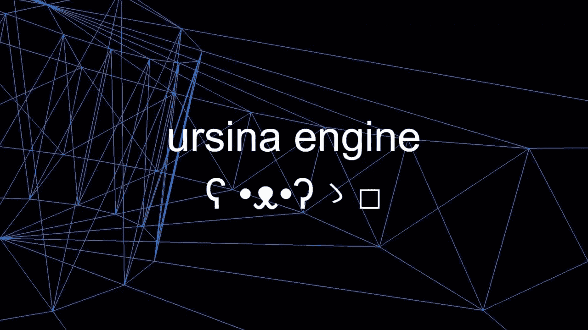
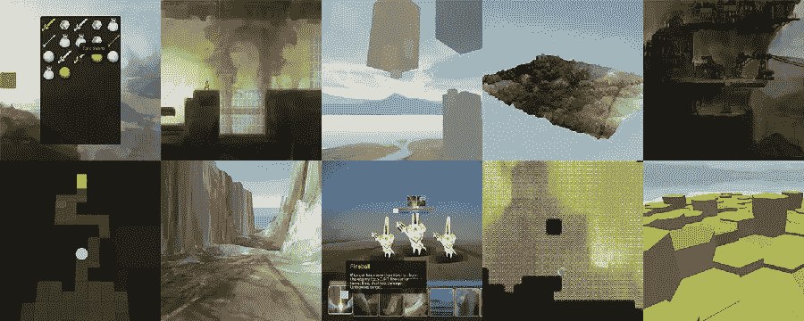
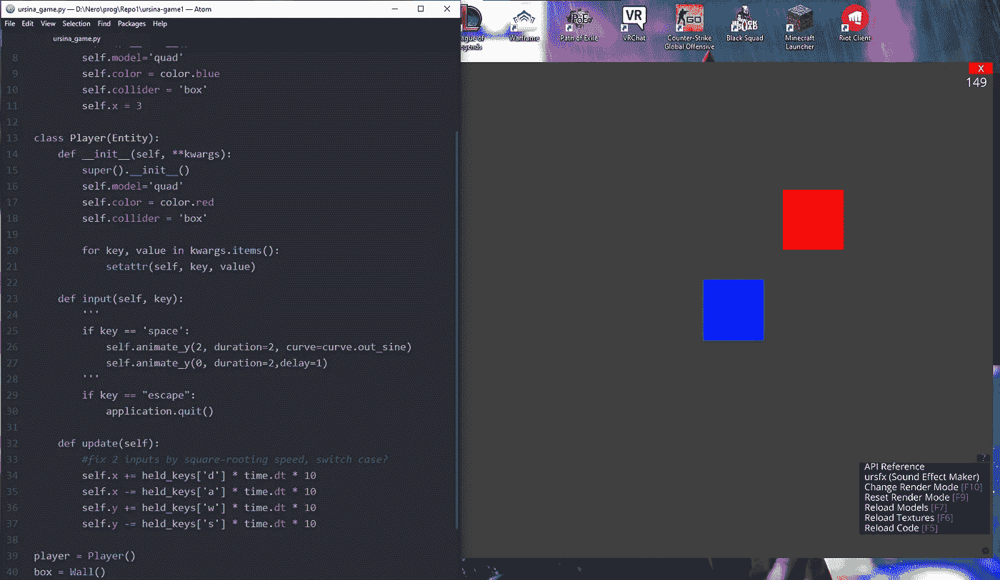

# 一个轻量级的 Python 游戏引擎:Ursina Engine

> 原文：<https://blog.devgenius.io/a-lightweight-game-engine-for-python-ursina-engine-6a2fd730889?source=collection_archive---------6----------------------->

## Python |游戏开发

## 如何作为一名 Python 程序员轻松进入游戏开发

“我知道 Python，我也想从事游戏开发，但学习 Unity3D 或虚幻引擎对我来说似乎太麻烦了。我能怎么办？”

如果你正处于这种情况或者有类似的困境，这篇文章就是适合你的。



## 乌斯娜，又名“乌斯娜引擎**ʕ•ᴥ•ʔゝ□**

[Ursina Engine](https://www.ursinaengine.org) 于 2019 年末推出，作为 Linux 和 Windows 的完全免费开源项目。展示在这一部分下面的介绍性视频，快速地向观众展示了 ursina 最具革命性的一些特征:

*   它是完全免费的。没有额外的包裹，什么都没有。免费。100%.
*   它是完全开源的。
*   它完全是用 Python 构建的。再者，主要依靠 Panda3D 库。
*   与 Photoshop 和 Blender 的兼容性。它接受。私营部门司和。混合文件。
*   用户可以在运行中改变他们的代码或纹理——当他们测试游戏时。

官方声明预告片，可在 YouTube 上找到

## 2D 和 3D 游戏

有了 Ursina，你几乎可以做任何东西。简单和复杂的 2D 和 3D 游戏。你可以导入 Photoshop 和 Blender 模型，让一切变得更简单。

这里有几个完全用 Python 和 Ursina Engine 构建的游戏快照。

Ursina Engine 的[官方网页](https://www.ursinaengine.org)带给用户很多资源。

准备好开始学习了吗？让我们继续安装软件。

## 快速简单的安装



一些用乌西娜制作的游戏——来自乌西娜的官方页面

## 快速简单的安装

你可以直接从你的终端安装 Ursina 引擎。方法如下:

打开你的终端(或者新的 [Windows 终端](/how-to-customize-your-terminal-in-windows-10-896fd2432f25)应用)。

首先，您需要确保至少安装了 Python 3.6。你可以通过检查 Python 的版本来做到这一点。

```
python --version
```

然后，您将需要使用 **pip** 包，默认情况下它随 Python 一起安装。然后，将此粘贴到您的终端中，并从 GitHub 官方页面下载最新版本。

```
pip install [https://github.com/pokepetter/ursina/archive/master.zip](https://github.com/pokepetter/ursina/archive/master.zip)
```

几秒钟后，如果一切正确，Ursina 引擎将安装在您的计算机上。

如果最后一行对您不起作用，您可以通过 python 调用 **pip** 安装包，如下所示(或者使用快捷方式“py”代替“Python”):

```
python -m pip install ursina
```

希望你的笔记本或电脑上有 Ursina！

## 使用 Ursina 引擎

Ursina Engine 的[官网](https://www.ursinaengine.org)带给用户很多资源。在那里，您可以找到教程、代码示例和非常详细的文档文件来支持您的编程过程。

要“使用”游戏引擎，您只需调用您的。py 文件，你的游戏马上就可以运行了。就这么简单！

这是我在不到五分钟的时间里构建的一个快速示例:



我做的一个快速演示的快照，测试了一些基本特性

在开始之前，我导入了所有的 Ursina 模块和对象。我首先设置的是主游戏循环，然后开始编程基本的游戏结构。

我很快创建了几个具有一些 Ursina 属性的类，并设置了“更新循环”——程序在其中检查用户输入。

很快我就运行了一个小的演示程序，用它我可以学习这个包的基础知识。在尝试了基础知识后，我开始研究 2D 碰撞系统和该软件带给用户的基本点击框。我还尝试添加一个跳跃功能，但我意识到这在自上而下的 2D 游戏中没有多大意义。

## 接下来会发生什么

Ursina 引擎开发人员正在为 Ursina 开发场景编辑器。用户可以在场景中交互地放置物体和模型，而不是通过代码。对于新开发人员来说，这可能会使事情变得更容易、更快。

YouTube 官方频道前几天发布了一个关于这个的视频。他们仍在开发该功能，它似乎处于早期状态，但它看起来真的很有前途。请随意查看。