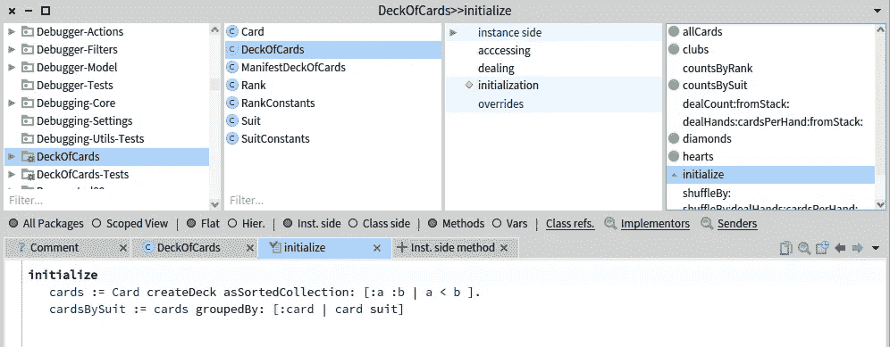
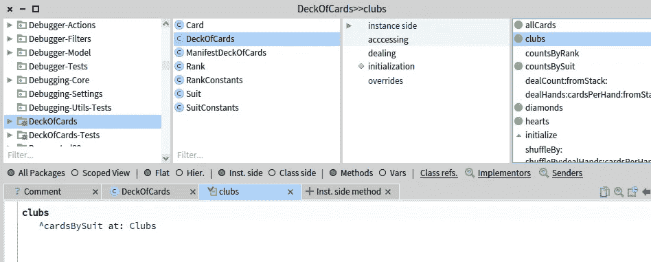
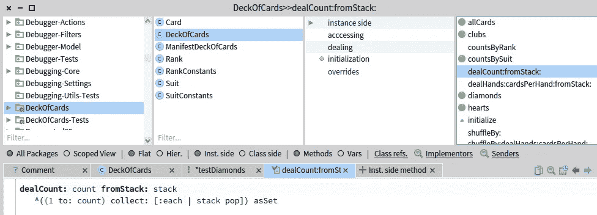

# 一个小小的心灵对话

> 原文：<https://blog.devgenius.io/a-little-smalltalk-for-the-soul-b12051b709d1?source=collection_archive---------1----------------------->

Smalltalk 帮助我成为了今天的软件工程师。

在一个现代的 Smalltalk IDE (Pharo 8.0)中处理卡牌形

# 说出来，然后去做

我第一次学习 IBM VisualAge Smalltalk 是在 1994 年。我参加了一个为期五周的面向对象的沉浸式课程 Smalltalk，这是 IBM 作为其对象技术大学项目的一部分提供的。我几乎立刻就爱上了 Smalltalk 语言和 IDE，并且在五个星期的晚上花了无数个小时在实验室里试验 VisualAge Smalltalk。时至今日，我从未遇到过更身临其境的开发者体验。我在 2000 年 3 月左右停止了 Smalltalk 的专业编程。

二十多年后，在我现在用 Java 编写的软件中，我仍然在使用我从 Smalltalk 中学到的关于优秀的面向对象编程的一切。我在 2004 年创建了一个开源的 Java 集合框架，现在被称为 [Eclipse 集合](https://www.eclipse.org/collections/)。Eclipse 集合受 Smalltalk 集合框架的启发，但是已经远远超出了 Smalltalk 集合。我希望为 Java 程序员提供全面的面向对象和函数集合体验。

本周，我在推特上热切地谈论我什么时候可以再次体验 Smalltalk 开发。

一个小时后，我决定“就这么做”，用 PharoLauncher 给 [Pharo 8.0](https://pharo.org/) 加电。

这是法老号的样子。我只需点击右边的绿色播放按钮，打开我的 Pharo 8.0 Smalltalk 图片。

法罗伦彻

# 选择卡牌形

决定用一种编程语言来解决一个不平凡但不太复杂的问题可能是一项挑战。幸运的是，这些年来我已经构建了许多代码表，当我想用编程语言解决更多的小问题时，我可以利用它们。

《纸牌卡塔》是一个开源的 Java 代码卡塔，基于我在 Devoxx US 2017 上与 [Nikhil Nanivadekar](https://twitter.com/NikhilNanivade) 和[莱奥·利马](https://twitter.com/leomrlima)一起发表的演讲，题目是“ [Collections.compare(JDK、Eclipse、番石榴、阿帕奇…)](https://www.youtube.com/watch?v=hWwbPguayNA) ”。kata 允许开发者使用不同的集合框架来实验解决与一副扑克牌相关的问题。我们已经使用了相同的主题来比较 JVM 语言。我们三个人在 Oracle CodeOne 2018 上做了一个题为“ [JVM 语言比较(Java，Kotlin，Groovy，Scala)](https://vimeo.com/331297954) 的演讲，Nikhil 和我在 Devnexus 2019 上重复了这个演讲。

卡牌卡塔是开源[代码卡塔报告](https://github.com/BNYMellon/CodeKatas)中包含的代码卡塔之一。这里是一副卡式的 README.md 的快速预览。

卡片组自述文件快照，带类别图，带卡片、等级和花色

# 用 Smalltalk 解决扑克牌形

只要你能用这种语言编写单元测试，卡牌卡塔可以用任何编程语言实现，或者使用任何集合库实现。扑克牌问题相当简单，任何看过扑克牌的人都很容易理解。

Smalltalk 拥有强大的 ide、包、类、方法和一个简单而强大的测试框架 SUnit。我决定使用开源的 Pharo IDE。

我在 IDE 中创建了两个包。一个包含我的域类，我将其命名为`DeckOfCards`。第二个将包含我的测试，我称之为`DeckOfCards-Tests`。

首先，我从`Tools`菜单中打开`System Browser`。我将在`System Browser`中完成我所有的编码。

打开系统浏览器

在`System Browser`中，我在左侧的包列表中单击鼠标右键，创建我想要的两个包。

在系统浏览器中创建新包

# 等级和套装清单

在 Java 和其他支持`Enum`类型的语言中，我会将`Rank`和`Suit`类型实现为枚举。枚举是具有一组预定义实例的类型。对于`Suit`，数值为`Hearts`、`Diamonds`、`Clubs`和`Spades`。对于等级，值为`Ace`到`King`。

Smalltalk 没有专用的`Enum`类型。Smalltalk 中的枚举的等价物是池字典。在我为`Rank`和`Suit`创建`PoolDictionary`类之前，我必须定义`Rank`和`Suit`。

在`System Browser`中，当鼠标放在`DeckOfCards`包上时，我选择了浏览器底部的 New Class 选项卡。

使用“新建类别”选项卡创建新类别

这是一些很酷的事情发生的地方。为了创建一个新类，我向`Object`类发送了`subclass:instanceVariableNames:classVariableNames:package:`消息。我只需替换`NameOfSubclass`文本并保存代码就可以了。文本前面的#很重要，因为它表示这是一个`Symbol`，在`Smalltalk`中是一个独特的`String`。`Symbol`型延伸`String` IIRC。

右键单击并选择“接受”或“Mac 上的命令”

在`Rank`的情况下，我想添加两个实例变量。一个我称之为`name`，它会有一个类似`ACE`或`TWO`的名字。另一个我将调用`order`，它将包含等级的自然顺序(例如 ACE `order` = 1，TWO `order` = 2 等)。).

将 name 和 order 实例变量添加到 Rank 中—再次右键单击并接受

接下来，我将为`name`和`order`添加 getters 和 setters。Smalltalk 中的 getter 与变量同名，没有参数。Smalltalk 中的 setter 与变量同名，但它采用一个参数，并且在方法名之后出现一个冒号(:)。没有参数的方法称为*一元消息*。采用一个或多个参数的方法称为*关键字消息*。还有*二进制消息*，是类似`>`、`<`、`=`、`+`、`-`等方法。二进制消息在方法名后不需要冒号，并且只接受一个参数。

## 添加 Smalltalk 实例方法

首先，我将为`Rank`名称添加一个 getter。我选择了`Rank`类。然后我确保“Inst。侧”单选按钮被选中，因为我正在添加一个实例方法。类可以有实例和类方法。然后我点击标题为“+ Inst”的选项卡。方法”。我看到了一个显示如何添加方法的模板。

添加实例方法

我输入了所有内容，并输入了一个简单的`name`getter 所需的文本，然后右键单击并选择 accept 或输入 Command-S 来保存。

实现等级名称 getter

方法名为`name`，语句`^name`翻译成“返回名”。插入符号是 Smalltalk 中用于从方法返回结果的符号。

然后我为`name:`定义 setter。

实现等级名:setter

方法的名字是`name:`。它与冒号有细微的不同，这表明该方法需要一个参数。冒号后是一个空格，后跟一个参数名。在这种情况下，我调用参数`aName`。您会注意到这里没有定义静态类型。这是因为 Smalltalk 是一种动态语言。`aName`的类型将在运行时确定，而不是在编译时。方法中的一个语句是`name := aName`。`:=`是 Smalltalk 中的赋值操作符。所以`aName`的值将被赋给实例变量`name`。

然后，我重复为`order`实例变量创建 getter 和 setter。

我提供了`=`和`hash`的实现。Smalltalk 中的`=`方法用于测试相等性。正如我之前提到的，赋值是通过`:=`实现的。如果你覆盖了`=`，你也应该覆盖`hash`。

下面是我为`Rank`实现的`=`。

实现=对于等级

下面是我为`Rank`实现的`hash`。

实施`hash`进行排名

在 Smalltalk 中，你对你的方法进行分类或归类。您还可以一次编辑一种方法。我将 getters 和 setters 放在访问类别中。

我为`Suit`类重复了同样的工作，添加了`name`和`order`实例变量、getters 和 setters，并覆盖了`=`和`hash`。

添加带有实例变量、getters 和 setters 以及=和 hash 的 Suit 类

# 枚举

在 Java 版本的纸牌卡塔中，我们将`Rank`和`Suit`类型定义为枚举。一个`Suit`将有`DIAMONDS`、`HEARTS`、`SPADES`和`CLUBS`的实例。一个`Rank`将拥有从`Ace`到`King`的所有等级的实例。

Smalltalk 没有枚举的特殊类型。相反，我必须定义两个池字典— `RankConstants`和`SuitConstants`。这是 Java 版本比 Smalltalk 版本更简洁的一个例子。

为了给`SuitConstants`定义`PoolDictionary`，我将创建一个新类，并让它扩展`SharedPool`。

将 SuitConstants 创建为 SharePool 的子类

我将`Clubs`、`Diamonds`、`Hearts`和`Spades`作为类变量添加到`classVariableNames`字符串中。然后我必须定义一个`initialize`方法作为类方法。所以在这里我将点击*类侧*单选按钮来添加方法。

向 SuitConstants 添加 initialize 类方法

我决定在这里添加一个名为`withName:order:`的类方法。所以我给`Suit`加了那个类方法，给`Rank`加了一个类似的类方法。

添加 withName:order: class 方法以适应类

在 Smalltalk 中，您可以使用消息后的`;`将消息发送到一个对象。所以在上面的代码中，我通过调用`self new`创建了一个`Suit`的新实例。这种情况下的自我就是套装类。然后我在那个实例上调用`name:`方法。下一个对 order:的调用被发送到与被调用的`name:` 方法相同的接收者。然后我调用方法`yourself`，每个对象都懂。`yourself`消息将返回从对`self new`的调用中返回的实例。

现在让我们回到`SuitConstants` `initialize`方法。

SuitConstants 类方法—初始化

我使用类方法`withName:order:`创建了一个`Suit`的实例，并将结果赋给每个相应的类变量。在我创建一个`DeckOfCards`之前，需要调用这个`initialize`方法。我为`RankConstants`类定义了一个类似的初始化方法。

RankConstants 类方法—初始化

现在我已经完成了第一组关于`Rank`、`RankConstants`、`Suit`、`SuitConstants`的方法，我准备定义`Card`类了。

# 定义卡类

`Card`类将是一个`Rank`和`Suit`之间的关联。我将通过计算`Rank`和`Suit`的笛卡尔乘积来创建一副牌中的所有牌。首先，我用名为`rank`和`suit`的实例变量定义了`Card`类，并在类声明中包含了用于`RankConstants`和`SuitConstants`的两个`poolDictionaries`。

我定义了一些方法来测试一个`Card`是否有一个特定的`Suit`。(例如`isClubs`、`isDiamonds`)。

我实现了一个名为`order`的方法，这样我就可以在需要的时候对卡片进行排序。`Card`的`order`是`Rank`和`Suit`的`order`之和。

我在名为`rank:suit:`的卡片类上定义了一个类方法。我在`DeckOfCards-Tests`包中的`CardTest`类中为这个方法编写了一个测试。

卡片测试钻石方法测试等级:套装:

我在`Rank`上定义了一个名为`of:`的实例方法。`of:`方法创建了一个`Card`。我在`CardTest`类中包含了`RankConstants`和`SuitConstants`池字典。这允许我通过池字典中定义的名称来引用所有的`Rank`和`Suit`实例。我觉得`Ace of: Diamonds`或者`Jack of: Clubs`非常容易阅读和理解。

在秩上定义的 of:方法

为了让测试工作，我在卡`class`上定义了一个合适的`=`方法。

卡片上定义的=方法

## 创建一副牌

我给名为`createDeck`的`Card`类添加了一个类方法。这通过产生`Rank`和`Suit`的笛卡尔乘积创建了`Card`的`Collection`。Smalltalk 中没有笛卡尔积方法，所以我通过对所有的`Rank`和`Suit`实例使用`flatCollect:`和`collect:`来实现笛卡尔积。

卡片创建方法

我在`Rank`和`Suit`上定义了`all`方法，这样我就可以在`createDeck`方法中获得这两种类型的所有实例。

使用级联 add: messages 到集合来定义用于排名的 all 方法

# 创建 DeckOfCardsTest 和 DeckOfCards 类

一个`DeckOfCards`应该是不可变的。在一个完美的世界中，一副牌中的任何一张牌都不能被添加、删除或修改。在闲聊中或者如果你有小孩，这是很难实现的。对于小型版本的 DeckOfCards 卡形，我使用封装和防御副本来防止牌组中的牌被操纵。我没有编写测试来验证一副牌中的牌永远不会变异。如果读者愿意接受这个挑战，我将把它作为一个练习留给他们。

我首先创建一个`DeckOfCardsTest`类来保存我将为添加到`DeckOfCards`类中的方法编写的测试。我在`poolDictionaries`中包含了`RankConstants`和`SuitConstants`。

DeckOfCardsTest 类

## testAllCards 测试

我编写的第一个测试验证了一副牌中有 52 张牌，每副牌有 4 套 13 张。

DeckOfCardsTest 中的 testAllCards 测试

当我使用`new`消息创建一个`DeckOfCards`时，会自动调用`initialize`方法。这是 Smalltalk 中常见的行为。

DeckofCards 初始化方法

在`initialize`方法中，我调用`Card` `createDeck`，然后使用`<`创建一个`SortedCollection`来比较每个`Card`。我将卡片按照它们的`Suit`分组，并将其存储在`cardsBySuit`实例变量中。

在`testAllCards`测试中，我最终在`DeckOfCards`上调用了`allCards`。这是我通过调用`asOrderedCollection`创建防御副本的一个地方。

扑克牌的实现

## 梅花测试，方块测试，红桃测试，黑桃测试

我将实现这些方法中的每一个，但只显示其中的一个，这样您就可以看到发生了什么。

这就是`testClubs`的实现。

DeckOfCardsTest 测试俱乐部的实现

我将使用我在`initialize`方法中创建的`cardsBySuit`分组在`DeckOfCards`上实现`clubs`方法。

迪卡俱乐部法的实施

`DeckOfCards`的`initialize`方法中使用的`groupedBy:`方法创建了`Suit`的`Dictionary`到`Card`的`Collection`。所以当我在`DeckOfCards`上调用方法`clubs`时，它会通过常量`Clubs`在`cardsBySuit`和`Dictionary`中进行简单的查找。

## 洗牌和发牌的测试

我会通过调用不同的方法来处理一手牌中的一张`Card`或一张`Collection`。首先，我将洗牌三次，从一张`Stack`的顶部发牌。

## 测试交易测试

在`testDeal`方法中，我将验证用指定数量的牌发牌的结果。我将把一个`Random`生成器传递给`DeckOfCards`的`shuffleBy:`方法，这将返回一个被混洗的`Card`的`Stack`。然后我将使用`DeckOfCards`从`Card`的`Stack`发牌。

在 DeckOfCardsTest 上实现 testDeal 方法

`shuffleBy:`方法将从`DeckOfCards`复制卡片，并使用传入的`Random`生成器洗牌三次。

洗牌:扑克牌上的方法

在我洗牌三次后，我用`inject:into:`将牌`push`到新的`Stack`上。

洗牌后，我从`Stack`发了 5 张牌。然后我从`Stack`发 2 张牌。在总共发了 7 张牌后，我核实了`Stack`的大小是 45。我对`dealCount:fromStack:`的方法实现如下:

方法实现

我使用`1 to: count`创建一个`Interval`。然后我调用`Interval`上的`collect:`和`Stack`中的`pop`到结果集合中。我使用`asSet`将最终得到的集合转换成一个`Set`。

## 洗牌和洗牌测试

我写的最后一个测试将测试洗牌和发五手牌，每手五张。

纸牌测试中的洗牌和洗牌测试

我将在`DeckOfCards`上编写的满足`testShuffleAndDealHands`测试的 API 是`shuffleBy:dealHands:cardsPerHand:`。

shuffle by:deal hands:cards perhand:on DeckOfCards 的实现

我写的最后一个方法是`dealHands:cardsPerHand:fromStack:`方法。

DeckOfCards 上 deal hands:cardsPerHand:from stack:方法的实现

这是实现 DeckOfCards 形所需的最终测试和方法。我使用`1 to: numberOfHands`创建了另一个`Interval`。然后我`collect:`调出了给`dealCount:fromStack:`打了那么多次电话的结果。

我已经完成了形。

# 摘要

我想写一些简短的代码。我写的不是通常的 Smalltalk 代码，它只是工作区中这里或那里的几行代码。我希望必须创建类和单元测试，并真正在 Smalltalk IDE 中花一些时间。在 Smalltalk 中实现 DeckOfCards 形给了我这个机会。我花了整整八个小时来练习形，并学习如何在法轮中导航。我不得不掸去 20 年 Smalltalk 蜘蛛网的灰尘，回到 Smalltalk 编码的流程中。我非常喜欢这个练习。我想起了是什么让我在 20 多岁的时候爱上了 Smalltalk 编程语言。我也欣赏 Java 中的一些可用特性(例如枚举、记录)和 [Eclipse 集合](https://github.com/eclipse/eclipse-collections)(例如不可变集合、Lazy Iterables、cartesianProduct)。

将经历写在博客上比我最初预期的更具挑战性。我想让读者体验一下我在 IDE 中从头开始实现 DeckOfCards 形的感觉。我不确定我应该尝试教多少 Smalltalk 语言，但是我试着解释我一直在做什么，以及语言和类库中的一些东西是如何工作的。也许你已经学到了足够多的知识来激发你的好奇心，也许你会想了解更多关于这种已经有 40 多年历史的令人惊讶的纯面向对象编程语言的知识。

如果你想[“在 Y 分钟内学会闲聊”](https://learnxinyminutes.com/docs/smalltalk/)，请查看这个资源。要下载我使用的 IDE，请查看 Pharo Smalltalk 站点。Pharo 网站也有这个 [PDF 备忘单](http://files.pharo.org/media/pharoCheatSheet.pdf)。

最后，如果你想尝试在线 Smalltalk 学习资源，你可以用 [ProfStef](https://amber-lang.net/learn.html) 学习 Smalltalk。

旅途愉快，希望你喜欢这次闲聊！

*我是*[*Eclipse Collections*](https://github.com/eclipse/eclipse-collections)*OSS 项目在*[*Eclipse Foundation*](https://projects.eclipse.org/projects/technology.collections)*的项目负责人。* [*月食收藏*](https://github.com/eclipse/eclipse-collections) *是开投* [*投稿*](https://github.com/eclipse/eclipse-collections/blob/master/CONTRIBUTING.md) *。如果你喜欢这个库，你可以在 GitHub 上让我们知道。*