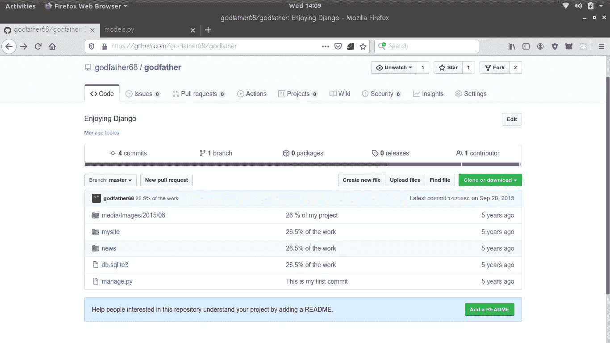

# 回顾我的第一个 GitHub 项目。

> 原文：<https://blog.devgenius.io/a-look-back-at-my-first-ever-github-project-d278785d8e60?source=collection_archive---------21----------------------->

**五年前从 Django 开始，至今仍在从事这项工作**

[𝓴𝓘𝓡𝓚 𝕝𝔸𝕀](https://unsplash.com/@laimannung?utm_source=medium&utm_medium=referral) 在 [Unsplash](https://unsplash.com?utm_source=medium&utm_medium=referral) 上拍照

通过阅读标题，你可能知道那篇文章将由什么组成，猜猜是什么？你是对的，我的朋友。我从事软件开发和编程已经有几年了，作为软件开发人员，我们通常没有时间回顾过去的自己——心态是不断提高解决问题的技能和能力——我不知道其他人是否也是如此，但就我而言，我一直都是这样。

我在想，如果我能和过去的自己就计算机科学、编程和软件开发进行一次交流，就为了……你知道吗？也许提供建议，对他挣扎的事情给出更清晰的解释，也许从他身上学到一些东西或者只是看到我这些年来获得的经验。我想我会通过查看我的第一个 Django 项目(感谢上帝，它在 GitHub 上)来效仿这一点，通过阅读我的旧代码，也许我会试图弄清楚在那个特定的时刻我的脑海中在想什么，以及我将如何改变或改变什么来使代码更有效。不打算检查整个代码库并试图重写所有的东西，我知道我以前很糟糕，但是，不是自夸，我确信我没有做错任何事情。

我在大学的第一年就接触了 Django 和 Python，当涉及到任何与 Web 开发相关的东西时，这通常是 goto 堆栈，这取决于课程的要求，在同一年，我设法学习了什么是 Git，所以为了将事情付诸实践，我决定建立一个简单的博客。点击 找到回购 [**的链接**](https://github.com/godfather68/godfather)

我会这样分:

*   **检查项目结构**
*   **代码审查**

1.  **检查项目结构**

让你的项目结构合理，避免在开发过程中定位文件的麻烦。提高生产率的一个方法是拥有一个结构良好的项目，虽然它有助于确定文件的位置，但在团队项目中工作也是一个好的实践。现在，让我们拿出存储库，给人们他们想看的东西。

我的第一个 GitHub 库的截图

我就不能想出一个更好的项目名称吗？我的意思是，我们甚至还没有命名变量，我仍然不能命名项目本身。这清楚地表明，我不在乎为项目命名和添加描述。在此基础上有了很大提高。

接下来是结构；有一个保存项目设置的`**mysite**` 目录，Django 开发人员对它很熟悉，你可以看到一个`**news**` 目录，这是应用程序。我记得在 Django 中，我一直在纠结 app 的概念，像`**Blog**` 这样的名字可能会更好或者更合适。对于其他人来说，对于一个新手来说，一切都很好。

**2。代码审查**

现在让我们看看代码。除了 ***models.py*** 和 ***views.py.*** 之外，我们不会查看所有文件

我将在每个文件中提取一些代码，并尝试突出我认为是不好的实践，看看我现在将如何实现它。

# 模型

models.py

为什么我总是试图重写整个认证机制？鉴于它只是一个博客，我想起来这是自我破坏。Django 用户模型对这个项目来说已经足够了，如果不是，就扩展它——不需要重写 UserManager 或 AbstractUser，我打赌我不知道我在做什么。

除了在 **author** 属性上缺少对我的用户模型的引用之外，**文章**模型看起来还不错。

# 视图

views.py

用户注册的处理方式，天哪！再说一次，我会浪费我的时间来处理用户认证，这是一个复杂的问题，尤其是如果你刚刚开始，没有任何经验。一只`UserCreationForm()`就搞定了。

这里不必要的视图函数:`register_success`，`loggedin`，很抱歉我不能说我当初为什么要创建它们。此外，在文章视图功能中，我现在会使用**decorator**而不是不断地验证用户，但这会带来更多的体验。

对于刚接触编程的人来说，我认为这并没有那么糟糕。只要想起我为那个博客感到多么自豪，你就会想，人类的满足感是不是一种“东西”。

> 随着技术飞速发展，软件工程师在其职业生涯中很容易经历很多事情——从冒名顶替综合症到害怕被技术抛弃——花些时间回顾一下你作为一个普通人迄今为止取得的进步总是件好事，尤其是在你的领域。
> 
> **这个故事的主要观点是，永远要欣赏和重视你每天所学的东西，因为这能让你成为更好的软件工程师。**

希望你觉得它有用，并且和我看你的旧代码有同样的感觉。

干杯。