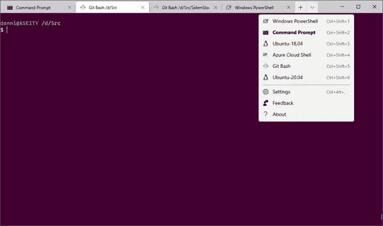

# 透视 Windows 终端

> 原文：<https://blog.devgenius.io/a-look-inside-windows-terminal-c3282d73d69b?source=collection_archive---------1----------------------->


软件开发人员的首选终端，在其中运行命令行命令和脚本是个人偏好的事情。长期使用 MS-DOS 的人会(也许不会深情地)记住“command.com”命令外壳。由于它的局限性，像 [4DOS](https://www.4dos.info/) 这样的替代品被开发出来了。Unix/Linux 用户已经习惯了外壳的强大功能和可组装性，例如 [ksh](https://github.com/att/ast) 、 [bash](https://www.gnu.org/software/bash/) 或 [zsh](http://zsh.sourceforge.net/) 。在典型的一周中，在 Windows 10 中工作的软件开发人员可能会发现自己在 cmd.exe、Windows PowerShell、git bash、Azure Cloud shell 或 Windows Linux 子系统(WSL) shell 中运行命令。

为了在这些各种工具中提供更现代化的体验，并在各种 shells 中引入某种统一的用户体验，微软发布了一个名为 Windows 终端的微软商店应用程序。应用程序名称中的“终端”一词意义重大，因为它能识别控制台、外壳和终端之间的区别[。Windows 终端是一个用户界面(输入和显示)，可用于与各种 shellss(如上面列出的那些 shell)进行交互。](https://www.hanselman.com/blog/whats-the-difference-between-a-console-a-terminal-and-a-shell)

以下是不同外壳的屏幕截图，每个外壳都是单个 Windows 终端窗口中的一个选项卡:


cmd.exe


Git Bash


Windows PowerShell


用于 Linux 的 Windows 子系统中的 Ubuntu 20.04

微软为 Windows 终端提供了大量的文档。Windows 终端有许多功能在这里没有详细说明，包括屏幕分割；背景图像；自定义操作；以及更多。请参阅相关文档。

要安装 Windows 终端，请转到 Microsoft 商店，搜索“终端”，然后选择“安装”


Windows 终端作为 Microsoft Store 应用程序的一个优点是，它与 Windows 更新分开更新。我最初安装的是 1.0 版，但现在是 1.5 版，不需要进行显式更新。你还会发现，Windows 终端非常善于识别某些 Shell，包括 PowerShell 和 WSL shells，会自动将它们添加到你可以启动的可用 shell 列表中。



使用 Windows 终端时的一些其他考虑事项…首先，虽然在本文发表时，Windows 终端的预览版包括一个配置 UI，但当前的生产版本需要编辑一个 json 文件。这并不是很大的障碍，因为 Windows 终端附带的设置文件中有一些例子。你还可以在网上找到许多其他的例子。下面是上面截图中 Git Bash shell 的 json 部分:

```
{
        "guid": "{00000000-0000-0000-ba54-000000000002}",
        "acrylicOpacity": 0.9,
        "closeOnExit": true,
        "colorScheme": "One Half Dark",
        "commandline": "\"%PROGRAMFILES%\\Git\\usr\\bin\\bash.exe\" -i -l",
        "startingDirectory": "D:\\Src",
        "cursorColor": "#FFFFFF",
        "cursorShape": "bar",
        "background": "#440033",
        "fontFace": "Cascadia Mono",
        "fontSize": 11,
        "historySize": 9001,
        "icon": "%PROGRAMFILES%\\Git\\mingw64\\share\\git\\git-for-windows.ico",
        "name": "Git Bash",
        "padding": "0, 0, 0, 0",
        "snapOnInput": true,
        "startingDirectory": "%USERPROFILE%",
        "useAcrylic": false
      },
```

第二，除了 Windows 终端，微软团队发布了 Windows 终端使用的新字体， [Cascadia](https://docs.microsoft.com/en-us/windows/terminal/cascadia-code) 。Cascadia 是一种标准的等宽窗口字体，可以下载并在你喜欢的编辑器和 ide 中使用。

最后，有时我们需要以提升的权限(即作为管理员)运行命令。使用 Windows 终端最简单的方法是将 Windows 终端固定在任务栏上。右键单击 Windows 终端任务栏图标，选择“以管理员身份运行”您将看到允许特权提升的常规确认。

我鼓励您安装 Windows 终端，根据您的喜好进行配置，并评估它是否能以更少的窗口和更高的跨 shells 一致性提高您的工作效率。

## ——唐尼·黑尔，产品开发团队负责人 [AWH](http://awh.net) 。我们正在帮助企业通过技术推动增长。