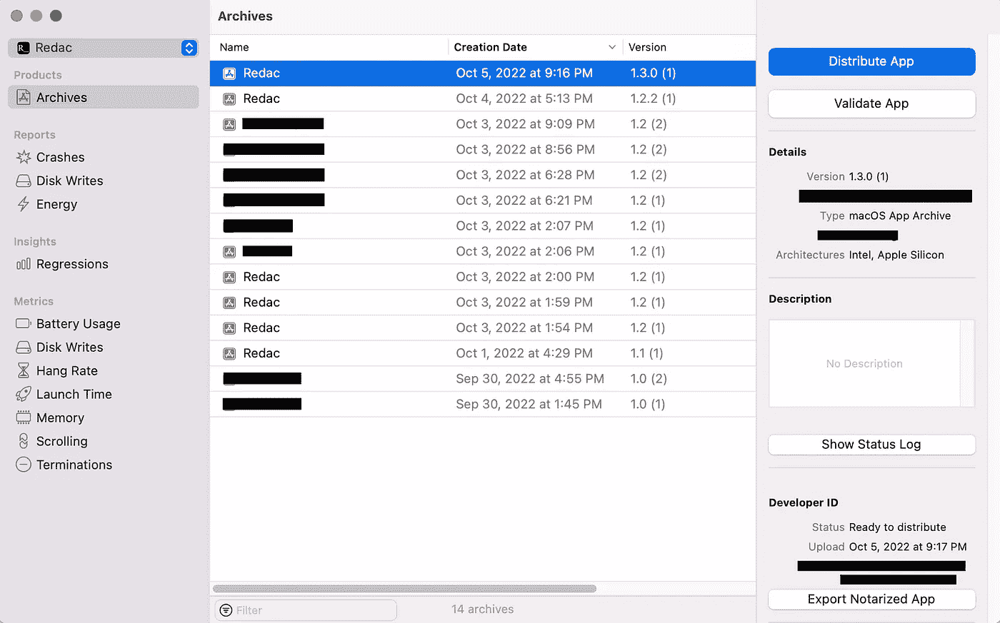
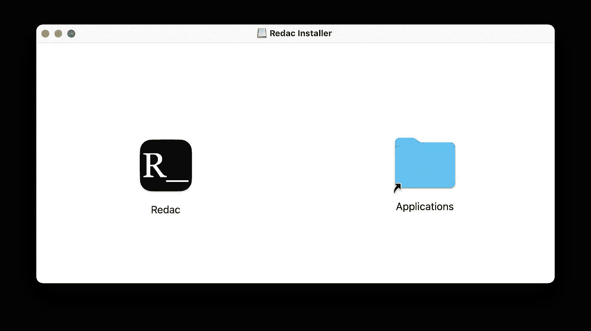
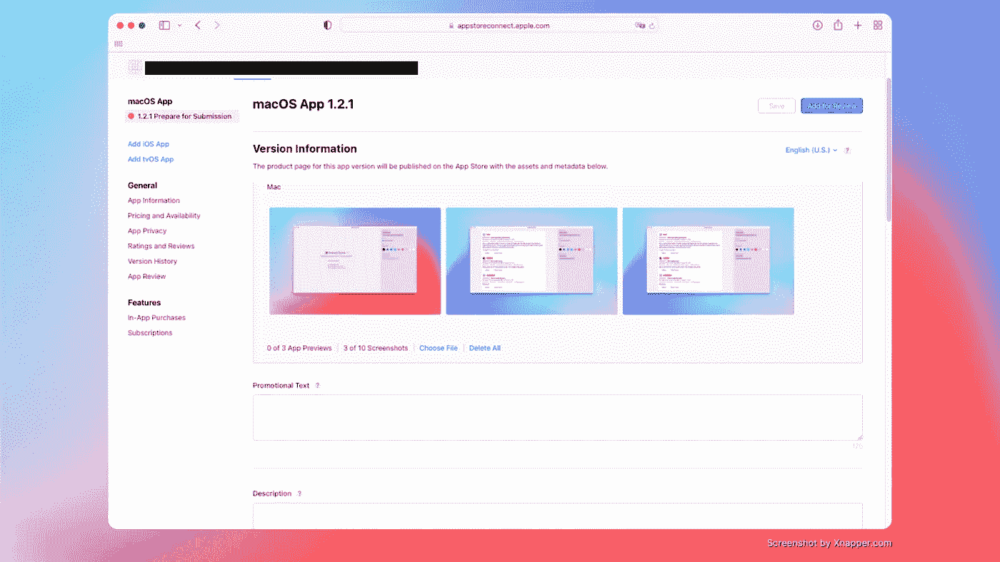

# macOS 开发手册

> 原文：<https://blog.devgenius.io/a-macos-development-playbook-2022-4ce5a6aec678?source=collection_archive---------7----------------------->

## 高效的步骤和廉价的工具来构建一个从创意到发布的应用

*(更新:我的书* [*用 SwiftUI*](https://amzn.to/3YvPPVW) *构建 macOS 应用出来了！获取更多详细信息和示例。)*

在 MacOS 上有一个应用程序的想法，但不知道从哪里开始？就是这篇文章。我正在分享一个剧本，它让我能够在几天内开发并发布一个应用程序。

我下面推荐的所有工具都非常有效，要么免费，要么价格低廉。

我知道开发一个应用程序非常耗时。你怀着一种信念建立了它，却不知道它是否会起飞。因此，关注前期成本是必须的。

# 先决条件—开始之前您需要什么

*   MacBook(普通 MacBook、Air、Pro……没关系)
*   下载 Xcode(从 App Store 免费下载)
*   苹果开发者计划年费$99(你知道同样的$99 可以构建很多 app 吗？)
*   一个想法💡

# 发展

## 用户体验

像许多工程师一样，我对自己设计 UX 没有信心。在与许多设计专业人士合作后，我了解了设计流程:

1.  了解要求
2.  设计几个选项
3.  获得反馈
4.  重复设计选项，直到你选定一个设计

但是我们没有费格玛！你可以用好的旧纸和铅笔来设计，你知道吗？画几个选项，给你的潜在用户看，征求反馈。

如果你是你正在构建的这个应用的用户，你会本能地知道你喜欢用户界面的哪个部分，你讨厌哪个部分。改进你讨厌的部分。这样迭代周期更短。

我的另一个诀窍是看看其他设计良好的应用程序如何解决 UX 问题。例如，如果你想在一个图像编辑应用程序上设计一个放大/缩小功能，你可以在谷歌图像上搜索“菲格玛·UX”或“坎瓦·UX”，看看他们是如何设计的。用它们来激发灵感。

我不打算发明全新的用户界面，这将节省我的用户学习新东西的时间。

## 斯威夫特伊

macOS 开发从一开始就有了很大的发展，从 Objective C 到 Swift，从 Storyboard 到 SwiftUI。制作过程变得更加容易和有趣。

SwiftUI 是迄今为止创建 macOS 和 iOS 应用程序最简单的方法。

以下是我经常使用的资源:

*   [苹果开发者文档](https://developer.apple.com/documentation/)(对于 API 查找很好，但是对于实际例子不太好)
*   [堆栈溢出](https://stackoverflow.com)(查找示例和解决方案)
*   [AppCoda](https://www.appcoda.com/) (SwiftUI 教程和课程)
*   [hackingwithswift.com](https://www.hackingwithswift.com)(好短文)
*   [sarunw.com](https://sarunw.com)(一个 iOS 开发者的好文章)
*   【swiftwithmajid.com】T2(好文章)
*   raywenderlich.com[(很棒的教程)](https://www.raywenderlich.com/)

当然，谷歌是你的朋友。我不会直接查找资源，但谷歌搜索最终会引导我找到它们。他们是我的可靠来源。

# 准备发射

## 检查并降低最低**操作系统版本**

该部分经常被忽略。并非所有客户都有我们的版本。您的客户群可能拥有较低版本的操作系统。

使用较低的操作系统目标构建您的代码，并查看哪些代码会中断。Xcode 会告诉你什么版本没有什么 API。根据错误消息，查看是否重构代码以支持版本。

根据 Redac 的反馈，我大幅降低了目标操作系统版本

## 设计一个图标

图标是应用程序的外观。一个伟大的图标会让你的应用令人难忘。

几个选项:

*   聘请专业人士设计一个(更贵)
*   从 [Canva](https://www.canva.com/search/templates?q=app%20icon) 购买一台(价格实惠且可定制)
*   谷歌幻灯片🤣(零成本，nada！)

想听听我的秘密吗？我用谷歌幻灯片设计了我的大部分图标。

我的经验是，一旦你有预算来改进图标，你总是可以迭代它们。

相反，8 年前，为了建立我的第一个想法，我开始设计一个花哨的图标。这是产品开发中一个幼稚的举动。

## 生成图标

如果你熟悉 iOS 开发，你会发现这里对于 macOS 有一点不同。

制作图标的资源很少

*   [AppIcon.co](https://appicon.co)(生成不同大小的平面图标。对 iOS 应用更有用，而不是 macOS 应用)
*   [Image2Icon](https://apps.apple.com/us/app/image2icon-make-your-own-icons/id992115977) (生成圆角图标，高亮推荐！)

与 iOS(仅应用商店)不同，你以两种方式分发你的 macOS:自分发和应用商店。

自发行更灵活，但你得自己营销 app。App Store 从你的应用收入中抽取一部分，有一个严格且更长的审查，但它有助于接触更多的受众。

你选择一个，或者两个都选。

# 准备发布(自我发布)

## 由公证人确认…合法

如果你自己发布安装程序，你的用户怎么能信任你构建的东西呢？苹果为你的应用程序提供公证服务。

公证过程非常快，2-3 分钟

1.  存档应用程序
2.  选择“分发应用程序”
3.  选择“开发者 ID”->选择“上传(发送到公证服务)”->选择您希望如何签署应用程序->“上传”
4.  等苹果发来的邮件，标题是“你的 Mac 软件公证成功。”
5.  然后你的。应用程序已准备好分发。

看到右下角的“状态”了吗？你就是这么查公证身份的。当它显示“准备分发”时，意味着您的应用程序已经过公证，现在可以导出。这张图片是由我的应用程序编辑的😎。

现在，想知道为什么你必须支付苹果 99 美元，尽管你不打算在应用商店出售你的应用程序？是的，所有服务，如公证服务和应用程序审查，都包含在这个价格中。

## 正在生成安装程序

你可以选择。app 文件或. dmg 安装程序。但是，有什么区别。app 和。dmg？

。dmg 是一个虚拟磁盘的副本，其中包含所有内容，包括一个. app 文件，可能还有 Readme(很少)。它提供了安装应用程序的过程。

点击后打开。dmg 文件

答。app file 是一个自包含的实体，拥有独立运行所需的框架和库。您可以简单地将. app 文件拖到“应用程序”文件夹来安装应用程序。

为了给应用程序生成一个. dmg 文件，我经常使用 [create-dmg](https://github.com/create-dmg/create-dmg) 。

为了在每次发布之前更容易，我将脚本转换成 Shell 脚本，并与应用程序源代码一起保存。

## 让它可供下载

这一部分非常容易理解——发送。dmg 安装程序给人！

几个选项:

*   建立一个网站，并在那里提供下载(购买域名和托管。所以它有前期成本和工作)
*   使用 [Gumroad](https://gumroad.com/) (提供人们免费下载或付费)

我觉得 Gumroad 在这种情况下很棒。你不仅可以在那里免费托管应用程序，还可以保存客户的邮件列表。一旦你有应用程序的更新，你也可以通知他们。

# 准备发布(应用商店市场)

## 上传到 App Store

这一步和 iOS 很像——

1.  存档应用程序
2.  点击“分发应用”
3.  选择“App Store 连接”
4.  选择“上传”
5.  签署应用程序
6.  上传

## 审查请求

要在 App Store 中推广您的应用，请在 [App Store Connect](https://appstoreconnect.apple.com/) 上准备吸引人的截屏、宣传文本、描述和关键词的良好文案。

在 App Store Connect 上准备应用程序

一切准备就绪后，请求苹果审核。当应用程序获得批准时，苹果将向您发送电子邮件。一般需要 1 到 2 天左右。然后你的 app 就在 App Store 了！🎉

希望这篇文章对你有用。这是我一直在改进的剧本，所以我可以用最小的成本快速地构建一个 macOS 应用程序。

应用程序 [Redac](https://gracehuang.gumroad.com/l/redac) ，一个使编辑图像信息更容易和更快的工具，就是这种剧本的见证。我能够在 3 天内完成并交付给客户。

如果你对这个应用感兴趣，你可以在这里下载。

# 🚀格瑞丝在做什么？

每个月，我都会发一份时事通讯，介绍我在创业过程中探索随机性、尝试、错误和小成功时的发现和想法。[免费加入这里→](https://gracehuang.substack.com/)