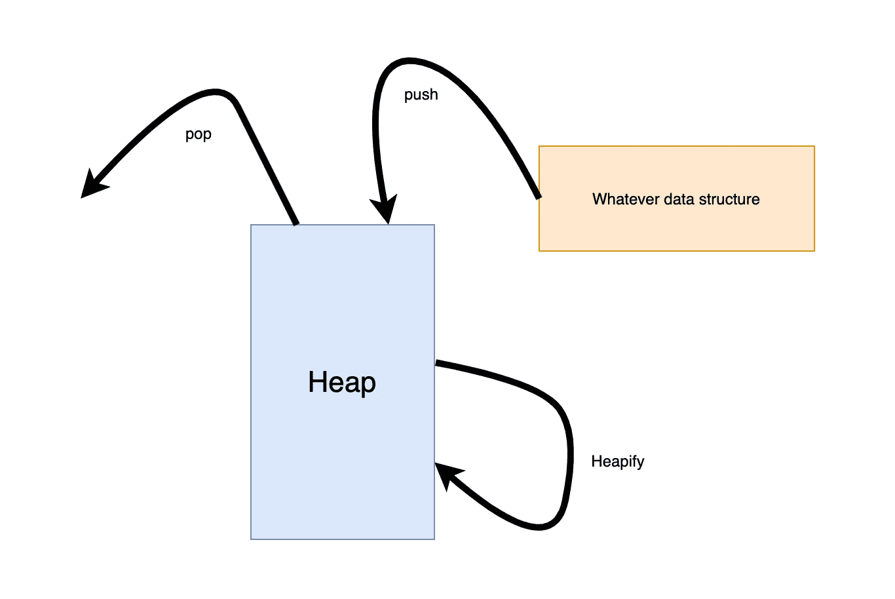

# 破解 FAANG 访谈中的堆算法

> 原文：<https://blog.devgenius.io/a-methodology-to-ace-the-heap-algorithms-question-c7063b2ba7fd?source=collection_archive---------0----------------------->

## 通过方法、示例问题和解决方案…..

照片由 [Fotis Fotopoulos](https://unsplash.com/@ffstop?utm_source=medium&utm_medium=referral) 在 [Unsplash](https://unsplash.com?utm_source=medium&utm_medium=referral) 上拍摄

在 FAANG 公司面试中，应聘者总是会遇到一大堆问题。他们确实喜欢问一个问题——Top k。因为这些公司有一个庞大的数据集，他们不可能总是检查所有的数据。寻找 tope 数据总是一个好的选择。在这篇文章中，我想分享我处理堆面试问题的方法。另外，我将分享 2 个典型的堆算法问题——前 K 个频繁，合并 K 个数组。

# 什么是堆？

堆是一个完整的树状数据结构。它有一个父节点、左子节点和右子节点。对于面试来说，最小堆和最大堆是很常见的。

**Max-Heap** :在 Max-Heap 中，父节点上的值必须是所有子节点上的值中最大的。

Min-Heap :在 Min-Heap 中，父节点上的值必须是所有子节点上的值中最小的。

# 堆积方法学

这是帮助思考解决方案的方法:

*作者图片*

对于大多数流行的数据结构问题。这个特性是共同的:我们必须做类似排序的步骤。我们可以对所有元素排序:heapsort。我们可以只对几个元素进行排序:top-k。这些元素应该是可比较的。否则，我们可能不得不将一些可比较的值与元素一起推出。

**Push** :我们推送一些类似 int 的元素。有时我不得不推一个可比的物体。无论我们推动什么，我们都是为了比较和健康。

**Heapify** : Heapify 是通过将二叉树中的节点重新排列成最大堆或最小堆，将二叉树转换成堆数据结构的过程。

万一你的面试问题之一是实现 heapify，这里我附上代码:

在这种情况下，我们必须将节点推到堆中。因为堆的表示是一个数组。它将新节点附加到末尾，并将其堆化。下面是最大堆的代码:

对于每次插入，堆化节点需要 O (log K)时间，K 是堆的大小。

**Pop** :现在是时候得到我们想要的了。这里我们有两种情况:

*   我们使用堆根上的值。如果需要的话，我们可以使用 **heap[0]** 来检查最上面的一个，如果我们在问题中有一些额外的条件。在我们得到值之后，我们可以把它放在一个数组中，或者按照问题的要求做额外的工作。
*   在其他情况下，我们需要堆中的其余值。我们可以遍历堆并返回它。

# 练习

这里我用 python 提供解决方案。对于大多数算法问题，它不仅仅是一个解。最好给出不同的解决方案，分析时间/空间复杂性，然后选择最佳方案。

在 python 中，我们有 [heapq](https://docs.python.org/3/library/heapq.html) 库来帮助我们正确地操作堆。它有*n 最大的*和*n 最小的*，我们可以用一行代码解决 top-k 类型的问题。但是，为了确保您能够更好地理解 Heap，让我们一步步来。

## 前 K 名频繁

下面是 leetcode 上的参考[题](https://leetcode.com/problems/top-k-frequent-elements/)。我们只需找到数组中前 K 个频繁值。

以下是代码中的步骤:

*   将数组转换为一个新数组，其中的元素是一个具有值和频率的元组。
*   将元组元素推到 k 大小的堆中。每当有新节点被推入时，堆就自动堆积。
*   在我们遍历完堆中的所有元素后，我们循环堆的其余部分来找到我们的目标值。

如果你在推一个物体，你必须确保这个物体是可比较的。如果你推一个 tuple，堆比较第一个元素，同时做 heapify *，*如果发生 ties，它将比较下一个值*。*

## 合并 K 个数组

下面是 leetcode 上的参考[问题](https://leetcode.com/problems/merge-k-sorted-lists/)。我们必须合并 k 个排序链表，并将其作为一个排序链表返回。下面是使用堆的解决方案:

以下是代码中的步骤:

*   我们用列表中每个 ListNode 的第一个节点及其值构建一个数组。然后我们把它堆成一个小堆。
*   我们使用堆中的 peek 节点来构建输出 ListNode。
*   如果节点没有结束，我们使用 heapreplace，这意味着我们从*堆*中弹出并返回最小的项目，并且也推送新的*项目*。

在这里，我想用优先级队列来解释这个问题的另一个解决方案。

优先级队列是抽象的数据结构，其中队列中的每个数据/值都有特定的优先级。
优先级队列是队列的扩展，具有以下属性。
1、优先级高的元素在优先级低的元素之前出队。
2、如果两个元素具有相同的优先级，则按照它们在队列中的顺序被服务。

以下是代码中的步骤:

*   从列表中的每个元素中，我们在 ListNode 中找到第一个节点及其值，将其放入优先级队列。我们需要节点值，因为我们需要它在优先级队列中进行比较。
*   然后，我们从优先级队列中获取元素(具有最小值的元素)，将其链接到输出 ListNode。
*   我们将节点移动到下一个，如果它存在，我们将它放入优先级队列。在所有这些步骤之后，我们返回输出 ListNode，它是 head.next。

# 最后的话

读完这篇文章后，您可能会认为使用这种方法堆并没有您想象的那么难。然而，我们可能有其他的数据结构，比如 LinkedList。因此，我们仍然需要用您喜欢的语言练习和掌握基本的数据结构 API。

希望你能从这篇文章中学到一些东西。如果你有兴趣阅读我的其他文章，欢迎查看我的个人资料。祝你求职顺利！