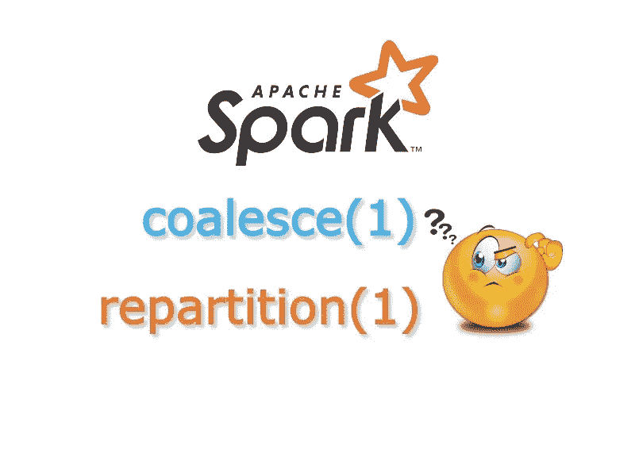
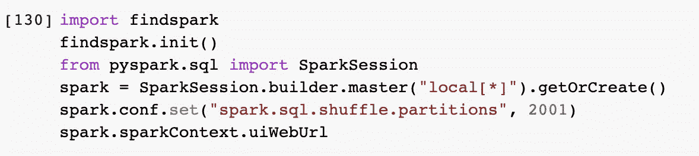
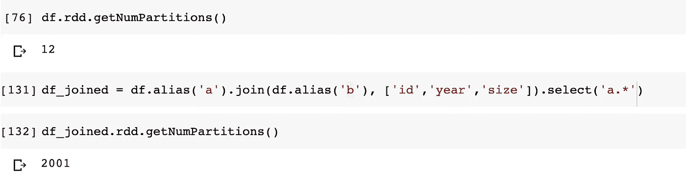
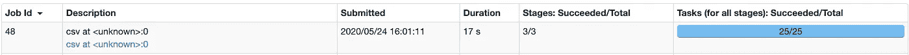
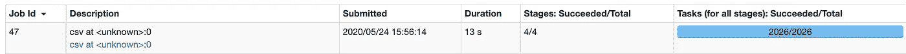
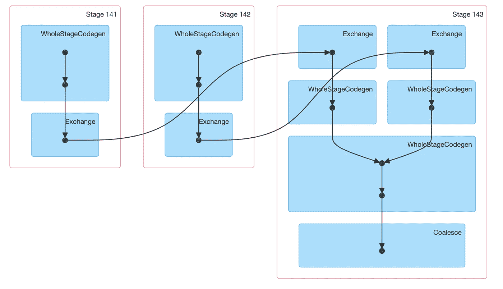
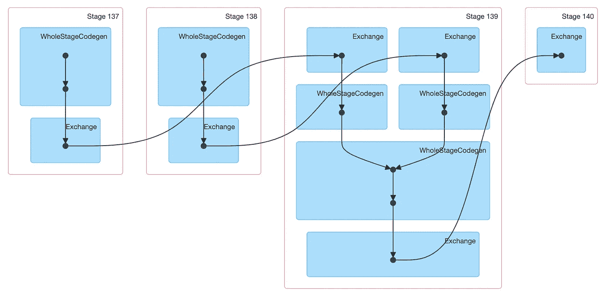
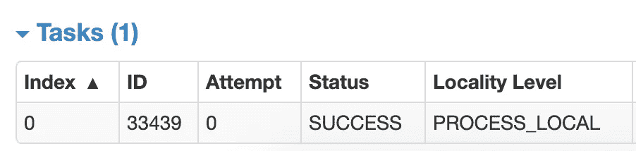
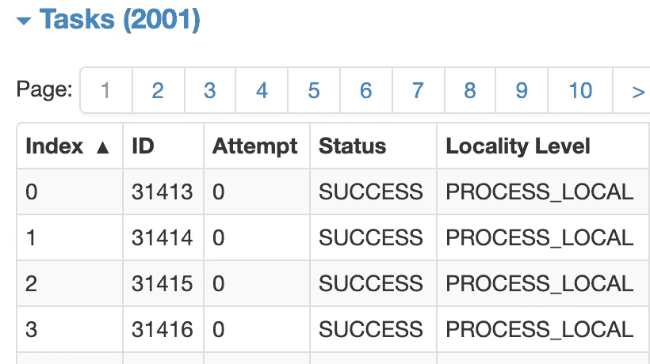
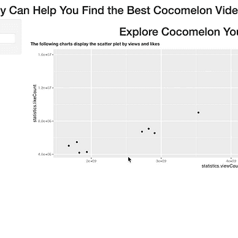

# 关于 Apache Spark 的一个被忽略的事实:合并和重新分配的性能比较

> 原文：<https://blog.devgenius.io/a-neglected-fact-about-apache-spark-performance-comparison-of-coalesce-1-and-repartition-1-80bb4e30aae4?source=collection_archive---------0----------------------->

## 使用 coalesce(1)或 repartition(1)时 Spark 运行速度比预期慢的另一个原因是



关于 Apache Spark 的一个被忽视的事实:coalesce(1)和 repartition(1)的性能比较(作者)

在 Spark 中， **coalesce** 和 **repartition** 都是众所周知的函数，可以根据人们的明确要求来调整分区的数量。人们经常更新配置:`spark.sql.shuffle.partition`来改变分区的数量(缺省值:200)，这是 Spark 性能调优策略的一个重要部分。尽管在 Spark 中调整`spark.sql.shuffle.partition`来减少计算时间是一项艺术，但如果分区数量很大，这可能会导致一些令人头疼的问题。由于此配置控制 HDFS 中最终文件的数量，它可能与您想要的不一样，有时您可能只想要一个文件。在本文中，我们将讨论 Apache Spark 在 **coalesce(1)** 和 **repartition(1)** 之间被忽略的部分，这可能是您在检查 Spark 作业性能时需要注意的一件事。

减少文件数量的常见方法是减少分区数量，我们可以在代码中显式调用 **coalesce** 或 **repartition** 来实现这一目标。如果您有一个 Spark 数据框架，并且希望将输出文件的数量改为一个，那么您应该主要写下以下内容:

```
df.**coalesce**(1).write.format("csv").save(filepath)
// OR
df.**repartition**(1).write.format("csv").save(filepath)
```

两者都应该给你正确的结果，**合并**或**重新分配有什么区别？**

## 合并和再分配的定义

这两个函数都是[数据集](https://spark.apache.org/docs/latest/api/scala/index.html#org.apache.spark.sql.Dataset)类中的方法。来自官方 Spark 文档:

> **coalesce:** 当请求更少的分区时，返回一个正好有`*numPartitions*`分区的新数据集。
> 
> **重新分区:**返回一个新的数据集，它正好有`*numPartitions*`个分区。

类似于`cache()`的功能，叫做`persist(StorageLevel.MEMORY_ONLY)`。如果我们看一下 [Spark 源代码](https://github.com/apache/spark/blob/master/core/src/main/scala/org/apache/spark/rdd/RDD.scala#L482-L484) , **重新分区**是一个友好的名字，通过直接调用 **coalesce** 但是将 shuffle 锁定为 true。

```
coalesce(numPartitions, shuffle = true)
```

正如你所看到的，**重新分配**将触发洗牌，这是一个昂贵的操作。另一方面，没有 shuffle 标志的 coalesce 不会执行 shuffle，因此会导致狭窄的依赖关系。

## 合并(1)和重新划分(1)性能评估

> 如果要增加分区数量，请使用 repartition，如果要减少分区数量，请使用 coalesce，在减少分区数量时，`*coalesce*`的性能优于`*repartition*`。— —在线推荐

以上推荐总体来说还是不错的。然而，它不是一颗银弹。在这种情况下，如果你认为`*coalesce(1)*` 可以适用于所有你想保持单个文件结果时的场景，请继续阅读，我们可以展示结果。感谢谷歌，我们将使用谷歌的 Colab 进行调查。

*   将 spark 会话中的“Spark . SQL . shuffle . partitions”显式设置为 2001，以便能够注意到差异。如果您想使用 Spark UI，您需要使用 colab 的本地计算模式。



在 Colab 中初始化 Spark(作者)

*   用在线数据集创建一个简单的 Spark 数据框架，这里我们 [craigslist-car-data](https://www.kaggle.com/austinreese/craigslist-carstrucks-data/data#) 。数据集的内容或模式在我们的性能测试中无关紧要。
*   初始分区将与 colab 给我们的内核相同，或者如果您运行在本地模式，它将与内核相同。在执行 join 操作之后，您会注意到分区与我们最初设置的一样。为了进行演示，我们在这里使用自连接，但是您可以假设将不同的数据帧连接在一起。



检查分区数量(按作者)

*   现在我们可以尝试使用 coalesce(1)编写输出并检查 Spark UI

```
df_joined.coalesce(1).write.csv(‘/tmp/coalesce’)
```



合并(1)性能(按作者)

*   然后，我们可以尝试使用 repartition(1)来编写输出

```
df_joined.repartition(1).write.csv(‘/tmp/repartition’)
```



再分配(1)性能(按作者)

正如您所注意到的，合并(1)需要大约 17 秒，总共只有 25 个任务，而重新分区(1)需要 13 秒，总共有 2026 (2001+25)个任务。

如果我们看 DAG，coalesce(1)有三个阶段，但是 repartition(1)有四个阶段。



coalesce(1) DAG(按作者)



重新分区(1) DAG(按作者)

在这种情况下，由于 repartition(1) envoke shuffle，您会在 Spark UI 上看到第四个阶段。如果您单击 coalesce(1)的 join 阶段，并检查与 repartition(1)比较的任务数量，您会很快发现瓶颈在哪里。我们只使用一个分区来执行 join 操作，另一方面，repartition(1)仍然使用 2001。如果你有一个巨大的数据集，你需要执行连接或洗牌一个分区不会利用火花优势，使并行执行。



合并(1)个分区(按作者)



重新分区(1)分区(按作者)

被忽略的事实是执行 coalesce(1)并避免洗牌，它收缩其父 RDD 以显式使用相同数量的分区。相反，repartition(1)保留其父分区的数量。如果在一次昂贵的洗牌后立即调用 coalesce(1 ),您会在 Spark UI 上看到这种行为。我们注意到在一个数据集中只有大约 1.5GB 的差异。对于大型数据集，差异可能会更大。

## 最终想法

Spark API 页面上也记录了性能事实。您需要展开 **coalesce** 函数来查看细节。

> 但是，如果您正在进行剧烈的合并，例如 numPartitions = 1，这可能会导致您的计算在比您希望的更少的节点上进行(例如，在 numPartitions = 1 的情况下只有一个节点)。为了避免这种情况，您可以调用 repartition。这将增加一个 shuffle 步骤，但意味着当前的上游分区将被并行执行(无论当前的分区是什么)。— [Spark 文档](https://spark.apache.org/docs/latest/api/scala/index.html#org.apache.spark.sql.Dataset)

在我们之前演示的示例中，这是一个剧烈的合并，由于没有并行性来执行 join 操作，所以性能很差。总之，Spark 中没有合并和重新分配的灵丹妙药。这取决于您的数据量和您的业务逻辑，以检查您最终是否希望使用合并和重新分区。有些情况下，您需要在 Spark 中以不同的方式处理在线推荐；在匆忙下结论之前，自己先试一试是个好主意。

**下面是上面**所示例子的详细代码

[](https://colab.research.google.com/drive/1V09wHg1P0tppAB2QBKpdAqc0DJ0z6r_9?usp=sharing) [## 火花 _ 性能 _ 比较 _ 联合 _ 重新分配

### Colab _ 示例

colab.research.google.com](https://colab.research.google.com/drive/1V09wHg1P0tppAB2QBKpdAqc0DJ0z6r_9?usp=sharing) 

希望这个故事对你有帮助。本文是我的工程&数据科学系列的**部分，目前包括以下内容:**


[赵承志](https://chengzhizhao.medium.com/?source=post_page-----80bb4e30aae4--------------------------------)

## 数据工程和数据科学故事

[View list](https://chengzhizhao.medium.com/list/data-engineering-data-science-stories-ddab37f718e7?source=post_page-----80bb4e30aae4--------------------------------)49 stories

你也可以 [**订阅我的新文章**](https://chengzhizhao.medium.com/subscribe) 或者成为 [**推荐媒介会员**](https://chengzhizhao.medium.com/membership) 无限制访问媒介上的所有故事。

如果有问题/评论，**请不要犹豫，写下这个故事的评论**或通过 [Linkedin](https://www.linkedin.com/in/chengzhizhao/) 或 [Twitter](https://twitter.com/ChengzhiZhao) 直接**联系我。**