# 通过 AWS CLI 用 Apache 服务器创建 EC2 实例的新手指南

> 原文：<https://blog.devgenius.io/a-newbies-guide-to-creating-an-ec2-instance-with-an-apache-server-via-the-aws-cli-5bdfc8aaae53?source=collection_archive---------17----------------------->

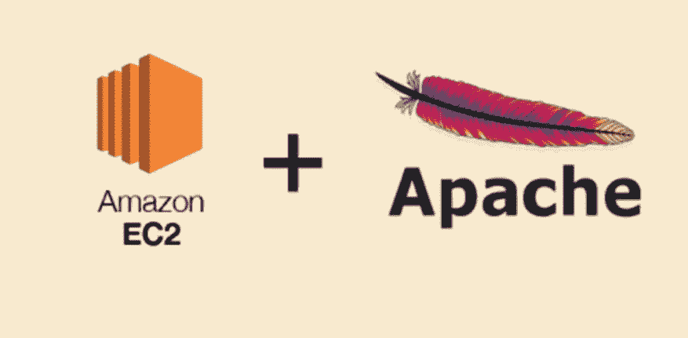

如果你一直在关注我的 DevOps 之旅，你可能还记得我的第一个项目是关于“[如何在 Ubuntu](https://cromyhector.medium.com/how-to-install-apache-web-server-on-ubuntu-fd5c8391adc2) 上安装 Apache Web Server”的演练。六个星期过去了，我们学到了很多，也为我们的武器库增加了很多。有趣的是，生活中有些时候事情会回到原点，这篇文章就是一个很好的例子。基于过去 6 周获得的知识(由技术水平提高提供)，今天的指南是一个初学者友好但广泛的关于使用 AWS CLI 和 Apache 服务器创建 EC2 实例的演练。

到目前为止，我们应该对什么是 Apache 服务器有所了解。但是 EC2 是什么呢？什么是 AWS CLI？让我们迅速填补这些空白。

EC2 也称为弹性云计算，是一台可以用作服务器的虚拟或物理计算机。名称中的“云”一词意味着可以通过互联网访问该计算机。最后但并非最不重要的一点是,“弹性”一词意味着该计算机可以复制以扩大规模，即满足不断增长的网络需求，也可以在需要时缩小规模。

据亚马逊*称，AWS 命令行界面是管理 AWS 服务的统一工具。只需下载和配置一个工具，您就可以从命令行控制多个 AWS 服务，并通过脚本自动化它们*。通俗地说，CLI 允许我们通过资源和资源(资源和服务)理解的语言与它们交流。或者我喜欢称之为“超能力”。

**目标:目标:**

创建一个 t.2 或 t.3 微 EC2 实例

使用一个脚本来更新所有包，安装 Apache，并启动服务

验证该实例通过公共 IP 下载并安装了 Apache 服务器

***先决条件*** 。

最新安装的 AWS CLI 版本

终端(Windows 终端或 PowerShell)。

通过 IAM 用户访问 AWS 帐户

文本编辑器，如 VIM

现在让我们开始吧。

***步骤 0:生成访问&密钥 ID 的***

这是至关重要的前期第一步。

为了通过命令行访问 AWS，需要访问密钥和秘密访问，以便将您的终端配置到 AWS 控制台。

登录 AWS 控制台后，请前往搜索栏并键入“IAM”

现在将显示 IAM 仪表板。进入控制面板后，在左侧的访问管理下，单击用户

选择您的 IAM 用户名。

打开安全凭证选项卡，然后选择创建访问密钥。

若要查看新的访问密钥，请选择“显示”。您的凭据如下所示:

访问密钥 ID:

秘密访问密钥:

要下载密钥对，请选择下载。csv 文件。存储。安全位置的带密钥的 csv 文件。

完成后，我们现在可以进入下一步了

***步骤 1:配置 AWS CLI***

现在，为了访问 AWS 的全部命令，我们必须配置我们的终端。把这想象成某种配对。从你的终端输入命令: ***aws 配置*** 。

然后，系统会提示您输入上一步中的访问密钥和访问密钥 id。接下来是你的默认区域和你的默认输出格式，应该是 JSON(见下图)。

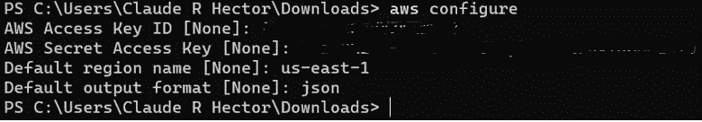

***第二步:生成密钥对***

为了让我们连接到任何 AWS EC2 实例，我们将需要一个密钥对。可以将密钥对视为一种身份验证工具或安全凭证，用来证明您的身份。要生成密钥对，请在您的终端上输入以下命令:***AWS ec2 create-key-pair—key-name<key pair name>—query‘key material’—output text><key pair name>。pem***

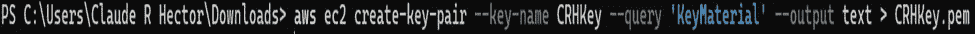

您可以进入 EC2 仪表板，点击 key pairs，仔细检查上述步骤，您的密钥对应该会列出。

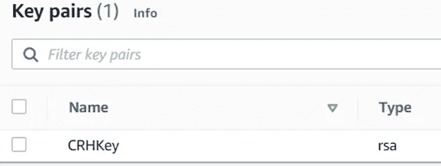

在继续下一步之前，让我们更改密钥对的权限，以确保我们(用户)是唯一拥有读取权限的人。这可以通过输入以下命令来实现:***chmod 400<key pair name>。pem***

***第三步:创建安全组***

谈到网络安全，安全组是必不可少的一部分。现在，将安全组视为一个附加的保护层或防火墙，它控制 EC2 服务器的入站和出站流量。现在，在我们创建安全性之前，我们必须找出我们的 VpcID。输入以下命令查找:***AWS ec2 describe-vpcs***

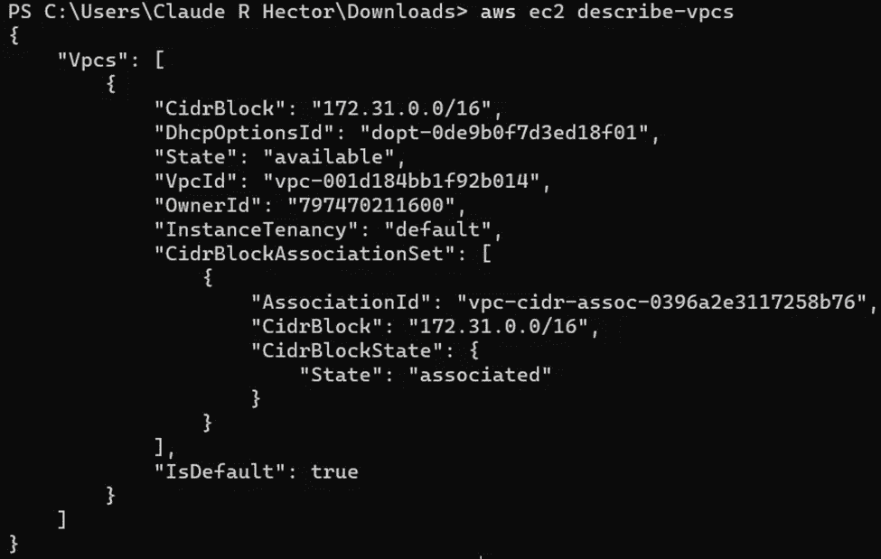

现在我们已经准备好了 VpcId，可以通过输入以下命令来创建我们的安全性:***AWS ec2 create-security-group—group-name<SecurityGroupName>—description“My security group”—VPC-id<VPC id>***

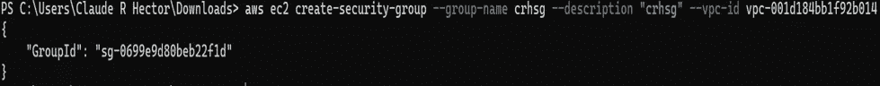

请务必复制给定的 GroupID，因为它很快就会派上用场。

***步骤 4:将规则添加到安全组***

在这一步中，我们将向安全性添加允许 SSH 和 HTTP 访问的规则。简单地说，SSH 允许与我们的服务器进行远程通信，而 HTTP 允许我们的实例是公共的。

要允许 SSH 流量，请输入以下命令:***AWS ec2 authorize-security-group-ingress—group-id<security group PID>—协议 tcp —端口 22—CIDR<IP address>/32***

要允许 SSH 流量，请输入以下命令:***AWS ec2 authorize-security-group-ingress-group-id<security group PID>—协议 tcp —端口 80 — cidr 0.0.0.0/0***

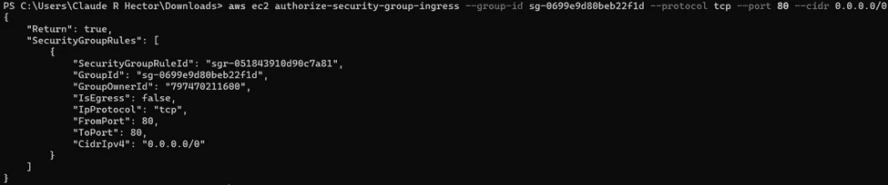

***第五步:启动 EC2 实例***

现在，要启动并运行我们的实例，我们需要一些东西。先说我们的 AMI ID 镜像。从你的亚马逊控制台进入计算，然后选择 EC2。

然后启动一个 EC2 实例。请记住，我们不是从控制台启动实例，我们只是试图获取映像 AMI ID 映像。在进入下一步之前，请务必复制它。

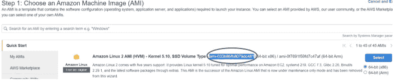

我们还需要一个子网 ID。您可以通过 AWS 控制台找到您的子网，方法是在搜索栏上键入 VPC，然后选择子网。

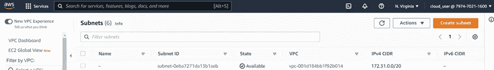

或者在终端上输入以下命令: ***aws ec2 describe-subnets。***

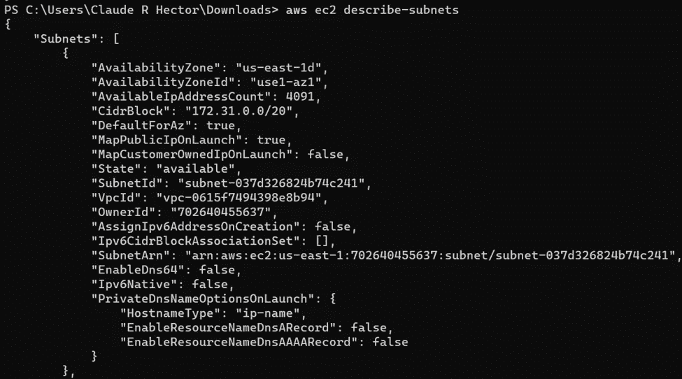

确保复制子网 ID，因为也需要它。

最后但同样重要的是，整个启动过程将通过一个脚本来引导。自举仅仅意味着自动化，脚本只是一系列的命令。现在为了自动化，我们首先需要通过输入以下命令创建一个名为 user 的脚本:***vim bootstrapscript . sh***

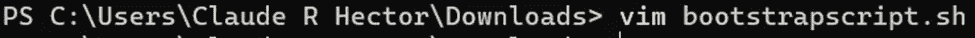

在文本编辑器中键入:set paste，单击 I 进入插入模式，然后粘贴下面的脚本

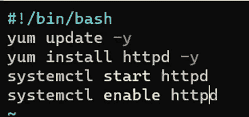

粘贴完脚本后，按 Esc 键退出插入模式，键入:wq！保存您的更改并退出文本编辑器。

我们有自己的 AMI 映像 ID、子网 ID，我们已经在文本编辑器中创建了一个脚本

现在是关键时刻了。让我们通过输入以下命令来启动我们的 EC2 实例:***AWS EC2 run-instances—image-id<AMIImageID>—count 1—instance-type T3 . nano—key-name<key pair name>—security-group-ids<security group PID>—subnet-id>—user-data file://user script . sh***

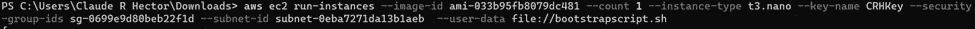

如果您得到了与下面类似的屏幕，请将其视为确认您的脚本工作正常，并且 EC2 实例已经创建。

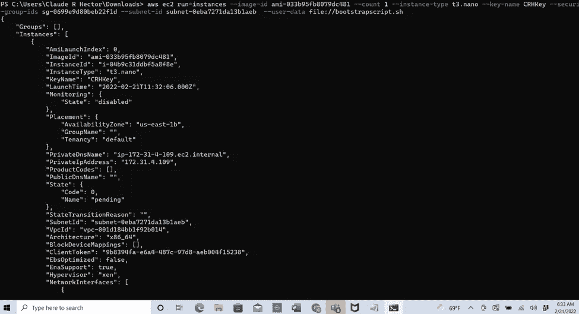

现在，让我们回到我们的 AWS 控制台，更具体地说是我们的 EC2，进行仔细检查。

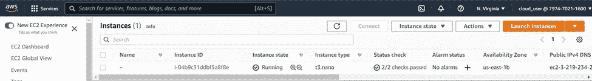

现在，让我们从实例中选择复选框，以获取我们的公共 IP 地址，然后我们将使用该地址来仔细检查是否一切都已设置并正常工作。让我们复制它并粘贴到一个单独的选项卡中。

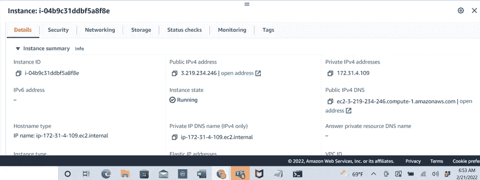

瞧，我们活下来了！！！！！

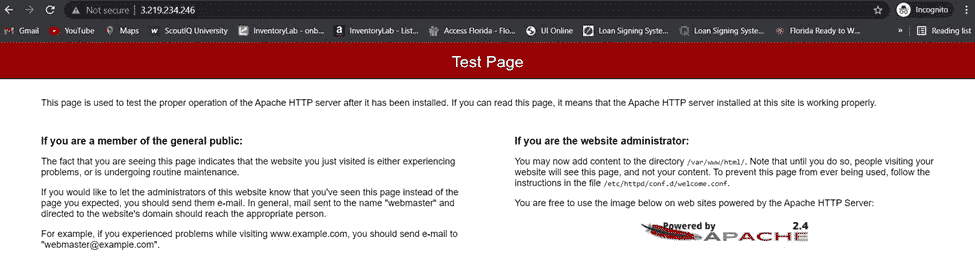

如果您已经做到了这一步，并且遵循了上面的步骤，那么您已经成功地并且应该知道使用 AWS CLI 启动一个带有 Apache 服务器的 EC2 实例。

直到下一次，

你友好的邻居云开发工程师。