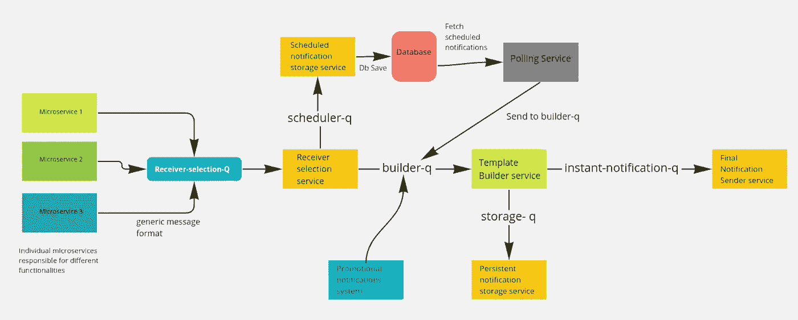

# 社交网络的通知架构—每天发送数百万条通知

> 原文：<https://blog.devgenius.io/a-notification-architecture-for-social-networks-send-millions-of-notifications-per-day-e29cb369e62f?source=collection_archive---------0----------------------->

通知是所有移动应用的生命线。如果一个不流行的应用程序停止发送通知，人们往往会忘记它甚至已经安装在他们的手机上。在大多数情况下，应用程序发送的通知类型分为两个不同的类别

*   **交易通知** —向您更新与您的账户相关的一些事件/操作。举几个例子——当有人在 Twitter 上关注你时，你会收到通知。当您在线订购食品时，您会不断收到订单更新的通知。当您预订出租车时，您会不断收到有关预订状态的通知。这些都是事务性通知
*   **促销通知** —向您更新该应用程序运行的最新优惠/竞赛/营销活动，以促进销售额/在该应用程序上花费的时间或移动其他指标。

在大多数情况下，事务通知的数量本质上是有限的。每个产品特性或流程大约有 1-5 个通知，只有少数产品流程在 80%的时间里被用户使用。移动应用程序通常会向您发送比交易通知更多的促销通知。但是，这种模式也有一些例外，这些例外就是**社交网络和消息应用**。

对于社交网络和消息应用程序，交易通知的数量取决于**可变因素**，例如-

*   **日活跃用户数量** (DAU)
*   **网络上建立的连接数**
*   **每个连接的活动**(你有几个经常发短信的朋友)
*   **你在网络上的突出地位**——知名度高的人往往会收到更多的活动，因此会收到更多的通知。
*   **内容创建行为** —例如，每个账户的推文数量高于 Instagram 每个账户的帖子数量。

我肯定我漏掉了一些要点，但你已经明白了要点。通知的数量实际上不由组织控制，因为它们取决于用户行为。公司使用不同的技术，并为他们的高层影响者提供工具来限制干扰(通过限制通知)，但即使这样，发送(或生成/更新)的通知数量也相对较高。

# 这就给我们带来了一个问题——如何为社交网络设计一个通知发送架构？

在为 [Leher App](https://play.google.com/store/apps/details?id=com.leher) 设计通知发送架构时，我也遇到了类似的挑战。这是一个基于社区的音频/视频第一社交网络(类似于[俱乐部](https://www.clubhouse.com/)，但更古老，功能更多)。我们的主要受众是印度二线/三线城市的人们。在写这篇文章的时候，我们每天发送数百万条通知！以下功能会生成这些通知-

*   **直接消息** —当用户 A 向用户 B 发送消息时
*   俱乐部信息 — Leher 是一个社区第一的社交网络。想象一个类似 WhatsApp group 的俱乐部，但成员数量没有限制。我们有许多超过 10k+成员的俱乐部，管理员可以向他们广播消息。
*   **音视频直播间** —平台上很大一部分的交流都是通过音视频直播间(类似于 Clubhouse 和 Twitter 空间)完成的，大量的通知都是因为他们而发出的。
*   **网络通知** —当有人关注你的账户或加入你的社区时
*   **支付通知** —我们在平台上有两种不同类型的虚拟货币，具有用户之间 P2P 转账的能力。所有这些流都有许多与之相关的通知(例如，支付成功、失败等。)
*   **每日游戏预定通知** —每日刮刮卡、用户条纹等。这些信息会发送给平台的所有活跃用户。
*   **促销通知** —之前，我们使用第三方工具，如 Clevertap 等。，用于发送促销通知。但是随着规模的扩大，它们对我们来说变得非常昂贵，我们已经开始利用我们的交易通知交付系统来处理这些促销通知。

同样，我肯定我错过了一些通知类型(我的工程团队无疑会指出来)，但是我希望它能很好地描述系统的复杂性。让我们谈谈我在设计解决方案时的高级产品需求。

# 高级产品要求

我们是一家以疯狂的速度成长的创业公司。因此，写下通知系统的确切产品要求实际上是不可能的。因为，不像 Twitter/Linkedin/Instagram，我们要不断增加新功能(同时去掉一些旧功能)来满足用户需求。这些功能和产品旅程中的每一个都可以添加与通知相关的多个需求。我们还必须在促销通知系统中进行各种实验。因此，我只有以下高层次的产品需求清单-

*   **通知模板应该是可配置的** —我们需要在不影响其他服务功能的情况下尽可能多次地更改通知模板。这个想法是有能力为不同的通知类型运行 [**A/B 测试**](https://vwo.com/ab-testing/) ，也有能力在未来将这些模板扩展到其他印度语言。(我们目前仅支持印地语和英语)
*   我们应该能够**创建和删除新类型的** **通知**而不会有太多的麻烦。
*   **能够仅保留一些通知推送** —我们在应用程序上有一个通知屏幕，但我们不会存储所有的通知。像许多组织一样，我们在持久存储中仅存储少量通知(针对特定通知类型进行了一些定制)。
*   **安排通知的能力** —我们需要为 Y 用户安排未来某个 X 点的通知。
*   **能够快速更改通知架构**而无需更改单个微服务——我们有一个基于微服务的架构，运行 80 多种服务来支持各种平台功能。我们需要能够设计一个通知架构，不需要多次改变这些独立的服务。(因为这只会进一步增加复杂性)。所以单个微服务和通知架构之间的通信格式应该尽可能通用。
*   **用户个性化控制** —用户应该能够关闭接收特定类型的通知。他们还应该能够设置他们希望接收通知的频率。

这些是高层次的产品需求。现在，让我们谈谈高层次的工程需求(或者在这样的系统中要解决的工程问题)

# 要解决的工程问题

除了产品要求，我还得考虑很多工程问题。以下是其中的一些-

1.  **高可扩展性** —一个未送达的通知就少了一个日活跃用户！这是成长中的创业公司的真理。因此，有必要使系统高度可靠、可用和可水平伸缩。
2.  与语言/工具无关的 —像大多数微服务架构一样，我们使用多种编程语言和工具(数据库、文件系统等)。).我们需要一个不受此影响的架构。
3.  **可观察性**——你不能优化你不能测量的东西。我们需要测量、跟踪和准确定位问题的能力，以便更快地解决问题。
4.  **缩放调度器** —任何曾经编写过调度系统的人都会理解这一点。对于其他人，等待不同的博客帖子。
5.  **安全性**——我们需要尽可能地保持这个系统的私密性和安全性。
6.  **性价比**——这还需要我解释吗？这是我设计的每个系统的实际需求。

既然你已经了解了在这样一个系统中问题陈述的复杂性，让我向你展示我的解决方案。为了使解释尽可能对初学者友好和简单，我将只解释高级架构、数据流和执行中使用的工具。我不会详细讨论每个服务的实现。但是，如果你正在开发这样一个系统并面临问题，我的 DMs 永远是开放的。请在 [LinkedIn](https://www.linkedin.com/in/theguywithideas/) 和 [Twitter](https://twitter.com/theguywithideas) 上找到我。

# 无耻的插头

你好。在提出解决方案之前，我决定做一个不要脸的塞。如果你想了解更多关于构建高性能、高性价比的分布式系统的知识，我已经为你创建了一个名为 [cloudeasy.club](https://cloudeasy.club/) 的专门学习社区。通过加入这个俱乐部，你可以学习系统设计、软件架构和分布式系统。你可以在[Discord](https://discord.com/invite/a5yWrRnyRf)([discord.com/invite/a5yWrRnyRf](https://discord.com/invite/a5yWrRnyRf))或者[Whatsapp group](https://link.cloudeasy.club/kBMf)([link.cloudeasy.club/kBMf](https://link.cloudeasy.club/kBMf))上找到我们。另外，如果你有任何问题，请随时在推特或 LinkedIn 上联系我。

# 解决方案:我们的通知系统的高层设计

[点击此处打开质量更好的图像](https://cdn.hashnode.com/res/hashnode/image/upload/v1650715913797/g0brexYbo.png?auto=compress,format&format=webp)

# 系统的工作——数据的流动

整个系统基于不同微服务之间的异步通信，具有明确的 [**关注点分离**](https://en.wikipedia.org/wiki/Separation_of_concerns) 。这使我们能够更快地进行更改，控制总吞吐量，并相对容易地监控系统。让我们一步一步地浏览数据流

1.  各个微服务(负责不同的功能)将一个具有通用消息格式的**发布/订阅事件**发送到一个名为**接收方选择 Q** 的发布/订阅队列中。这种通用的消息格式确保了我们可以跨服务对其进行标准化。我不能在这里透露确切的消息格式，但它类似于这样的东西— **{notificationType，entityType，entityId，sendType}**
2.  这些消息由负责寻找该通知的接收者的 ***接收者选择服务*** 消费。该服务包含查找这些接收者的业务逻辑。它还知道特定的通知类型应该被安排在以后还是立即传送。我们的接收者选择服务本身是一个复杂的系统，超出了本博客的范围。以后我会为此写一篇不同的博文。请注意，无论接收方的数量是多少，每个通知只接收一个发布/订阅事件。
3.  如果通知应该被调度为稍后发送，则它被发送到另一个名为 ***调度器队列*的发布/订阅队列。**然后由计划的通知服务使用，该服务将通知保存在数据库中。然后，轮询服务以预定的时间间隔查询数据库，并将这些预定的通知发送到生成器队列进行进一步处理。
4.  如果通知应该立即发送，它直接进入 ***生成器队列*** 。请注意: ***builder-q*** 接收每个接收者的单独事件。例如，假设您正在一个社区中发送消息，该社区包含 1000 名成员。在这种情况下，队列将收到 1000 条不同的发布/订阅消息，每条消息对应一个要发送的通知。
5.  构建器队列中的消息然后由 ***模板构建器服务*** 消费，该模板构建器服务负责根据通知类型生成最终通知文本，然后将其发送到 ***即时通知队列*** 。该模板构建器服务还负责理解用户的语言偏好，并以该语言生成通知。它还使我们能够通过更改一个特定通知类型的配置来进行 A/B 测试。
6.  如果通知消息应该保留在我们的数据库中，模板构建器服务也将相同的消息发送到 ***存储队列*** 。一个专门负责存储通知(并为通知屏幕分组)的服务使用这个消息并完成它的工作。
7.  最终消费者服务消费来自 ***即时通知-q*** 的消息，然后负责将它们交付给最终用户。在发送通知之前，它还会考虑最终用户的通知首选项和个性化设置。
8.  如前所述，我们的促销通知系统也利用相同的通知发送系统，因此它直接发送构建器队列中的消息，以便将其发送给相关用户。这也是我们开发的一个令人兴奋的系统，我将在另一篇博客文章中解释它。

上述架构和数据流使我们能够解决我前面提到的所有产品和工程问题。如果你有任何问题，请在评论中提问。

# 使用的工具和技术

现在您已经理解了架构图和数据流，让我们来讨论一下所使用的各种工具和技术。

*   [**Google cloud**](https://cloud.google.com/pubsub)发布/订阅——接收者选择-q、构建者-q、存储-q 和即时通知-q 都是由 GCP 发布/订阅支持的发布-订阅队列。如果您想使用它，请检查[死信队列和指数补偿设置以及](https://cloud.google.com/pubsub/docs/handling-failures)
*   **服务** —接收器选择服务、模板构建器服务以及上图中提到的所有其他服务都是用 [Go 编程语言](https://go.dev/)编写的。
*   **数据库** —为了存储和检索，我们使用 [MongoDB](https://www.mongodb.com/) 作为我们的主数据库，在某些地方借助 [Redis](https://redis.io/) 。
*   **部署** —在 Kubernetes 集群中使用[部署](https://kubernetes.io/docs/concepts/workloads/controllers/deployment/)协调所有服务，该集群具有[水平 Pod 自动扩展](https://kubernetes.io/docs/tasks/run-application/horizontal-pod-autoscale/)设置。这种部署设置使得整个应用层可以自动伸缩。它会根据负载不断增加和减少这些应用程序的实例数量。

# 可扩展性和未来挑战

在架构上，除了**接收器选择服务**和**轮询服务**之外，整个系统都是水平可扩展的。当我们达到每小时一百万次通知的规模时，这是唯一需要重新架构的两个部分。我们是在以当前规模的 100 倍对系统进行基准测试和测试后发现这一点的。它还证明了**系统可以轻松地扩展到每天 5000 万个通知，而不会中断**。我们已经在重写这两个组件的过程中，以解决我们未来的扩展需求。但是，对于一家成长中的社交网络公司来说，上述架构应该足以满足他们的通知交付需求。

# 有问题吗？

如果你有任何问题，请随时在 Twitter 或 LinkedIn 上联系我。