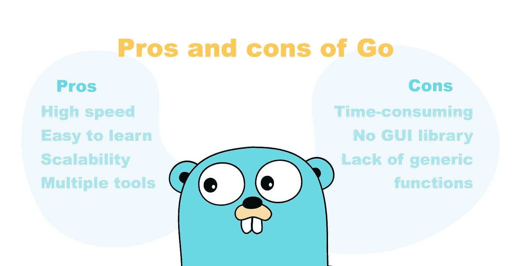
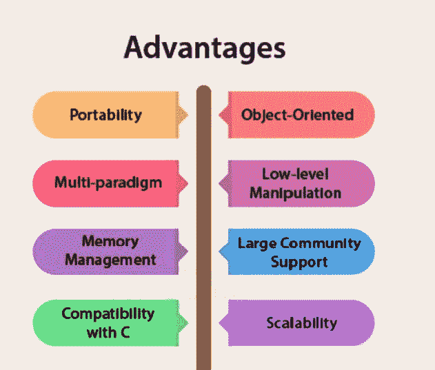
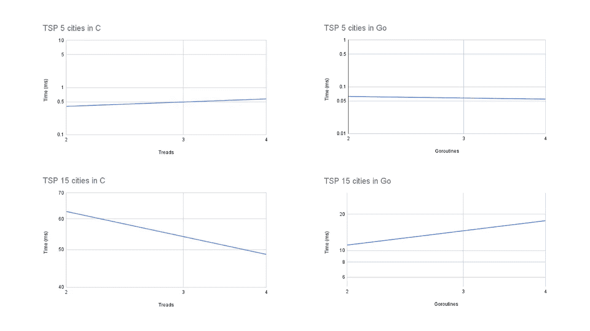

# C 和 Go 的性能分析

> 原文：<https://blog.devgenius.io/a-performance-analysis-of-c-and-go-82a378be8c87?source=collection_archive---------3----------------------->

在本文中，我们探讨了 C 和 Go 这两种世界上最流行的编程语言的区别、相似之处和用例。c 是有史以来最广泛使用的编程语言之一。Go 是一种 *n 开源编程语言，可以轻松构建简单、可靠、高效的软件*。*从这两者的快速比较开始，然后看看它们在可读性、速度、易学性等方面的表现如何。*

信用:[卡雷卡尔马](https://careerkarma.com/blog/go-vs-c-plus-plus/)

# 介绍

在本文中，我们使用 Go 和 C 语言实现了 Peter Pacheco 所著的《并行编程入门》一书第 6 章中描述的旅行售货员问题(TSP)算法的并行版本。这个问题寻求确定穿过一系列城市的最短路线。(每个人只拜访一次)，回到原来的城市。这是一个 [NP-hard](https://en.wikipedia.org/wiki/NP-hardness)

两个系统都从进程 0 开始读取实例，并将其传播给所有其他系统。所有进程必须复制广度搜索的开始，然后致力于探索一个子树。我们的程序应该静态地在具有全局最佳路由更新的进程之间划分工作。为了比较所实现算法的性能，我们测量了每个进程中 2 或 4 个线程的执行时间。最后，我们使用已知的 TSP 场景来比较实现的性能。重要的是要说，这篇文章比较的是 C 和逆天一个具体算法的性能。性能测试不应该这样进行。

# Go 中的实现

Go(也称为 Golang)是由 Google 的工程师设计的，他们希望这种语言能够提供 C++的效率，但更容易学习、编写、阅读和部署。该语言的 [*Goroutines*](https://gobyexample.com/goroutines) 使开发人员可以轻松构建充分利用并发性的应用，例如通过同时在多个 CPU 内核上部署工作负载来构建主要的电子商务网站。换句话说，非常适合并行计算环境。

学分:[柔化](https://softensy.com/is-go-the-best-programming-language-for-finance-best-practices-and-our-expertise/)

我们的程序使用分支定界法来解决这个问题。这意味着每个实例都包含一条路径、已经通过的边数以及以该路径为起点的往返行程的最小开销。这些实例在一个优先级队列中进行管理，该队列目前被实现为一个基于数组的二进制堆。我们使用 *Goroutines* 来并行执行线程。这个想法是，我们将同时能够更快地达到理想的解决方案。扩展一个实例，生成给定路径的所有可能范围，添加所有可用的边，重新计算边界，最后将这些实例插回到堆中。为了防止队列中出现竞争情况，我们使用同步互斥体。这是一种用作锁定机制的方法，以确保在任何时候只有一个 *Goroutine* 可以访问代码的临界区。

我们解决这个问题的方法是使用下界。我们计算一个值，该值表示具有某个子路径的每个可能路径的确定的最小长度。为此，我们首先计算每个顶点的输出边的最低权重。现在我们可以把所有这些加在一起。我们可以对输入边做同样的事情。因为这两个值是最短路径长度的确定下限，所以我们只需要考虑较高的值。

我们现在有了第一个子路径。它只包含一个顶点，没有边。该路径可以被最后访问的节点(目前唯一的一个)的所有邻居扩展。我们现在最多创建 n-1 个*新候选人。对于所有这些，我们可以再次计算最终的下限。唯一的区别是，在这一点上，我们有一个已知输出权重的节点和一个已知输入权重的节点。*

*由于这个决定可以改变下限，我们现在可以选择最小成本最低的候选。如果有两个候选具有相同的阈值但不同的长度，我们选择较短的一个，因为访问的节点越多意味着阈值更可能是实际的最终值。*

*在某一点上，我们最终会得到一个恰好有 n 条边的“候选项”,它的代价至多等于另一个候选项的下界。所以没有其他更短的路径。你可以通过这个 [repo](https://github.com/matheusroleal/tsp-golang) 访问完整的实现。*

# *用 C 实现*

*c 是一种通用的高级语言，最初是由 Dennis Ritchie 为 Unix 操作系统开发的。它是一种通用的、过程化的计算机编程语言，支持结构化编程、词法变量范围和递归，具有静态类型系统。由于各种原因，c 语言现在已经成为广泛使用的专业语言。通过设计，它提供了有效映射到典型机器指令的结构。*

**

*演职员表: [Quora](https://www.quora.com/Why-should-we-learn-C-in-2021-1)*

*总的来说，实现遵循了彼得·帕切科在参考书中建议的途径。只修改了几个部分。其中之一是在算法开始时，进程 0 需要将问题数据发送给其他进程。我们最终以稍微不同的方式解决了这个问题。我们没有将整个图矩阵发送给其他流程，也没有在宽度方向上重复搜索以在每个流程中生成任务，而是选择在初始流程中进行搜索和划分。在为每个进程生成每个任务堆栈后，主进程只发送生成的堆栈，其他进程在收到现成的堆栈后很快就开始在堆栈上工作。这些进程通过 MPI 进行通信，在每个进程中，我们通过 [*pthreads*](https://man7.org/linux/man-pages/man7/pthreads.7.html) 使用线程。在这些线程之间，我们有一个动态的工作平衡，使用书中描述的策略。*

*至于在宽度上的搜索和任务本身的划分，我们遵循书中建议的逻辑，生成任务并将它们放入队列中，直到我们到达树的一个级别，该级别有几个生成的任务大于进程的数量。这个函数也在每个进程中重复，为每个线程生成不同的任务堆栈。*

*准备好每个进程中每个线程的所有堆栈后，算法开始并行运行。我们有一个角色，负责生成新的旅程，并将它们与迄今为止找到的最佳旅程进行比较。它还执行进程间的动态平衡策略，检查进程是否在等待新任务，并在必要时划分堆栈。*

*最后，在每个线程和每个进程完成它的搜索之后，制定归约策略来找出哪个线程具有最低的旅行成本。我们还遵循书中的建议，使用 *MPI_Allreduce* 操作符来查找具有最佳旅程的流程，然后该流程将有问题的旅程发送到主流程，主流程打印在最终确定算法的屏幕上。这个[库](https://github.com/matheusroleal/tsp-mpi)包含了问题的完整实现。*

# *技术性能分析*

*一些[网页](https://people.sc.fsu.edu/~jburkardt/datasets/tsp/tsp.html)有众所周知的 TSP 的测试文件。我们使用其中一个站点进行测试。我们注意到，当测试有许多实例的场景时，解决这些问题很快变得非常耗时。我们使用一个 5 个城市的场景作为我们的起点，然后扩展到 15 个城市，看看一个稍微复杂一点的场景。正如我们在下面的结果中看到的，Go 中的实现比 c 中的实现获得了更好的结果。*

**

*我们在 Go 中的第一个实现比在 c 中的算法性能差 3 倍。在快速搜索中，可以找到证明这种差异与像 Go 这样的语言的[垃圾收集](https://en.wikipedia.org/wiki/Garbage_collection_%28computer_science%29)特性的分析。这个分析很浅薄。垃圾收集通常只占总运行时间的很小一部分，还有一些间接和相关的事情。垃圾收集语言试图成为内存安全的语言，所以当编译器不能证明它们可以被省略时，它们也倾向于进行数组边界检查。他们也倾向于不允许同样多的[智能造型](https://www.javatpoint.com/kotlin-smart-cast)，也倾向于不允许[算术指针](http://ibm.com/docs/en/i/7.2?topic=pointers-pointer-arithmetic)。*

*波格丹一世·温古雷亚努回复了这篇文章，告诉我们这个问题可能与使用同步有关。Mutex 而不是 sync.RWMutex。正因为如此，所有 goroutines 都将处于锁定模式，不管你是在读还是写。多亏了他的拉请求，Go 中的实现得到了更新，得到了更好的结果。*

# *结论*

*我们能够使用 Go 和 C 语言实现 Peter Pacheco 所著的《并行编程入门》一书第 6 章中描述的旅行推销员问题(TSP)算法的并行版本。通过从互联网上获得的一些场景，我们能够比较这两种解决方案的性能。正如我们在结果中看到的，Go 中的实现比 c 中的实现获得了更好的结果，需要强调的是，本文的目的是进行快速比较。c 语言是我们最擅长的语言，这可能会影响所获得的结果。对于未来的工作，除了在具有更大计算能力的专用机器上运行更复杂的场景之外，我们还将尽可能地实现这些算法。*