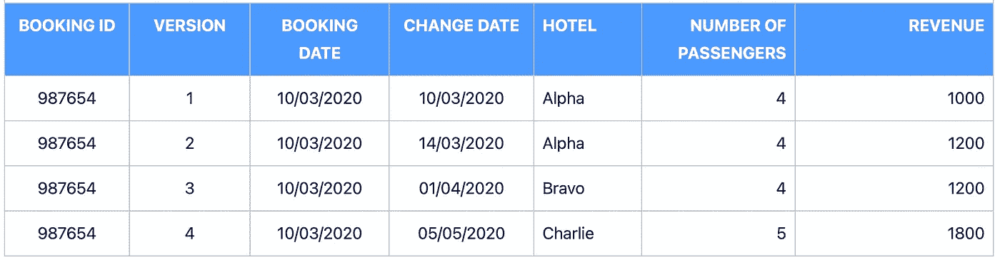

# 时间点数据仓库

> 原文：<https://blog.devgenius.io/a-point-in-time-data-warehouse-fa5c57fe6c18?source=collection_archive---------9----------------------->


在 [Unsplash](https://unsplash.com?utm_source=medium&utm_medium=referral) 上由[Towfiqu barb huya](https://unsplash.com/@towfiqu999999?utm_source=medium&utm_medium=referral)拍摄的照片

如何组织数据，以便在任意时间点或任意时间点之间轻松进行报告。

# 目的

通常，对于事务性数据，您需要能够跟踪数据随时间的变化，例如，一家度假公司可能向客户销售特定酒店的假期，但后来他们升级了房间、更改了酒店，或者他们可能在预订中添加了额外的乘客。任何这些都可能导致同时支付的金额发生变化。

例如，您可能需要报告您的数据，因为它是上个月发生变化之前的数据，如营销部门的追加销售，以便与本月尚未进行任何追加销售的预订进行比较，因此您是在进行同类比较。

这种方法使你能够简单地作为问题，如:

*我今天的预订值是多少？*

截至上周，我的预订价值是多少？

*7 天前有什么变化？*

*预订变更对各酒店有什么影响？*

*上个月我们向每家酒店出售或增加了多少乘客？*

# 它是如何工作的

通常情况下，您会将记录独立地接收到您的数据仓库中，并将它们作为每次更改的快照存储起来，并加盖您接收它们的日期。但是，您可能希望运行报告，以便轻松地查看昨天所做的更改，或特定日期或特定时间段的所有更改。

下面的方法向您展示了如何构建一个中间层来实现可靠的快照存储，以及如何构建一个 datamart 表来跟踪更改，以便您可以灵活方便地跟踪维度和值的更改。尝试仅使用快照进行报告通常涉及更复杂的 SQL，使用相关的子查询来获取不同时间点或不同时间点之间的数据，因此下面的“contra”机制非常适合需要在不同时间点轻松报告数据的数据集市。


## 应用程序或源数据

这显示了预订在源系统中是如何随时间变化的。每个版本可能保留在预订系统中，也可能不保留，这取决于应用程序是如何编写的，但这并不重要，因为它们都是作为加载到临时区域的一部分而被捕获的。

预订日期保持与最初创建时相同。示例记录将显示该方法如何适用于:

*   **版本 1** 中的原始预订
*   **版本 2** 中的数值变化
*   **版本 3** 中的尺寸变化
*   在**版本 4** 中数值和尺寸同时变化



## **注释**

*   为阿尔法酒店创建了 4 名乘客和 1000 英镑收入的 10 月预订
*   14 月 3 日的预订被修改，收入增加了 200 英镑，仍然是阿尔法酒店
*   4 月 1 日改为布拉沃酒店，收入不变
*   05 年 5 月改为查理酒店，增加了一名乘客，收入增加到 1800 英镑

## 暂存层

应用程序数据被加载到暂存层中。此示例假设它是一个持久性临时层(未删除)。


暂存层

# 中间层

中间层包含每个记录的快照以及:

*   **有效起始日期** —源系统创建记录的日期(或相关的日期时间)
*   **有效截止日期** —在插入的下一条记录的有效起始日期之后 1 个增量(天、秒、毫秒等)的日期(或日期时间，如果相关的话)。插入下一条记录时，会更新前一条记录
*   **当前记录标志** —对于当前记录设置为‘Y ’,对于所有先前记录设置为‘N’。插入下一条记录时，会更新前一条记录


中

虽然本文关注的是数据集市的最终输出，但是中间层在任何时间点的查询都可以按如下方式实现:

(在本例中，假设您想要截至 2020 年 4 月 15 日的记录)

```
SELECT *
FROM middle_table
WHERE '2020-04-15' BETWEEN valid_from_date AND valid_to_date
```

# 数据集市层

每个记录都被加载到 datamart 表中，但是随着每个新版本的添加，也会为以前的版本创建一个反向记录——这就是“contra”记录。

“抵销”一词来自会计术语，即两个账户相互抵销，以减少整体的价值。在这种情况下，净值为零。


数据集市层

## **注意事项**

*   在 3 月 10 日，插入初始记录，更改日期与预订日期相同
*   在 3 月 14 日，**版本 1** 记录被撤销，更改日期为 3 月 14 日
*   版本 2 的新记录**插入了 14 月变更日期。预订的累计价值现在是 1200 英镑，有 4 名乘客到阿尔法酒店**
*   4 月 1 日，**版本 2** 记录被撤销，更改日期为 4 月 1 日
*   版本 3 的**新记录插入了 1-Apr 变更日期。预订的累计价值现在是 1200 英镑，有 4 名乘客，但现在是布拉沃酒店**
*   5 月 5 日，**版本 3** 记录被撤销，更改日期为 5 月 5 日
*   版本 4 的**新记录插入了 1-Apr 变更日期。预订的累计价值现在是 1800，有 5 名乘客，但现在是查理酒店**

这种工作的关键是，对销记录添加了与插入的新记录相同的变更日期，因为这显示了在预订的给定日期发生的所有变更。

数据集市层中每个预订的记录数总是等于:

**(变化次数 x 2 ) -1**

# 一个完全可行的例子

这是一个完全工作的例子，已经在谷歌大查询中编写。它可以在大多数数据库中工作，只需稍微修改一下语法。

它设置了表，将一些“源”数据加载到 e 阶段表中，加载中间的“快照”表，然后从那里开始数据集市表，包括合同，然后有一些示例查询。

适当替换[您的数据库]和[您的模式]。

```
--Set up your schema and tables
CREATE SCHEMA [YOUR_DATEBASE].[YOUR_SCHEMA];

CREATE TABLE [YOUR_DATEBASE].[YOUR_SCHEMA].stage_table
(
  booking_id numeric,
  version numeric(15,0),
  booking_date date,
  change_date date,
  hotel string,
  number_of_passengers numeric(15,0),
  revenue numeric(15,2)
);

CREATE TABLE [YOUR_DATEBASE].[YOUR_SCHEMA].middle_table
(
  booking_id numeric,
  version numeric(15,0),
  booking_date date,
  change_date date,
  hotel string,
  number_of_passengers numeric(15,0),
  revenue numeric(15,2),
  valid_from_date date,
  valid_to_date date,
  current_record_flag string
);

CREATE TABLE [YOUR_DATEBASE].[YOUR_SCHEMA].datamart_table
(
  booking_id numeric,
  version numeric(15,0),
  booking_date date,
  change_date date,
  hotel string,
  number_of_passengers numeric(15,0),
  revenue numeric(15,2),
  record_type string
);

--Insert some test data in the source table
INSERT INTO [YOUR_DATEBASE].[YOUR_SCHEMA].stage_table
VALUES
(987654,1,'2021-03-10', '2021-03-10', 'Alpha', 4, 1000),
(987654,2,'2021-03-10', '2021-03-14', 'Alpha', 4, 1200),
(987654,3,'2021-03-10', '2021-04-01', 'Bravo', 4, 1200),
(987654,4,'2021-03-10', '2021-05-05', 'Charlie', 5, 1800)
;

--Check the data
SELECT * FROM [YOUR_DATEBASE].[YOUR_SCHEMA].stage_table ORDER BY 1;------------------------------
--Load into the middle table as snapshots
INSERT INTO [YOUR_DATEBASE].[YOUR_SCHEMA].middle_table
SELECT
booking_id,
version,
booking_date,
change_date,
hotel,
number_of_passengers,
revenue,
change_date AS valid_from_date,
COALESCE(DATE_ADD(LEAD(change_date) OVER (PARTITION BY booking_id ORDER BY change_date ASC), INTERVAL -1 DAY), '2099-12-31') AS valid_to_date,
CASE
  WHEN change_date = MAX(change_date) OVER (PARTITION BY booking_id) THEN 'Y'
  ELSE 'N'
END AS current_reecord_flag 
FROM [YOUR_DATEBASE].[YOUR_SCHEMA].stage_table
;--Check the data
SELECT * from [YOUR_DATEBASE].[YOUR_SCHEMA].middle_table order by version;--Load into the datamart table including contras
--Note the LEAD function to apply the date of the new insert record to the contra
--of the previous insert
INSERT INTO [YOUR_DATEBASE].[YOUR_SCHEMA].datamart_table
SELECT
booking_id,
version,
booking_date,
CASE
    WHEN record_type = 'INSERT' THEN change_date
    ELSE LEAD(change_date) over (partition by booking_id order by change_date)
END AS change_date,
hotel,
number_of_passengers,
revenue,
record_type
FROM
(
  SELECT
  booking_id,
  version,
  booking_date,
  change_date,
  hotel,
  number_of_passengers,
  revenue,
  'INSERT' AS record_type
  FROM [YOUR_DATEBASE].[YOUR_SCHEMA].middle_table
  UNION ALL
  SELECT
  t.booking_id,
  t.version,
  t.booking_date,
  t.change_date,
  t.hotel,
  t.number_of_passengers * -1 AS number_of_passengers,
  t.revenue * -1 AS revenue,
  'CONTRA' AS record_type
  FROM [YOUR_DATEBASE].[YOUR_SCHEMA].middle_table t
  WHERE t.change_date < (SELECT MAX(t2.change_date)
                                     FROM [YOUR_DATEBASE].[YOUR_SCHEMA].middle_table t2
                                     WHERE t.booking_id = t2.booking_id)
);

--Check the data
SELECT * from [YOUR_DATEBASE].[YOUR_SCHEMA].datamart_table order by version,record_type DESC;

--Run some reports
--Report 1: Cumulative for the booking:
SELECT
hotel,
SUM(number_of_passengers),
SUM(revenue)
FROM [YOUR_DATEBASE].[YOUR_SCHEMA].datamart_table
GROUP BY 1;

--Report 2: Net movement on 14-Mar:
SELECT
hotel,
SUM(number_of_passengers),
SUM(revenue)
FROM [YOUR_DATEBASE].[YOUR_SCHEMA].datamart_table
WHERE change_date = '2021-03-14'
GROUP BY 1;

--Report 3: Net movement on 1-Apr
SELECT
hotel,
SUM(number_of_passengers),
SUM(revenue)
FROM [YOUR_DATEBASE].[YOUR_SCHEMA].datamart_table
WHERE change_date = '2021-04-01'
AND hotel = 'Alpha'
GROUP BY 1;

--Report 4: Net movement on 1-Apr by hotel
SELECT
hotel,
SUM(number_of_passengers),
SUM(revenue)
FROM [YOUR_DATEBASE].[YOUR_SCHEMA].datamart_table
WHERE change_date = '2021-04-01'
AND hotel = 'Bravo'
GROUP BY 1;

--Report 5: Net movement on 1-Apr all
SELECT
SUM(number_of_passengers),
SUM(revenue)
FROM [YOUR_DATEBASE].[YOUR_SCHEMA].datamart_table
WHERE change_date = '2021-04-01';

--Report 6: Net movement on 5-May hotel Bravo
SELECT
hotel,
SUM(number_of_passengers),
SUM(revenue)
FROM [YOUR_DATEBASE].[YOUR_SCHEMA].datamart_table
WHERE change_date = '2021-05-05'
AND hotel = 'Bravo'
GROUP BY 1;

--Report 7: Net movement on 5-May hotel Charlie
SELECT
hotel,
SUM(number_of_passengers),
SUM(revenue)
FROM [YOUR_DATEBASE].[YOUR_SCHEMA].datamart_table
WHERE change_date = '2021-05-05'
AND hotel = 'Charlie'
GROUP BY 1;

--Report 8: Net movement on 5-May all
SELECT
SUM(number_of_passengers),
SUM(revenue)
FROM [YOUR_DATEBASE].[YOUR_SCHEMA].datamart_table
WHERE change_date = '2021-05-05';

--Report 9: Net movement between 12-Mar and 20-Apr all
SELECT
hotel,
SUM(number_of_passengers),
SUM(revenue)
FROM [YOUR_DATEBASE].[YOUR_SCHEMA].datamart_table
WHERE change_date BETWEEN '2021-03-12' AND '2021-04-20'
GROUP BY 1;

--Clean up
DROP SCHEMA [YOUR_DATEBASE].[YOUR_SCHEMA] CASCADE;
```