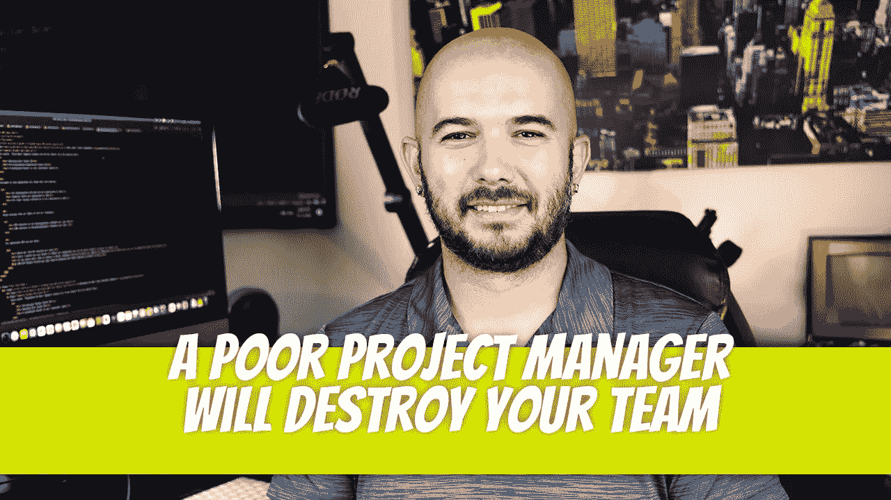

# 一个糟糕的项目经理会毁掉你的团队

> 原文：<https://blog.devgenius.io/a-poor-project-manager-will-destroy-your-team-199277c2426e?source=collection_archive---------10----------------------->

一个好的项目经理是让你的团队开心的关键。他们是软件开发的骨干，负责计划、协调和管理整个项目的活动。你团队的成功取决于你对他们的管理。在本文中，我们将探讨导致糟糕的项目管理的几个方面，以及如何避免它们。

## 未能有效管理

软件开发项目失败的最常见原因是未能有效管理。一个常见的原因是当项目经理不理解他们需要管理项目而不是人的时候。在人员管理方面，做一个炒作者是项目经理应该做的。如果出现与个人相关的问题，项目经理应与开发经理密切合作。

## 缺乏沟通

说到管理项目，你能做的最重要的事情之一就是沟通。如果你不清楚你的团队需要实现什么，以及如何实现，那么你的项目可能会失败。

项目经理是开发团队和客户之间的联络人。参加没有准备好的客户会议会让整个团队看起来效率低下，会引起客户的很多关注。让团队和客户满意的最简单的项目经理沟通策略是:

*   为所有会议做好准备，尤其是与客户的会议。让整个团队步调一致，确保演示已经过测试。
*   迅速引发关注。不要等待会议的到来。如果遇到障碍，与客户沟通，让他们了解时间表。
*   经常向客户提供最新信息。客户在付钱。正式的电子邮件可以每周发送一次，但应通过 Slack/团队进行更频繁的互动。
*   每天与开发团队交流。了解他们的障碍是什么，并迅速与客户沟通，或酌情在内部解决。

## 低估客户需求

了解客户需求、目标和期望的项目经理将能够有效地管理项目。这可以通过多种方法实现，包括:

*   理解客户的愿景
*   了解他们的商业模式
*   了解是什么推动了他们所在市场的变化(例如，技术进步)

## 走捷径

项目经理对他们团队的工作质量负责。如果一个人没有做好自己的工作，那么作为项目经理，你没有做更多的工作来让他们走上正轨是你的错。这是客户的看法。他们不理解角色的分离，因为项目经理通常是项目的代言人。

有很多方法可以走捷径，制造出劣质产品。第一种方式是在开始一个项目或任务之前没有足够的资源。另一种方法是在开发和测试阶段走捷径，使用与当前系统或流程不兼容的软件(或者更糟，导致错误)。

确保软件开发团队明白什么时候应用程序是 MVP，什么时候不是。有时捷径可能是一种优势(MVP)，但其他时候它们会突出项目失败，并将聚光灯照射到项目经理身上。

## 微观管理团队成员

微观管理是一件坏事。好了，我说了。没有人想被微观管理；你的团队成员可能会因此而怨恨你。微观管理者不了解每项任务需要做多少工作，所以他们总是期望员工做超出他们能力的事情。这会给团队带来压力、挫折和低落的士气——这意味着你将很难完成任何事情。

相反，与你的团队成员交流需要完成什么(以及何时完成)。确保每个人都知道谁负责每项任务；谈论截止日期和里程碑，这样每个人都知道事情在完成的及时性方面处于什么位置。让他们知道现在是否有什么紧急的事情需要关注——你甚至可以问他们是否有任何方法可以在等待一件事情的同时做其他事情，直到以后资源不再那么有限的时候。

## **做一个好的软件开发项目经理，让你的团队开心**

成为一名优秀的软件开发项目经理是一门艺术，也是一门科学。你必须管理项目，管理客户，管理预算和质量要求，在内部和外部相互沟通(有时甚至与你的老板沟通)，管理与项目开发或测试阶段可能出现的任何变化相关的风险；但最重要的是，您需要牢记利益相关者设定的所有期望，包括为任务或里程碑设定现实的时间表，以及在整个完成周期中定期更新这些任务/里程碑的进展状态。

## 结论

需要注意的是，并不是所有的项目经理都不好。只是如果你是一个软件开发项目经理，并且有能力管理你的团队，那么你有责任确保他们开心。做到这一点的最好方法是按照我们之前所说的去做:与你的团队成员沟通，给他们足够的时间对他们的工作进行反馈，并确保他们的努力得到赞赏。

迪诺·卡伊奇目前是 [LSBio(生命周期生物科学公司)](https://www.lsbio.com/)、[绝对抗体](https://absoluteantibody.com/)、 [Kerafast](https://www.kerafast.com/) 、[珠穆朗玛生物](https://everestbiotech.com/)、[北欧 MUbio](https://www.nordicmubio.com/) 和 [Exalpha](https://www.exalpha.com/) 的 IT 主管。他还担任我的自动系统的首席执行官。他有十多年的软件工程经验。他拥有计算机科学学士学位，辅修生物学。他的背景包括创建企业级电子商务应用程序、执行基于研究的软件开发，以及通过写作促进知识的传播。

你可以在 [LinkedIn](https://www.linkedin.com/in/dinocajic/) 上联系他，在 [Instagram](https://instagram.com/think.dino) 上关注他，或者[订阅他的媒体出版物](https://dinocajic.medium.com/subscribe)。

[*阅读迪诺·卡吉克(以及媒体上成千上万其他作家)的每一个故事。你的会员费直接支持迪诺·卡吉克和你阅读的其他作家。你也可以在媒体上看到所有的故事。*](https://dinocajic.medium.com/membership)