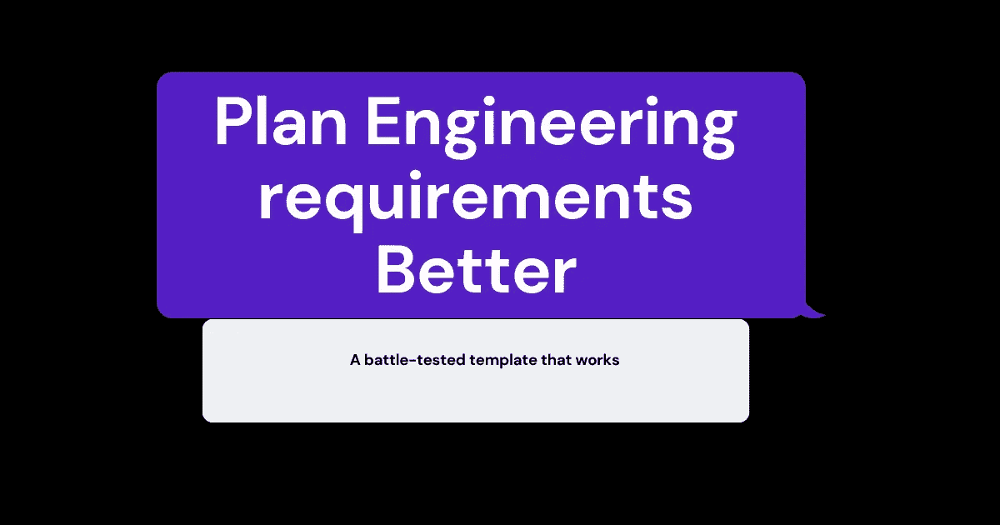

# 更好地规划工程需求的实用方法

> 原文：<https://blog.devgenius.io/a-practical-approach-to-planning-your-engineering-requirements-better-f526aeae8678?source=collection_archive---------14----------------------->

建筑技术产品是一个复杂的过程。在一家快速发展的初创公司工作时，为特定用例开发产品更具挑战性。在大多数情况下，你要么快速发货，要么冒着在市场上失败的风险。在过去的几年里，我与这些组织中的开发人员、工程人员和产品负责人进行了多次交谈。我发现最棘手的问题之一是技术债务。Atlassian 将技术债务定义为“承诺与交付之间的差额”

大多数公认的技术债务定义的原因通常围绕以下短语

1.  这是工程(或开发团队)在运输产品时走捷径的结果。
2.  这是在编写代码和交付产品时优先考虑速度过度优化的结果。
3.  设计不良或考虑不周的架构构成了技术债务。

技术债务不仅会造成长期的问题，而且会在短期内导致严重的错误，从而破坏最终用户的体验并损害您的商业形象。世界各地的不同团队已经创建了他们的方法来定义(记住，在我们开始解决问题之前，很好地定义问题是至关重要的)和解决技术债务。但问题仍然存在——有没有一种方法可以在不影响交付速度的情况下减少技术债务？

# 更好地计划——但是如何计划？

在试图回答之前讨论的问题时，最一致的答案是——软件团队必须更好地计划。许多公司已经开始建立架构团队来解决由糟糕的架构设计导致的问题。类似地，也有自动化工具来检查代码质量和进行测试。优秀的可观察性工具可以让您 360 度全方位了解系统的好与坏。现代 CI/CD 工具允许您快速发布可靠的软件。然而，科技债务仍然是一个大问题。因此，简单地说我们需要更好地计划是一种保守的说法。

# 无耻的插头

你好。在提出解决方案之前，我决定做一个不要脸的塞。如果你想学习如何创造一流的技术产品，我专门为你创建了一个名为 [cloudeasy.club](http://cloudeasy.club/) 的学习社区。通过加入这个俱乐部，你可以学习系统设计、软件架构和分布式系统。您还将了解 Org。为工程团队设计，以及如何在运送技术产品的同时解决现实世界的问题。你可以在 [Discord](https://link.cloudeasy.club/Wx31) 或者 [Whatsapp group](https://link.cloudeasy.club/kBMf) 上找到我们。此外，如果您有任何问题，请随时在 [LinkedIn](https://www.linkedin.com/in/theguywithideas/) 或 [Twitter](https://twitter.com/theguywithideas) 上联系我。

# 非常嫌疑犯

在我的谈话中，我整理了以下被认为是“计划失败”并导致技术债务的最常见原因。

*   不完整的产品需求文档—询问产品经理产品需求文档是否完整，在大多数情况下，答案是肯定的和否定的。尽管产品管理是一个相对较新的领域，但有数百种关于编写良好的产品需求文档或定义良好的产品问题陈述的模板和书籍。但是，即使有了所有这些内容，优先考虑速度过度优化通常会导致不完整或定义不明确的产品需求，无意中导致技术债务。
*   边缘和角落案例导致的模糊性——大多数 bug 都是由没有考虑到的边缘和角落案例导致的。如果你认为边缘和角落案例只与编写代码相关，那你就错了。产品特性、架构、系统内外的沟通等。所有这些都可能具有由边缘情况、拐角情况、边界情况等导致的模糊性。
*   需要充分研究非功能性需求，如可用性、容量需求、可靠性、可伸缩性等。在设计技术解决方案或编写代码时，必须适当考虑。
*   没有考虑最终用户的行为——由于组织通常是如何构建/设计的，大多数代码是在没有正确了解最终用户将如何与功能交互的情况下编写的。(阅读更多关于康威定律的内容)
*   没有适当探索对第三方或组织中现有服务(系统)的依赖。它会导致发货延迟或产品上线后出现 bug。
*   运输产品时，安全考虑经常被忽略。

# 但是还有更多。

上面的列表包含了导致技术债务的最常见的原因。但是许多更不常见但重要的原因导致了技术债务和缺陷。从上面的列表中可以明显看出，上面提到的许多问题都可以通过在编写代码之前进行更好的规划或者通过组织级别的有效文档和实践来解决。但是人类作为一个物种很少做被要求/合乎逻辑的事情，并且经常倾向于我们的习惯和偏好。

# 一个经过战斗考验的模板

在我的咨询经历中，我使用了一个特定的模板来确保我在设计复杂的技术产品时覆盖了大多数基础(你不能覆盖所有基础)。在你批评我创建了另一个工程需求文档模板之前，请听我说完。我知道大多数人既没有时间也没有耐心编写完美的文档来解决未来的问题。但是如果-

*   你已经因为你的技术债务遭受了损失。
*   你想学习如何更好地计划或评估产品需求
*   你对这个问题感同身受，想要回避它。

这个模板可以帮助你。如果你没有时间，用这个模板作为清单。把每一部分看一遍，然后把清单上的项目划掉。在大多数情况下，很多章节都不适用。

# 模板链接— ( [概念链接](https://cloudeasyclub.notion.site/ERD-Template-Server-Side-Applications-8bd85bb3b051421586172ad5a95e4c27))

试试吧，如果对你有帮助，请在评论中告诉我。您还可以在概念文档中作为评论提及任何反馈或建议(评论访问对所有人开放)。

如果你有任何问题，请随时在 [Twitter](https://twitter.com/theguywithideas) 或 [LinkedIn](https://www.linkedin.com/in/theguywithideas) 上联系我。在 [Discord](https://link.cloudeasy.club/Wx31) 或 [Whatsapp group](https://link.cloudeasy.club/kBMf) 上加入我的社区，了解更多内容。