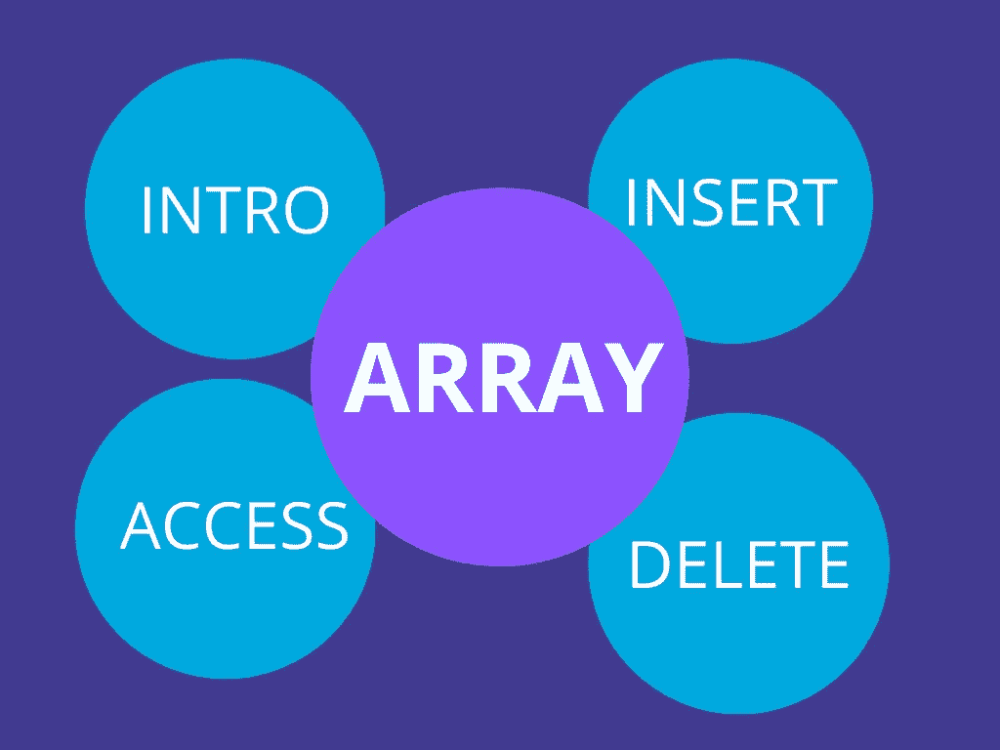
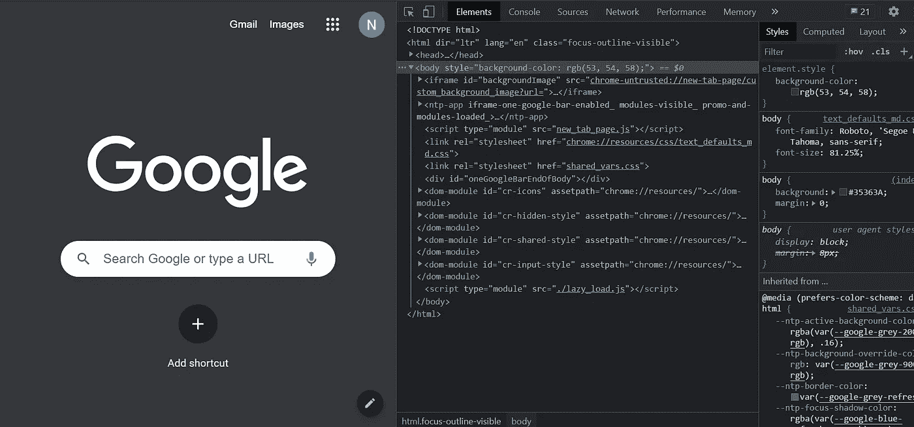
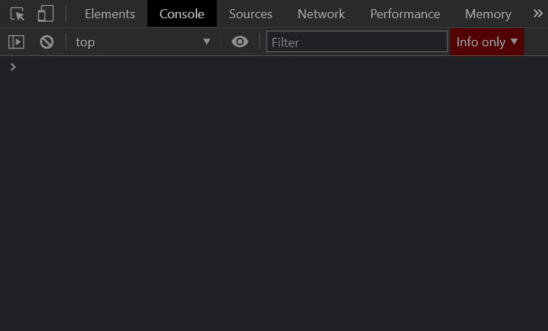
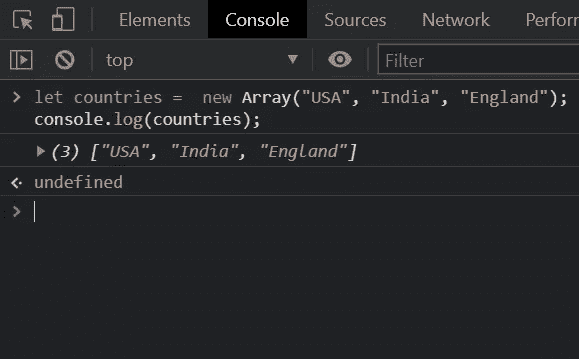

# JavaScript 数组实用指南

> 原文：<https://blog.devgenius.io/a-practical-guide-to-array-in-javascript-d0acd16fb78d?source=collection_archive---------7----------------------->

## 学习 JavaScript 数组中的关键方法



资料来源:古巴妇女事务全国委员会

在这里，我会解释你想知道的关于数组的一切。

只是你得练习一下。你一定会成为一名专家。

# 我们来谈谈 JavaScript 应用

1.  成为一名 JavaScript 开发者。
2.  [成为一名网页开发者。](https://medium.com/code-blog/getting-started-and-earning-105-813-yr-as-a-web-developer-for-beginners-19b2cd26fcc2)
3.  [成为一名应用开发者。](https://javascript.plainenglish.io/getting-started-with-react-native-for-beginners-958d39fee16a)
4.  [做一个 AI 开发者。](https://medium.com/dev-genius/introduction-to-artificial-intelligence-the-future-5ed6f26d0578)
5.  [卖代码挣钱。](https://javascript.plainenglish.io/how-businesses-earn-revenue-from-selling-code-ed3a90316277)
6.  为网络开发者创造财富。
7.  作为一名开发者，除此之外，还有其他赚钱的方式。

还有很多。

# 阵列简介

现在让我们开始了解 JavaScript 数组。

我们知道，单个变量可以保存单个值(不使用数组)，如 int、float、char 等。

```
var name = "Nitin";
```

或者

```
let name = "Nitin";
```

但是如果我们需要在一个变量中存储多个值呢？

所以我们需要数组。

# 数组声明:

主要有两种语法用于声明数组。

**第一个语法如下:**

```
let array = new Array();
```

比如说—

```
let countries =  new Array("USA", "India", "England");
console.log(countries);//The output will be
//["USA", "India", "England"]
```

现在我们来谈谈数组的第二次声明。

首先，让我们定义一个空数组。

```
let array = [];
```

比如说—

```
let countries = ["USA", "India", "England"];
console.log(countries);//The output will be the same
//["USA", "India", "England"]
```

# 从数组中访问元素

访问一个元素意味着从数组中获取一个元素。请记住，数组索引总是从零开始。

例如:

```
let countries = ["USA", "India", "England"];
console.log(countries[0]);//The output will be:
//USA
```

这里我们定义了一个名为 countries 的数组，然后输出了索引 0。因为索引 0 处的元素是`USA`，所以它被打印在输出中。

类似地，我们可以打印数组的每个元素。

例如:

```
let countries = ["USA", "India", "England"];
console.log(countries[0]); //USA
console.log(countries[1]); //India
console.log(countries[2]); //England
```

# 从数组中插入元素


克里斯多夫·高尔在 [Unsplash](https://unsplash.com?utm_source=medium&utm_medium=referral) 拍摄的照片

插入一个元素意味着在数组中添加一个新元素。JavaScipt 使用`push()`方法在数组末尾插入一个元素。

例如:

```
let countries = ["USA", "India", "England"];
countries.push("Russia");
console.log(countries);//["USA", "India", "England", "Russia"]
```

我们首先用三个国家定义一个数组。然后我们使用 push 方法添加了 Russia init。现在当我们打印输出时，我们得到了`[“USA”, “India”, “England”, “Russia”]`。

我们也可以使用`push()`方法在一个数组中插入多个元素。

例如:

```
let countries = ["USA", "India", "England", "Russia"];
countries.push("Italy", "Germany", "France", "Australia");
console.log(countries);//["USA", "India", "England", "Russia", "Italy", "Germany", //"France", "Australia"]
```

让我再解释一下索引。

现在在`countries`数组中，有 8 个元素。

索引:“国家”

> 0:“美国”
> 
> 1:“印度”
> 
> 2:《英格兰》
> 
> 3:“俄罗斯”
> 
> 4:“意大利”
> 
> 5:“德国”
> 
> 6:“法国”
> 
> 7:“澳大利亚”

你可以看到指数为 3 的是俄罗斯，指数为 7 的是澳大利亚。

如果你想得到一个元素，你可以用一个索引来得到它。

比如`console.log(countries[3]);`会打印俄罗斯。

# 从数组中删除元素

JavaScript 使我们能够使用`pop()`方法从数组中删除元素。

此方法将移除数组的最后一个元素。

例如:

```
let countries = ["USA", "India", "England"];
countries.pop();
console.log(countries);//["USA", "India"]
```

如果你试图在`pop()`方法中添加一个元素，那将是没有用的。它将从数组中删除最后一个元素。

例如:

```
let countries = ["USA", "India", "England"];
countries.pop("USA");
console.log(countries);//["USA", "India"]
```

# 但是去哪里练呢？

你们很多人都有谷歌浏览器。所以你可以在那里练习。

1.  打开你的谷歌浏览器。
2.  windows 或 mac 点击`Ctrl+Shift+i`。开发者工具将会打开。

类似于下图。



来源:谷歌浏览器

3.转到`Elements`选项卡右侧的`Console`选项卡。



来源:谷歌浏览器

4.编写您的 JavaScript 代码并运行。



来源:谷歌浏览器

5.您可以使用`Shift+Enter`转到下一行，并通过点击`Enter`键运行您的 JavaScript 代码。

# 结论

JavaScript 是目前最流行的编程语言之一。所以学习 JavaScript 概念会对你有很大帮助。

我认为这篇文章将帮助你成为一名更好的开发人员。

这是本系列的第一部分，请跟随我在 [Nitin Sharma](https://medium.com/u/9c6cbf57703?source=post_page-----d0acd16fb78d--------------------------------) 快速获取。一周内准备好第二部分。

谢了。

# 类似的故事

[](https://medium.com/code-blog/getting-started-and-earning-105-813-yr-as-a-web-developer-for-beginners-19b2cd26fcc2) [## 作为一名面向初学者的 Web 开发人员，开始工作并获得每年 105，813 美元的收入。

### 成为 Web 开发人员的简单方法。

medium.com](https://medium.com/code-blog/getting-started-and-earning-105-813-yr-as-a-web-developer-for-beginners-19b2cd26fcc2) [](https://javascript.plainenglish.io/5-ways-to-earn-money-as-a-developer-1e42e694a078) [## 开发人员挣钱的 5 种方法

### 从新手到专家:成功的深度指南

javascript.plainenglish.io](https://javascript.plainenglish.io/5-ways-to-earn-money-as-a-developer-1e42e694a078) [](https://javascript.plainenglish.io/80-free-resources-for-web-designers-and-web-developers-in-2021-f400be2875ea) [## 2021 年为网页设计师和网页开发者提供 80+免费资源。

### 成为网页开发者的完整指南。

javascript.plainenglish.io](https://javascript.plainenglish.io/80-free-resources-for-web-designers-and-web-developers-in-2021-f400be2875ea)