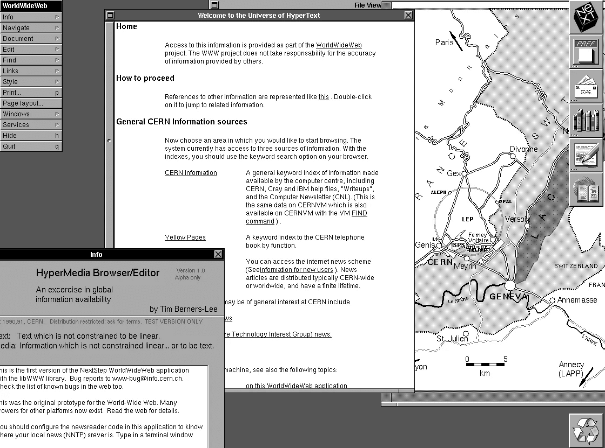
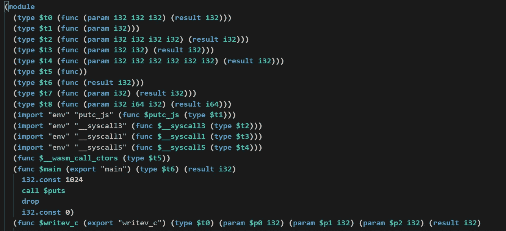
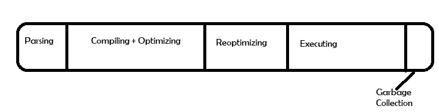
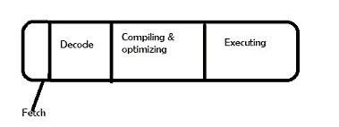

# WebAssembly 入门

> 原文：<https://blog.devgenius.io/a-primer-on-webassembly-834150fdd7ae?source=collection_archive---------2----------------------->

## 以及为什么它还没有取代 Javascript……

正如这篇 LinkedIn 帖子中所详述的，2022 年将是我潜入 WebAssembly 和 Rust 世界的一年。随着越来越多的人选择博客内容而不是其他媒体，这里是第一个，我希望会是一个涵盖上述主题的系列帖子。

尽管互联网上有各种形式的报道，但我认为任何关于新技术或工具的内容都应该从其诞生背后的动机开始。为了理解为什么会有 WebAssembly 的需求，让我们不要急着回想一下。

# 万维网的历史

我们今天所知道的万维网，是从欧洲粒子物理研究所的一台 NeXT 计算机上的一个单页项目开始的。你仍然可以在这里看到它[。该页面是一个用 HTML 编写的简单的静态页面，包含项目链接和一些其他技术细节。这个项目背后的动机是通过一个文档交换网络实现学者之间的信息共享。](http://info.cern.ch/hypertext/WWW/TheProject.html)

第一个网页，鸣谢:欧洲粒子物理研究所

正如你可能在上面注意到的，第一个浏览器和我们今天使用的浏览器并没有根本的不同。然而，从那以后，网络内容的交互性已经发生了巨大的变化。随着它的普及和成熟，人们要求内容变得更加复杂，并在不同的操作系统和设备上呈现。这显然意味着与 HTML 文档中的各种元素进行交互并访问这些元素，而这个领域的领先者之一就是 JavaScript。

# 进入..Java Script 语言

JavaScript 创建于 1995 年，其名称旨在利用 Java 的广泛应用，它的准入门槛非常低。这意味着即使是非技术人员也可以使用它在他们的网页中引入交互性。这促使它成为事实上的编译目标，与 ActiveX、Adobe Flash、JavaBeans 等竞争对手相抗衡。

但是随着这种不受约束的增长，也有一些挑战。JavaScript 是一种解释型语言。简单地说，你写的函数被打包并压缩成一个源文件。作为纯文本发送到客户端的浏览器，这需要被解析成[抽象语法树](https://en.wikipedia.org/wiki/Abstract_syntax_tree)，编译成字节码，然后由解释器执行。浏览器的 [JavaScript 引擎](https://en.wikipedia.org/wiki/JavaScript_engine)然后通过 JIT 编译等方法发现任何潜在的优化，最终实现优化。这里的关键字是最终的，因为这是一个以速度为最终目标的漫长过程。

然而，对速度的担忧不仅仅局限于到达目的地的复杂过程。对于性能是关键因素的更具挑战性的应用程序，性能水平缺乏一致性/可预测性是一个重大障碍。

此外，随着网络的普及，人们更热衷于将更复杂的语言引入竞争。在没有插件的情况下，使用 JavaScript 作为编译目标是唯一的选择。作为一种解释语言本身，上述操作变得复杂，因为如果要有效地实现它们，需要付出大量的努力。

**作为 JavaScript 的一个子集， [asm.js 规范](http://asmjs.org/spec/latest/)旨在为 C 或 C++等内存不安全的语言描述一个沙盒虚拟机，并为编译器提供一种低级、高效的目标语言。该规范首先由 Mozilla Firefox 浏览器实现，通过 JavaScript 引擎对有效的 asm.js 代码采用提前优化编译策略，引入了性能改进。**

**引用 [Mozilla 文档](https://developer.mozilla.org/en-US/docs/Games/Tools/asm.js?source=post_page)，**

> **它是 JavaScript 的一个非常小的、严格的子集，只允许诸如“while”、“if”、数字、顶级命名函数和其他简单的构造。它不允许对象、字符串、闭包以及基本上任何需要堆分配的东西。Asm.js 代码在许多方面类似于 C，但它仍然是完全有效的 JavaScript，可以在所有当前引擎中运行**

**虽然 asm.js 在性能方面有所改进，但它仍然局限于可以用 JavaScript 表达的东西。作为 JavaScript 的非正式规范，而不是真正的标准，每个供应商都以他们认为合适的方式对其进行了优化。尽管它确实导致了[最终的融合](https://hacks.mozilla.org/2015/03/asm-speedups-everywhere/)，但在标准化方面肯定还有改进的空间。**

# **输入… WebAssembly**

**基于 asm.js 的经验，所有主流浏览器都致力于为 Web 设计一种新的格式，最终目标之一是速度和效率。**

> **WebAssembly，缩写为 Wasm，旨在成为编程语言的可移植编译目标，支持客户端和服务器应用程序在 web 上的部署。**

**那么 [WebAssembly](https://webassembly.org/) 到底是什么？它是基于堆栈的机器的二进制指令格式。下面是一个简单的“Hello world”程序在 Wasm 中的部分片段。**

****

**从上面的代码片段可以看出，这比 asm.js 或 JavaScript 更接近于机器码。因此，解码、编译、获取和优化 WebAssembly 代码花费的时间更少是显而易见的。为什么？**

**现在，一个 JavaScript 引擎在应用程序启动过程中所花费的典型时间如下所示。**

****

**尽管为了图示的描述，这些任务已经被分开，但实际上它们是相互交织在一起的，而不是分离的。对于较大的 JavaScript 应用程序，监控和编译代码的开销当然会增加。**

**与典型的 WebAssembly 流程形成对比。**

****

**不仅因为它更接近机器代码，所以花费的时间有了显著的不同，而且某些步骤也完全消除了。这显然会在大多数情况下(但不是所有情况下)带来更好的性能，因为 WebAssembly 仍处于萌芽阶段(MVP 已于 2017 年完成)。**

**但是等等..这是否意味着开发人员将会用 WebAssembly 而不是 JavaScript 来编写整个代码库？由于这是一个同类比较，这个问题的答案显然是肯定的。但事实并非如此！预计大多数 Wasm 开发人员将继续使用 Rust、C 等语言编写代码。然后编译成 WebAssembly，这样用户就可以获得它的性能优势。**

**所以这个帖子到此为止！这里有一个在学习过程中帮助我的资源列表，**

*   **[Mozilla 黑客博客](https://hacks.mozilla.org/)**
*   **由 Linux 基金会在 edX 上提供的免费课程**
*   **[session stack 博客](https://blog.sessionstack.com/)**
*   **[欧洲核子研究中心网页](https://home.cern/science/computing/birth-web/short-history-web)**
*   **[MDN 网络文档](https://developer.mozilla.org/en-US/docs/WebAssembly)**

***要了解我最新的科技恶作剧，请在*[*Twitter*](https://twitter.com/Divya_Mohan02)*和*[*LinkedIn*](https://www.linkedin.com/in/divya-mohan0209/)*上关注我。***