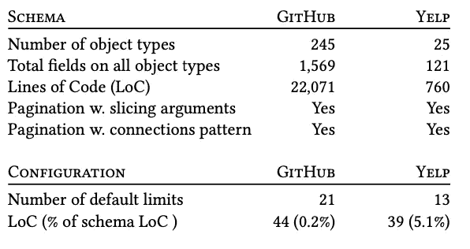
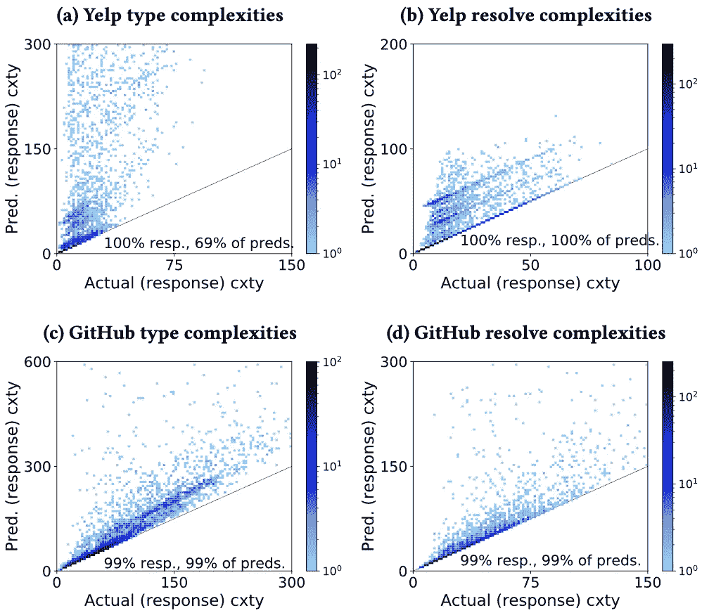
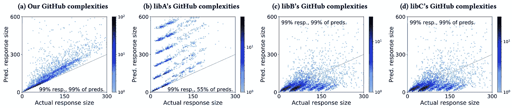

# GraphQL 查询代价分析的原理方法

> 原文：<https://blog.devgenius.io/a-principled-approach-to-graphql-query-cost-analysis-8c7243de42c1?source=collection_archive---------1----------------------->

## 为什么应该测量 GraphQL 查询的成本，以及应该如何做。

我们的查询分析的建议应用。客户端的恶意查询从 GitHub 的 GraphQL API 请求一个指数级大的结果。在我们研究的时候，GitHub 允许显示的查询，但是在超过时间限制后停止执行。使用我们的技术，客户端查询检查可以在合成期间提供反馈(参见“复杂性”插图)。服务器端查询执行可以拒绝查询，并根据提供者定义的策略更新速率限制。

这是在 ESEC/FSE 2020 上发表的研究论文*graph QL 查询成本分析的原理方法*的简介。艾伦·查领导这项工作，得到了埃里克·维特恩、纪尧姆·包达特、我、路易斯·曼德尔和吉姆·拉雷多的帮助。这些作者大多隶属于 IBM Research 或 IBM 的产品团队，是 IBM 参与 GraphQL 的一部分。

这个项目是我们之前研究 GraphQL 模式的[的后续项目](https://medium.com/swlh/empirical-study-graphql-icsoc19-29038c48da5)。

# 摘要

*实践状态:*Web API 的前景正在演变，以满足新的客户需求，并促进提供商如何满足这些需求。最新的 web API 模型是 [GraphQL](https://graphql.org/) ，通过它，客户端查询表达他们想要检索或改变的数据，而服务器则准确地用那些数据或改变来响应。GraphQL 减少了网络往返，并消除了不必要的数据传输。

*有什么问题吗？* **GraphQL 的** **表现力对于服务商来说是** **有风险的**。GraphQL 客户端可以简洁地请求数量惊人的数据，而响应这些查询可能代价高昂或者会破坏服务可用性。最近的实证研究表明，许多服务提供商面临风险。从业者缺乏估计和测量他们收到的 GraphQL 查询的成本的原则性方法。

*我们做了什么？*我们的**静态 GraphQL 查询分析**在不执行查询的情况下测量查询的复杂性。基于我们的 GraphQL 语义的形式规范，我们的分析是可证明正确的。与现有的静态方法相比，我们的分析支持影响查询复杂性的常见 GraphQL 约定。因为我们的方法是静态的，所以它可以应用于一个单独的 API 管理层，并与任意的 GraphQL 后端一起使用。

我们的分析有用吗？我们使用一个新颖的 GraphQL 查询-响应语料库为两个商业 GraphQL APIs 演示了我们的方法。我们的查询分析始终获得复杂性上限，相对于真实的响应大小足够紧密，以便服务提供商采取行动。相反，现有的静态 GraphQL 查询分析表现出高估和低估，因为它们不支持 GraphQL 约定。

*这在实践中会是什么样子？*第一张图(上图)展示了我们的愿景。我们的成本分析可以应用在客户端和服务器端。它可以引导客户远离意外昂贵的查询。对于中间件/服务器，它可用于检测和响应潜在的高成本查询。

# 背景

如果你对 GraphQL 不熟悉，看看[我之前的帖子](https://medium.com/swlh/empirical-study-graphql-icsoc19-29038c48da5)和其中的参考资料。网上也有很多其他的教程。

# 动机

## 许多 GraphQL 服务支持超线性 GraphQL 查询

之前的两项实证研究描述了对 GraphQL 模式的分析，以了解它们是否存在“GraphQL 查询拒绝服务”的风险[1，2]。他们想知道用户是否可以发送一个小的查询并得到一个真正大的响应。他们报告说这对于大多数 GraphQL 模式是可能的；超过 80%的商业或大规模开源模式允许输入长度为指数大小的响应，多项式大小的响应也很常见。

## 很少有 GraphQL 服务记录他们的防御

我们手动研究了由 APIs.guru 列出的 30 个公共 GraphQL APIs 的文档。令人不安的是，这 30 个提供商中有 25 个没有描述静态或动态查询分析来管理访问和防止滥用。一些 GraphQL APIs 已经将定制的查询和/或响应分析整合到它们的管理方法中(GitHub、Shopify、Yelp、Contentful 和 TravelGateX)，但是这些方法都有缺点。详见论文($2.2 和$6.4.3)。

## 现有的 GraphQL 成本分析是不充分的

很容易衡量查询的成本——只需执行它！但是如果查询很昂贵，那可能会适得其反。*成本分析*在不执行查询的情况下测量查询的成本。像大多数成本分析一样，GraphQL 查询有两种类型的成本分析:*动态*和*静态*。

研究人员已经提出了一种动态分析方法【1，3】，它将查询放在数据图的上下文中考虑，查询将在数据图中执行。通过轻量级查询解析，它遍历查询以确定涉及的对象数量，而不解析它们。这种成本测量是准确的，但是获取成本很高。它会导致额外的运行时负载，并可能需要工程成本来支持对象计数的廉价查询[3]。

从业者已经提出了**静态分析***【4，5，6】，其计算假设病理数据图(即，将产生最大可能响应的图)的查询的最坏情况响应大小。因为静态分析假设了最坏的情况，所以它可以在不与后端交互的情况下有效地提供查询复杂性的上限。静态查询分析的速度和通用性使其成为商业 GraphQL API 提供者的一种有吸引力的方法。*

*我们的静态方法遵循与现有静态分析相似的范例。我们在几个方面不同。最值得注意的是:*

1.  *我们将我们的分析建立在形式 GraphQL 语义上，并证明了我们的查询复杂度估计的正确性。*
2.  *我们的分析可以配置为处理常见的模式约定，以产生更好的估计。*

# *方法*

*因为我们的目的是证明我们分析的正确性，所以这部分有点数学化。我试图捕捉高层次的想法，把数学留给纸上谈兵。*

## *GraphQL 形式化*

*GraphQL 类似于 SQL，但在我看来，它使数据之间的关系更加清晰。我将使用(内联)符号来指出 SQL 类比。*

*   *GraphQL **数据图**(数据库实例)表示服务提供者已知的底层数据和关系。*
*   *GraphQL **模式**(数据库模式)定义了客户端可以查询的数据类型，以及对这些数据可能的操作。*
*   *GraphQL **查询**(数据库查询)请求满足特定标准的数据子集，这些数据按照数据图中呈现的关系进行组织。*
*   *GraphQL 查询的**评估**可以被认为是对最初对应于完整数据图的虚拟数据对象应用连续过滤器。这些过滤器由查询定义，并按照查询的结构递归应用(参见本文中的图 3)。使用**解析器函数**将数据图映射到后端存储，解析器函数解析模式中每种类型的每个字段的实体。*
*   *GraphQL **响应**由匹配查询的实体组成，根据查询的过滤器进行分类和组织。*

## *查询复杂性—查询成本的定义*

*GraphQL 查询描述了响应数据的结构，还规定了为满足查询而必须调用的解析器函数(哪些解析器，以什么顺序，调用多少次)。我们提出两种查询成本定义:*

*   ***Type complexity** 表示响应的大小，用响应中字段的数量来衡量。您可以简单地对每个条目进行计数，或者您可以根据表示条目的成本对条目进行加权(例如，对每种类型的字段进行编码所需的字节数，如最大字符串长度或最大整数宽度)。这个成本是由每个人支付的——服务提供商(生成和整理它)、网络运营商(运输它)和客户(解组和处理它)。*
*   ***响应复杂度**表示 GraphQL 服务提供者生成响应的成本。如果提供者的最大成本是通过网络传输数据，那么类型复杂性可能就足够了。但是提供者的计算成本也可能取决于调用哪个解析器函数以及每个函数调用多少次。例如，也许有些解析器可以通过缓存来解析，有些可以通过访问冷存储来解析，还有一些可以通过第三方的 API 组合来获得。GraphQL 的后端不可知特性可能会导致提供商在每个解析器的基础上产生不同的成本。我们的*反应复杂性*概念包含了这些类型的成本。*

*在我们的形式化下，这两种成本都可以使用加权递归和来计算，这类似于脸书对 GraphQL 的定义。但是这个定义没有提到如何处理*列表。如果我们简单地假设所有列表都是无限长的(或者包含底层数据图中该类型的所有条目)，我们不会得到非常有用的成本估计。令人高兴的是，这个社区遵循两个**分页约定**，因为返回无限长的列表对任何人都没有帮助。**

## *分页会计*

*我们考虑两种常见的分页约定:切片模式和连接模式。**切片**使用限制参数来限制返回列表的大小。 **Connections** 引入了一个间接层来实现更灵活的分页，limit 参数应用于游标而不是列表本身。下图说明了这些概念。*

**

*一个 GraphQL 模式(左)。一个示例查询(中间)使用了两种分页约定:切片(红色)和连接(绿色)。回答在右边。*

## *我们的成本分析*

*我们根据查询的**类型复杂度**和**响应复杂度**来衡量查询的潜在成本。我们的分析本质上是加权递归求和，列表大小受到通过切片和连接模式指定的限制参数的限制。*

*由于我们的方法依赖于约定，模式必须伴随着一个**配置**来解释它如何遵循这些约定。这种配置完成了三件事:*

*   *它*标记包含限制的字段*，以及这些限制适用的子字段(对于连接模式)。*
*   *在限制字段没有提供参数的情况下，它提供*默认限制*。*
*   *它可选地*提供权重*来指示每种类型和每个解析器函数的成本。默认情况下，权重 1 可能是合理的。*

***保证**给定一个模式和一个配置，我们的分析总是会根据查询的类型复杂性和响应复杂性得出查询成本的上限。这种保证假设所有返回列表的字段都强制执行它们的限制参数，并且有一个有限的默认限制。这些是上限，因为我们假设底层图是病态的——查询中请求的每个列表都将被完全填充。*

***我们分析的时间和空间复杂性***

*   **时间:*我们的分析以广度优先的方式“由外向内”地进行。它访问查询的每个节点一次，因为查询的内层不能增加响应外层的节点数。因此，它的运行时间与查询的大小成线性关系。*
*   **空间:*递归查询的*上下文*必须被携带，以便跟踪子字段的限制来处理连接模式。该公约(和我们的实施)只适用于这些限制直接儿童，一个恒定的空间成本。一般来说，空间复杂度与查询中嵌套的最大程度相匹配。*

***实现**我们实现了这种方法，但是还没有说服 IBM 开源它:-)。我们希望开源工具[4，5，6]会考虑采纳我们的想法。*

# *估价*

*我们调查了五个问题。我们的评估使用了两个公共的 GraphQL 服务，GitHub 和 Yelp。*

## *分析(和配置)可以应用于现实世界的 API 吗？*

*我们的分析需要一个 GraphQL 模式伴随着一个限制参数、权重和默认限制的配置。*

*我们发现为这两种模式开发一个配置非常简单。由于 GraphQL 模式遵循命名约定[2]，我们支持正则表达式来表示我们的配置语言中的字段名，因此我们的配置比相应的模式小得多。*

**

*评估的 API 和我们的配置的特征。*

## *我们总是得到上界吗？*

*是啊！我们开发了一个开源的 GraphQL 查询生成器[7]，并为每个 API 生成了 5000 个查询-响应对。这里画出了预测和实际的复杂性。我们保证有上限，所以我们的预测成本总是位于图中的直线之上***y = x*。***

**

*实际(响应)复杂性和预测(查询)复杂性，使用我们对语料库的分析。轴根据数据的形状进行缩放。每个图都有文本，指示显示的响应的百分比(剩余的超过 x 轴)，以及显示的相应查询复杂性的百分比(剩余的超过 y 轴)。*

## *这些界限是否足够紧密有用？*

*这个有点主观。我们的界限可能是高估的，但是通过静态的、数据不可知的方法，我们的界限是尽可能紧的。结果取决于底层数据图。*

*数据稀疏导致响应没有最坏情况下的复杂。在上图中，我们的上限接近或等于实际类型，并解决了许多查询的复杂性——这可以从对角线附近的高密度查询中看出。对于更复杂的查询，我们的界限变得更宽松。这符合对底层图形的直觉:更大、嵌套更多的查询可能无法被 API 的真实数据所满足。*

*我们在论文中对此进行了量化(见表 2)。*

## *我们的分析是否便宜到可以应用于中间件？*

*是啊！除了我们分析的功能正确性之外，我们还评估了它的运行时成本，以查看它是否可以合并到现有的请求-响应流中，例如在 GraphQL 客户端或 API 管理中间件中。*

*我们在 2017 款 MacBook Pro (8 核英特尔 i7 处理器，16 GB 内存)上测量了成本。正如预测的那样，我们的分析在线性时间内作为查询大小的函数
运行。几乎所有的查询都可以在 5 毫秒内完成。*

## *我们的方法与其他静态分析相比如何？*

*我们对比了开源和闭源分析。*

***开源**我们将我们的方法与三个开源库的方法进行了比较【4，5，6】。下图总结了结果。请注意，巴丽产生了疯狂的高估，而 libB 和 libC 遵循同样的方法，容易低估。*

**

*基于类型复杂性的实际和预测响应大小，来自我们的分析和 GitHub 数据的库。在我们的配置下，libB 和 libC 产生相同的值。由于数据稀疏，所有静态方法都会高估。图书馆有超出我们自己的高估来源。libB 和 libC 也低估了(对角线下方)。*

*这些库的缺点可能与它们对 GraphQL 分页约定的错误处理有关。问题是，这些库并不总是允许用户指定列表的长度，从而导致高估或低估。*

*   *巴丽容易被高估。它只允许列表长度有一个*全局最大值*。由于这些 API 提供者在缺省长度上有很大的差异(并且支持极限参数)，因此得到的上限可能会被大大高估。*
*   ***libB** 和 **libC** 可能会低估。它们将非分页列表视为总是只返回一个元素。它们也不支持间接限制参数，因此不能处理连接模式。*

***闭源***

*我们考虑了 GitHub 和 Yelp 的静态分析，它们虽然不是开源的，但是有文档记录。*

*   ***GitHub** 在我们研究的时候，GitHub 共享了 libB 和 libC 的一个局限性:它不能正确处理未分页列表的大小。第一张图使用未分页的*相关主题*字段说明了这个问题。我们报告了这个问题，他们已经解决了这个问题。我们的分析比他们修复后的分析更加灵活。*
*   *Yelp 遵循一个简单的规则:字段最多可以嵌套四层。通过嵌套大型列表，仍然可以获得相对较大的响应。我们更精确的分析具有与他们相同的时间复杂度(两者都在一次传递中处理查询)。*

# *结论*

*GraphQL 是一种新兴的 Web API 模型。它的灵活性可以使客户端、服务器和网络运营商受益。但是它的灵活性也是一个威胁:GraphQL 查询可能会非常复杂，对服务提供商的影响包括速率限制和拒绝服务。*

*对服务提供商的基本要求是以一种便宜、准确的方式来估计查询的成本。我们已经提出了一个有原则的、可证明正确的方法来应对这一挑战。通过适当的配置，我们的分析提供了严格的上限、较低的运行时开销，并且独立于后端实现细节。*

# *更多信息*

1.  *全文可从[这里](https://davisjam.github.io//files/publications/ChaWitternBaudartDavisMandelLaredo-PrincipledGraphQL-ESECFSE20.pdf)获得。*
2.  *幻灯片将很快推出。*
3.  *与论文相关联的工件在处[可用。亮点包括一个匿名的查询-响应语料库和我们用来生成它的查询生成器。](https://zenodo.org/record/3878220#.XvSvXJNKhQI)*
4.  *我很兴奋地说，IBM 已经将我们工作的某些方面整合到了 [IBM API Connect v10.x](https://community.ibm.com/community/user/imwuc/blogs/rob-thelen1/2020/06/16/api-connect-is-making-graphql-safer-for-the-enterp) 中。该产品有助于保护 GraphQL 服务提供商免于昂贵的查询。从发布链接底部的视频中的 1:45–3:30，您可以看到在配置过程中支持用户的 GUI。从 5:10 到 6:00，您可以看到该分析如何用于限速。*

# *参考*

*[1]哈蒂格和佩雷斯，2018 年。[*graph QL 的语义和复杂性*](http://olafhartig.de/files/HartigPerez_WWW2018_Preprint.pdf) 。*

*[2]维特恩，查，戴维斯，包达特，和曼德尔，2019。[*graph QL 图式的实证研究*](https://medium.com/swlh/empirical-study-graphql-icsoc19-29038c48da5) 。*

*[3]安德森，2018。 [*脸书 GraphQL 查询语言*](http://www.diva-portal.org/smash/get/diva2:1237221/FULLTEXT01.pdf) 的结果大小计算。*

*[4]4 catalyster 的[*graph QL-validation-complexity*](https://github.com/4Catalyzer/graphql-validation-complexity/)项目。*

*[5] slicknode 的[*graph QL-query-complexity*](https://github.com/slicknode/graphql-query-complexity)项目。*

*[6]帕布鲁的 [*图表 QL-成本分析*](https://github.com/pa-bru/graphql-cost-analysis) 项目。*

*[7]我们的[*graph QL-query-generator*](https://github.com/IBM/graphql-query-generator)项目。*