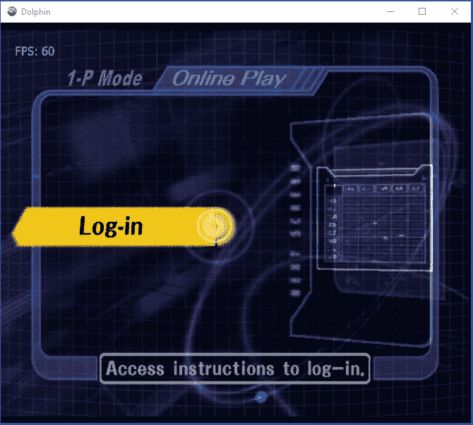
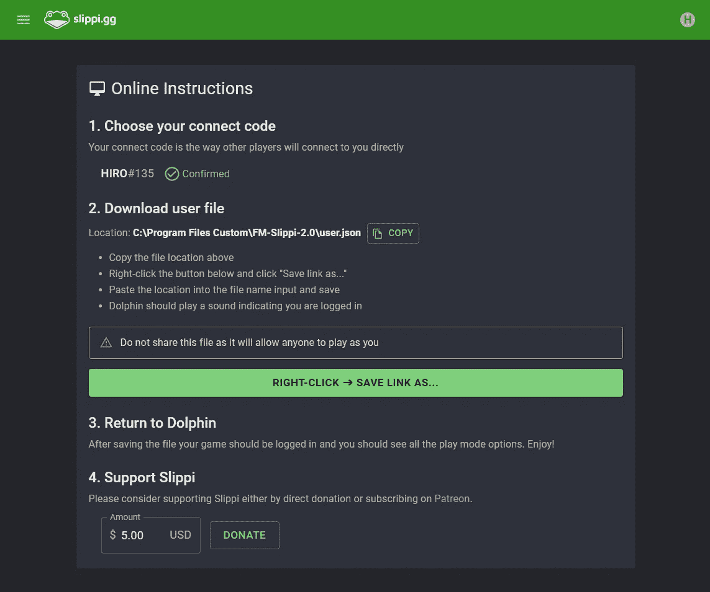
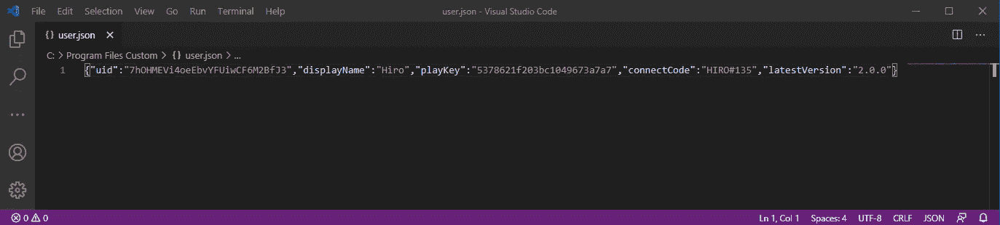

# 将我的爱好和职业结合起来的努力

> 原文：<https://blog.devgenius.io/a-push-to-merge-my-hobby-and-career-572be079d08c?source=collection_archive---------25----------------------->

当我 3 岁的时候，我玩了我的第一个电子游戏。我在家里几乎不能用的个人电脑上玩它；它的风扇开足马力帮助机器运行 Windows '98。这是一个无聊的、有教育意义的数学游戏，我非常喜欢。鼠标和键盘的交互性比在纸上写问题更吸引我年轻时的大脑，尽管两者都只是简单的算术练习。

这些年来，我对游戏的热爱持续增长。当我 5 岁的时候，我得到了我的第一台游戏机:任天堂 GameCube，它与游戏 Super Smash Bros .混战一起出现。我在小学的时候玩这个游戏很开心，因为它是我和我哥哥拥有的为数不多的多人游戏之一，所以我经常玩。我当时不知道我会在高中重新发现这个游戏及其竞争场景。我当时不知道这一发现会让我在接下来的 5 年里每周都参加锦标赛。我当时不知道我会举办一场锦标赛，世界上最好的球员之一会参加，然后用我的锦标赛照片作为他今年的排名照片。

顺便说一句，在我的锦标赛上拍的照片

但是我跑题了。

快进到 2020 年 6 月 22 日星期一。我刚刚在熨斗学校的软件工程训练营完成了第一个为期 3 周的模块，今天是第二个模块的第一堂课。当然，我在模块之间的周末都在玩 Smash 这既是为了减轻每天编码的工作量所带来的压力，也是为了庆祝我成功通过了 Mod 1。我整个周日晚上都在担心自己会回到朝九晚五的日程安排，所以我在睡眠不足的状态下参加了我的第一次 Mod 2 讲座，在 Zoom 上，多亏了某个疫情，我在家里很舒服。很快就到了中午，上午的讲座结束了。吃午饭前我掏出手机查了一下推特。

我简直不敢相信自己的眼睛。我最喜欢的游戏在推出 18 年后收到了一个社区更新。一群比我更有技能的程序员已经完全从头开始修改了一个视频游戏控制台模拟器。他们梳理了用汇编语言编写的游戏源代码，以简化游戏，减少 PC 上的资源使用。见鬼，他们甚至在没有任何原始开发者支持的情况下，从头开始建立了在线婚介系统。我无法思考我的下一堂课。吃午饭的时候，脑子里所有的想法都不断回到我看过的那条推特上。我不得不尝试一下。

我前往网站，在那里我会下载新的模拟器。我注意到的第一件事是该网站时尚、现代的外观。我们在 Mod 2 中使用 HTML 和 CSS 越多，我就越欣赏网站的流线型用户界面。这显然是由一位经验丰富的 web 开发人员制作的，他希望他们的激情项目能够大放异彩。我下载了模拟器，并设置播放。当我启动游戏时，迎接我的不是 Smash 标志性的开场过场动画，而是用汇编语言硬编码的自定义用户界面。

当我按下控制器上的 A 键时，我的终端不知从哪里蹦了出来。它打开了 Chrome，链接回到了我下载游戏的网站，但这次链接到了一个网站主页上没有的目录。它用一个非常标准的注册/登录页面提示我，看起来它可以属于任何其他在线视频游戏。在我创建了一个帐户后，我立即登录(不需要搜索我需要打开才能登录的电子邮件),并进入一个更加独特的网页:

我以前从未见过这样的一套说明。连接代码是一个非常标准的播放器定制，我不太担心。第二步真的让我措手不及。用户被告知复制一个目录，然后保存从网站到该目录的链接。经过仔细检查，我意识到它告诉我将一个 JSON 文件保存到保存游戏的目录中。我上周在 Mod 1 中才知道 JSON 文件的存在，所以我很好奇它在一个在线模拟主机游戏中是如何工作的。JSON 代表 JavaScript Object Notation，它是一种文件格式，包含数组、散列或由这两种类型相互嵌套组成的数据结构。当我将 user.json 文件保存到游戏的目录中时，仍然在后台运行的游戏发出了明显的乒乒乓乓的声音。我把它推到了前台:

一款 18 年前的任天堂游戏显示了我几秒钟前刚刚输入的用户名，同样的菜单我非常熟悉。我震惊了。这是怎么回事？我的好奇心让我第一次在实验室或项目之外的东西上使用 VS 代码；我不得不查看我刚刚下载的 JSON 文件。

映入我眼帘的是一个非常熟悉的数据结构:hash。我很快意识到刚刚发生的事情的含义。这个游戏实时识别出一个文件被放入它的目录中，然后用这个文件设置一个用户和他们的对手都能看到的名字。哈希还包含 2 条加密的信息，我认为服务器会用这些信息来识别我的帐户以及连接到其他玩家。当我在 JSON 文件中编辑我的显示名时，它在游戏中也改变了！这不是开发者想要的特性。一旦您在网站上输入了您的显示名称，就无法对其进行编辑。当我意识到我的编程知识意味着我可以使用大多数其他用户没有的功能时，感觉真的很特别。

JSON 文件并不是我最近在这个程序中唯一学到的东西。以前，如果模拟器被更新，你必须下载新的版本或者在社区的其他人切换到不同的，但是更优化的程序时被遗忘。有了这个新版本的程序，这一切都将成为过去。当用户连接到服务器时，它会检查 JSON 文件中包含的版本号。如果不是最新版本，会在游戏界面向用户呈现一个更新按钮。按下 A 后，终端将打开并在游戏模拟器的源 github repo 上运行 git pull。然后终端将你的 JSON 文件更新到当前版本号，然后为你重启游戏。

那天让我大开眼界。我在职业生涯中学到的技能被用在了我最喜欢的爱好上。两周前，我刚刚创建了我的第一个 github repo，这些了不起的程序员正在将我在 Flatiron 工作的相同东西集成到我从幼儿园就开始玩的游戏中。如果有一天，我能帮助这个令我兴奋不已的激情项目，会怎么样？我能成为一名经验丰富的开发人员，在他们需要的时候做他们需要的事情，并且仍然成功吗？我真的能在工作中找到乐趣吗？

当我 21 岁的时候，我发现编程和我最喜欢的爱好有着直接的联系。在 2020 年 6 月 22 日之前，我一直在从一个专业到另一个专业，从一个学校到另一个学校之间四处漂泊，没有实质性的生活动力。我不知道自己想在生活中追求什么，我尝试了一个编程训练营，因为社区大学的在线课程很糟糕，我的父母迫使我在这个被隔离的室内夏天保持高效率，而我当时经常转换的 STEM 专业恰好是计算机科学。那时我不知道它会给我人生中第一次想要的方向感。

## 但确实如此。

 [## 新网络游戏:立即尝试

### 回滚网络代码，匹配，重播，等等！

slippi.gg](https://slippi.gg/)  [## 发布项目-slippi/Ishiiruka

### 今天就创建您的免费 GitHub 帐户，订阅这个新版本库，并与 50…

github.com](https://github.com/project-slippi/Ishiiruka/releases/)