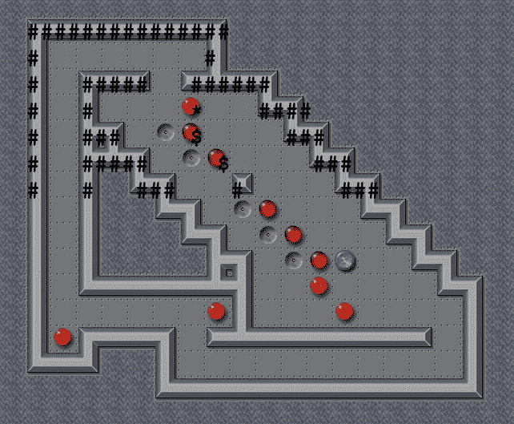

# 用 JavaScript 快速实现 Sokoban

> 原文：<https://blog.devgenius.io/a-quick-and-dirty-implementation-of-sokoban-with-javascript-1e77e04c70b4?source=collection_archive---------3----------------------->



不缺少 Sokoban 实现。最著名的实现之一就是 YASC 推箱子。首字母缩写代表“又一个推箱子克隆”

在网上已经有至少一个使用 JavaScript 的推箱子实现:[game-sokoban.com](http://www.game-sokoban.com/index.php)，我经常玩这个。我不知道是谁编的程序。

作为 Scala 中 Sokoban 实现的前期工作的一部分，我决定使用 HTML、CSS 和 JavaScript 来实现一个快速而简单的实现。

推箱子关卡的基本概念很容易理解:你移动箱子，这样每个箱子都在一个目标上。

找出解决某个特定关卡的具体步骤，这可能相当困难，尤其是如果目标上已经有一些盒子，并且您必须在将其他盒子移入之前将它们移出。

推箱子级别通常被分组到集合中。想必一套的第一关很容易。如果你解决了这个问题，你就可以进入第二关，这可能会稍微困难一些。

对于我的 JavaScript 实现，我决定只使用“普通的”JavaScript。如果你想跟着做，你不需要 NPM 安装一百个不同的库。我甚至不打算使用 jQuery。

如果你愿意，可以参考[我的 GitHub 库](https://github.com/Alonso-del-Arte/sokoban-ascii)。为了让你可以在浏览器中玩游戏，而不需要调用存储库，它有一个 gh-pages 分支。

进入[索引页面](https://alonso-del-arte.github.io/sokoban-ascii/index.html)，选择难度等级。实际上，即使您非常擅长在其他实现中玩推箱子，也应该选择从简单开始。第二次移动后没有单次移动撤消，重新开始该级别的唯一方法是刷新页面。

这个项目有一个 Git ignore 文件的唯一原因是为了排除一个草稿 Sokoban 级别的文件夹。

至于文本编辑器，如果您愿意，当然可以使用 Visual Studio 代码。可能有点矫枉过正。如果你真的想的话，你绝对可以使用 Sublime Text、Vim 甚至记事本。

我使用 Adobe 括号，因为我已经开始喜欢它用于 HTML 项目。它是免费的，这当然很有帮助。

我喜欢 Sublime，但是我还没有喜欢到愿意掏钱买的程度，所以就不再用了。崇高的试用期应该是无限期的，但来吧，它不应该需要超过一年的时间来作出决定。

Adobe Brackets 有一个 JavaScript linter，但在大多数情况下，我发现它远不如 Firefox 在控制台中给出的错误和警告有用。

另外，我想我会从 ES5 开始，遇到一些问题，然后不得不切换到 ES6。JavaScript 是一种极其复杂的编程语言，我是作为一个尝试过用 Malbolge 编程的人这么说的。

虽然公平地说，我实际上在 JavaScript 中完成了一些事情，但在 Malbolge 中什么也没完成。

我还决定不对 JavaScript 实现使用测试驱动开发。这使得开发过程变得快速(当然假设我没有遇到意想不到的问题，这在 JavaScript 中更容易发生)但也很肮脏。

在这个特别的项目中，我没有像我想象的那样笨手笨脚。我想绝对清楚的是，我想出的东西仍然需要相当多的努力。它不是突然出现的。

我做的另一个决定是不在任何游戏元素中使用任何图形。那么，用哪些角色来代表游戏元素呢？

我曾短暂考虑过使用表情符号。但是我意识到我不能指望它们都有相同的宽度，也不能指望它们在广泛使用的等宽字体中可用。

I also considered kanji, which are used in Chinese and Japanese, and to a much lesser extent Korean and Vietnamese. Google Translate gives me “壁” (“kabe”) for “wall,” which doesn’t look particularly wall-like to me, and worse, “ボックス” (“bokkusu”) for “box.”

也许最初的 Sokoban 程序员确实使用了汉字，但更有可能的是，他们使用了一小组现在被认为实际上是标准的 ASCII 字符。那为什么不直接用那些呢？我照做了。

具有推箱子级别的 HTML 页面应该链接样式表和脚本。然后，在 Body 标签的`onload`属性中，页面调用`initialize()`，这是一个寻找预格式化标签的过程。例如:

```
<pre>       ####;
########  ##;
#          ###;
# @$$ ##   ..#;
# $$   ##  ..#;
#         ####;
###########;</pre>
```

注意，如果 HTML 页面有多个预格式化的元素，只有第一个这样的元素会被解析并理解为 Sokoban 级别。任何其他的都将被忽略。

然后，脚本解析元素内容中的推箱子符号。除了分号之外，上面的示例显示了七个最常用的推箱子符号中的五个:

*   墙砖的井号(#)
*   空目标的周期
*   星号(*)代表目标上的方框
*   美元符号($)表示不在目标上的方框
*   球门上玩家标记(推杆)的加号(+)
*   不在球门上的玩家标志
*   当然，一个没有被其他任何东西占据的地方的空间，不管这个地方是在墙外还是墙内

该脚本还理解较少使用但可能同样标准的符号，如“B”代表不在目标上的方框,“B”代表目标上的方框。

我认为换行和回车会有问题。也许有一种更聪明的方法，但是我决定简单地通过使用分号来回避这个问题，分号是旧编程语言中令人讨厌的祸害，它表示行的结束。

如果最后一个字符被省略，脚本会推断它是分号。但是不用担心，脚本不会在其他任何位置推断分号。

该脚本还检查盒子的数量是否与目标的数量相匹配。如果有一个不匹配，像太多的盒子太少的目标，它会给出警告，但如果你想，它仍然会让你发挥水平。

没有任何其他级别的验证，当然也没有验证该级别是否有解决方案。这种验证是一个艰巨的任务，即使是一个专门的推箱子程序，包括一个解算器，如 YASC 推箱子。

我应该提到，该脚本使用了几个全局变量，包括两个数字来保存玩家令牌的当前( *x* ， *y* )坐标，以及计数器，用于记录目标上有多少个方块以及玩家到目前为止已经走了多少步。如果这不是快速和肮脏的，这将是一个明确的不要。

另一个全局变量`currentState`是一个二维数组，它最初按照解析 Sokoban 符号的顺序保存这些符号。初始化之后，它只能通过`queryPosition()` getter 和`changePosition()` setter 来访问，但是没有任何东西来强制进行封装。

一旦板的初始状态被读入并显示出来，就该给整个文档附加一个事件监听器了。实际上，我之前已经放在那里了，但是也许我应该重构一下。

```
document.onkeydown = processArrowKey;
```

这使得每次按下任何键时都会调用`processArrowKey()`过程。我承认我在将箭头键代码与相应的`x`和`y`坐标变化进行匹配时有点阅读障碍。

通过查看事件对象的键码，该过程确定是否按下了箭头键。如果是这种情况，就会计算相对坐标。

```
function processArrowKey(e) {
    var x, y;
    switch(e.keyCode) {
        case 37: 
            x = 0;
            y = -1;
            break;
        case 38: 
            x = -1;
            y = 0;
            break;
        case 39: 
            x = 0;
            y = 1;
            break;
        case 40: 
            x = 1;
            y = 0;
            break;
        default:
            x = 0;
            y = 0;
    }
    if (canMove(x, y)) {
        writeBoard();
    }
}
```

`canMove()`函数是一个布尔函数，如果玩家令牌可以移动到指定的相对位置，则返回 true，否则返回 false。这里引用的函数太长了，可能周期也太长了。这意味着也许我应该重构，把它分解成更小的函数。

如果相对( *x* ， *y* )坐标为(0，0)，`canMove()`返回 false。我可以重构它，使它总是用非零的相对坐标来调用，但这只会删除三行。

使用非零相对坐标，`canMove()`接下来计算绝对位置，并使用`queryPosition()`计算出在建议的新位置有什么(如果有的话)。

在这一点上，我利用 Switch-Case fall-through 来避免重复行，例如，当建议位置中的项目是一个盒子时，无论是否在目标上。

```
 case "*":
            playerToken = "+";
        case "$":
            if (canPush(absoluteX, absoluteY, 
                        relativeX, relativeY)) {
                if (currPlayerToken == "@") {
                    changePosition(playerX, playerY, " ");
                } else {
                    changePosition(playerX, playerY, ".");
                }
                playerX = absoluteX;
                playerY = absoluteY;
                changePosition(playerX, playerY, playerToken);
                moveCount++;
                return true;
            }
            return false;
```

Scala 中没有切换失败这样的东西，所以我可能会想出一个解决方案，虽然不那么聪明，但是更简洁。

显然`canMove()`不是一个纯粹的函数，因为它有改变玩家令牌位置的副作用，如果确定它可以移动到那里，`canPush()`也不是，因为它改变了受影响盒子的状态。就像我说的，这会又快又脏。

我将为 Hacktoberfest 开放 GitHub 知识库。