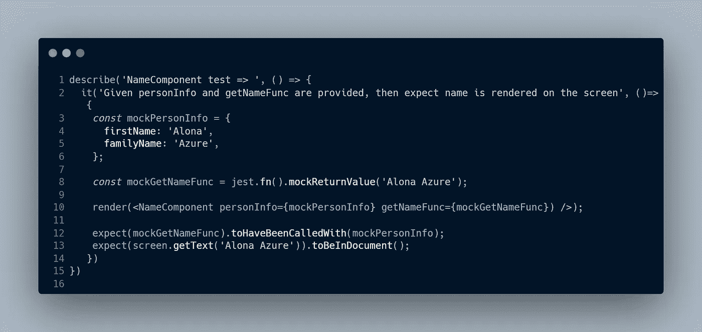
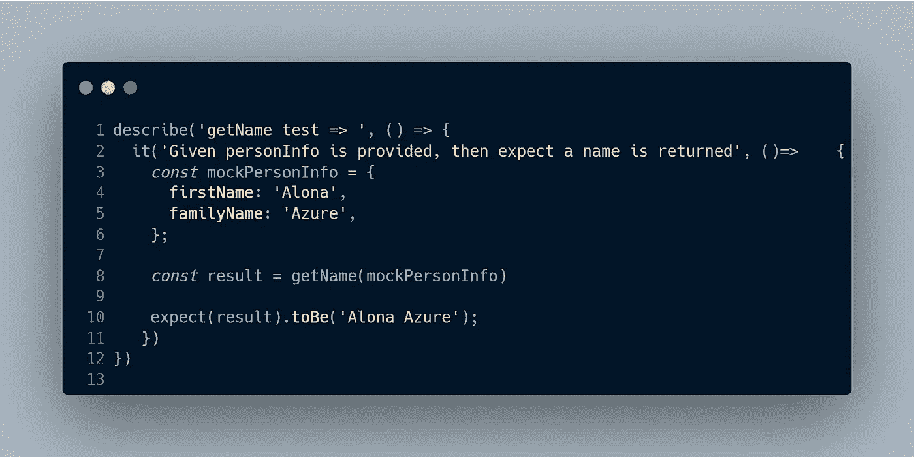
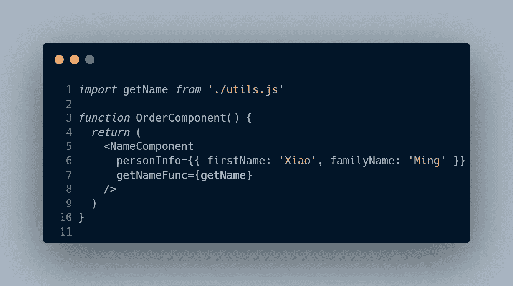
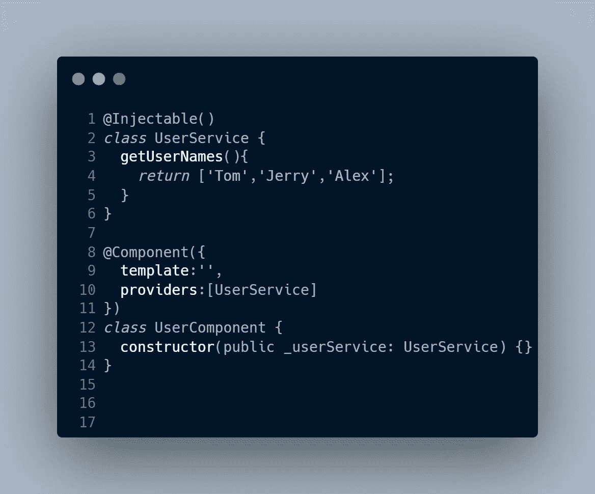

# 依赖注入快速指南(在 Angular/React 中)

> 原文：<https://blog.devgenius.io/a-quick-guide-about-dependency-injection-in-angular-react-2ff26fe57bd0?source=collection_archive---------3----------------------->

事实上，DI(依赖注入)是一个超级简单的概念，广泛应用于软件开发中。它的基本意思是，当一个组件需要一些道具来渲染时，这些道具是从这个组件的外部传递过来的，而不是直接在这个组件内部创建这些道具。这些道具被称为依赖。当这个组件即将运行时，需要有人把这些道具**传递给它(或者我们把这些道具注入到组件中)。道具可以是对象或功能。**

**反应部分:**

让我们看一个 react 示例:

你也可以通过这个链接访问这个例子:[https://react-ts-fjrt 4 f . stack blitz . io](https://react-ts-fjrt4f.stackblitz.io)

NameComponent 需要 personInfo 对象和 getNameFunction 来呈现。personInfo 和 getNameFunc 是依赖项，它们需要被注入到 NameComponent 中。

依赖注入(DI)的目的是分离我们的应用程序，使测试每个组件变得容易。

为什么？

这是因为当我们测试这个组件时，我们只关心组件本身的内部逻辑，即它是否会在一个段落 html 标签中返回名称。没必要关心我们是怎么得到这个名字的。我们可以简单地模仿 getNameFunc 并将其传递给 NameComponent。NameComponent 的单元测试可以写成这样:

NameComponent 的单元测试

getName 函数可以像这样独立地进行单元测试:

getName 函数的单元测试

将来，如果业务逻辑对我们如何获得名称有重大改变。只需要更改 getName 函数，而不需要更改 NameComponent。

你有没有注意到我们实际上有一个潜在的问题？

图片我们有另一个名为 OrderComponent 的组件，它是 NameComponent 的父组件。我们如何将 getNameFunc 属性传递给 NameComponent？我们必须在 OrderComponent 中手动完成，如在 OrderComponent 中导入它，并将其传递(或注入)到 NameComponent。大概是这样的:

OrderComponent 和 NameCompoent 的示例

在这种情况下，它看起来没问题。没那么糟。**如果 NameComponent 实际上需要某些类的三个实例呢？我们必须在 OrderComponent 中创建三个实例并将其传递给 NameComponent 吗？**

如果有人能够在 NameComponent 需要的时候为我提供 getNameFunc 或实例，生活将会变得更加轻松和美好。如果可能的话，就不需要导入 getName 函数或在 OrderComponent 中创建这些实例，并将它们传递给 NameComponent。NameComponent 可以从某个地方获取它们。

**解决方法是使用容器。容器的目的是为我自动创建一个实例，并将这些实例传递给任何需要它的组件。**

是容器创建了一个实例(或 props ),而不是我们手动创建/导入这些实例。我们把控制权从我们身上转移到了容器上。它也被称为控制反转。这项技术广泛应用于角形。

**角形部分:**

在 angular 中，当一个组件需要这些实例(或者我们称之为服务)时，angular 框架会为我们做这些。它创建这个实例并将其传递给组件。这样的实例(或服务)用可注入的。

UserComponent 需要一个名为 UserService 的依赖项，但是我们作为开发人员没有手动创建 UserService 的新实例。angular 框架会自动为我们完成这项工作。它将首先在组件中本地查找 UserService，然后在模块(我指的是 ngModule)中查找，然后尝试全局查找。

**依赖关系总是单一的吗？**

号码

它可以是全局可用的，也可以只对模块或组件可用。

1.  如果全局可用，那么它是单例的(app 只有一个实例)；
2.  如果依赖关系只适用于一个组件或一个模块，那么我们可以有多个实例。

# **结论**

1.  依赖注入的目的是分离应用程序，使其易于测试。
2.  Angular 本身支持依赖注入，但在 react 中，我们手动或借助第三方库来实现。
3.  依赖并不总是单一的。这取决于如何定义这种依赖的范围。在 angular 中，如果一个服务在根中是可注入的，那么它就是单例的，否则可能有多个实例。